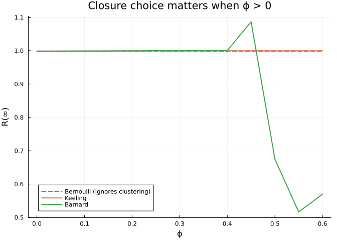

# Clustering Effects on Epidemic Dynamics
Simon Frost
2026-04-19

- [Introduction](#introduction)
- [Setup](#setup)
- [Sweep](#sweep)
- [Closures diverge as $\phi$ grows](#closures-diverge-as-phi-grows)
- [Summary](#summary)

## Introduction

Triangles in a contact network — three mutual contacts $A$–$B$–$C$ all
linked — slow down epidemics because once two of the three are infected,
the third has fewer naive susceptible neighbours to spread to. The
pair-approximation framework captures this through the **clustering
coefficient** $\phi$ and a triangle-aware closure (Keeling, Barnard, or
Eames).

This vignette quantifies the effect by sweeping $\phi$ from $0$ to
$0.6$.

## Setup

``` julia
using NodeBasedModels
using ModelingToolkit
using OrdinaryDiffEqDefault
using Plots
```

## Sweep

``` julia
function final_size(ϕ; closure = KeelingClosure(), τ = 0.2, γ = 0.1)
    net = regular_network(6; ϕ = ϕ)
    psys = generate_pairwise(sir_model(), net, closure;
                             tspan = (0.0, 400.0), N = 1.0)
    ic = copy(psys.u0)
    S0, I0 = 0.99, 0.01; k = 6.0
    ic[psys.singles[:S]] = S0
    ic[psys.singles[:I]] = I0
    ic[psys.singles[:R]] = 0.0
    ic[psys.pairs[(:S,:S)]] = k * S0 * S0
    ic[psys.pairs[(:S,:I)]] = k * S0 * I0
    ic[psys.pairs[(:S,:R)]] = 0.0
    ic[psys.pairs[(:I,:I)]] = k * I0 * I0
    ic[psys.pairs[(:I,:R)]] = 0.0
    ic[psys.pairs[(:R,:R)]] = 0.0
    p = copy(psys.params); p[:τ] = τ; p[:γ] = γ
    prob = ODEProblem(psys.system, merge(ic, p), psys.tspan)
    sol  = solve(prob; reltol = 1e-8, abstol = 1e-10)
    return sol[psys.singles[:R]][end]
end

ϕgrid = 0.0:0.05:0.6
R∞_keeling = [final_size(ϕ; closure = KeelingClosure()) for ϕ in ϕgrid]
R∞_barnard = [final_size(ϕ; closure = BarnardClosure()) for ϕ in ϕgrid]
nothing
```

``` julia
plot(ϕgrid, R∞_keeling, label = "Keeling", lw = 2, marker = :circle)
plot!(ϕgrid, R∞_barnard, label = "Barnard", lw = 2, marker = :diamond)
xlabel!("Clustering coefficient ϕ")
ylabel!("Final attack size R(∞)")
title!("Triangle density reduces final size, 6-regular SIR (R₀ = 8)")
```


As clustering grows, both Keeling and Barnard predict a smaller
epidemic. The Bernoulli closure (no clustering correction) would predict
the same final size at every $\phi$ — see vignette 02 for the comparison
at a single $\phi$.

## Closures diverge as $\phi$ grows

``` julia
R∞_bernoulli = [final_size(ϕ; closure = BernoulliClosure()) for ϕ in ϕgrid]
plot(ϕgrid, R∞_bernoulli, label = "Bernoulli (ignores clustering)",
     lw = 2, ls = :dash)
plot!(ϕgrid, R∞_keeling, label = "Keeling", lw = 2)
plot!(ϕgrid, R∞_barnard, label = "Barnard", lw = 2)
xlabel!("ϕ"); ylabel!("R(∞)")
title!("Closure choice matters when ϕ > 0")
```



## Summary

Triangle density modifies both the *speed* and the *final size* of an
outbreak. Use Keeling, Barnard, or Eames closures whenever the network
has $\phi > 0.1$ or so; reserve Bernoulli for the unclustered limit.
