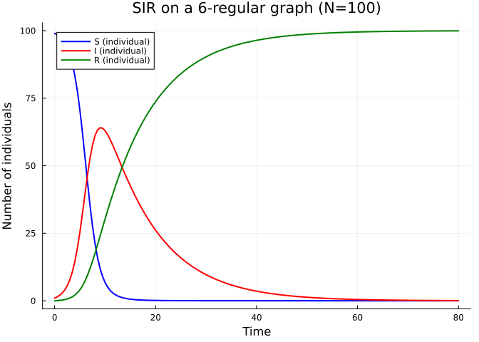
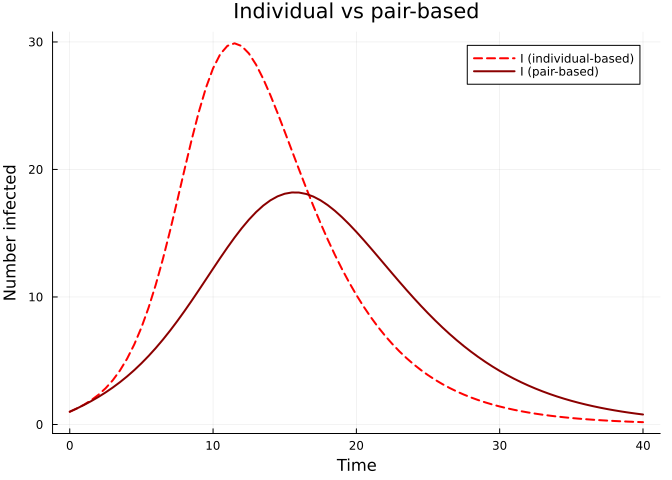
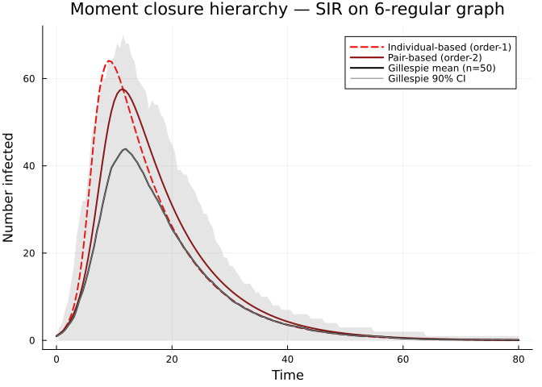
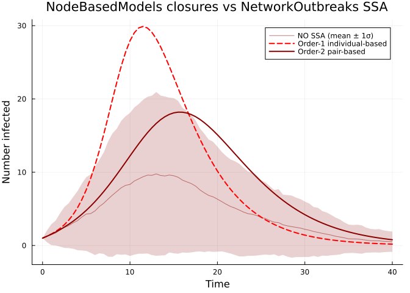

# SIR Epidemic on a Graph
Simon Frost
2026-05-14

- [Introduction](#introduction)
- [Setup](#setup)
- [Create a graph](#create-a-graph)
- [Individual-based model (order-1)](#individual-based-model-order-1)
- [Pair-based model (order-2)](#pair-based-model-order-2)
- [Gillespie validation](#gillespie-validation)
- [Discussion](#discussion)
  - [NetworkOutbreaks ribbon](#networkoutbreaks-ribbon)

## Introduction

In contrast to the edge-based approach of
[EdgeBasedModels.jl](https://github.com/sdwfrost/edgebasedmodels), which
works with degree distributions and probability generating functions,
**NodeBasedModels.jl** operates directly on specific graph instances.
This means every node and every edge is tracked explicitly, allowing us
to capture the full heterogeneity of a network — not just its degree
distribution, but the precise adjacency structure.

[Sharkey (2011)](https://doi.org/10.1007/s00285-010-0340-1) showed that
node-level epidemic models can be organised into a hierarchy of **moment
closures**:

- **Order-1 (individual-based / NIMFA):** Tracks the marginal
  probability $\langle S_i \rangle$, $\langle I_i \rangle$ for each node
  $i$. Pairs are approximated by independence:
  $$\langle S_i I_j \rangle \approx \langle S_i \rangle \langle I_j \rangle.$$
- **Order-2 (pair-based):** Tracks both node marginals and pair
  probabilities $\langle S_i I_j \rangle$ for each edge $(i,j)$. Triples
  are closed via the Kirkwood superposition:
  $$\langle A_k B_i C_j \rangle \approx \frac{\langle A_k B_i \rangle \langle B_i C_j \rangle}{\langle B_i \rangle}.$$
- **Exact (Gillespie):** Continuous-time Markov chain simulation using
  the Gillespie algorithm. No approximation — the “gold standard.”

Higher-order closures are more accurate but more expensive. In this
vignette we run all three levels on the same graph and compare their
predictions for an SIR epidemic.

## Setup

``` julia
using NodeBasedModels
using Graphs
using Plots
using OrdinaryDiffEqDefault
using Random
```

## Create a graph

We build a random regular graph with $N = 100$ nodes and degree $k = 6$.
Every node has exactly 6 neighbours. *(This vignette is an exception to
the canonical $\varepsilon = 0.001$ convention: per-node ODE/SSA size
makes $N = 1000$ intractable, so we keep $N = 100$ with a single seed,
which is $\varepsilon = 0.01$.)*

> [!NOTE]
>
> **$R_0=2$ anchor.** For the homogeneous pairwise anchor,
> $R_0=\tau(k-2)/\gamma$. With $k=6$ and $\gamma=0.25$, the comparable
> per-edge/pair rate is $\tau=0.125$, and 1% seeding corresponds to one
> initial node.

``` julia
Random.seed!(42)
N = 100
k = 6
γ_val = 0.25
R0_target = 2.0
τ_val = R0_target * γ_val / (k - 2)
initial_seed = [1]
tmax = 40.0
g = random_regular_graph(N, k)
net = GraphNetwork(g)

println("Nodes:       ", nv(g))
println("Edges:       ", ne(g))
println("Mean degree: ", mean_degree(net))
```

    Nodes:       100
    Edges:       300
    Mean degree: 6.0

## Individual-based model (order-1)

The individual-based (NIMFA) approximation tracks the probability that
each node is in a given state. For the SIR model on a graph with
adjacency matrix $A$, the equations for node $i$ are

$$\frac{d \langle S_i \rangle}{dt} = -\tau \sum_{j} A_{ij} \langle S_i \rangle \langle I_j \rangle, \qquad
\frac{d \langle I_i \rangle}{dt} = \tau \sum_{j} A_{ij} \langle S_i \rangle \langle I_j \rangle - \gamma \langle I_i \rangle.$$

Because pairs are factorised
($\langle S_i I_j \rangle \approx \langle S_i \rangle \langle I_j \rangle$),
the system has $2N$ ODEs.

``` julia
ib_result = generate_individual_based(
    sir_model(), net;
    infection_rate = τ_val,
    recovery_rate  = γ_val,
    initial_infected = initial_seed,
    tspan  = (0.0, tmax),
    saveat = 0.5
)

S_ib = aggregate(ib_result, :S)
I_ib = aggregate(ib_result, :I)
R_ib = N .- S_ib .- I_ib
t_ib = range(0.0, tmax, length = length(S_ib))

p = plot(t_ib, S_ib, label = "S (individual)", lw = 2, color = :blue,
         xlabel = "Time", ylabel = "Number of individuals",
         title = "SIR on a 6-regular graph (R₀=2, N=100)")
plot!(p, t_ib, I_ib, label = "I (individual)", lw = 2, color = :red)
plot!(p, t_ib, R_ib, label = "R (individual)", lw = 2, color = :green)
p
```



## Pair-based model (order-2)

The pair-based model additionally tracks the joint probability
$\langle S_i I_j \rangle$ for every directed edge $(i,j)$. Triples like
$\langle S_k S_i I_j \rangle$ that appear in the pair equations are
closed using the **Kirkwood closure**:

$$\langle A_k B_i C_j \rangle \approx \frac{\langle A_k B_i \rangle \langle B_i C_j \rangle}{\langle B_i \rangle}.$$

This closure is **exact on tree graphs** (no cycles), because in that
case nodes $k$ and $j$ are conditionally independent given $i$.

``` julia
pb_result = generate_pair_based(
    sir_model(), net;
    infection_rate = τ_val,
    recovery_rate  = γ_val,
    initial_infected = initial_seed,
    tspan  = (0.0, tmax),
    saveat = 0.5
)

S_pb = aggregate(pb_result, :S)
I_pb = aggregate(pb_result, :I)
R_pb = N .- S_pb .- I_pb
t_pb = range(0.0, tmax, length = length(S_pb))
```

    0.0:0.5:40.0

``` julia
p = plot(t_ib, I_ib, label = "I (individual-based)", lw = 2, ls = :dash, color = :red,
         xlabel = "Time", ylabel = "Number infected",
         title = "Individual vs pair-based")
plot!(p, t_pb, I_pb, label = "I (pair-based)", lw = 2, color = :darkred)
p
```



## Gillespie validation

The Gillespie algorithm simulates the exact continuous-time Markov
chain. We run 50 realisations and compute the mean trajectory together
with a 90% confidence interval (5th–95th percentile envelope).

``` julia
gill_avg = gillespie_sir_average(
    net;
    nruns          = 50,
    dt             = 0.5,
    tmax_grid      = tmax,
    infection_rate = τ_val,
    recovery_rate  = γ_val,
    initial_infected = initial_seed
)
```

    (t_grid = [0.0, 0.5, 1.0, 1.5, 2.0, 2.5, 3.0, 3.5, 4.0, 4.5  …  35.5, 36.0, 36.5, 37.0, 37.5, 38.0, 38.5, 39.0, 39.5, 40.0], S_mean = [99.0, 98.56, 98.16, 97.78, 97.12, 96.52, 95.8, 95.12, 94.4, 93.64  …  49.44, 49.4, 49.38, 49.34, 49.24, 49.24, 49.2, 49.18, 49.16, 49.14], I_mean = [1.0, 1.32, 1.64, 1.86, 2.22, 2.58, 2.82, 3.04, 3.42, 3.78  …  1.04, 0.98, 0.84, 0.76, 0.74, 0.64, 0.56, 0.52, 0.48, 0.46], R_mean = [0.0, 0.12, 0.2, 0.36, 0.66, 0.9, 1.38, 1.84, 2.18, 2.58  …  49.52, 49.62, 49.78, 49.9, 50.02, 50.12, 50.24, 50.3, 50.36, 50.4], S_q05 = [99.0, 97.0, 96.0, 94.0, 92.0, 90.0, 88.0, 86.0, 83.0, 80.0  …  7.0, 7.0, 7.0, 7.0, 7.0, 7.0, 7.0, 7.0, 7.0, 7.0], S_q95 = [99.0, 99.0, 99.0, 99.0, 99.0, 99.0, 99.0, 99.0, 99.0, 99.0  …  99.0, 99.0, 99.0, 99.0, 99.0, 99.0, 99.0, 99.0, 99.0, 99.0], I_q05 = [1.0, 0.0, 0.0, 0.0, 0.0, 0.0, 0.0, 0.0, 0.0, 0.0  …  0.0, 0.0, 0.0, 0.0, 0.0, 0.0, 0.0, 0.0, 0.0, 0.0], I_q95 = [1.0, 3.0, 4.0, 5.0, 6.0, 8.0, 9.0, 9.0, 11.0, 11.0  …  6.0, 6.0, 5.0, 5.0, 5.0, 4.0, 4.0, 3.0, 3.0, 3.0], final_sizes = [57, 2, 4, 76, 87, 1, 80, 1, 89, 3  …  90, 92, 90, 68, 78, 1, 75, 87, 28, 86])

``` julia
p = plot(t_ib, I_ib, label = "Individual-based (order-1)", lw = 2, ls = :dash, color = :red,
         xlabel = "Time", ylabel = "Number infected",
         title = "Moment closure hierarchy — SIR on 6-regular graph")
plot!(p, t_pb, I_pb, label = "Pair-based (order-2)", lw = 2, color = :darkred)
plot!(p, gill_avg.t_grid, gill_avg.I_mean, label = "Gillespie mean (n=50)",
      lw = 2, color = :black)
plot!(p, gill_avg.t_grid, gill_avg.I_mean,
      ribbon = (gill_avg.I_mean .- gill_avg.I_q05, gill_avg.I_q95 .- gill_avg.I_mean),
      fillalpha = 0.18, linealpha = 0.0, color = :black, label = "Gillespie 90% CI")
p
```



The plot illustrates the characteristic ordering of the hierarchy:

$$\text{Individual-based} \;\ge\; \text{Pair-based} \;\ge\; \text{Gillespie mean}.$$

The individual-based model over-estimates the epidemic because the
pairwise independence assumption ignores **dynamical correlations**: if
node $i$ infected node $j$, then $j$ is less likely to re-infect $i$
because $i$ is probably still infected. This “2-cycle” effect is
captured by the pair-based model.

## Discussion

### NetworkOutbreaks ribbon

To standardise across the package suite we also overlay the
[`NetworkOutbreaks.jl`](https://github.com/sdwfrost/NetworkOutbreaks.jl)
Gillespie SSA (used as the canonical ground truth in EBM and NO
vignettes). At $N=100$ this is on the small side for a smooth ribbon —
we average across several graph realisations to reduce conditioning on a
single graph.

``` julia
include("../_validation.jl")

t_no, μ_no, σ_no = gillespie_ribbon(
    sir_model(τ = :β),                        # NBM model → NO adapter
    Dict(:β => τ_val, :γ => γ_val),
    regular_graph_builder(N, k);
    N = N, n_graphs = 5, nsims_per_graph = 20,
    tspan = (0.0, tmax), seed_fraction = length(initial_seed) / N)
```

    ([0.0, 0.5, 1.0, 1.5, 2.0, 2.5, 3.0, 3.5, 4.0, 4.5  …  35.5, 36.0, 36.5, 37.0, 37.5, 38.0, 38.5, 39.0, 39.5, 40.0], Dict(:I => [0.01, 0.0124, 0.0147, 0.017, 0.0212, 0.0246, 0.0271, 0.030899999999999997, 0.0339, 0.038900000000000004  …  0.0089, 0.0088, 0.008100000000000001, 0.0073, 0.006500000000000001, 0.0063, 0.0063, 0.005699999999999999, 0.0054, 0.0052], :R => [0.0, 0.001, 0.003, 0.005, 0.0074, 0.009899999999999999, 0.0138, 0.0181, 0.0232, 0.027200000000000002  …  0.4482, 0.4487, 0.4499, 0.4511, 0.45189999999999997, 0.4524, 0.45289999999999997, 0.4535, 0.45399999999999996, 0.4545], :S => [0.99, 0.9865999999999999, 0.9823000000000001, 0.978, 0.9714, 0.9655, 0.9591, 0.951, 0.9429000000000001, 0.9339  …  0.5428999999999999, 0.5425, 0.542, 0.5416, 0.5416, 0.5413, 0.5408, 0.5408, 0.5406, 0.5403]), Dict(:I => [0.0, 0.007928977668570323, 0.014245679834230236, 0.017026420348945633, 0.022753843054248525, 0.027940051264206095, 0.03065925470375787, 0.03536519432573459, 0.04034935819899379, 0.04572413990111755  …  0.01906368910846593, 0.019502913535255094, 0.01936856768430268, 0.01710661753931395, 0.01616674476707158, 0.01574127945206103, 0.016058919293927873, 0.014924388554891413, 0.014172102343988519, 0.013888444437333107], :R => [0.0, 0.0030151134457776364, 0.005222329678670934, 0.006435381994422819, 0.008832904506457772, 0.010395706184319902, 0.013982673260687726, 0.01606143508437826, 0.01937821332102502, 0.023744430500603292  …  0.3942910272139275, 0.3946809349386418, 0.39569015273278785, 0.3965581593377871, 0.39720664799587785, 0.39750260783084584, 0.3977113693790175, 0.39819891227547793, 0.39852505846210257, 0.39888829098742506], :S => [0.0, 0.007415517445863032, 0.014274013967608228, 0.018694784018408704, 0.02514684147887437, 0.03166666666666666, 0.03623980176992187, 0.04489043901713945, 0.05397895212698439, 0.06447762120583883  …  0.40106750231618293, 0.4012943074753506, 0.4014368133984664, 0.4017505130643579, 0.4017505130643579, 0.4020720449035587, 0.4023584009664553, 0.4023584009664553, 0.40246668724682594, 0.40274927659522836]))

``` julia
plot(t_no, μ_no[:I] .* N, ribbon = σ_no[:I] .* N,
     label = "NO SSA (mean ± 1σ)", color = :darkred, fillalpha = 0.18, linealpha = 0.5)
plot!(t_ib, I_ib, label = "Order-1 individual-based",
      lw = 2, ls = :dash, color = :red)
plot!(t_pb, I_pb, label = "Order-2 pair-based",
      lw = 2, color = :darkred)
xlabel!("Time"); ylabel!("Number infected")
title!("NodeBasedModels closures vs NetworkOutbreaks SSA")
```

<div id="fig-no-validation-01">



Figure 1: NetworkOutbreaks SSA ribbon (matched per-closure colors) over
the order-1 and order-2 closures.

</div>

The pair-based closure tracks the SSA ribbon mean closely; the
individual- based closure systematically over-predicts the peak,
illustrating the moment-closure ordering numerically.

The three levels of the moment closure hierarchy trade off accuracy
against computational cost:

| Level | Variables | Closure | Exact when? |
|----|----|----|----|
| Order-1 (individual) | $O(N)$ | Independence | Complete graph (mean-field limit) |
| Order-2 (pair-based) | $O(N + M)$ | Kirkwood | Tree graphs (no cycles) |
| Exact (Gillespie) | $O(N)$ state | None | Always (stochastic) |

The order-1 approximation ignores correlations introduced by
**2-cycles** (anomalous terms of the form
$\langle S_i I_j \rangle - \langle S_i \rangle \langle I_j \rangle$).
These terms are always positive during an epidemic, so order-1
systematically over-estimates the force of infection.

The order-2 approximation captures pair correlations but neglects
**triangles** (3-cycles). On graphs with low clustering (like random
regular graphs), the pair-based model is already very accurate. On
highly clustered graphs, higher-order closures or the exact Gillespie
simulation may be needed.

In the next vignette, we explore how different network topologies affect
both the epidemic dynamics and the accuracy of these approximations.
