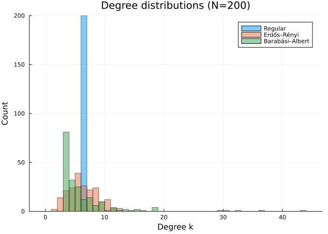
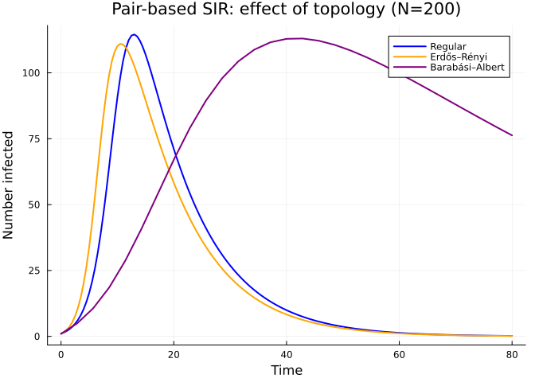
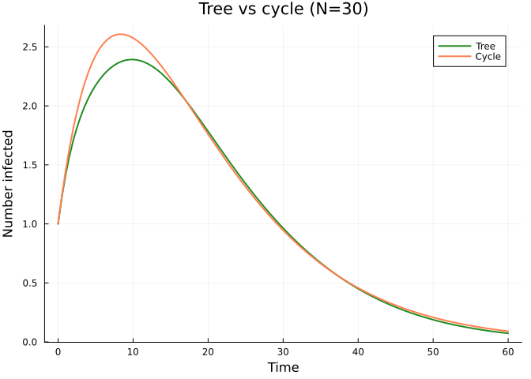
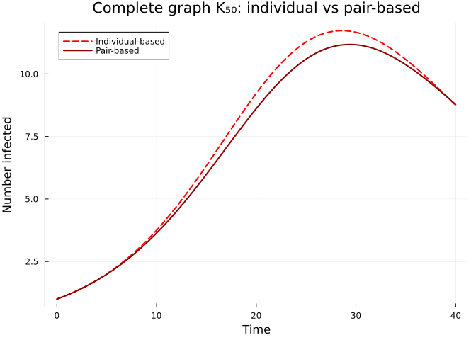

# Effect of Network Topology
Simon Frost
2026-05-15

- [Introduction](#introduction)
- [Setup](#setup)
- [Regular vs Erdős–Rényi vs
  Scale-free](#regular-vs-erdősrényi-vs-scale-free)
  - [Degree distributions](#degree-distributions)
- [Pair-based dynamics on each
  topology](#pair-based-dynamics-on-each-topology)
- [Epidemic threshold](#epidemic-threshold)
- [Tree vs cyclic graph](#tree-vs-cyclic-graph)
- [Complete graph: recovering
  mass-action](#complete-graph-recovering-mass-action)
- [Summary](#summary)
- [NetworkOutbreaks SSA ribbon](#networkoutbreaks-ssa-ribbon)

## Introduction

Population-level pairwise models characterise a network solely through
summary statistics — the mean degree $\langle k \rangle$, the second
moment $\langle k^2 \rangle$, and possibly the clustering coefficient
$\phi$. Node-based models, by contrast, can use **any** graph instance,
so we can directly investigate how the precise topology shapes the
epidemic.

In this vignette we compare three canonical network families — regular,
Erdős–Rényi, and scale-free (Barabási–Albert) — and examine special
cases (trees, cycles, complete graphs) where theoretical guarantees
exist.

## Setup

``` julia
using NodeBasedModels
using Graphs
using Plots
using OrdinaryDiffEqDefault
using Random
using Statistics
```

## Regular vs Erdős–Rényi vs Scale-free

We create three graphs on $N = 200$ nodes, each targeting a mean degree
of approximately 6.

``` julia
Random.seed!(123)

g_reg = random_regular_graph(200, 6)
g_er  = erdos_renyi(200, 6 / 199)
g_ba  = barabasi_albert(200, 3)   # each new node adds 3 edges → mean degree ≈ 6

net_reg = GraphNetwork(g_reg)
net_er  = GraphNetwork(g_er)
net_ba  = GraphNetwork(g_ba)

println("Regular  — nodes: ", nv(g_reg), ", edges: ", ne(g_reg),
        ", ⟨k⟩ = ", round(mean_degree(net_reg); digits=2))
println("Erdős–Rényi — nodes: ", nv(g_er), ", edges: ", ne(g_er),
        ", ⟨k⟩ = ", round(mean_degree(net_er); digits=2))
println("Barabási–Albert — nodes: ", nv(g_ba), ", edges: ", ne(g_ba),
        ", ⟨k⟩ = ", round(mean_degree(net_ba); digits=2))
```

    Regular  — nodes: 200, edges: 600, ⟨k⟩ = 6.0
    Erdős–Rényi — nodes: 200, edges: 586, ⟨k⟩ = 5.86
    Barabási–Albert — nodes: 200, edges: 591, ⟨k⟩ = 5.91

### Degree distributions

The three families have very different degree distributions despite
similar mean degree. The regular graph is a delta function at $k = 6$,
the Erdős–Rényi graph is approximately Poisson, and the Barabási–Albert
graph has a heavy (power-law) tail.

``` julia
deg_reg = degree(g_reg)
deg_er  = degree(g_er)
deg_ba  = degree(g_ba)

p = histogram(deg_reg, bins = 0:maximum(deg_ba)+1, alpha = 0.5, label = "Regular",
              xlabel = "Degree k", ylabel = "Count",
              title = "Degree distributions (N=200)")
histogram!(p, deg_er, bins = 0:maximum(deg_ba)+1, alpha = 0.5, label = "Erdős–Rényi")
histogram!(p, deg_ba, bins = 0:maximum(deg_ba)+1, alpha = 0.5, label = "Barabási–Albert")
p
```



## Pair-based dynamics on each topology

We run the pair-based (order-2) model on each graph with the same
epidemiological parameters.

``` julia
τ = 0.125
γ = 0.25

pb_reg = generate_pair_based(sir_model(), net_reg;
    infection_rate = τ, recovery_rate = γ,
    initial_infected = [1], tspan = (0.0, 40.0), saveat = 0.5)
pb_er  = generate_pair_based(sir_model(), net_er;
    infection_rate = τ, recovery_rate = γ,
    initial_infected = [1], tspan = (0.0, 40.0), saveat = 0.5)
pb_ba  = generate_pair_based(sir_model(), net_ba;
    infection_rate = τ, recovery_rate = γ,
    initial_infected = [1], tspan = (0.0, 40.0), saveat = 0.5)

I_reg = aggregate(pb_reg, :I)
I_er  = aggregate(pb_er, :I)
I_ba  = aggregate(pb_ba, :I)
t = range(0.0, 40.0, length = length(I_reg))
```

    0.0:0.5:40.0

``` julia
p = plot(t, I_reg, label = "Regular", lw = 2, color = :blue,
         xlabel = "Time", ylabel = "Number infected",
         title = "Pair-based SIR: effect of topology (N=200, R₀=2 anchor, k=6)")
plot!(p, t, I_er, label = "Erdős–Rényi", lw = 2, color = :orange)
plot!(p, range(0.0, 40.0, length = length(I_ba)), I_ba,
      label = "Barabási–Albert", lw = 2, color = :purple)
p
```



The **Barabási–Albert** (scale-free) graph typically shows the fastest
early growth, driven by its high-degree hub nodes. These hubs are
infected early and rapidly spread infection to many neighbours. The
**regular** graph, with its uniform degree, produces the most
“classical” epidemic curve.

## Epidemic threshold

For population-level pairwise models on a homogeneous (regular) network
with degree $n$ and the Bernoulli closure, the epidemic threshold is

$$\tau_c = \frac{\gamma}{n - 2}.$$

This depends only on the degree, not on the specific graph realisation:

``` julia
τ_c = epidemic_threshold(regular_network(6), BernoulliClosure(), γ)
println("Epidemic threshold τ_c = ", round(τ_c; digits=4))
println("Our τ = $τ → R₀ proxy above threshold: τ > τ_c = ", τ > τ_c)
```

    Epidemic threshold τ_c = 0.0625
    Our τ = 0.125 → R₀ proxy above threshold: τ > τ_c = true

The basic reproduction number at the population level:

``` julia
R0 = basic_reproduction_number(regular_network(6), BernoulliClosure(), τ, γ)
println("R₀ (Bernoulli, n=6) = ", round(R0; digits=3))
```

    R₀ (Bernoulli, n=6) = 2.0

## Tree vs cyclic graph

On a **tree graph** the pair-based (Kirkwood) closure is exact because
every pair of neighbours of a node $i$ are conditionally independent
given $i$ — there are no short cycles.

We compare a tree with a cycle graph of the same number of nodes.

``` julia
Random.seed!(99)
n_small = 30
g_tree  = prufer_decode(rand(1:n_small, n_small - 2))
g_cycle = cycle_graph(n_small)

net_tree  = GraphNetwork(g_tree)
net_cycle = GraphNetwork(g_cycle)

println("Tree  — edges: ", ne(g_tree), ", mean degree: ",
        round(mean_degree(net_tree); digits=2))
println("Cycle — edges: ", ne(g_cycle), ", mean degree: ",
        round(mean_degree(net_cycle); digits=2))
```

    Tree  — edges: 29, mean degree: 1.93
    Cycle — edges: 30, mean degree: 2.0

``` julia
pb_tree = generate_pair_based(sir_model(), net_tree;
    infection_rate = 0.3, recovery_rate = 0.1,
    initial_infected = [1], tspan = (0.0, 60.0), saveat = 0.5)
pb_cycle = generate_pair_based(sir_model(), net_cycle;
    infection_rate = 0.3, recovery_rate = 0.1,
    initial_infected = [1], tspan = (0.0, 60.0), saveat = 0.5)

I_tree  = aggregate(pb_tree, :I)
I_cycle = aggregate(pb_cycle, :I)
t_small = range(0.0, 60.0, length = length(I_tree))

p = plot(t_small, I_tree, label = "Tree", lw = 2, color = :forestgreen,
         xlabel = "Time", ylabel = "Number infected",
         title = "Tree vs cycle (N=$n_small)")
plot!(p, range(0.0, 60.0, length = length(I_cycle)), I_cycle,
      label = "Cycle", lw = 2, color = :coral)
p
```



The tree, despite having similar mean degree, supports faster epidemic
spread because the branching structure allows infection to reach many
nodes simultaneously, unlike the cycle where infection can only travel
in one direction.

## Complete graph: recovering mass-action

On a **complete graph** ($K_N$), every node is connected to every other
node. In this limit the individual-based (NIMFA) model should closely
approximate the classical **mass-action SIR** ODE, since the graph is
maximally homogeneous and degree variance is zero.

``` julia
g_comp = complete_graph(50)
net_comp = GraphNetwork(g_comp)

ib_comp = generate_individual_based(sir_model(), net_comp;
    infection_rate = 0.005, recovery_rate = 0.1,
    initial_infected = [1], tspan = (0.0, 40.0), saveat = 0.25)

pb_comp = generate_pair_based(sir_model(), net_comp;
    infection_rate = 0.005, recovery_rate = 0.1,
    initial_infected = [1], tspan = (0.0, 40.0), saveat = 0.25)

S_ib = aggregate(ib_comp, :S)
I_ib = aggregate(ib_comp, :I)
S_pb = aggregate(pb_comp, :S)
I_pb = aggregate(pb_comp, :I)

t_comp = range(0.0, 40.0, length = length(S_ib))

p = plot(t_comp, I_ib, label = "Individual-based", lw = 2, ls = :dash, color = :red,
         xlabel = "Time", ylabel = "Number infected",
         title = "Complete graph K₅₀: individual vs pair-based")
plot!(p, range(0.0, 40.0, length = length(I_pb)), I_pb,
      label = "Pair-based", lw = 2, color = :darkred)
p
```



On the complete graph, the individual-based and pair-based models are
very close because the independence assumption becomes nearly exact: the
neighbours of any node $i$ form an almost-complete subgraph, so
conditioning on $i$’s state provides little extra information about its
neighbours.

## Summary

| Topology | Key property | Effect on epidemic |
|----|----|----|
| Regular | Uniform degree | Predictable, moderate speed |
| Erdős–Rényi | Poisson degree | Moderate heterogeneity |
| Barabási–Albert | Power-law degree (hubs) | Fastest early growth, lower threshold |
| Tree | No cycles | Pair-based model is exact |
| Cycle | Minimal connectivity | Slowest spread |
| Complete | Maximum connectivity | Individual-based ≈ mass-action |

Network structure controls three key quantities:

1.  **Epidemic speed** — Hubs accelerate early spread (scale-free
    networks).
2.  **Final epidemic size** — Degree heterogeneity generally increases
    the final size.
3.  **Model accuracy** — The pair-based closure is exact on trees; the
    individual-based closure is best on complete (or near-complete)
    graphs. On graphs with many short cycles, neither may suffice and
    Gillespie simulation is needed.

## NetworkOutbreaks SSA ribbon

We overlay the
[`NetworkOutbreaks.jl`](https://github.com/sdwfrost/NetworkOutbreaks.jl)
Gillespie SSA on each topology to confirm that the pair-based prediction
sits inside the stochastic ensemble. Because $N = 200$ is small here,
each ribbon is averaged over multiple graph realisations from the same
family. The seed fraction is matched to the deterministic single-node
seed ($\varepsilon = 1/200 = 0.005$).

``` julia
include("../_validation.jl")

N_v = 200
ε_v = 1 / N_v
prog_no = sir_model(τ = :β)
params_no = Dict(:β => τ, :γ => γ)

t_reg, μ_reg, σ_reg = gillespie_ribbon(prog_no, params_no,
    regular_graph_builder(N_v, 6);
    N = N_v, n_graphs = 6, nsims_per_graph = 20,
    tspan = (0.0, 40.0), seed_fraction = ε_v)
t_er, μ_er, σ_er = gillespie_ribbon(prog_no, params_no,
    poisson_graph_builder(N_v, 6.0);
    N = N_v, n_graphs = 6, nsims_per_graph = 20,
    tspan = (0.0, 40.0), seed_fraction = ε_v)
t_ba, μ_ba, σ_ba = gillespie_ribbon(prog_no, params_no,
    barabasi_albert_graph_builder(N_v, 3);
    N = N_v, n_graphs = 6, nsims_per_graph = 20,
    tspan = (0.0, 40.0), seed_fraction = ε_v)
```

    ([0.0, 0.5, 1.0, 1.5, 2.0, 2.5, 3.0, 3.5, 4.0, 4.5  …  35.5, 36.0, 36.5, 37.0, 37.5, 38.0, 38.5, 39.0, 39.5, 40.0], Dict(:I => [0.005, 0.007041666666666667, 0.009958333333333333, 0.013666666666666667, 0.017708333333333333, 0.02379166666666667, 0.030750000000000003, 0.040791666666666664, 0.049833333333333334, 0.058916666666666666  …  0.0025416666666666665, 0.0021666666666666666, 0.0018333333333333333, 0.0017499999999999998, 0.0014166666666666666, 0.00125, 0.0011666666666666668, 0.0010833333333333333, 0.0009583333333333334, 0.0007916666666666666], :R => [0.0, 0.0007083333333333333, 0.0017916666666666667, 0.0034583333333333332, 0.00575, 0.008458333333333333, 0.01175, 0.016041666666666666, 0.021166666666666667, 0.027083333333333334  …  0.41679166666666667, 0.4171666666666667, 0.4175833333333333, 0.41775, 0.4180833333333333, 0.4182916666666667, 0.41841666666666666, 0.41850000000000004, 0.41862499999999997, 0.41883333333333334], :S => [0.995, 0.99225, 0.9882500000000001, 0.9828749999999999, 0.9765416666666666, 0.9677500000000001, 0.9575, 0.9431666666666666, 0.929, 0.914  …  0.5806666666666667, 0.5806666666666667, 0.5805833333333333, 0.5805, 0.5805, 0.5804583333333333, 0.5804166666666667, 0.5804166666666667, 0.5804166666666667, 0.580375]), Dict(:I => [0.0, 0.005742947203050956, 0.01381899547197052, 0.021632271773274966, 0.028549645933236466, 0.03693052660764814, 0.046826382350482865, 0.059989480286947304, 0.07124915843033384, 0.08124085813685332  …  0.009701334772006555, 0.009045481097836454, 0.007776643908280133, 0.007822881757485323, 0.006552417391273834, 0.0056971908159440575, 0.005009794328681195, 0.004858646167095399, 0.004410445647814394, 0.0037794131271183073], :R => [0.0, 0.0017508501336425657, 0.002656515166365826, 0.004289709855486465, 0.006756571653153815, 0.010447866440822552, 0.01437273913532493, 0.020394181009484518, 0.02689641922165065, 0.034419454957215996  …  0.3700311114749458, 0.37036135734442593, 0.3707300221181445, 0.37089311355250615, 0.37119338734994317, 0.37137067024724496, 0.3714784132148109, 0.3715404001014735, 0.37164519680862873, 0.37178692581542305], :S => [0.0, 0.00521995202656728, 0.0143434756637869, 0.02377823399171406, 0.033038021344229083, 0.0451740332194384, 0.05876530732105309, 0.07778426676946144, 0.09564816479458155, 0.11279974074706485  …  0.37226590598912596, 0.37226590598912596, 0.37233996806779723, 0.37237732738390483, 0.37237732738390483, 0.37239684479598595, 0.3724259462418988, 0.3724259462418988, 0.3724259462418988, 0.3724697057784553]))

``` julia
p = plot(t, I_reg, label = "Regular (PB)", lw = 2, color = :blue,
         xlabel = "Time", ylabel = "Number infected",
         title = "Pair-based vs NetworkOutbreaks SSA across topologies")
plot!(p, t_reg, μ_reg[:I] .* N_v, ribbon = σ_reg[:I] .* N_v,
      label = "Regular (SSA)", color = :blue,
      fillalpha = 0.2, linealpha = 0.5, lw = 1)
plot!(p, t, I_er, label = "Erdős–Rényi (PB)", lw = 2, color = :orange)
plot!(p, t_er, μ_er[:I] .* N_v, ribbon = σ_er[:I] .* N_v,
      label = "Erdős–Rényi (SSA)", color = :orange,
      fillalpha = 0.2, linealpha = 0.5, lw = 1)
plot!(p, range(0.0, 40.0, length = length(I_ba)), I_ba,
      label = "Barabási–Albert (PB)", lw = 2, color = :purple)
plot!(p, t_ba, μ_ba[:I] .* N_v, ribbon = σ_ba[:I] .* N_v,
      label = "Barabási–Albert (SSA)", color = :purple,
      fillalpha = 0.2, linealpha = 0.5, lw = 1)
p
```

<div id="fig-nbm-02-no-ribbon">


Figure 1: Pair-based deterministic predictions (lines) vs
NetworkOutbreaks SSA mean ± 1σ ribbons (shaded). Each ribbon averages 6
graph realisations × 20 stochastic runs at N=200, ε=1/200.

</div>
