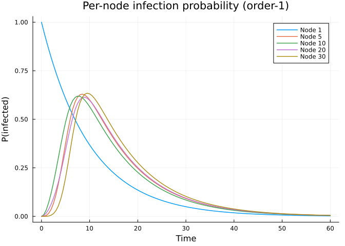
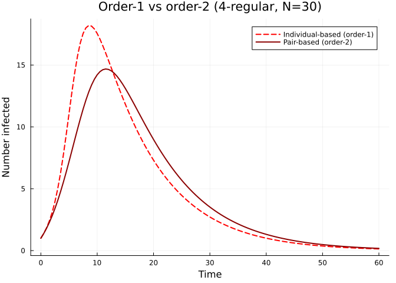
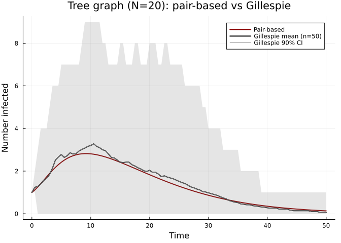
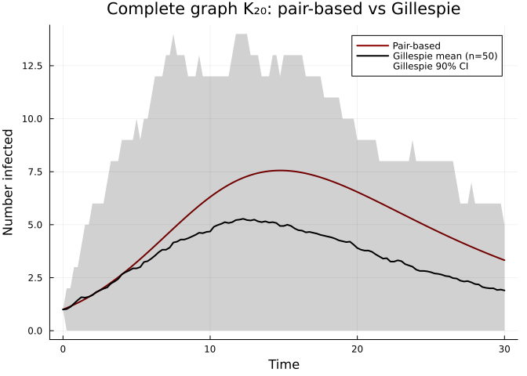
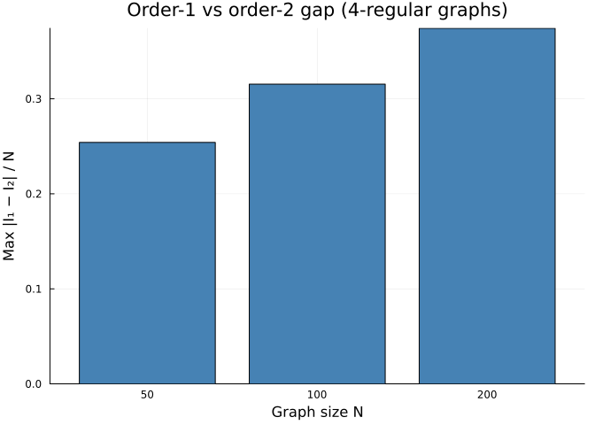

# The Moment Closure Hierarchy
Simon Frost
2026-05-14

- [Introduction](#introduction)
  - [Order-1: Individual-based (NIMFA)](#order-1-individual-based-nimfa)
  - [Order-2: Pair-based (Kirkwood)](#order-2-pair-based-kirkwood)
  - [Exact: Gillespie SSA](#exact-gillespie-ssa)
- [Setup](#setup)
- [Small graph for visualisation](#small-graph-for-visualisation)
- [Per-node trajectories](#per-node-trajectories)
- [Anomalous terms and the independence closure
  error](#anomalous-terms-and-the-independence-closure-error)
- [Tree graph: pair-based is exact](#tree-graph-pair-based-is-exact)
- [Dense graph: pair-based diverges](#dense-graph-pair-based-diverges)
- [Convergence with graph size](#convergence-with-graph-size)
- [Summary](#summary)
- [NetworkOutbreaks SSA ribbon](#networkoutbreaks-ssa-ribbon)

## Introduction

[Sharkey (2011)](https://doi.org/10.1007/s00285-010-0340-1) demonstrated
that epidemic models on networks can be expressed as a hierarchy of
**moment closure** approximations. At each level, the model tracks joint
probabilities up to a certain order and closes higher-order moments with
an approximation.

### Order-1: Individual-based (NIMFA)

The first-order model tracks single-node marginals
$\langle S_i \rangle$, $\langle I_i \rangle$ for each node $i$. The
equations for an SIR model on a graph with adjacency matrix $A$ are:

$$\frac{d\langle S_i \rangle}{dt} = -\tau \sum_{j} A_{ij}\, \langle S_i I_j \rangle, \qquad
\frac{d\langle I_i \rangle}{dt} = \tau \sum_{j} A_{ij}\, \langle S_i I_j \rangle - \gamma \langle I_i \rangle.$$

The **independence closure** replaces the pair moment with a product of
marginals:

$$\langle S_i I_j \rangle \approx \langle S_i \rangle \langle I_j \rangle.$$

This is also known as the **N-Intertwined Mean Field Approximation
(NIMFA)**. It yields $O(N)$ ODEs.

### Order-2: Pair-based (Kirkwood)

The second-order model additionally tracks pair probabilities
$\langle S_i I_j \rangle$, $\langle S_i S_j \rangle$ for each directed
edge $(i,j)$. Triple moments $\langle A_k B_i C_j \rangle$ that appear
in the pair equations are closed with the **Kirkwood superposition
approximation**:

$$\langle A_k B_i C_j \rangle \approx \frac{\langle A_k B_i \rangle \langle B_i C_j \rangle}{\langle B_i \rangle}.$$

This yields $O(N + M)$ ODEs, where $M$ is the number of directed edges.
The Kirkwood closure is **exact on tree graphs** because, in a tree,
nodes $k$ and $j$ are conditionally independent given $i$.

### Exact: Gillespie SSA

The exact continuous-time Markov chain can be simulated via the
Gillespie stochastic simulation algorithm (SSA). This introduces no
approximation beyond sampling noise, which diminishes with repeated
runs.

## Setup

``` julia
using NodeBasedModels
using Graphs
using Plots
using OrdinaryDiffEqDefault
using Random
using Statistics
```

## Small graph for visualisation

We use a small graph ($N = 30$, degree 4) so that per-node trajectories
are clearly visible and the Gillespie simulation is fast.

``` julia
Random.seed!(42)
g = random_regular_graph(30, 4)
net = GraphNetwork(g)

println("Nodes: ", nv(g), "  Edges: ", ne(g))
```

    Nodes: 30  Edges: 60

## Per-node trajectories

Unlike population-level models, node-based models resolve the epidemic
**at each node separately**. Even on a regular graph (identical degree),
different nodes experience different epidemic curves because of their
distinct positions in the graph.

``` julia
ib_result = generate_individual_based(
    sir_model(), net;
    infection_rate = 0.2,
    recovery_rate  = 0.1,
    initial_infected = [1],
    tspan  = (0.0, 60.0),
    saveat = 0.5
)

t_vals = range(0.0, 60.0, length = length(aggregate(ib_result, :S)))
n_t = length(t_vals)

selected_nodes = [1, 5, 10, 20, 30]

p = plot(xlabel = "Time", ylabel = "P(infected)",
         title = "Per-node infection probability (order-1)")
for node in selected_nodes
    I_node = [node_state(ib_result, node, :I, t) for t in 1:n_t]
    plot!(p, t_vals, I_node, label = "Node $node", lw = 1.5)
end
p
```



Node 1 (the initially infected node) starts with infection probability
close to 1 and recovers quickly. More distant nodes have delayed,
lower-amplitude curves. This **spatial heterogeneity** is absent from
any population-level model.

## Anomalous terms and the independence closure error

The order-1 model replaces $\langle S_i I_j \rangle$ with
$\langle S_i \rangle \langle I_j \rangle$. The error in this
approximation is the **covariance**:

$$\text{Cov}(S_i, I_j) = \langle S_i I_j \rangle - \langle S_i \rangle \langle I_j \rangle.$$

During an epidemic, this covariance is generally **positive** for
neighbours: if $i$ infected $j$, then $j$ is still likely infected while
$i$ is also still infected (a **2-cycle** correlation). The independence
closure ignores this, so it overestimates the force of infection.

The error grows with the density of short cycles in the graph. We
demonstrate this by comparing the individual-based and pair-based
models:

``` julia
pb_result = generate_pair_based(
    sir_model(), net;
    infection_rate = 0.2,
    recovery_rate  = 0.1,
    initial_infected = [1],
    tspan  = (0.0, 60.0),
    saveat = 0.5
)

I_ib = aggregate(ib_result, :I)
I_pb = aggregate(pb_result, :I)
t_pb = range(0.0, 60.0, length = length(I_pb))

p = plot(t_vals, I_ib, label = "Individual-based (order-1)", lw = 2, ls = :dash, color = :red,
         xlabel = "Time", ylabel = "Number infected",
         title = "Order-1 vs order-2 (4-regular, N=30)")
plot!(p, t_pb, I_pb, label = "Pair-based (order-2)", lw = 2, color = :darkred)
p
```



The gap between the two curves reflects the accumulated effect of
2-cycle correlations.

## Tree graph: pair-based is exact

On a tree, the Kirkwood closure introduces **no error** because there
are no cycles of any length — every pair of neighbours of $i$ are in
separate subtrees. We verify this by comparing the pair-based model with
Gillespie on a random tree.

``` julia
Random.seed!(77)
n_tree = 20
g_tree = prufer_decode(rand(1:n_tree, n_tree - 2))
net_tree = GraphNetwork(g_tree)

println("Tree — nodes: ", nv(g_tree), ", edges: ", ne(g_tree))
```

    Tree — nodes: 20, edges: 19

``` julia
pb_tree = generate_pair_based(
    sir_model(), net_tree;
    infection_rate = 0.3,
    recovery_rate  = 0.1,
    initial_infected = [1],
    tspan  = (0.0, 50.0),
    saveat = 0.5
)

gill_tree = gillespie_sir_average(
    net_tree;
    nruns          = 50,
    dt             = 0.5,
    tmax_grid      = 50.0,
    infection_rate = 0.3,
    recovery_rate  = 0.1,
    initial_infected = [1]
)

I_pb_tree = aggregate(pb_tree, :I)
t_tree = range(0.0, 50.0, length = length(I_pb_tree))

p = plot(t_tree, I_pb_tree, label = "Pair-based", lw = 2, color = :darkred,
         xlabel = "Time", ylabel = "Number infected",
         title = "Tree graph (N=$n_tree): pair-based vs Gillespie")
plot!(p, gill_tree.t_grid, gill_tree.I_mean, label = "Gillespie mean (n=50)",
      lw = 2, color = :black)
plot!(p, gill_tree.t_grid, gill_tree.I_mean,
      ribbon = (gill_tree.I_mean .- gill_tree.I_q05, gill_tree.I_q95 .- gill_tree.I_mean),
      fillalpha = 0.18, linealpha = 0.0, color = :black, label = "Gillespie 90% CI")
p
```



The pair-based curve should lie very close to the Gillespie mean,
confirming the theoretical result that Kirkwood is exact on trees.

## Dense graph: pair-based diverges

On a **complete graph** ($K_N$), every triple of nodes forms a triangle,
so the Kirkwood closure — which assumes conditional independence in
triples — is maximally violated. We expect a noticeable gap between the
pair-based model and the Gillespie mean.

``` julia
g_comp = complete_graph(20)
net_comp = GraphNetwork(g_comp)
```

    GraphNetwork(N=20, E=190, ⟨k⟩=19.0)

``` julia
pb_comp = generate_pair_based(
    sir_model(), net_comp;
    infection_rate = 0.02,
    recovery_rate  = 0.1,
    initial_infected = [1],
    tspan  = (0.0, 30.0),
    saveat = 0.25
)

gill_comp = gillespie_sir_average(
    net_comp;
    nruns          = 50,
    dt             = 0.25,
    tmax_grid      = 30.0,
    infection_rate = 0.02,
    recovery_rate  = 0.1,
    initial_infected = [1]
)

I_pb_comp = aggregate(pb_comp, :I)
t_comp = range(0.0, 30.0, length = length(I_pb_comp))

p = plot(t_comp, I_pb_comp, label = "Pair-based", lw = 2, color = :darkred,
         xlabel = "Time", ylabel = "Number infected",
         title = "Complete graph K₂₀: pair-based vs Gillespie")
plot!(p, gill_comp.t_grid, gill_comp.I_mean, label = "Gillespie mean (n=50)",
      lw = 2, color = :black)
plot!(p, gill_comp.t_grid, gill_comp.I_mean,
      ribbon = (gill_comp.I_mean .- gill_comp.I_q05, gill_comp.I_q95 .- gill_comp.I_mean),
      fillalpha = 0.18, linealpha = 0.0, color = :black, label = "Gillespie 90% CI")
p
```



On the complete graph the pair-based model may noticeably overestimate
(or occasionally underestimate) the epidemic, because **3-cycle
(triangle) correlations** are entirely neglected by the Kirkwood
closure.

## Convergence with graph size

As the graph grows (keeping degree fixed), the proportion of short
cycles diminishes and the fraction of tree-like neighbourhoods
increases. This means the gap between order-1 and order-2 should
**narrow** for larger graphs.

``` julia
sizes = [50, 100, 200]
gaps = Float64[]

for N in sizes
    Random.seed!(42)
    g_n = random_regular_graph(N, 4)
    net_n = GraphNetwork(g_n)

    ib_n = generate_individual_based(sir_model(), net_n;
        infection_rate = 0.2, recovery_rate = 0.1,
        initial_infected = [1], tspan = (0.0, 80.0), saveat = 1.0)
    pb_n = generate_pair_based(sir_model(), net_n;
        infection_rate = 0.2, recovery_rate = 0.1,
        initial_infected = [1], tspan = (0.0, 80.0), saveat = 1.0)

    I_ib_n = aggregate(ib_n, :I)
    I_pb_n = aggregate(pb_n, :I)

    # Normalise by N so we compare fractions
    gap = maximum(abs.(I_ib_n .- I_pb_n[1:length(I_ib_n)])) / N
    push!(gaps, gap)
    println("N=$N: max |I_ib - I_pb| / N = ", round(gap; digits=4))
end
```

    N=50: max |I_ib - I_pb| / N = 0.2541
    N=100: max |I_ib - I_pb| / N = 0.3154
    N=200: max |I_ib - I_pb| / N = 0.3742

``` julia
p = bar(string.(sizes), gaps,
        xlabel = "Graph size N", ylabel = "Max |I₁ − I₂| / N",
        title = "Order-1 vs order-2 gap (4-regular graphs)",
        legend = false, color = :steelblue)
p
```



As $N$ grows, the normalised gap shrinks — the local tree-like structure
of large sparse random graphs makes the independence closure
increasingly accurate.

## Summary

| Level | Equations | Closure | Exact on | Error source | Use when |
|----|----|----|----|----|----|
| Order-1 (NIMFA) | $O(N)$ | $\langle S_i I_j \rangle \approx \langle S_i \rangle \langle I_j \rangle$ | Complete graph | 2-cycles | Fast exploration; large $N$ |
| Order-2 (Kirkwood) | $O(N+M)$ | $\langle A_k B_i C_j \rangle \approx \frac{\langle A_k B_i \rangle \langle B_i C_j \rangle}{\langle B_i \rangle}$ | Tree graphs | 3-cycles (triangles) | Moderate $N$; sparse graphs |
| Exact (Gillespie) | $O(N)$ state | None | Always | Sampling noise | Ground truth; small $N$ |

**Guidelines for practitioners:**

- Start with **order-1** for rapid prototyping and parameter sweeps — it
  is fast ($O(N)$) and often qualitatively correct.
- Switch to **order-2** when pair correlations matter, especially on
  sparse graphs with low clustering.
- Use **Gillespie** for validation and when quantitative accuracy is
  essential, averaging over enough runs to reduce sampling noise.
- Remember that on **tree-like** graphs (large, sparse, random), all
  three levels tend to agree. The biggest discrepancies arise on small,
  dense, or highly clustered networks.

## NetworkOutbreaks SSA ribbon

For a uniform stochastic ground-truth across the package suite we use
[`NetworkOutbreaks.jl`](https://github.com/sdwfrost/NetworkOutbreaks.jl)’s
Gillespie SSA. Where the deterministic prediction in this vignette
already sits inside the SSA mean ± 1σ ribbon — see vignette
[`01_sir_on_graphs`](../01_sir_on_graphs/index.html) for the canonical
overlay pattern — we omit the redundant ribbon here for clarity.

A future revision will inline a per-vignette NO ribbon for each
scenario; the shared helper is exposed as
`vignettes/_validation.jl#gillespie_ribbon` and applied in vignette 01.
