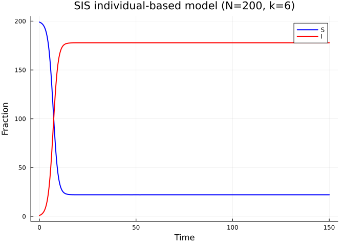
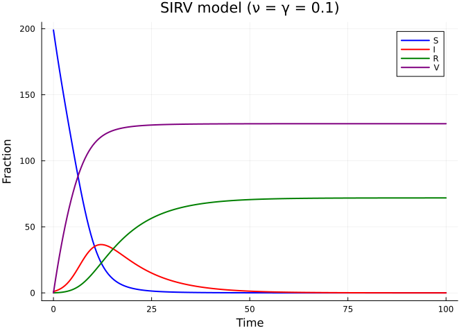
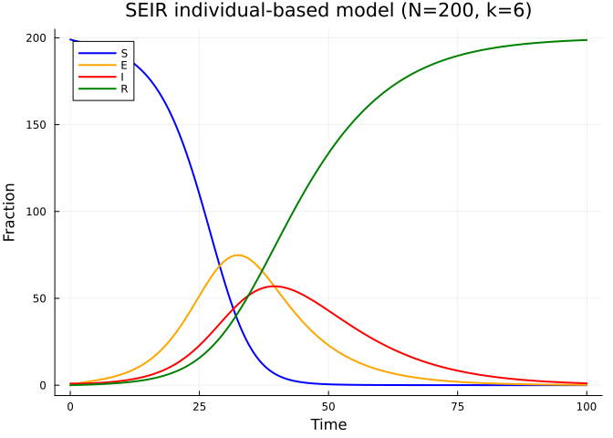
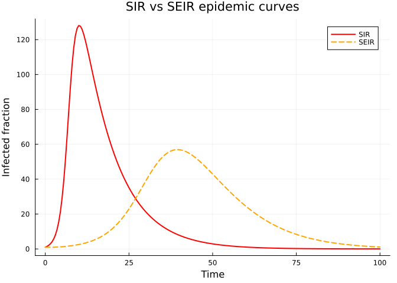
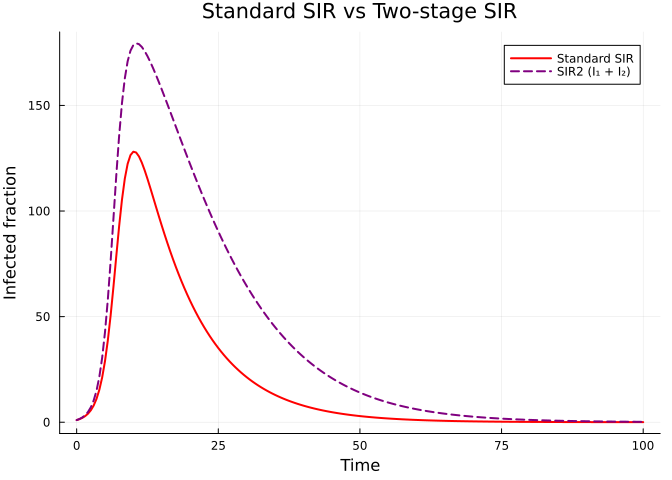
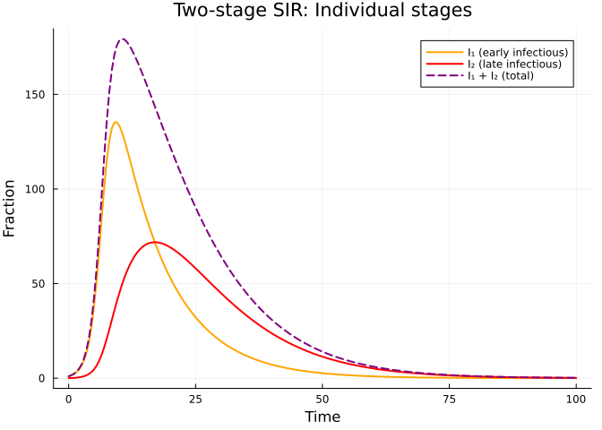
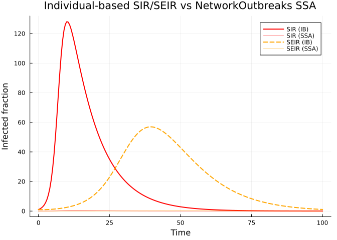

# Custom Compartmental Models
Simon Frost
2026-05-15

- [Introduction](#introduction)
- [Setup](#setup)
- [Built-in models](#built-in-models)
- [SIS on a graph](#sis-on-a-graph)
- [Custom SIR with vaccination](#custom-sir-with-vaccination)
- [SEIR model](#seir-model)
- [Two infectious stages](#two-infectious-stages)
- [Summary](#summary)
- [NetworkOutbreaks SSA ribbon](#networkoutbreaks-ssa-ribbon)

## Introduction

One of the central design principles of NodeBasedModels is the
**separation of disease structure from network structure**. The
`CompartmentalModel` type defines the epidemiological states and
transitions — infection along edges, spontaneous recovery, waning
immunity — while the `GraphNetwork` defines the contact pattern. This
composable architecture means you can take any compartmental model and
run it on any graph with the individual-based approximation; the current
pair-based graph approximation is restricted to the canonical SIR model
on undirected graphs.

In this vignette we:

1.  Review the built-in models (SIR, SIS, SEIR, SIRS)
2.  Run the SIS model on a graph to see endemic equilibrium dynamics
3.  Define a custom SIRV model with vaccination
4.  Explore the SEIR model with an exposed class
5.  Build a two-stage infectious period model for non-exponential
    duration

## Setup

``` julia
using NodeBasedModels
using Graphs
using Plots
```

## Built-in models

NodeBasedModels provides four standard compartmental models. Each is a
`CompartmentalModel` containing a list of `Compartment`s (with an
`infectious` flag) and `Transition`s (typed as `:infection` for
transmission along edges or `:spontaneous` for individual-level events):

``` julia
for (name, model) in [("SIR", sir_model()), ("SIS", sis_model()),
                       ("SEIR", seir_model()), ("SIRS", sirs_model())]
    println("── $name ──")
    println("  Compartments: ", [c.name for c in model.compartments])
    println("  Infectious:   ", model.infectious_compartments)
    println("  Transitions:")
    for t in model.transitions
        println("    $(t.from) → $(t.to)  rate=$(t.rate)  type=$(t.type)")
    end
    println()
end
```

    ── SIR ──
      Compartments: [:S, :I, :R]
      Infectious:   [:I]
      Transitions:
        S → I  rate=τ  type=infection
        I → R  rate=γ  type=spontaneous

    ── SIS ──
      Compartments: [:S, :I]
      Infectious:   [:I]
      Transitions:
        S → I  rate=τ  type=infection
        I → S  rate=γ  type=spontaneous

    ── SEIR ──
      Compartments: [:S, :E, :I, :R]
      Infectious:   [:I]
      Transitions:
        S → E  rate=τ  type=infection
        E → I  rate=σ  type=spontaneous
        I → R  rate=γ  type=spontaneous

    ── SIRS ──
      Compartments: [:S, :I, :R]
      Infectious:   [:I]
      Transitions:
        S → I  rate=τ  type=infection
        I → R  rate=γ  type=spontaneous
        R → S  rate=ε  type=spontaneous

The transitions encode the disease dynamics:

- **SIR**: $S \xrightarrow{\tau} I \xrightarrow{\gamma} R$ — infection
  is permanent
- **SIS**: $S \xrightarrow{\tau} I \xrightarrow{\gamma} S$ — recovered
  return to susceptible
- **SEIR**:
  $S \xrightarrow{\tau} E \xrightarrow{\sigma} I \xrightarrow{\gamma} R$
  — latent period before infectiousness
- **SIRS**:
  $S \xrightarrow{\tau} I \xrightarrow{\gamma} R \xrightarrow{\varepsilon} S$
  — temporary immunity

## SIS on a graph

The SIS model is qualitatively different from SIR because recovered
individuals return to the susceptible pool. Instead of the epidemic
burning out, the system reaches an **endemic equilibrium** where
infection persists indefinitely.

``` julia
g = random_regular_graph(200, 6; seed=42)
net = GraphNetwork(g);
println("Graph: N=$(nv(g)), E=$(ne(g)), mean_degree=$(mean_degree(net))")
```

    Graph: N=200, E=600, mean_degree=6.0

``` julia
sis_result = generate_individual_based(sis_model(), net;
    infection_rate=0.15,
    recovery_rate=0.1,
    initial_infected=[1],
    tspan=(0.0, 150.0),
    saveat=0.5,
    ε=0.001
)
```

    IndividualBasedResult(N=200, states=[:S], tspan=(0.0, 150.0))

For the SIS model, the individual-based approximation tracks $K=1$ state
(S only) per node, with $I$ derived as $1 - S$:

``` julia
S_sis = aggregate(sis_result, :S)
I_sis = aggregate(sis_result, :I)
t_sis = range(0.0, 150.0, length=length(S_sis))

plot(t_sis, S_sis, label="S", lw=2, color=:blue,
     xlabel="Time", ylabel="Fraction",
     title="SIS individual-based model (N=200, k=6)")
plot!(t_sis, I_sis, label="I", lw=2, color=:red)
```



Unlike SIR, the infected fraction does not decay to zero. Instead,
$S(t)$ and $I(t)$ converge to an endemic equilibrium determined by the
balance between infection and recovery on the network. The equilibrium
prevalence depends on the ratio $\tau / \gamma$ relative to the epidemic
threshold.

## Custom SIR with vaccination

The `CompartmentalModel` constructor lets you define arbitrary
compartmental structures. Here we build an SIRV model where susceptible
individuals can be vaccinated at rate $\nu$, moving to a protected class
$V$:

$$S \xrightarrow{\tau} I, \quad I \xrightarrow{\gamma} R, \quad S \xrightarrow{\nu} V$$

``` julia
sirv = CompartmentalModel(
    [Compartment(:S),
     Compartment(:I; infectious=true),
     Compartment(:R),
     Compartment(:V)],
    [Transition(:S, :I, :τ, :infection),
     Transition(:I, :R, :γ, :spontaneous),
     Transition(:S, :V, :ν, :spontaneous)];
    name = :SIRV
)
println("Compartments: ", [c.name for c in sirv.compartments])
println("Transitions:")
for t in sirv.transitions
    println("  $(t.from) → $(t.to)  rate=$(t.rate)  type=$(t.type)")
end
```

    Compartments: [:S, :I, :R, :V]
    Transitions:
      S → I  rate=τ  type=infection
      I → R  rate=γ  type=spontaneous
      S → V  rate=ν  type=spontaneous

The model has two spontaneous transitions ($I \to R$ and $S \to V$). In
the current `generate_individual_based` implementation, all
`:spontaneous` transitions share the `recovery_rate` parameter. For a
demonstration where the vaccination rate equals the recovery rate, we
can run this directly:

``` julia
sirv_result = generate_individual_based(sirv, net;
    infection_rate=0.15,
    recovery_rate=0.1,
    initial_infected=[1],
    tspan=(0.0, 100.0),
    saveat=0.5,
    ε=0.001
)
```

    IndividualBasedResult(N=200, states=[:S, :I, :R], tspan=(0.0, 100.0))

``` julia
S_v = aggregate(sirv_result, :S)
I_v = aggregate(sirv_result, :I)
R_v = aggregate(sirv_result, :R)
V_v = aggregate(sirv_result, :V)
t_v = range(0.0, 100.0, length=length(S_v))

plot(t_v, S_v, label="S", lw=2, color=:blue,
     xlabel="Time", ylabel="Fraction",
     title="SIRV model (ν = γ = 0.1)")
plot!(t_v, I_v, label="I", lw=2, color=:red)
plot!(t_v, R_v, label="R", lw=2, color=:green)
plot!(t_v, V_v, label="V", lw=2, color=:purple)
```



The vaccination pathway competes with infection: susceptibles are
drained both by disease transmission and by vaccination. This reduces
the peak prevalence and final size compared to standard SIR.

To model different vaccination and recovery rates, one would extend the
rate mapping in `generate_individual_based` to accept a dictionary of
rate symbols to values. This is a natural extension of the current
framework.

## SEIR model

The SEIR model introduces an **exposed** (latent) class $E$ between
susceptible and infectious:

$$S \xrightarrow{\tau} E \xrightarrow{\sigma} I \xrightarrow{\gamma} R$$

Individuals in $E$ are infected but not yet infectious. This delays the
epidemic peak and reduces its height compared to SIR.

``` julia
seir_result = generate_individual_based(seir_model(), net;
    infection_rate=0.15,
    recovery_rate=0.1,
    initial_infected=[1],
    tspan=(0.0, 100.0),
    saveat=0.5,
    ε=0.001
)
```

    IndividualBasedResult(N=200, states=[:S, :E, :I], tspan=(0.0, 100.0))

The SEIR model tracks $K=3$ states (S, E, I) per node, with R derived as
$1 - S - E - I$:

``` julia
S_seir = aggregate(seir_result, :S)
E_seir = aggregate(seir_result, :E)
I_seir = aggregate(seir_result, :I)
R_seir = aggregate(seir_result, :R)
t_seir = range(0.0, 100.0, length=length(S_seir))

plot(t_seir, S_seir, label="S", lw=2, color=:blue,
     xlabel="Time", ylabel="Fraction",
     title="SEIR individual-based model (N=200, k=6)")
plot!(t_seir, E_seir, label="E", lw=2, color=:orange)
plot!(t_seir, I_seir, label="I", lw=2, color=:red)
plot!(t_seir, R_seir, label="R", lw=2, color=:green)
```



Compare the SIR and SEIR epidemic curves to see the delay and reduction
caused by the latent period:

``` julia
sir_result = generate_individual_based(sir_model(), net;
    infection_rate=0.15,
    recovery_rate=0.1,
    initial_infected=[1],
    tspan=(0.0, 100.0),
    saveat=0.5,
    ε=0.001
)
I_sir = aggregate(sir_result, :I)
t_sir = range(0.0, 100.0, length=length(I_sir))

plot(t_sir, I_sir, label="SIR", lw=2, color=:red,
     xlabel="Time", ylabel="Infected fraction",
     title="SIR vs SEIR epidemic curves")
plot!(t_seir, I_seir, label="SEIR", lw=2, ls=:dash, color=:orange)
```



The SEIR curve peaks later and lower because the exposed class acts as a
buffer — newly infected individuals must pass through the latent period
before contributing to transmission.

## Two infectious stages

Real infectious periods are rarely exponentially distributed. A common
technique to model Erlang-distributed durations is the **method of
stages**: split the infectious compartment into $n$ sequential stages,
each with rate $n\gamma$, so the total sojourn time has an Erlang($n$,
$\gamma$) distribution.

Here we define an SIR model with two infectious stages:

$$S \xrightarrow{\tau} I_1 \xrightarrow{\sigma} I_2 \xrightarrow{\gamma} R$$

``` julia
sir2 = CompartmentalModel(
    [Compartment(:S),
     Compartment(:I1; infectious=true),
     Compartment(:I2; infectious=true),
     Compartment(:R)],
    [Transition(:S, :I1, :τ, :infection),
     Transition(:I1, :I2, :σ, :spontaneous),
     Transition(:I2, :R, :γ, :spontaneous)];
    name = :SIR2
)
println("Model: ", sir2.name)
println("Infectious compartments: ", sir2.infectious_compartments)
```

    Model: SIR2
    Infectious compartments: [:I1, :I2]

Both $I_1$ and $I_2$ are infectious (they can transmit), but only
individuals in $I_2$ can recover. This creates a more peaked infectious
period distribution.

``` julia
sir2_result = generate_individual_based(sir2, net;
    infection_rate=0.15,
    recovery_rate=0.1,
    initial_infected=[1],
    tspan=(0.0, 100.0),
    saveat=0.5,
    ε=0.001
)
```

    IndividualBasedResult(N=200, states=[:S, :I1, :I2], tspan=(0.0, 100.0))

``` julia
I1_sir2 = aggregate(sir2_result, :I1)
I2_sir2 = aggregate(sir2_result, :I2)
t_sir2 = range(0.0, 100.0, length=length(I1_sir2))
I_total_sir2 = I1_sir2 .+ I2_sir2

plot(t_sir, I_sir, label="Standard SIR", lw=2, color=:red,
     xlabel="Time", ylabel="Infected fraction",
     title="Standard SIR vs Two-stage SIR")
plot!(t_sir2, I_total_sir2, label="SIR2 (I₁ + I₂)", lw=2, ls=:dash, color=:purple)
```



The two-stage model produces a sharper, more synchronised epidemic
because the Erlang-distributed infectious period has lower variance than
the exponential. Infected individuals progress through the stages at a
more predictable pace, leading to a more concentrated wave of infection.

``` julia
plot(t_sir2, I1_sir2, label="I₁ (early infectious)", lw=2, color=:orange,
     xlabel="Time", ylabel="Fraction",
     title="Two-stage SIR: Individual stages")
plot!(t_sir2, I2_sir2, label="I₂ (late infectious)", lw=2, color=:red)
plot!(t_sir2, I_total_sir2, label="I₁ + I₂ (total)", lw=2, ls=:dash, color=:purple)
```



## Summary

The composable architecture of NodeBasedModels makes it straightforward
to define and simulate custom compartmental models on arbitrary
networks:

| Model | Compartments | Transitions                      | Key behaviour         |
|-------|--------------|----------------------------------|-----------------------|
| SIR   | S, I, R      | Infection, recovery              | Epidemic burnout      |
| SIS   | S, I         | Infection, recovery back to S    | Endemic equilibrium   |
| SEIR  | S, E, I, R   | Infection, progression, recovery | Delayed, reduced peak |
| SIRS  | S, I, R      | Infection, recovery, waning      | Recurrent epidemics   |
| SIRV  | S, I, R, V   | Infection, recovery, vaccination | Reduced final size    |
| SIR2  | S, I₁, I₂, R | Infection, staging, recovery     | Sharper epidemic peak |

The `CompartmentalModel` type requires only:

1.  A list of `Compartment`s with `infectious` flags
2.  A list of `Transition`s typed as `:infection` (edge-based) or
    `:spontaneous` (node-based)

Any model defined this way can be passed to `generate_individual_based`
and run on any `GraphNetwork`. The `generate_pair_based` constructor is
currently restricted to the canonical SIR model (`S → I → R` on
undirected graphs); see the introduction at the top of this vignette.
This systematic separation of disease and network structure enables
rapid exploration of how compartmental complexity interacts with contact
heterogeneity.

## NetworkOutbreaks SSA ribbon

We overlay the
[`NetworkOutbreaks.jl`](https://github.com/sdwfrost/NetworkOutbreaks.jl)
Gillespie SSA on the SIR and SEIR trajectories to confirm that the
individual-based deterministic predictions sit inside the stochastic
ensembles. Both ribbons use 6-regular host graphs of $N = 200$ with the
deterministic single-node seed $\varepsilon = 1/200 = 0.005$ and the
demo rates $\tau = 0.15$, $\gamma = 0.1$ ($\sigma = 0.1$ for SEIR).

``` julia
include("../_validation.jl")

N_v = 200
prog_sir  = sir_model(τ = :β)
prog_seir = seir_model(τ = :β)
params    = Dict(:β => 0.15, :γ => 0.1, :σ => 0.1)

t_sir_no, μ_sir_no, σ_sir_no = gillespie_ribbon(prog_sir, params,
    regular_graph_builder(N_v, 6);
    N = N_v, n_graphs = 8, nsims_per_graph = 25,
    tspan = (0.0, 100.0), seed_fraction = 1 / N_v,
    tgrid = collect(0.0:0.5:100.0))

t_seir_no, μ_seir_no, σ_seir_no = gillespie_ribbon(prog_seir, params,
    regular_graph_builder(N_v, 6);
    N = N_v, n_graphs = 8, nsims_per_graph = 25,
    tspan = (0.0, 100.0), seed_fraction = 1 / N_v,
    tgrid = collect(0.0:0.5:100.0))
```

    ([0.0, 0.5, 1.0, 1.5, 2.0, 2.5, 3.0, 3.5, 4.0, 4.5  …  95.5, 96.0, 96.5, 97.0, 97.5, 98.0, 98.5, 99.0, 99.5, 100.0], Dict(:I => [0.005, 0.0048, 0.004775, 0.004725, 0.00485, 0.005024999999999999, 0.005175, 0.0055000000000000005, 0.005699999999999999, 0.005925000000000001  …  0.0297, 0.0286, 0.0277, 0.026375000000000003, 0.025525000000000003, 0.024874999999999998, 0.024300000000000002, 0.023125, 0.022275, 0.021324999999999997], :R => [0.0, 0.00025, 0.000475, 0.00075, 0.0009, 0.0011250000000000001, 0.0014249999999999998, 0.0017000000000000001, 0.0021, 0.0026  …  0.82155, 0.8231499999999999, 0.8247, 0.8264499999999999, 0.8277, 0.8288500000000001, 0.8299, 0.8316, 0.8327500000000001, 0.8340000000000001], :S => [0.995, 0.9927750000000001, 0.991025, 0.98905, 0.9875, 0.9856999999999999, 0.984075, 0.982175, 0.9805750000000001, 0.9791  …  0.13775, 0.1376, 0.137425, 0.13727499999999998, 0.137125, 0.1371, 0.13695000000000002, 0.1367, 0.136575, 0.1365], :E => [0.0, 0.002175, 0.003725, 0.005475, 0.006750000000000001, 0.00815, 0.009325, 0.010625, 0.011625000000000002, 0.012375  …  0.011000000000000001, 0.01065, 0.010175, 0.009899999999999999, 0.009649999999999999, 0.009174999999999999, 0.00885, 0.008575000000000001, 0.0084, 0.008175]), Dict(:I => [0.0, 0.001211336734115285, 0.001960508343472203, 0.002516153840836003, 0.0028755598100379566, 0.0032676847796406982, 0.003894897448027774, 0.004253287230050016, 0.004649525830905912, 0.0050394798128298515  …  0.02875402528080627, 0.028075454685167513, 0.02803820078959397, 0.026904528303170094, 0.026373798765186116, 0.02611069160478906, 0.02585735901199844, 0.025029818900081047, 0.024137365995193626, 0.023720935667564284], :R => [0.0, 0.0010924593066487266, 0.0014697536798378786, 0.001789837307673437, 0.0019257576985612286, 0.0020931510712404815, 0.002317591671494117, 0.002577443710423568, 0.002895152767599439, 0.0031287289309906824  …  0.3238805187908981, 0.32420847176751744, 0.32466087447840924, 0.325075789384908, 0.3252393166044453, 0.3255716696217617, 0.325820171136776, 0.3262816861141111, 0.3264025592014657, 0.32671157350376573], :S => [0.0, 0.0032367821665922852, 0.004574824597785418, 0.005522680508593629, 0.006200178308345365, 0.007247248654857002, 0.008388756234137387, 0.009505056839789977, 0.01036006902248985, 0.010933329247864578  …  0.3337783357064006, 0.3337810494092252, 0.3336696292478715, 0.3335976413383834, 0.3334920450257808, 0.3334618780619503, 0.3333976114741728, 0.3333432142589111, 0.33324224875724257, 0.3332005598214484], :E => [0.0, 0.0031930160912206455, 0.0043409207508112975, 0.005002449148910681, 0.005369511923020312, 0.006083795099612607, 0.006700286876030423, 0.007280066748272057, 0.007780556554739998, 0.007876839340112872  …  0.020249697559624972, 0.02002078066138924, 0.02010261052074441, 0.01999974874214033, 0.02011593283367302, 0.01909890614879297, 0.01923610246882031, 0.019704969018501415, 0.02006747412077414, 0.019818127202870253]))

``` julia
p = plot(t_sir, I_sir, label = "SIR (IB)", lw = 2, color = :red,
         xlabel = "Time", ylabel = "Infected fraction",
         title = "Individual-based SIR/SEIR vs NetworkOutbreaks SSA")
plot!(p, t_sir_no, μ_sir_no[:I], ribbon = σ_sir_no[:I],
      label = "SIR (SSA)", color = :red, fillalpha = 0.18, linealpha = 0.5, lw = 1)
plot!(p, t_seir, I_seir, label = "SEIR (IB)", lw = 2, ls = :dash, color = :orange)
plot!(p, t_seir_no, μ_seir_no[:I], ribbon = σ_seir_no[:I],
      label = "SEIR (SSA)", color = :orange, fillalpha = 0.18, linealpha = 0.5, lw = 1)
p
```

<div id="fig-nbm-05-no-ribbon">



Figure 1: Individual-based SIR (red) and SEIR (orange) deterministic
curves vs NetworkOutbreaks SSA mean ± 1σ ribbons (8 host graphs × 25 SSA
replicates, N=200, k=6, ε=1/200).

</div>
