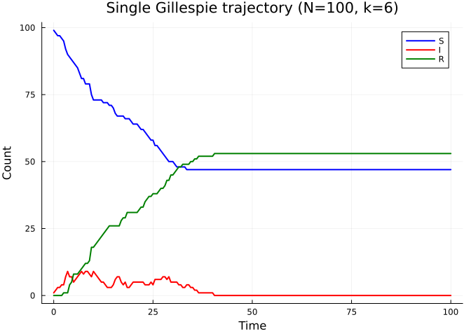
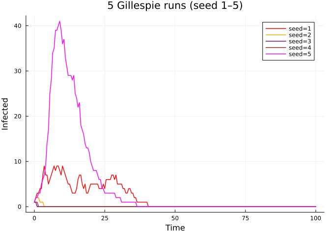
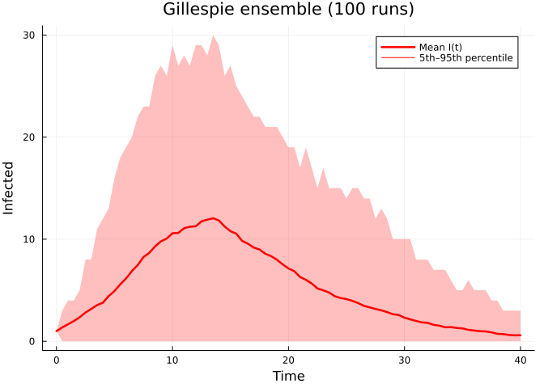
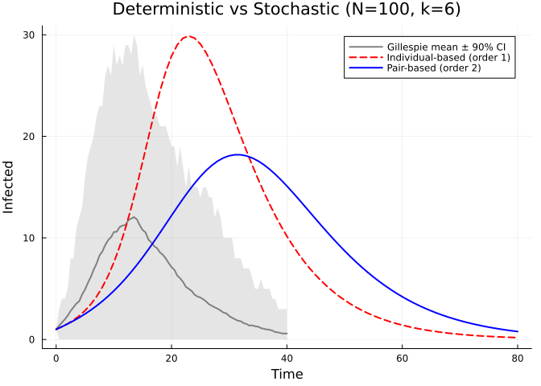
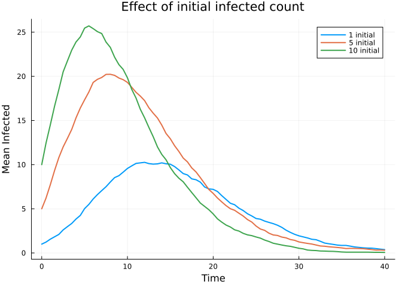
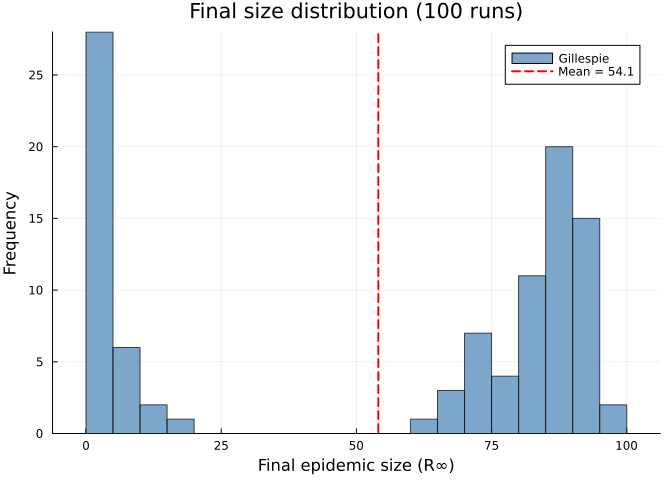

- [Stochastic Validation with
  Gillespie](#stochastic-validation-with-gillespie)
  - [Introduction](#introduction)
  - [Setup](#setup)
  - [Single stochastic trajectory](#single-stochastic-trajectory)
  - [Stochastic variability](#stochastic-variability)
  - [Ensemble averaging](#ensemble-averaging)
  - [Comparison with deterministic
    models](#comparison-with-deterministic-models)
  - [Effect of initial conditions](#effect-of-initial-conditions)
  - [Final size distribution](#final-size-distribution)
  - [Summary](#summary)

# Stochastic Validation with Gillespie

Simon Frost 2026-03-29

- [Introduction](#introduction)
- [Setup](#setup)
- [Single stochastic trajectory](#single-stochastic-trajectory)
- [Stochastic variability](#stochastic-variability)
- [Ensemble averaging](#ensemble-averaging)
- [Comparison with deterministic
  models](#comparison-with-deterministic-models)
- [Effect of initial conditions](#effect-of-initial-conditions)
- [Final size distribution](#final-size-distribution)
- [Summary](#summary)

## Introduction

Deterministic models — whether individual-based (order 1) or pair-based
(order 2) — are approximations of the true stochastic process that
governs disease spread on a network. They replace integer-valued node
states with continuous probabilities and assume that correlations beyond
a certain order can be closed. These approximations work well for large
populations far from the epidemic threshold, but they can be misleading
when stochastic effects dominate: early in an outbreak, near the
critical threshold, or in small populations.

The **Gillespie algorithm** (Gillespie, 1977) provides an exact
stochastic simulation of the continuous-time Markov chain on a specific
graph. Each event — an infection along an edge or a recovery of a node —
is drawn from the correct waiting-time distribution. NodeBasedModels
implements this using
[JumpProcesses.jl](https://github.com/SciML/JumpProcesses.jl) with
`ConstantRateJump` events and the `Direct` aggregator.

In this vignette we:

1.  Run single stochastic trajectories and visualise the step-function
    dynamics
2.  Explore stochastic variability across runs
3.  Compute ensemble averages with confidence bands
4.  Compare the Gillespie ground truth with deterministic approximations
5.  Examine the effect of initial conditions on stochastic extinction
6.  Inspect the bimodal final-size distribution

## Setup

``` julia
using NodeBasedModels
using Graphs
using Plots
using Statistics
```

## Single stochastic trajectory

We start with a random regular graph where every node has degree 6. This
is a natural test case because the homogeneous degree structure means
population-level theory should apply, and deviations are purely due to
stochasticity and local structure.

``` julia
g = random_regular_graph(100, 6; seed=42)
net = GraphNetwork(g)
println("Nodes: ", nv(g), ", Edges: ", ne(g), ", Mean degree: ", round(mean_degree(net), digits=2))
```

    Nodes: 100, Edges: 300, Mean degree: 6.0

Run a single Gillespie SIR simulation starting from one infected node:

``` julia
result = gillespie_sir(net;
    infection_rate=0.15,
    recovery_rate=0.1,
    initial_infected=[1],
    seed=1
)
```

    GillespieResult(SciMLBase.ODESolution{Int64, 2, Vector{Vector{Int64}}, Nothing, Nothing, Vector{Float64}, Nothing, Nothing, SciMLBase.DiscreteProblem{Vector{Int64}, Tuple{Float64, Float64}, true, Vector{Float64}, SciMLBase.DiscreteFunction{true, SciMLBase.FullSpecialize, SciMLBase.var"#297#298", Nothing, typeof(SciMLBase.DEFAULT_OBSERVED), Nothing, Nothing}, Base.Pairs{Symbol, Union{}, Nothing, @NamedTuple{}}}, JumpProcesses.SSAStepper, SciMLBase.ConstantInterpolation{Vector{Float64}, Vector{Vector{Int64}}}, SciMLBase.DEStats, Nothing, Nothing, Nothing, Nothing}([[0, 1, 1, 1, 1, 1, 1, 1, 1, 1  …  0, 0, 0, 0, 0, 0, 0, 0, 0, 0], [0, 1, 1, 1, 1, 1, 1, 1, 1, 1  …  0, 0, 0, 0, 0, 0, 0, 0, 0, 0], [0, 1, 1, 1, 1, 1, 1, 1, 1, 1  …  0, 0, 0, 0, 0, 0, 0, 0, 0, 0], [0, 1, 1, 1, 1, 1, 1, 1, 1, 1  …  0, 0, 0, 0, 0, 0, 0, 0, 0, 0], [0, 1, 1, 1, 1, 1, 1, 1, 1, 1  …  0, 0, 0, 0, 0, 0, 0, 0, 0, 0], [0, 1, 1, 1, 1, 1, 0, 1, 1, 1  …  0, 0, 0, 0, 0, 0, 0, 0, 0, 0], [0, 1, 1, 1, 1, 1, 0, 1, 1, 1  …  0, 0, 0, 0, 0, 0, 0, 0, 0, 0], [0, 1, 1, 0, 1, 1, 0, 1, 1, 1  …  0, 0, 0, 0, 0, 0, 0, 0, 0, 0], [0, 1, 1, 0, 1, 1, 0, 1, 1, 1  …  0, 0, 0, 0, 0, 0, 0, 0, 0, 0], [0, 1, 1, 0, 1, 1, 0, 1, 1, 0  …  0, 0, 0, 0, 0, 0, 0, 0, 0, 0]  …  [0, 0, 0, 0, 0, 0, 0, 0, 0, 0  …  1, 0, 0, 1, 0, 0, 0, 0, 1, 0], [0, 0, 0, 0, 0, 0, 0, 0, 0, 0  …  1, 0, 0, 1, 0, 0, 0, 0, 1, 0], [0, 0, 0, 0, 0, 0, 0, 0, 0, 0  …  1, 0, 0, 1, 0, 0, 0, 0, 1, 0], [0, 0, 0, 0, 0, 0, 0, 0, 0, 0  …  1, 0, 0, 1, 0, 0, 0, 0, 1, 0], [0, 0, 0, 0, 0, 0, 0, 0, 0, 0  …  1, 0, 0, 0, 0, 0, 0, 0, 1, 0], [0, 0, 0, 0, 0, 0, 0, 0, 0, 0  …  0, 0, 0, 0, 0, 0, 0, 0, 1, 0], [0, 0, 0, 0, 0, 0, 0, 0, 0, 0  …  0, 0, 0, 0, 0, 0, 0, 0, 1, 0], [0, 0, 0, 0, 0, 0, 0, 0, 0, 0  …  0, 0, 0, 0, 0, 0, 0, 0, 1, 0], [0, 0, 0, 0, 0, 0, 0, 0, 0, 0  …  0, 0, 0, 0, 0, 0, 0, 0, 0, 0], [0, 0, 0, 0, 0, 0, 0, 0, 0, 0  …  0, 0, 0, 0, 0, 0, 0, 0, 0, 0]], nothing, nothing, [0.0, 0.09423776100793935, 0.872587695576791, 1.792242617357132, 2.373872666520294, 2.4151098598357805, 2.542440219079665, 2.5649180003552385, 2.8607679083694832, 2.9281660044497775  …  37.01228755672665, 37.815026150497744, 38.57451842747557, 39.67294036431042, 39.743508915335994, 43.19245294355713, 47.18051597020926, 51.994004596169766, 54.6018049603783, 100.0], nothing, nothing, SciMLBase.DiscreteProblem{Vector{Int64}, Tuple{Float64, Float64}, true, Vector{Float64}, SciMLBase.DiscreteFunction{true, SciMLBase.FullSpecialize, SciMLBase.var"#297#298", Nothing, typeof(SciMLBase.DEFAULT_OBSERVED), Nothing, Nothing}, Base.Pairs{Symbol, Union{}, Nothing, @NamedTuple{}}}(SciMLBase.DiscreteFunction{true, SciMLBase.FullSpecialize, SciMLBase.var"#297#298", Nothing, typeof(SciMLBase.DEFAULT_OBSERVED), Nothing, Nothing}(SciMLBase.var"#297#298"(), nothing, SciMLBase.DEFAULT_OBSERVED, nothing, nothing), [0, 1, 1, 1, 1, 1, 1, 1, 1, 1  …  0, 0, 0, 0, 0, 0, 0, 0, 0, 0], (0.0, 100.0), [0.15, 0.1], Base.Pairs{Symbol, Union{}, Nothing, @NamedTuple{}}()), JumpProcesses.SSAStepper(), SciMLBase.ConstantInterpolation{Vector{Float64}, Vector{Vector{Int64}}}([0.0, 0.09423776100793935, 0.872587695576791, 1.792242617357132, 2.373872666520294, 2.4151098598357805, 2.542440219079665, 2.5649180003552385, 2.8607679083694832, 2.9281660044497775  …  37.01228755672665, 37.815026150497744, 38.57451842747557, 39.67294036431042, 39.743508915335994, 43.19245294355713, 47.18051597020926, 51.994004596169766, 54.6018049603783, 100.0], [[0, 1, 1, 1, 1, 1, 1, 1, 1, 1  …  0, 0, 0, 0, 0, 0, 0, 0, 0, 0], [0, 1, 1, 1, 1, 1, 1, 1, 1, 1  …  0, 0, 0, 0, 0, 0, 0, 0, 0, 0], [0, 1, 1, 1, 1, 1, 1, 1, 1, 1  …  0, 0, 0, 0, 0, 0, 0, 0, 0, 0], [0, 1, 1, 1, 1, 1, 1, 1, 1, 1  …  0, 0, 0, 0, 0, 0, 0, 0, 0, 0], [0, 1, 1, 1, 1, 1, 1, 1, 1, 1  …  0, 0, 0, 0, 0, 0, 0, 0, 0, 0], [0, 1, 1, 1, 1, 1, 0, 1, 1, 1  …  0, 0, 0, 0, 0, 0, 0, 0, 0, 0], [0, 1, 1, 1, 1, 1, 0, 1, 1, 1  …  0, 0, 0, 0, 0, 0, 0, 0, 0, 0], [0, 1, 1, 0, 1, 1, 0, 1, 1, 1  …  0, 0, 0, 0, 0, 0, 0, 0, 0, 0], [0, 1, 1, 0, 1, 1, 0, 1, 1, 1  …  0, 0, 0, 0, 0, 0, 0, 0, 0, 0], [0, 1, 1, 0, 1, 1, 0, 1, 1, 0  …  0, 0, 0, 0, 0, 0, 0, 0, 0, 0]  …  [0, 0, 0, 0, 0, 0, 0, 0, 0, 0  …  1, 0, 0, 1, 0, 0, 0, 0, 1, 0], [0, 0, 0, 0, 0, 0, 0, 0, 0, 0  …  1, 0, 0, 1, 0, 0, 0, 0, 1, 0], [0, 0, 0, 0, 0, 0, 0, 0, 0, 0  …  1, 0, 0, 1, 0, 0, 0, 0, 1, 0], [0, 0, 0, 0, 0, 0, 0, 0, 0, 0  …  1, 0, 0, 1, 0, 0, 0, 0, 1, 0], [0, 0, 0, 0, 0, 0, 0, 0, 0, 0  …  1, 0, 0, 0, 0, 0, 0, 0, 1, 0], [0, 0, 0, 0, 0, 0, 0, 0, 0, 0  …  0, 0, 0, 0, 0, 0, 0, 0, 1, 0], [0, 0, 0, 0, 0, 0, 0, 0, 0, 0  …  0, 0, 0, 0, 0, 0, 0, 0, 1, 0], [0, 0, 0, 0, 0, 0, 0, 0, 0, 0  …  0, 0, 0, 0, 0, 0, 0, 0, 1, 0], [0, 0, 0, 0, 0, 0, 0, 0, 0, 0  …  0, 0, 0, 0, 0, 0, 0, 0, 0, 0], [0, 0, 0, 0, 0, 0, 0, 0, 0, 0  …  0, 0, 0, 0, 0, 0, 0, 0, 0, 0]], false), true, 0, SciMLBase.DEStats(0, 0, 0, 0, 0, 0, 0, 0, 0, 0, 0, 0, 0.0), nothing, SciMLBase.ReturnCode.Success, nothing, nothing, nothing), SimpleGraph{Int64}(300, [[4, 10, 17, 24, 73, 91], [27, 54, 56, 67, 80, 95], [13, 25, 28, 30, 37, 42], [1, 43, 45, 69, 70, 88], [25, 27, 33, 34, 41, 62], [7, 12, 25, 50, 66, 72], [6, 17, 33, 40, 81, 93], [11, 12, 36, 56, 63, 82], [14, 19, 34, 39, 46, 92], [1, 14, 31, 36, 40, 63]  …  [1, 45, 48, 75, 85, 92], [9, 22, 50, 76, 89, 91], [7, 18, 38, 43, 80, 96], [19, 21, 22, 35, 38, 58], [2, 13, 30, 58, 65, 100], [43, 65, 66, 69, 87, 93], [15, 37, 59, 78, 85, 87], [36, 40, 47, 58, 79, 85], [29, 35, 58, 74, 78, 85], [41, 57, 62, 69, 90, 95]]), 100)

The `aggregate` function with `saveat` interpolates the step-function
trajectory onto a regular time grid:

``` julia
S_agg = aggregate(result, :S; saveat=0.5)
I_agg = aggregate(result, :I; saveat=0.5)
R_agg = aggregate(result, :R; saveat=0.5)
```

    (times = [0.0, 0.5, 1.0, 1.5, 2.0, 2.5, 3.0, 3.5, 4.0, 4.5  …  95.5, 96.0, 96.5, 97.0, 97.5, 98.0, 98.5, 99.0, 99.5, 100.0], counts = [0, 0, 0, 0, 0, 0, 0, 1, 3, 3  …  99, 99, 99, 99, 99, 99, 99, 99, 99, 99])

``` julia
plot(S_agg.times, S_agg.counts, label="S", lw=2, color=:blue,
     xlabel="Time", ylabel="Count", title="Single Gillespie trajectory (N=100, k=6)")
plot!(I_agg.times, I_agg.counts, label="I", lw=2, color=:red)
plot!(R_agg.times, R_agg.counts, label="R", lw=2, color=:green)
```



The step-function nature of the trajectory reflects the discrete state
changes: each jump corresponds to exactly one infection or recovery
event.

## Stochastic variability

A single trajectory tells us what *could* happen but not what
*typically* happens. Let us run 5 simulations with different random
seeds to see the range of outcomes:

``` julia
p = plot(xlabel="Time", ylabel="Infected", title="5 Gillespie runs (seed 1–5)")
colors = [:red, :orange, :purple, :brown, :magenta]
for (idx, s) in enumerate(1:5)
    res = gillespie_sir(net;
        infection_rate=0.15,
        recovery_rate=0.1,
        initial_infected=[1],
        seed=s
    )
    I_s = aggregate(res, :I; saveat=0.5)
    plot!(p, I_s.times, I_s.counts, label="seed=$s", lw=1.5, color=colors[idx])
end
p
```



Some runs produce large epidemics while others die out quickly — this is
**stochastic extinction**, where the initial infected node recovers
before passing the infection on. The probability of extinction is
especially high when starting from a single infected individual.

## Ensemble averaging

To characterise the typical behaviour we run many simulations and
compute summary statistics. The `gillespie_sir_average` function
automates this:

``` julia
ens = gillespie_sir_average(net;
    nruns=100,
    dt=0.5,
    tmax_grid=80.0,
    infection_rate=0.15,
    recovery_rate=0.1,
    initial_infected=[1]
)
```

    (t_grid = [0.0, 0.5, 1.0, 1.5, 2.0, 2.5, 3.0, 3.5, 4.0, 4.5  …  75.5, 76.0, 76.5, 77.0, 77.5, 78.0, 78.5, 79.0, 79.5, 80.0], S_mean = [99.0, 98.34, 97.66, 96.81, 95.65, 93.98, 92.06, 89.76, 86.93, 83.85  …  9.22, 9.22, 9.22, 9.22, 9.22, 9.22, 9.22, 9.22, 9.22, 9.22], I_mean = [1.0, 1.62, 2.24, 2.93, 3.94, 5.38, 6.97, 8.7, 11.14, 13.7  …  0.06, 0.06, 0.06, 0.05, 0.05, 0.05, 0.05, 0.04, 0.04, 0.04], R_mean = [0.0, 0.04, 0.1, 0.26, 0.41, 0.64, 0.97, 1.54, 1.93, 2.45  …  90.72, 90.72, 90.72, 90.73, 90.73, 90.73, 90.73, 90.74, 90.74, 90.74], S_q05 = [99.0, 97.0, 94.0, 92.0, 88.0, 84.0, 78.0, 72.0, 67.0, 60.0  …  0.0, 0.0, 0.0, 0.0, 0.0, 0.0, 0.0, 0.0, 0.0, 0.0], S_q95 = [99.0, 99.0, 99.0, 99.0, 99.0, 99.0, 99.0, 99.0, 99.0, 99.0  …  99.0, 99.0, 99.0, 99.0, 99.0, 99.0, 99.0, 99.0, 99.0, 99.0], I_q05 = [1.0, 1.0, 0.0, 0.0, 0.0, 0.0, 0.0, 0.0, 0.0, 0.0  …  0.0, 0.0, 0.0, 0.0, 0.0, 0.0, 0.0, 0.0, 0.0, 0.0], I_q95 = [1.0, 3.0, 6.0, 7.0, 10.0, 14.0, 18.0, 22.0, 28.0, 33.0  …  1.0, 1.0, 1.0, 0.0, 0.0, 0.0, 0.0, 0.0, 0.0, 0.0], final_sizes = [99, 100, 1, 100, 100, 100, 100, 99, 1, 100  …  98, 99, 100, 99, 100, 100, 100, 100, 100, 100])

Plot the mean infected curve with a ribbon showing the 5th–95th
percentile range:

``` julia
plot(ens.t_grid, ens.I_mean, label="Mean I(t)", lw=2.5, color=:red,
     xlabel="Time", ylabel="Infected",
     title="Gillespie ensemble (100 runs)")
plot!(ens.t_grid, ens.I_mean, ribbon=(ens.I_mean .- ens.I_q05, ens.I_q95 .- ens.I_mean),
      fillalpha=0.25, color=:red, label="5th–95th percentile")
```



The wide ribbon at early times reflects the stochastic extinction
events. After the epidemic establishes, the trajectories converge and
the ribbon narrows.

## Comparison with deterministic models

Now we overlay the individual-based (order 1) and pair-based (order 2)
deterministic approximations on the Gillespie envelope:

``` julia
ib = generate_individual_based(sir_model(), net;
    infection_rate=0.15,
    recovery_rate=0.1,
    initial_infected=[1],
    tspan=(0.0, 80.0),
    saveat=0.5,
    ε=0.01
)

pb = generate_pair_based(sir_model(), net;
    infection_rate=0.15,
    recovery_rate=0.1,
    initial_infected=[1],
    tspan=(0.0, 80.0),
    saveat=0.5,
    ε=0.01
)
```

    PairBasedResult(SciMLBase.ODESolution{Float64, 2, Vector{Vector{Float64}}, Nothing, Nothing, Vector{Float64}, Vector{Vector{Vector{Float64}}}, Nothing, SciMLBase.ODEProblem{Vector{Float64}, Tuple{Float64, Float64}, true, SciMLBase.NullParameters, SciMLBase.ODEFunction{true, SciMLBase.AutoSpecialize, FunctionWrappersWrappers.FunctionWrappersWrapper{Tuple{FunctionWrappers.FunctionWrapper{Nothing, Tuple{Vector{Float64}, Vector{Float64}, SciMLBase.NullParameters, Float64}}, FunctionWrappers.FunctionWrapper{Nothing, Tuple{Vector{ForwardDiff.Dual{ForwardDiff.Tag{DiffEqBase.OrdinaryDiffEqTag, Float64}, Float64, 1}}, Vector{ForwardDiff.Dual{ForwardDiff.Tag{DiffEqBase.OrdinaryDiffEqTag, Float64}, Float64, 1}}, SciMLBase.NullParameters, Float64}}, FunctionWrappers.FunctionWrapper{Nothing, Tuple{Vector{ForwardDiff.Dual{ForwardDiff.Tag{DiffEqBase.OrdinaryDiffEqTag, Float64}, Float64, 1}}, Vector{Float64}, SciMLBase.NullParameters, ForwardDiff.Dual{ForwardDiff.Tag{DiffEqBase.OrdinaryDiffEqTag, Float64}, Float64, 1}}}, FunctionWrappers.FunctionWrapper{Nothing, Tuple{Vector{ForwardDiff.Dual{ForwardDiff.Tag{DiffEqBase.OrdinaryDiffEqTag, Float64}, Float64, 1}}, Vector{ForwardDiff.Dual{ForwardDiff.Tag{DiffEqBase.OrdinaryDiffEqTag, Float64}, Float64, 1}}, SciMLBase.NullParameters, ForwardDiff.Dual{ForwardDiff.Tag{DiffEqBase.OrdinaryDiffEqTag, Float64}, Float64, 1}}}}, false}, LinearAlgebra.UniformScaling{Bool}, Nothing, Nothing, Nothing, Nothing, Nothing, Nothing, Nothing, Nothing, Nothing, Nothing, Nothing, Nothing, typeof(SciMLBase.DEFAULT_OBSERVED), Nothing, Nothing, Nothing, Nothing}, Base.Pairs{Symbol, Union{}, Nothing, @NamedTuple{}}, SciMLBase.StandardODEProblem}, OrdinaryDiffEqCore.CompositeAlgorithm{0, Tuple{OrdinaryDiffEqTsit5.Tsit5{typeof(OrdinaryDiffEqCore.trivial_limiter!), typeof(OrdinaryDiffEqCore.trivial_limiter!), Static.False}, OrdinaryDiffEqVerner.Vern7{typeof(OrdinaryDiffEqCore.trivial_limiter!), typeof(OrdinaryDiffEqCore.trivial_limiter!), Static.False, Val{true}}, OrdinaryDiffEqRosenbrock.Rosenbrock23{0, ADTypes.AutoFiniteDiff{Val{:forward}, Val{:forward}, Val{:hcentral}, Nothing, Nothing, Int64}, Nothing, typeof(OrdinaryDiffEqCore.DEFAULT_PRECS), Val{:forward}(), true, nothing, typeof(OrdinaryDiffEqCore.trivial_limiter!), typeof(OrdinaryDiffEqCore.trivial_limiter!)}, OrdinaryDiffEqRosenbrock.Rodas5P{0, ADTypes.AutoFiniteDiff{Val{:forward}, Val{:forward}, Val{:hcentral}, Nothing, Nothing, Int64}, Nothing, typeof(OrdinaryDiffEqCore.DEFAULT_PRECS), Val{:forward}(), true, nothing, typeof(OrdinaryDiffEqCore.trivial_limiter!), typeof(OrdinaryDiffEqCore.trivial_limiter!)}, OrdinaryDiffEqBDF.FBDF{5, 0, ADTypes.AutoFiniteDiff{Val{:forward}, Val{:forward}, Val{:hcentral}, Nothing, Nothing, Int64}, Nothing, OrdinaryDiffEqNonlinearSolve.NLNewton{Rational{Int64}, Rational{Int64}, Rational{Int64}, Nothing}, typeof(OrdinaryDiffEqCore.DEFAULT_PRECS), Val{:forward}(), true, nothing, Nothing, Nothing, typeof(OrdinaryDiffEqCore.trivial_limiter!)}, OrdinaryDiffEqBDF.FBDF{5, 0, ADTypes.AutoFiniteDiff{Val{:forward}, Val{:forward}, Val{:hcentral}, Nothing, Nothing, Int64}, LinearSolve.KrylovJL{typeof(Krylov.gmres!), Int64, Nothing, Tuple{}, Base.Pairs{Symbol, Union{}, Nothing, @NamedTuple{}}}, OrdinaryDiffEqNonlinearSolve.NLNewton{Rational{Int64}, Rational{Int64}, Rational{Int64}, Nothing}, typeof(OrdinaryDiffEqCore.DEFAULT_PRECS), Val{:forward}(), true, nothing, Nothing, Nothing, typeof(OrdinaryDiffEqCore.trivial_limiter!)}}, OrdinaryDiffEqCore.AutoSwitchCache{Tuple{OrdinaryDiffEqTsit5.Tsit5{typeof(OrdinaryDiffEqCore.trivial_limiter!), typeof(OrdinaryDiffEqCore.trivial_limiter!), Static.False}, OrdinaryDiffEqVerner.Vern7{typeof(OrdinaryDiffEqCore.trivial_limiter!), typeof(OrdinaryDiffEqCore.trivial_limiter!), Static.False, Val{true}}}, Tuple{OrdinaryDiffEqRosenbrock.Rosenbrock23{0, ADTypes.AutoFiniteDiff{Val{:forward}, Val{:forward}, Val{:hcentral}, Nothing, Nothing, Int64}, Nothing, typeof(OrdinaryDiffEqCore.DEFAULT_PRECS), Val{:forward}(), true, nothing, typeof(OrdinaryDiffEqCore.trivial_limiter!), typeof(OrdinaryDiffEqCore.trivial_limiter!)}, OrdinaryDiffEqRosenbrock.Rodas5P{0, ADTypes.AutoFiniteDiff{Val{:forward}, Val{:forward}, Val{:hcentral}, Nothing, Nothing, Int64}, Nothing, typeof(OrdinaryDiffEqCore.DEFAULT_PRECS), Val{:forward}(), true, nothing, typeof(OrdinaryDiffEqCore.trivial_limiter!), typeof(OrdinaryDiffEqCore.trivial_limiter!)}, OrdinaryDiffEqBDF.FBDF{5, 0, ADTypes.AutoFiniteDiff{Val{:forward}, Val{:forward}, Val{:hcentral}, Nothing, Nothing, Int64}, Nothing, OrdinaryDiffEqNonlinearSolve.NLNewton{Rational{Int64}, Rational{Int64}, Rational{Int64}, Nothing}, typeof(OrdinaryDiffEqCore.DEFAULT_PRECS), Val{:forward}(), true, nothing, Nothing, Nothing, typeof(OrdinaryDiffEqCore.trivial_limiter!)}, OrdinaryDiffEqBDF.FBDF{5, 0, ADTypes.AutoFiniteDiff{Val{:forward}, Val{:forward}, Val{:hcentral}, Nothing, Nothing, Int64}, LinearSolve.KrylovJL{typeof(Krylov.gmres!), Int64, Nothing, Tuple{}, Base.Pairs{Symbol, Union{}, Nothing, @NamedTuple{}}}, OrdinaryDiffEqNonlinearSolve.NLNewton{Rational{Int64}, Rational{Int64}, Rational{Int64}, Nothing}, typeof(OrdinaryDiffEqCore.DEFAULT_PRECS), Val{:forward}(), true, nothing, Nothing, Nothing, typeof(OrdinaryDiffEqCore.trivial_limiter!)}}, Rational{Int64}, Int64}}, OrdinaryDiffEqCore.InterpolationData{SciMLBase.ODEFunction{true, SciMLBase.AutoSpecialize, FunctionWrappersWrappers.FunctionWrappersWrapper{Tuple{FunctionWrappers.FunctionWrapper{Nothing, Tuple{Vector{Float64}, Vector{Float64}, SciMLBase.NullParameters, Float64}}, FunctionWrappers.FunctionWrapper{Nothing, Tuple{Vector{ForwardDiff.Dual{ForwardDiff.Tag{DiffEqBase.OrdinaryDiffEqTag, Float64}, Float64, 1}}, Vector{ForwardDiff.Dual{ForwardDiff.Tag{DiffEqBase.OrdinaryDiffEqTag, Float64}, Float64, 1}}, SciMLBase.NullParameters, Float64}}, FunctionWrappers.FunctionWrapper{Nothing, Tuple{Vector{ForwardDiff.Dual{ForwardDiff.Tag{DiffEqBase.OrdinaryDiffEqTag, Float64}, Float64, 1}}, Vector{Float64}, SciMLBase.NullParameters, ForwardDiff.Dual{ForwardDiff.Tag{DiffEqBase.OrdinaryDiffEqTag, Float64}, Float64, 1}}}, FunctionWrappers.FunctionWrapper{Nothing, Tuple{Vector{ForwardDiff.Dual{ForwardDiff.Tag{DiffEqBase.OrdinaryDiffEqTag, Float64}, Float64, 1}}, Vector{ForwardDiff.Dual{ForwardDiff.Tag{DiffEqBase.OrdinaryDiffEqTag, Float64}, Float64, 1}}, SciMLBase.NullParameters, ForwardDiff.Dual{ForwardDiff.Tag{DiffEqBase.OrdinaryDiffEqTag, Float64}, Float64, 1}}}}, false}, LinearAlgebra.UniformScaling{Bool}, Nothing, Nothing, Nothing, Nothing, Nothing, Nothing, Nothing, Nothing, Nothing, Nothing, Nothing, Nothing, typeof(SciMLBase.DEFAULT_OBSERVED), Nothing, Nothing, Nothing, Nothing}, Vector{Vector{Float64}}, Vector{Float64}, Vector{Vector{Vector{Float64}}}, Vector{Int64}, OrdinaryDiffEqCore.DefaultCache{OrdinaryDiffEqTsit5.Tsit5Cache{Vector{Float64}, Vector{Float64}, Vector{Float64}, typeof(OrdinaryDiffEqCore.trivial_limiter!), typeof(OrdinaryDiffEqCore.trivial_limiter!), Static.False}, OrdinaryDiffEqVerner.Vern7Cache{Vector{Float64}, Vector{Float64}, Vector{Float64}, typeof(OrdinaryDiffEqCore.trivial_limiter!), typeof(OrdinaryDiffEqCore.trivial_limiter!), Static.False, Val{true}}, OrdinaryDiffEqRosenbrock.Rosenbrock23Cache{Vector{Float64}, Vector{Float64}, Vector{Float64}, Matrix{Float64}, Matrix{Float64}, OrdinaryDiffEqRosenbrock.Rosenbrock23Tableau{Float64}, SciMLBase.TimeGradientWrapper{true, SciMLBase.ODEFunction{true, SciMLBase.AutoSpecialize, FunctionWrappersWrappers.FunctionWrappersWrapper{Tuple{FunctionWrappers.FunctionWrapper{Nothing, Tuple{Vector{Float64}, Vector{Float64}, SciMLBase.NullParameters, Float64}}, FunctionWrappers.FunctionWrapper{Nothing, Tuple{Vector{ForwardDiff.Dual{ForwardDiff.Tag{DiffEqBase.OrdinaryDiffEqTag, Float64}, Float64, 1}}, Vector{ForwardDiff.Dual{ForwardDiff.Tag{DiffEqBase.OrdinaryDiffEqTag, Float64}, Float64, 1}}, SciMLBase.NullParameters, Float64}}, FunctionWrappers.FunctionWrapper{Nothing, Tuple{Vector{ForwardDiff.Dual{ForwardDiff.Tag{DiffEqBase.OrdinaryDiffEqTag, Float64}, Float64, 1}}, Vector{Float64}, SciMLBase.NullParameters, ForwardDiff.Dual{ForwardDiff.Tag{DiffEqBase.OrdinaryDiffEqTag, Float64}, Float64, 1}}}, FunctionWrappers.FunctionWrapper{Nothing, Tuple{Vector{ForwardDiff.Dual{ForwardDiff.Tag{DiffEqBase.OrdinaryDiffEqTag, Float64}, Float64, 1}}, Vector{ForwardDiff.Dual{ForwardDiff.Tag{DiffEqBase.OrdinaryDiffEqTag, Float64}, Float64, 1}}, SciMLBase.NullParameters, ForwardDiff.Dual{ForwardDiff.Tag{DiffEqBase.OrdinaryDiffEqTag, Float64}, Float64, 1}}}}, false}, LinearAlgebra.UniformScaling{Bool}, Nothing, Nothing, Nothing, Nothing, Nothing, Nothing, Nothing, Nothing, Nothing, Nothing, Nothing, Nothing, typeof(SciMLBase.DEFAULT_OBSERVED), Nothing, Nothing, Nothing, Nothing}, Vector{Float64}, SciMLBase.NullParameters}, SciMLBase.UJacobianWrapper{true, SciMLBase.ODEFunction{true, SciMLBase.AutoSpecialize, FunctionWrappersWrappers.FunctionWrappersWrapper{Tuple{FunctionWrappers.FunctionWrapper{Nothing, Tuple{Vector{Float64}, Vector{Float64}, SciMLBase.NullParameters, Float64}}, FunctionWrappers.FunctionWrapper{Nothing, Tuple{Vector{ForwardDiff.Dual{ForwardDiff.Tag{DiffEqBase.OrdinaryDiffEqTag, Float64}, Float64, 1}}, Vector{ForwardDiff.Dual{ForwardDiff.Tag{DiffEqBase.OrdinaryDiffEqTag, Float64}, Float64, 1}}, SciMLBase.NullParameters, Float64}}, FunctionWrappers.FunctionWrapper{Nothing, Tuple{Vector{ForwardDiff.Dual{ForwardDiff.Tag{DiffEqBase.OrdinaryDiffEqTag, Float64}, Float64, 1}}, Vector{Float64}, SciMLBase.NullParameters, ForwardDiff.Dual{ForwardDiff.Tag{DiffEqBase.OrdinaryDiffEqTag, Float64}, Float64, 1}}}, FunctionWrappers.FunctionWrapper{Nothing, Tuple{Vector{ForwardDiff.Dual{ForwardDiff.Tag{DiffEqBase.OrdinaryDiffEqTag, Float64}, Float64, 1}}, Vector{ForwardDiff.Dual{ForwardDiff.Tag{DiffEqBase.OrdinaryDiffEqTag, Float64}, Float64, 1}}, SciMLBase.NullParameters, ForwardDiff.Dual{ForwardDiff.Tag{DiffEqBase.OrdinaryDiffEqTag, Float64}, Float64, 1}}}}, false}, LinearAlgebra.UniformScaling{Bool}, Nothing, Nothing, Nothing, Nothing, Nothing, Nothing, Nothing, Nothing, Nothing, Nothing, Nothing, Nothing, typeof(SciMLBase.DEFAULT_OBSERVED), Nothing, Nothing, Nothing, Nothing}, Float64, SciMLBase.NullParameters}, LinearSolve.LinearCache{Matrix{Float64}, Vector{Float64}, Vector{Float64}, SciMLBase.NullParameters, LinearSolve.DefaultLinearSolver, LinearSolve.DefaultLinearSolverInit{LinearAlgebra.LU{Float64, Matrix{Float64}, Vector{Int64}}, LinearAlgebra.QRCompactWY{Float64, Matrix{Float64}, Matrix{Float64}}, Nothing, Nothing, Nothing, Nothing, Nothing, Nothing, Tuple{LinearAlgebra.LU{Float64, Matrix{Float64}, Vector{Int64}}, Vector{Int64}}, Tuple{LinearAlgebra.LU{Float64, Matrix{Float64}, Vector{Int64}}, Vector{Int64}}, Nothing, Nothing, Nothing, LinearAlgebra.SVD{Float64, Float64, Matrix{Float64}, Vector{Float64}}, LinearAlgebra.Cholesky{Float64, Matrix{Float64}}, LinearAlgebra.Cholesky{Float64, Matrix{Float64}}, Tuple{LinearAlgebra.LU{Float64, Matrix{Float64}, Vector{Int32}}, Base.RefValue{Int32}}, Tuple{LinearAlgebra.LU{Float64, Matrix{Float64}, Vector{Int64}}, Base.RefValue{Int64}}, LinearAlgebra.QRPivoted{Float64, Matrix{Float64}, Vector{Float64}, Vector{Int64}}, Nothing, Nothing, Nothing, Nothing, Nothing, Matrix{Float64}, Vector{Float64}}, LinearSolve.InvPreconditioner{LinearAlgebra.Diagonal{Float64, Vector{Float64}}}, LinearAlgebra.Diagonal{Float64, Vector{Float64}}, Float64, LinearSolve.LinearVerbosity{SciMLLogging.Silent, SciMLLogging.Silent, SciMLLogging.Silent, SciMLLogging.Silent, SciMLLogging.Silent, SciMLLogging.Silent, SciMLLogging.Silent, SciMLLogging.Silent, SciMLLogging.WarnLevel, SciMLLogging.WarnLevel, SciMLLogging.Silent, SciMLLogging.Silent, SciMLLogging.Silent, SciMLLogging.Silent, SciMLLogging.Silent, SciMLLogging.Silent}, Bool, LinearSolve.LinearSolveAdjoint{Missing}}, Tuple{DifferentiationInterfaceFiniteDiffExt.FiniteDiffTwoArgJacobianPrep{Nothing, FiniteDiff.JacobianCache{Vector{Float64}, Vector{Float64}, Vector{Float64}, Vector{Float64}, UnitRange{Int64}, Nothing, Val{:forward}(), Float64}, Float64, Float64, Int64}, DifferentiationInterfaceFiniteDiffExt.FiniteDiffTwoArgJacobianPrep{Nothing, FiniteDiff.JacobianCache{Vector{Float64}, Vector{Float64}, Vector{Float64}, Vector{Float64}, UnitRange{Int64}, Nothing, Val{:forward}(), Float64}, Float64, Float64, Int64}}, Tuple{DifferentiationInterfaceFiniteDiffExt.FiniteDiffTwoArgDerivativePrep{Tuple{SciMLBase.TimeGradientWrapper{true, SciMLBase.ODEFunction{true, SciMLBase.AutoSpecialize, FunctionWrappersWrappers.FunctionWrappersWrapper{Tuple{FunctionWrappers.FunctionWrapper{Nothing, Tuple{Vector{Float64}, Vector{Float64}, SciMLBase.NullParameters, Float64}}, FunctionWrappers.FunctionWrapper{Nothing, Tuple{Vector{ForwardDiff.Dual{ForwardDiff.Tag{DiffEqBase.OrdinaryDiffEqTag, Float64}, Float64, 1}}, Vector{ForwardDiff.Dual{ForwardDiff.Tag{DiffEqBase.OrdinaryDiffEqTag, Float64}, Float64, 1}}, SciMLBase.NullParameters, Float64}}, FunctionWrappers.FunctionWrapper{Nothing, Tuple{Vector{ForwardDiff.Dual{ForwardDiff.Tag{DiffEqBase.OrdinaryDiffEqTag, Float64}, Float64, 1}}, Vector{Float64}, SciMLBase.NullParameters, ForwardDiff.Dual{ForwardDiff.Tag{DiffEqBase.OrdinaryDiffEqTag, Float64}, Float64, 1}}}, FunctionWrappers.FunctionWrapper{Nothing, Tuple{Vector{ForwardDiff.Dual{ForwardDiff.Tag{DiffEqBase.OrdinaryDiffEqTag, Float64}, Float64, 1}}, Vector{ForwardDiff.Dual{ForwardDiff.Tag{DiffEqBase.OrdinaryDiffEqTag, Float64}, Float64, 1}}, SciMLBase.NullParameters, ForwardDiff.Dual{ForwardDiff.Tag{DiffEqBase.OrdinaryDiffEqTag, Float64}, Float64, 1}}}}, false}, LinearAlgebra.UniformScaling{Bool}, Nothing, Nothing, Nothing, Nothing, Nothing, Nothing, Nothing, Nothing, Nothing, Nothing, Nothing, Nothing, typeof(SciMLBase.DEFAULT_OBSERVED), Nothing, Nothing, Nothing, Nothing}, Vector{Float64}, SciMLBase.NullParameters}, Vector{Float64}, ADTypes.AutoFiniteDiff{Val{:forward}, Val{:forward}, Val{:hcentral}, Nothing, Nothing, Int64}, Float64, Tuple{}}, FiniteDiff.GradientCache{Nothing, Vector{Float64}, Vector{Float64}, Float64, Val{:forward}(), Float64, Val{true}()}, Float64, Float64, Int64}, DifferentiationInterfaceFiniteDiffExt.FiniteDiffTwoArgDerivativePrep{Tuple{SciMLBase.TimeGradientWrapper{true, SciMLBase.ODEFunction{true, SciMLBase.AutoSpecialize, FunctionWrappersWrappers.FunctionWrappersWrapper{Tuple{FunctionWrappers.FunctionWrapper{Nothing, Tuple{Vector{Float64}, Vector{Float64}, SciMLBase.NullParameters, Float64}}, FunctionWrappers.FunctionWrapper{Nothing, Tuple{Vector{ForwardDiff.Dual{ForwardDiff.Tag{DiffEqBase.OrdinaryDiffEqTag, Float64}, Float64, 1}}, Vector{ForwardDiff.Dual{ForwardDiff.Tag{DiffEqBase.OrdinaryDiffEqTag, Float64}, Float64, 1}}, SciMLBase.NullParameters, Float64}}, FunctionWrappers.FunctionWrapper{Nothing, Tuple{Vector{ForwardDiff.Dual{ForwardDiff.Tag{DiffEqBase.OrdinaryDiffEqTag, Float64}, Float64, 1}}, Vector{Float64}, SciMLBase.NullParameters, ForwardDiff.Dual{ForwardDiff.Tag{DiffEqBase.OrdinaryDiffEqTag, Float64}, Float64, 1}}}, FunctionWrappers.FunctionWrapper{Nothing, Tuple{Vector{ForwardDiff.Dual{ForwardDiff.Tag{DiffEqBase.OrdinaryDiffEqTag, Float64}, Float64, 1}}, Vector{ForwardDiff.Dual{ForwardDiff.Tag{DiffEqBase.OrdinaryDiffEqTag, Float64}, Float64, 1}}, SciMLBase.NullParameters, ForwardDiff.Dual{ForwardDiff.Tag{DiffEqBase.OrdinaryDiffEqTag, Float64}, Float64, 1}}}}, false}, LinearAlgebra.UniformScaling{Bool}, Nothing, Nothing, Nothing, Nothing, Nothing, Nothing, Nothing, Nothing, Nothing, Nothing, Nothing, Nothing, typeof(SciMLBase.DEFAULT_OBSERVED), Nothing, Nothing, Nothing, Nothing}, Vector{Float64}, SciMLBase.NullParameters}, Vector{Float64}, ADTypes.AutoFiniteDiff{Val{:forward}, Val{:forward}, Val{:hcentral}, Nothing, Nothing, Int64}, Float64, Tuple{}}, FiniteDiff.GradientCache{Nothing, Vector{Float64}, Vector{Float64}, Float64, Val{:forward}(), Float64, Val{true}()}, Float64, Float64, Int64}}, Float64, OrdinaryDiffEqRosenbrock.Rosenbrock23{0, ADTypes.AutoFiniteDiff{Val{:forward}, Val{:forward}, Val{:hcentral}, Nothing, Nothing, Int64}, Nothing, typeof(OrdinaryDiffEqCore.DEFAULT_PRECS), Val{:forward}(), true, nothing, typeof(OrdinaryDiffEqCore.trivial_limiter!), typeof(OrdinaryDiffEqCore.trivial_limiter!)}, Nothing, typeof(OrdinaryDiffEqCore.trivial_limiter!), typeof(OrdinaryDiffEqCore.trivial_limiter!)}, OrdinaryDiffEqRosenbrock.RosenbrockCache{Vector{Float64}, Vector{Float64}, Float64, Vector{Float64}, Matrix{Float64}, Matrix{Float64}, OrdinaryDiffEqRosenbrock.RodasTableau{Float64, Float64, Vector{Float64}}, SciMLBase.TimeGradientWrapper{true, SciMLBase.ODEFunction{true, SciMLBase.AutoSpecialize, FunctionWrappersWrappers.FunctionWrappersWrapper{Tuple{FunctionWrappers.FunctionWrapper{Nothing, Tuple{Vector{Float64}, Vector{Float64}, SciMLBase.NullParameters, Float64}}, FunctionWrappers.FunctionWrapper{Nothing, Tuple{Vector{ForwardDiff.Dual{ForwardDiff.Tag{DiffEqBase.OrdinaryDiffEqTag, Float64}, Float64, 1}}, Vector{ForwardDiff.Dual{ForwardDiff.Tag{DiffEqBase.OrdinaryDiffEqTag, Float64}, Float64, 1}}, SciMLBase.NullParameters, Float64}}, FunctionWrappers.FunctionWrapper{Nothing, Tuple{Vector{ForwardDiff.Dual{ForwardDiff.Tag{DiffEqBase.OrdinaryDiffEqTag, Float64}, Float64, 1}}, Vector{Float64}, SciMLBase.NullParameters, ForwardDiff.Dual{ForwardDiff.Tag{DiffEqBase.OrdinaryDiffEqTag, Float64}, Float64, 1}}}, FunctionWrappers.FunctionWrapper{Nothing, Tuple{Vector{ForwardDiff.Dual{ForwardDiff.Tag{DiffEqBase.OrdinaryDiffEqTag, Float64}, Float64, 1}}, Vector{ForwardDiff.Dual{ForwardDiff.Tag{DiffEqBase.OrdinaryDiffEqTag, Float64}, Float64, 1}}, SciMLBase.NullParameters, ForwardDiff.Dual{ForwardDiff.Tag{DiffEqBase.OrdinaryDiffEqTag, Float64}, Float64, 1}}}}, false}, LinearAlgebra.UniformScaling{Bool}, Nothing, Nothing, Nothing, Nothing, Nothing, Nothing, Nothing, Nothing, Nothing, Nothing, Nothing, Nothing, typeof(SciMLBase.DEFAULT_OBSERVED), Nothing, Nothing, Nothing, Nothing}, Vector{Float64}, SciMLBase.NullParameters}, SciMLBase.UJacobianWrapper{true, SciMLBase.ODEFunction{true, SciMLBase.AutoSpecialize, FunctionWrappersWrappers.FunctionWrappersWrapper{Tuple{FunctionWrappers.FunctionWrapper{Nothing, Tuple{Vector{Float64}, Vector{Float64}, SciMLBase.NullParameters, Float64}}, FunctionWrappers.FunctionWrapper{Nothing, Tuple{Vector{ForwardDiff.Dual{ForwardDiff.Tag{DiffEqBase.OrdinaryDiffEqTag, Float64}, Float64, 1}}, Vector{ForwardDiff.Dual{ForwardDiff.Tag{DiffEqBase.OrdinaryDiffEqTag, Float64}, Float64, 1}}, SciMLBase.NullParameters, Float64}}, FunctionWrappers.FunctionWrapper{Nothing, Tuple{Vector{ForwardDiff.Dual{ForwardDiff.Tag{DiffEqBase.OrdinaryDiffEqTag, Float64}, Float64, 1}}, Vector{Float64}, SciMLBase.NullParameters, ForwardDiff.Dual{ForwardDiff.Tag{DiffEqBase.OrdinaryDiffEqTag, Float64}, Float64, 1}}}, FunctionWrappers.FunctionWrapper{Nothing, Tuple{Vector{ForwardDiff.Dual{ForwardDiff.Tag{DiffEqBase.OrdinaryDiffEqTag, Float64}, Float64, 1}}, Vector{ForwardDiff.Dual{ForwardDiff.Tag{DiffEqBase.OrdinaryDiffEqTag, Float64}, Float64, 1}}, SciMLBase.NullParameters, ForwardDiff.Dual{ForwardDiff.Tag{DiffEqBase.OrdinaryDiffEqTag, Float64}, Float64, 1}}}}, false}, LinearAlgebra.UniformScaling{Bool}, Nothing, Nothing, Nothing, Nothing, Nothing, Nothing, Nothing, Nothing, Nothing, Nothing, Nothing, Nothing, typeof(SciMLBase.DEFAULT_OBSERVED), Nothing, Nothing, Nothing, Nothing}, Float64, SciMLBase.NullParameters}, LinearSolve.LinearCache{Matrix{Float64}, Vector{Float64}, Vector{Float64}, SciMLBase.NullParameters, LinearSolve.DefaultLinearSolver, LinearSolve.DefaultLinearSolverInit{LinearAlgebra.LU{Float64, Matrix{Float64}, Vector{Int64}}, LinearAlgebra.QRCompactWY{Float64, Matrix{Float64}, Matrix{Float64}}, Nothing, Nothing, Nothing, Nothing, Nothing, Nothing, Tuple{LinearAlgebra.LU{Float64, Matrix{Float64}, Vector{Int64}}, Vector{Int64}}, Tuple{LinearAlgebra.LU{Float64, Matrix{Float64}, Vector{Int64}}, Vector{Int64}}, Nothing, Nothing, Nothing, LinearAlgebra.SVD{Float64, Float64, Matrix{Float64}, Vector{Float64}}, LinearAlgebra.Cholesky{Float64, Matrix{Float64}}, LinearAlgebra.Cholesky{Float64, Matrix{Float64}}, Tuple{LinearAlgebra.LU{Float64, Matrix{Float64}, Vector{Int32}}, Base.RefValue{Int32}}, Tuple{LinearAlgebra.LU{Float64, Matrix{Float64}, Vector{Int64}}, Base.RefValue{Int64}}, LinearAlgebra.QRPivoted{Float64, Matrix{Float64}, Vector{Float64}, Vector{Int64}}, Nothing, Nothing, Nothing, Nothing, Nothing, Matrix{Float64}, Vector{Float64}}, LinearSolve.InvPreconditioner{LinearAlgebra.Diagonal{Float64, Vector{Float64}}}, LinearAlgebra.Diagonal{Float64, Vector{Float64}}, Float64, LinearSolve.LinearVerbosity{SciMLLogging.Silent, SciMLLogging.Silent, SciMLLogging.Silent, SciMLLogging.Silent, SciMLLogging.Silent, SciMLLogging.Silent, SciMLLogging.Silent, SciMLLogging.Silent, SciMLLogging.WarnLevel, SciMLLogging.WarnLevel, SciMLLogging.Silent, SciMLLogging.Silent, SciMLLogging.Silent, SciMLLogging.Silent, SciMLLogging.Silent, SciMLLogging.Silent}, Bool, LinearSolve.LinearSolveAdjoint{Missing}}, Tuple{DifferentiationInterfaceFiniteDiffExt.FiniteDiffTwoArgJacobianPrep{Nothing, FiniteDiff.JacobianCache{Vector{Float64}, Vector{Float64}, Vector{Float64}, Vector{Float64}, UnitRange{Int64}, Nothing, Val{:forward}(), Float64}, Float64, Float64, Int64}, DifferentiationInterfaceFiniteDiffExt.FiniteDiffTwoArgJacobianPrep{Nothing, FiniteDiff.JacobianCache{Vector{Float64}, Vector{Float64}, Vector{Float64}, Vector{Float64}, UnitRange{Int64}, Nothing, Val{:forward}(), Float64}, Float64, Float64, Int64}}, Tuple{DifferentiationInterfaceFiniteDiffExt.FiniteDiffTwoArgDerivativePrep{Tuple{SciMLBase.TimeGradientWrapper{true, SciMLBase.ODEFunction{true, SciMLBase.AutoSpecialize, FunctionWrappersWrappers.FunctionWrappersWrapper{Tuple{FunctionWrappers.FunctionWrapper{Nothing, Tuple{Vector{Float64}, Vector{Float64}, SciMLBase.NullParameters, Float64}}, FunctionWrappers.FunctionWrapper{Nothing, Tuple{Vector{ForwardDiff.Dual{ForwardDiff.Tag{DiffEqBase.OrdinaryDiffEqTag, Float64}, Float64, 1}}, Vector{ForwardDiff.Dual{ForwardDiff.Tag{DiffEqBase.OrdinaryDiffEqTag, Float64}, Float64, 1}}, SciMLBase.NullParameters, Float64}}, FunctionWrappers.FunctionWrapper{Nothing, Tuple{Vector{ForwardDiff.Dual{ForwardDiff.Tag{DiffEqBase.OrdinaryDiffEqTag, Float64}, Float64, 1}}, Vector{Float64}, SciMLBase.NullParameters, ForwardDiff.Dual{ForwardDiff.Tag{DiffEqBase.OrdinaryDiffEqTag, Float64}, Float64, 1}}}, FunctionWrappers.FunctionWrapper{Nothing, Tuple{Vector{ForwardDiff.Dual{ForwardDiff.Tag{DiffEqBase.OrdinaryDiffEqTag, Float64}, Float64, 1}}, Vector{ForwardDiff.Dual{ForwardDiff.Tag{DiffEqBase.OrdinaryDiffEqTag, Float64}, Float64, 1}}, SciMLBase.NullParameters, ForwardDiff.Dual{ForwardDiff.Tag{DiffEqBase.OrdinaryDiffEqTag, Float64}, Float64, 1}}}}, false}, LinearAlgebra.UniformScaling{Bool}, Nothing, Nothing, Nothing, Nothing, Nothing, Nothing, Nothing, Nothing, Nothing, Nothing, Nothing, Nothing, typeof(SciMLBase.DEFAULT_OBSERVED), Nothing, Nothing, Nothing, Nothing}, Vector{Float64}, SciMLBase.NullParameters}, Vector{Float64}, ADTypes.AutoFiniteDiff{Val{:forward}, Val{:forward}, Val{:hcentral}, Nothing, Nothing, Int64}, Float64, Tuple{}}, FiniteDiff.GradientCache{Nothing, Vector{Float64}, Vector{Float64}, Float64, Val{:forward}(), Float64, Val{true}()}, Float64, Float64, Int64}, DifferentiationInterfaceFiniteDiffExt.FiniteDiffTwoArgDerivativePrep{Tuple{SciMLBase.TimeGradientWrapper{true, SciMLBase.ODEFunction{true, SciMLBase.AutoSpecialize, FunctionWrappersWrappers.FunctionWrappersWrapper{Tuple{FunctionWrappers.FunctionWrapper{Nothing, Tuple{Vector{Float64}, Vector{Float64}, SciMLBase.NullParameters, Float64}}, FunctionWrappers.FunctionWrapper{Nothing, Tuple{Vector{ForwardDiff.Dual{ForwardDiff.Tag{DiffEqBase.OrdinaryDiffEqTag, Float64}, Float64, 1}}, Vector{ForwardDiff.Dual{ForwardDiff.Tag{DiffEqBase.OrdinaryDiffEqTag, Float64}, Float64, 1}}, SciMLBase.NullParameters, Float64}}, FunctionWrappers.FunctionWrapper{Nothing, Tuple{Vector{ForwardDiff.Dual{ForwardDiff.Tag{DiffEqBase.OrdinaryDiffEqTag, Float64}, Float64, 1}}, Vector{Float64}, SciMLBase.NullParameters, ForwardDiff.Dual{ForwardDiff.Tag{DiffEqBase.OrdinaryDiffEqTag, Float64}, Float64, 1}}}, FunctionWrappers.FunctionWrapper{Nothing, Tuple{Vector{ForwardDiff.Dual{ForwardDiff.Tag{DiffEqBase.OrdinaryDiffEqTag, Float64}, Float64, 1}}, Vector{ForwardDiff.Dual{ForwardDiff.Tag{DiffEqBase.OrdinaryDiffEqTag, Float64}, Float64, 1}}, SciMLBase.NullParameters, ForwardDiff.Dual{ForwardDiff.Tag{DiffEqBase.OrdinaryDiffEqTag, Float64}, Float64, 1}}}}, false}, LinearAlgebra.UniformScaling{Bool}, Nothing, Nothing, Nothing, Nothing, Nothing, Nothing, Nothing, Nothing, Nothing, Nothing, Nothing, Nothing, typeof(SciMLBase.DEFAULT_OBSERVED), Nothing, Nothing, Nothing, Nothing}, Vector{Float64}, SciMLBase.NullParameters}, Vector{Float64}, ADTypes.AutoFiniteDiff{Val{:forward}, Val{:forward}, Val{:hcentral}, Nothing, Nothing, Int64}, Float64, Tuple{}}, FiniteDiff.GradientCache{Nothing, Vector{Float64}, Vector{Float64}, Float64, Val{:forward}(), Float64, Val{true}()}, Float64, Float64, Int64}}, Float64, OrdinaryDiffEqRosenbrock.Rodas5P{0, ADTypes.AutoFiniteDiff{Val{:forward}, Val{:forward}, Val{:hcentral}, Nothing, Nothing, Int64}, Nothing, typeof(OrdinaryDiffEqCore.DEFAULT_PRECS), Val{:forward}(), true, nothing, typeof(OrdinaryDiffEqCore.trivial_limiter!), typeof(OrdinaryDiffEqCore.trivial_limiter!)}, typeof(OrdinaryDiffEqCore.trivial_limiter!), typeof(OrdinaryDiffEqCore.trivial_limiter!)}, OrdinaryDiffEqBDF.FBDFCache{5, OrdinaryDiffEqNonlinearSolve.NLSolver{OrdinaryDiffEqNonlinearSolve.NLNewton{Rational{Int64}, Rational{Int64}, Rational{Int64}, Nothing}, true, Vector{Float64}, Float64, Nothing, Float64, OrdinaryDiffEqNonlinearSolve.NLNewtonCache{Vector{Float64}, Float64, Float64, Vector{Float64}, Matrix{Float64}, Matrix{Float64}, SciMLBase.UJacobianWrapper{true, SciMLBase.ODEFunction{true, SciMLBase.AutoSpecialize, FunctionWrappersWrappers.FunctionWrappersWrapper{Tuple{FunctionWrappers.FunctionWrapper{Nothing, Tuple{Vector{Float64}, Vector{Float64}, SciMLBase.NullParameters, Float64}}, FunctionWrappers.FunctionWrapper{Nothing, Tuple{Vector{ForwardDiff.Dual{ForwardDiff.Tag{DiffEqBase.OrdinaryDiffEqTag, Float64}, Float64, 1}}, Vector{ForwardDiff.Dual{ForwardDiff.Tag{DiffEqBase.OrdinaryDiffEqTag, Float64}, Float64, 1}}, SciMLBase.NullParameters, Float64}}, FunctionWrappers.FunctionWrapper{Nothing, Tuple{Vector{ForwardDiff.Dual{ForwardDiff.Tag{DiffEqBase.OrdinaryDiffEqTag, Float64}, Float64, 1}}, Vector{Float64}, SciMLBase.NullParameters, ForwardDiff.Dual{ForwardDiff.Tag{DiffEqBase.OrdinaryDiffEqTag, Float64}, Float64, 1}}}, FunctionWrappers.FunctionWrapper{Nothing, Tuple{Vector{ForwardDiff.Dual{ForwardDiff.Tag{DiffEqBase.OrdinaryDiffEqTag, Float64}, Float64, 1}}, Vector{ForwardDiff.Dual{ForwardDiff.Tag{DiffEqBase.OrdinaryDiffEqTag, Float64}, Float64, 1}}, SciMLBase.NullParameters, ForwardDiff.Dual{ForwardDiff.Tag{DiffEqBase.OrdinaryDiffEqTag, Float64}, Float64, 1}}}}, false}, LinearAlgebra.UniformScaling{Bool}, Nothing, Nothing, Nothing, Nothing, Nothing, Nothing, Nothing, Nothing, Nothing, Nothing, Nothing, Nothing, typeof(SciMLBase.DEFAULT_OBSERVED), Nothing, Nothing, Nothing, Nothing}, Float64, SciMLBase.NullParameters}, Tuple{DifferentiationInterfaceFiniteDiffExt.FiniteDiffTwoArgJacobianPrep{Nothing, FiniteDiff.JacobianCache{Vector{Float64}, Vector{Float64}, Vector{Float64}, Vector{Float64}, UnitRange{Int64}, Nothing, Val{:forward}(), Float64}, Float64, Float64, Int64}, DifferentiationInterfaceFiniteDiffExt.FiniteDiffTwoArgJacobianPrep{Nothing, FiniteDiff.JacobianCache{Vector{Float64}, Vector{Float64}, Vector{Float64}, Vector{Float64}, UnitRange{Int64}, Nothing, Val{:forward}(), Float64}, Float64, Float64, Int64}}, LinearSolve.LinearCache{Matrix{Float64}, Vector{Float64}, Vector{Float64}, SciMLBase.NullParameters, LinearSolve.DefaultLinearSolver, LinearSolve.DefaultLinearSolverInit{LinearAlgebra.LU{Float64, Matrix{Float64}, Vector{Int64}}, LinearAlgebra.QRCompactWY{Float64, Matrix{Float64}, Matrix{Float64}}, Nothing, Nothing, Nothing, Nothing, Nothing, Nothing, Tuple{LinearAlgebra.LU{Float64, Matrix{Float64}, Vector{Int64}}, Vector{Int64}}, Tuple{LinearAlgebra.LU{Float64, Matrix{Float64}, Vector{Int64}}, Vector{Int64}}, Nothing, Nothing, Nothing, LinearAlgebra.SVD{Float64, Float64, Matrix{Float64}, Vector{Float64}}, LinearAlgebra.Cholesky{Float64, Matrix{Float64}}, LinearAlgebra.Cholesky{Float64, Matrix{Float64}}, Tuple{LinearAlgebra.LU{Float64, Matrix{Float64}, Vector{Int32}}, Base.RefValue{Int32}}, Tuple{LinearAlgebra.LU{Float64, Matrix{Float64}, Vector{Int64}}, Base.RefValue{Int64}}, LinearAlgebra.QRPivoted{Float64, Matrix{Float64}, Vector{Float64}, Vector{Int64}}, Nothing, Nothing, Nothing, Nothing, Nothing, Matrix{Float64}, Vector{Float64}}, LinearSolve.InvPreconditioner{LinearAlgebra.Diagonal{Float64, Vector{Float64}}}, LinearAlgebra.Diagonal{Float64, Vector{Float64}}, Float64, LinearSolve.LinearVerbosity{SciMLLogging.Silent, SciMLLogging.Silent, SciMLLogging.Silent, SciMLLogging.Silent, SciMLLogging.Silent, SciMLLogging.Silent, SciMLLogging.Silent, SciMLLogging.Silent, SciMLLogging.WarnLevel, SciMLLogging.WarnLevel, SciMLLogging.Silent, SciMLLogging.Silent, SciMLLogging.Silent, SciMLLogging.Silent, SciMLLogging.Silent, SciMLLogging.Silent}, Bool, LinearSolve.LinearSolveAdjoint{Missing}}, Nothing}, Float64}, Vector{Float64}, Vector{Float64}, Vector{Float64}, Float64, Vector{Float64}, Vector{Vector{Float64}}, StaticArraysCore.SMatrix{5, 6, Rational{Int64}, 30}, Float64, Vector{Float64}, Vector{Float64}, typeof(OrdinaryDiffEqCore.trivial_limiter!), Matrix{Float64}, OrdinaryDiffEqBDF.StabilityLimitDetectionState{Float64}}, Union{OrdinaryDiffEqBDF.FBDFCache{5, N, Vector{Float64}, Vector{Float64}, Vector{Float64}, Float64, Vector{Float64}, Vector{Vector{Float64}}, StaticArraysCore.SMatrix{5, 6, Rational{Int64}, 30}, Float64, Vector{Float64}, Vector{Float64}, typeof(OrdinaryDiffEqCore.trivial_limiter!), Matrix{Float64}, OrdinaryDiffEqBDF.StabilityLimitDetectionState{Float64}} where N<:(OrdinaryDiffEqNonlinearSolve.NLSolver{OrdinaryDiffEqNonlinearSolve.NLNewton{Rational{Int64}, Rational{Int64}, Rational{Int64}, Nothing}, true, Vector{Float64}, Float64, Nothing, Float64, OrdinaryDiffEqNonlinearSolve.NLNewtonCache{Vector{Float64}, Float64, Float64, Vector{Float64}, OrdinaryDiffEqDifferentiation.JVPCache{Float64}, SciMLOperators.WOperator{true, Float64, LinearAlgebra.UniformScaling{Bool}, Float64, OrdinaryDiffEqDifferentiation.JVPCache{Float64}, Vector{Float64}, OrdinaryDiffEqDifferentiation.JVPCache{Float64}, OrdinaryDiffEqDifferentiation.JVPCache{Float64}}, SciMLBase.UJacobianWrapper{true, SciMLBase.ODEFunction{true, SciMLBase.AutoSpecialize, FunctionWrappersWrappers.FunctionWrappersWrapper{Tuple{FunctionWrappers.FunctionWrapper{Nothing, Tuple{Vector{Float64}, Vector{Float64}, SciMLBase.NullParameters, Float64}}, FunctionWrappers.FunctionWrapper{Nothing, Tuple{Vector{ForwardDiff.Dual{ForwardDiff.Tag{DiffEqBase.OrdinaryDiffEqTag, Float64}, Float64, 1}}, Vector{ForwardDiff.Dual{ForwardDiff.Tag{DiffEqBase.OrdinaryDiffEqTag, Float64}, Float64, 1}}, SciMLBase.NullParameters, Float64}}, FunctionWrappers.FunctionWrapper{Nothing, Tuple{Vector{ForwardDiff.Dual{ForwardDiff.Tag{DiffEqBase.OrdinaryDiffEqTag, Float64}, Float64, 1}}, Vector{Float64}, SciMLBase.NullParameters, ForwardDiff.Dual{ForwardDiff.Tag{DiffEqBase.OrdinaryDiffEqTag, Float64}, Float64, 1}}}, FunctionWrappers.FunctionWrapper{Nothing, Tuple{Vector{ForwardDiff.Dual{ForwardDiff.Tag{DiffEqBase.OrdinaryDiffEqTag, Float64}, Float64, 1}}, Vector{ForwardDiff.Dual{ForwardDiff.Tag{DiffEqBase.OrdinaryDiffEqTag, Float64}, Float64, 1}}, SciMLBase.NullParameters, ForwardDiff.Dual{ForwardDiff.Tag{DiffEqBase.OrdinaryDiffEqTag, Float64}, Float64, 1}}}}, false}, LinearAlgebra.UniformScaling{Bool}, Nothing, Nothing, Nothing, Nothing, Nothing, Nothing, Nothing, Nothing, Nothing, Nothing, Nothing, Nothing, typeof(SciMLBase.DEFAULT_OBSERVED), Nothing, Nothing, Nothing, Nothing}, Float64, SciMLBase.NullParameters}, Tuple{Nothing, Nothing}, _A, Nothing}, Float64} where _A), OrdinaryDiffEqBDF.FBDFCache{5, N, Vector{Float64}, Vector{Float64}, Vector{Float64}, Float64, Vector{Float64}, Vector{Vector{Float64}}, StaticArraysCore.SMatrix{5, 6, Rational{Int64}, 30}, Float64, Vector{Float64}, Vector{Float64}, typeof(OrdinaryDiffEqCore.trivial_limiter!), Matrix{Float64}, OrdinaryDiffEqBDF.StabilityLimitDetectionState{Float64}} where N<:(OrdinaryDiffEqNonlinearSolve.NLSolver{OrdinaryDiffEqNonlinearSolve.NLNewton{Rational{Int64}, Rational{Int64}, Rational{Int64}, Nothing}, true, Vector{Float64}, Float64, Nothing, Float64, OrdinaryDiffEqNonlinearSolve.NLNewtonCache{Vector{Float64}, Float64, Float64, Vector{Float64}, OrdinaryDiffEqDifferentiation.JVPCache{Float64}, SciMLOperators.WOperator{true, Float64, LinearAlgebra.UniformScaling{Bool}, Float64, OrdinaryDiffEqDifferentiation.JVPCache{Float64}, Vector{Float64}, SciMLOperators.AddedOperator{Float64, Tuple{SciMLOperators.ScaledOperator{Float64, SciMLOperators.ScalarOperator{Float64, SciMLOperators.FilterKwargs{typeof(SciMLOperators.DEFAULT_UPDATE_FUNC), Val{()}}}, SciMLOperators.IdentityOperator}, OrdinaryDiffEqDifferentiation.JVPCache{Float64}}}, OrdinaryDiffEqDifferentiation.JVPCache{Float64}}, SciMLBase.UJacobianWrapper{true, SciMLBase.ODEFunction{true, SciMLBase.AutoSpecialize, FunctionWrappersWrappers.FunctionWrappersWrapper{Tuple{FunctionWrappers.FunctionWrapper{Nothing, Tuple{Vector{Float64}, Vector{Float64}, SciMLBase.NullParameters, Float64}}, FunctionWrappers.FunctionWrapper{Nothing, Tuple{Vector{ForwardDiff.Dual{ForwardDiff.Tag{DiffEqBase.OrdinaryDiffEqTag, Float64}, Float64, 1}}, Vector{ForwardDiff.Dual{ForwardDiff.Tag{DiffEqBase.OrdinaryDiffEqTag, Float64}, Float64, 1}}, SciMLBase.NullParameters, Float64}}, FunctionWrappers.FunctionWrapper{Nothing, Tuple{Vector{ForwardDiff.Dual{ForwardDiff.Tag{DiffEqBase.OrdinaryDiffEqTag, Float64}, Float64, 1}}, Vector{Float64}, SciMLBase.NullParameters, ForwardDiff.Dual{ForwardDiff.Tag{DiffEqBase.OrdinaryDiffEqTag, Float64}, Float64, 1}}}, FunctionWrappers.FunctionWrapper{Nothing, Tuple{Vector{ForwardDiff.Dual{ForwardDiff.Tag{DiffEqBase.OrdinaryDiffEqTag, Float64}, Float64, 1}}, Vector{ForwardDiff.Dual{ForwardDiff.Tag{DiffEqBase.OrdinaryDiffEqTag, Float64}, Float64, 1}}, SciMLBase.NullParameters, ForwardDiff.Dual{ForwardDiff.Tag{DiffEqBase.OrdinaryDiffEqTag, Float64}, Float64, 1}}}}, false}, LinearAlgebra.UniformScaling{Bool}, Nothing, Nothing, Nothing, Nothing, Nothing, Nothing, Nothing, Nothing, Nothing, Nothing, Nothing, Nothing, typeof(SciMLBase.DEFAULT_OBSERVED), Nothing, Nothing, Nothing, Nothing}, Float64, SciMLBase.NullParameters}, Tuple{Nothing, Nothing}, _A, Nothing}, Float64} where _A)}, Tuple{Vector{Float64}, Vector{Float64}, DataType, DataType, DataType, Vector{Float64}, Vector{Float64}, SciMLBase.ODEFunction{true, SciMLBase.AutoSpecialize, FunctionWrappersWrappers.FunctionWrappersWrapper{Tuple{FunctionWrappers.FunctionWrapper{Nothing, Tuple{Vector{Float64}, Vector{Float64}, SciMLBase.NullParameters, Float64}}, FunctionWrappers.FunctionWrapper{Nothing, Tuple{Vector{ForwardDiff.Dual{ForwardDiff.Tag{DiffEqBase.OrdinaryDiffEqTag, Float64}, Float64, 1}}, Vector{ForwardDiff.Dual{ForwardDiff.Tag{DiffEqBase.OrdinaryDiffEqTag, Float64}, Float64, 1}}, SciMLBase.NullParameters, Float64}}, FunctionWrappers.FunctionWrapper{Nothing, Tuple{Vector{ForwardDiff.Dual{ForwardDiff.Tag{DiffEqBase.OrdinaryDiffEqTag, Float64}, Float64, 1}}, Vector{Float64}, SciMLBase.NullParameters, ForwardDiff.Dual{ForwardDiff.Tag{DiffEqBase.OrdinaryDiffEqTag, Float64}, Float64, 1}}}, FunctionWrappers.FunctionWrapper{Nothing, Tuple{Vector{ForwardDiff.Dual{ForwardDiff.Tag{DiffEqBase.OrdinaryDiffEqTag, Float64}, Float64, 1}}, Vector{ForwardDiff.Dual{ForwardDiff.Tag{DiffEqBase.OrdinaryDiffEqTag, Float64}, Float64, 1}}, SciMLBase.NullParameters, ForwardDiff.Dual{ForwardDiff.Tag{DiffEqBase.OrdinaryDiffEqTag, Float64}, Float64, 1}}}}, false}, LinearAlgebra.UniformScaling{Bool}, Nothing, Nothing, Nothing, Nothing, Nothing, Nothing, Nothing, Nothing, Nothing, Nothing, Nothing, Nothing, typeof(SciMLBase.DEFAULT_OBSERVED), Nothing, Nothing, Nothing, Nothing}, Float64, Float64, Float64, SciMLBase.NullParameters, Bool, Val{true}, OrdinaryDiffEqCore.DEVerbosity{SciMLLogging.Minimal, SciMLLogging.Minimal, SciMLLogging.WarnLevel, SciMLLogging.WarnLevel, SciMLLogging.WarnLevel, SciMLLogging.WarnLevel, SciMLLogging.WarnLevel, SciMLLogging.WarnLevel, SciMLLogging.Silent, SciMLLogging.Silent, SciMLLogging.Silent, SciMLLogging.Silent, SciMLLogging.Silent, SciMLLogging.Silent, SciMLLogging.WarnLevel, SciMLLogging.Silent, SciMLLogging.Silent, SciMLLogging.Silent, SciMLLogging.WarnLevel, SciMLLogging.Silent, SciMLLogging.WarnLevel, SciMLLogging.Silent, SciMLLogging.Silent, SciMLLogging.Silent, SciMLLogging.Silent, SciMLLogging.Silent, SciMLLogging.Silent, SciMLLogging.Silent, SciMLLogging.Silent, SciMLLogging.Silent, SciMLLogging.Silent, SciMLLogging.Silent}}, OrdinaryDiffEqCore.AutoSwitchCache{Tuple{OrdinaryDiffEqTsit5.Tsit5{typeof(OrdinaryDiffEqCore.trivial_limiter!), typeof(OrdinaryDiffEqCore.trivial_limiter!), Static.False}, OrdinaryDiffEqVerner.Vern7{typeof(OrdinaryDiffEqCore.trivial_limiter!), typeof(OrdinaryDiffEqCore.trivial_limiter!), Static.False, Val{true}}}, Tuple{OrdinaryDiffEqRosenbrock.Rosenbrock23{0, ADTypes.AutoFiniteDiff{Val{:forward}, Val{:forward}, Val{:hcentral}, Nothing, Nothing, Int64}, Nothing, typeof(OrdinaryDiffEqCore.DEFAULT_PRECS), Val{:forward}(), true, nothing, typeof(OrdinaryDiffEqCore.trivial_limiter!), typeof(OrdinaryDiffEqCore.trivial_limiter!)}, OrdinaryDiffEqRosenbrock.Rodas5P{0, ADTypes.AutoFiniteDiff{Val{:forward}, Val{:forward}, Val{:hcentral}, Nothing, Nothing, Int64}, Nothing, typeof(OrdinaryDiffEqCore.DEFAULT_PRECS), Val{:forward}(), true, nothing, typeof(OrdinaryDiffEqCore.trivial_limiter!), typeof(OrdinaryDiffEqCore.trivial_limiter!)}, OrdinaryDiffEqBDF.FBDF{5, 0, ADTypes.AutoFiniteDiff{Val{:forward}, Val{:forward}, Val{:hcentral}, Nothing, Nothing, Int64}, Nothing, OrdinaryDiffEqNonlinearSolve.NLNewton{Rational{Int64}, Rational{Int64}, Rational{Int64}, Nothing}, typeof(OrdinaryDiffEqCore.DEFAULT_PRECS), Val{:forward}(), true, nothing, Nothing, Nothing, typeof(OrdinaryDiffEqCore.trivial_limiter!)}, OrdinaryDiffEqBDF.FBDF{5, 0, ADTypes.AutoFiniteDiff{Val{:forward}, Val{:forward}, Val{:hcentral}, Nothing, Nothing, Int64}, LinearSolve.KrylovJL{typeof(Krylov.gmres!), Int64, Nothing, Tuple{}, Base.Pairs{Symbol, Union{}, Nothing, @NamedTuple{}}}, OrdinaryDiffEqNonlinearSolve.NLNewton{Rational{Int64}, Rational{Int64}, Rational{Int64}, Nothing}, typeof(OrdinaryDiffEqCore.DEFAULT_PRECS), Val{:forward}(), true, nothing, Nothing, Nothing, typeof(OrdinaryDiffEqCore.trivial_limiter!)}}, Rational{Int64}, Int64}, Vector{Float64}}, Nothing}, SciMLBase.DEStats, Vector{Int64}, Nothing, Nothing, Nothing}([[0.0, 1.0, 1.0, 0.0, 1.0, 0.0, 1.0, 0.0, 1.0, 0.0  …  1.0, 0.0, 1.0, 0.0, 1.0, 0.0, 1.0, 0.0, 1.0, 0.0], [0.0, 0.9512294244979612, 0.9999233911395029, 7.567570609997199e-5, 0.999866513893856, 0.00013181786304376043, 0.929313721425538, 0.0689145987388474, 0.999993254097909, 6.6791892459182195e-6  …  0.9292547100323034, 0.06635824064677066, 0.9996689645412287, 0.00018916329644072993, 0.9996689645412287, 0.00013164027518605906, 0.999667814837827, 0.00019017104629685068, 0.999667814837827, 0.0001317532091579281], [0.0, 0.9048374180374034, 0.9993408140049915, 0.0006434727428033613, 0.99897786022325, 0.0009966640463083996, 0.8659821177929787, 0.12730150641453808, 0.9998895560905882, 0.00010828772621449074  …  0.8655756966810063, 0.1179335343844346, 0.9974895913876974, 0.0013660361664894712, 0.9974895913876974, 0.0009905172822881568, 0.9974737960959432, 0.0013781041827727856, 0.9974737960959432, 0.0009934298667683204], [0.0, 0.8607079764295721, 0.9976296288274942, 0.0022872026829899132, 0.9966703546332062, 0.0032058684061510366, 0.8084904271214054, 0.17714979828242833, 0.9994281034440426, 0.0005553432195899343  …  0.8072782983685327, 0.157710075524945, 0.9919196277831442, 0.004186421572318551, 0.9919196277831442, 0.00315633355927598, 0.9918523048119653, 0.004230708227755564, 0.9918523048119653, 0.003173967687587118], [0.0, 0.8187307530847786, 0.9940557804820225, 0.005670824360441471, 0.9923189344805844, 0.007303525395643749, 0.7557018999627261, 0.21998348648122235, 0.998152676114326, 0.0017768300222133287  …  0.75309772733787, 0.18792047669084838, 0.9816344491997406, 0.00905802303987112, 0.9816344491997406, 0.007084789161073092, 0.9814595138997223, 0.009154809808980579, 0.9814595138997223, 0.00714326628149275], [0.0, 0.7788007828358696, 0.9877850152436415, 0.011523607804000024, 0.9852823361979989, 0.01382319242175937, 0.7067225355193262, 0.25701593266875694, 0.9953961588242943, 0.004386562717408817  …  0.7020049895366298, 0.2102770563195967, 0.9654453560268484, 0.01621981787003178, 0.9654453560268484, 0.013129266588484475, 0.9651042306167155, 0.016371506608070602, 0.9651042306167155, 0.013267645270030813], [0.0, 0.7408182204596319, 0.9778938091643726, 0.020626285071289652, 0.9748624465557139, 0.02332797110627174, 0.660811219070554, 0.2892524361156761, 0.9902724817307405, 0.009182023805851236  …  0.6531019631055731, 0.22611611617716598, 0.9422642506682142, 0.025781864124640605, 0.9422642506682142, 0.021542858602351563, 0.9417190953368209, 0.025958493009560456, 0.9417190953368209, 0.021805626985867566], [0.0, 0.7046880895294341, 0.9633890426896645, 0.03378926741533064, 0.960280481679481, 0.0364322866524267, 0.6173224120946338, 0.3175563012375848, 0.9816831676907556, 0.017128885571728168  …  0.6055709778008594, 0.23649014835157253, 0.9111141364695562, 0.03773391747278173, 0.9111141364695562, 0.03246046629882084, 0.9103706805231666, 0.0378665339142349, 0.9103706805231666, 0.032886376159641725], [0.0, 0.6703200450897819, 0.9432464800342872, 0.051813641903934476, 0.9406795581085378, 0.05379663920097792, 0.575675653721163, 0.34268524904437525, 0.9683506991927052, 0.029320187590042693  …  0.5586709094919143, 0.24222295257093493, 0.8711966407869577, 0.0519216342216138, 0.8711966407869577, 0.04585715045727994, 0.8703184106239629, 0.051907182621925306, 0.8703184106239629, 0.04646888480733587], [0.0, 0.6376281506638404, 0.9164737990606998, 0.07542975812962925, 0.9151555980722, 0.07609512464507857, 0.5353445457024626, 0.36530735282379734, 0.9488849956692013, 0.046904904196775114  …  0.5117634513579272, 0.24394814008877186, 0.8220021643396942, 0.06800634857325549, 0.8220021643396942, 0.06149245849273905, 0.8211113151827433, 0.06772450206590205, 0.8211113151827433, 0.0622902698517778]  …  [0.0, 0.0005261714437005533, 0.004525174165895301, 0.0012872071758300483, 0.004525220501853673, 0.0012980054029708519, 0.0044487124847008095, 0.0009992643028523443, 0.0045260814153919495, 0.0013304487122148532  …  0.0001216815817781588, 2.302974553371491e-9, 0.00012366459868482142, 3.1685897891492036e-9, 0.00012366459868482142, 3.1641719762764096e-9, 0.00012365478499944325, 3.1937821017845317e-9, 0.00012365478499944325, 3.16646653194807e-9], [0.0, 0.0005005069130801942, 0.00452517277610662, 0.0012244237630274048, 0.004525219088237163, 0.0012346953198280734, 0.004448711340108532, 0.0009505253429567636, 0.0045260799889025064, 0.0012655561876229406  …  0.00012168152498017027, 2.048274386674219e-9, 0.00012366453640801572, 2.8149779144387138e-9, 0.00012366453640801572, 2.810917852612463e-9, 0.00012365472243673194, 2.8373372547832277e-9, 0.00012365472243673194, 2.8129978693154778e-9], [0.0, 0.00047609995417228785, 0.004525171570559663, 0.0011647165555998481, 0.004525217862192777, 0.0011744872453568077, 0.004448710347262725, 0.0009041744411924533, 0.004526078751893595, 0.0012038432097608198  …  0.00012168147571879873, 1.8267090812780977e-9, 0.00012366448237659356, 2.508213267655203e-9, 0.00012366448237659356, 2.504498803022264e-9, 0.00012365466815787696, 2.52811842255435e-9, 0.00012365466815787696, 2.5063826187587728e-9], [0.0, 0.0004528885820793206, 0.00452517053032619, 0.001107933946803948, 0.004525216804444985, 0.0011172283013032144, 0.004448709490572956, 0.0008600939060751544, 0.0045260776848890984, 0.001145153078754916  …  0.00012168143321956146, 1.6348888631272159e-9, 0.0001236644357437006, 2.2434836734263188e-9, 0.0001236644357437006, 2.2401030683376134e-9, 0.00012365462131204785, 2.2612743884717105e-9, 0.00012365462131204785, 2.2418073960775854e-9], [0.0, 0.0004308132840030444, 0.004525169634720118, 0.00105393038076723, 0.0045252158939222, 0.0010627717110857822, 0.004448708753001102, 0.000818170743589065, 0.004526076766588963, 0.0010893353488795365  …  0.00012168139663578814, 1.4691375319754538e-9, 0.00012366439558429994, 2.0155313394637174e-9, 0.00012366439558429994, 2.0124717534178014e-9, 0.00012365458096985226, 2.031504628996577e-9, 0.00012365458096985226, 2.0140119457183783e-9], [0.0, 0.0004098170192444807, 0.004525168861297514, 0.001002566352488188, 0.004525215107756784, 0.0010109767997953385, 0.004448708116061357, 0.0007782966571868485, 0.004526075973869198, 0.0010362458285568807  …  0.00012168136504862099, 1.3254924613863288e-9, 0.0001236643608951721, 1.8186528565628297e-9, 0.0001236643608951721, 1.815898827149405e-9, 0.00012365454612333599, 1.8330593136774549e-9, 0.00012365454612333599, 1.8172891407742048e-9], [0.0, 0.0003898452192039155, 0.0045251681858565936, 0.0009537084078362694, 0.004525214421285044, 0.0009617089941950385, 0.004448707559820228, 0.000740368047789623, 0.004526075281781876, 0.0009857465803570292  …  0.00012168133746701466, 1.199704598733212e-9, 0.00012366433059491513, 1.6466991986031753e-9, 0.00012366433059491513, 1.6442311224465809e-9, 0.00012365451568598296, 1.6597393051503998e-9, 0.00012365451568598296, 1.6454849829850316e-9], [0.0, 0.00037084578738090263, 0.004525167582437726, 0.0009072291435518844, 0.004525213808047229, 0.000914839822720372, 0.004448707062896535, 0.0007042860137869689, 0.004526074663555131, 0.0009377059209979499  …  0.00012168131282773628, 1.0872384651991342e-9, 0.00012366430352394448, 1.4930757225480796e-9, 0.00012366430352394448, 1.490868336250803e-9, 0.00012365448849271525, 1.5048961591387225e-9, 0.00012365448849271525, 1.491998602737455e-9], [0.0, 0.0003527690993742623, 0.004525167023323433, 0.0008630072072464026, 0.004525213239787541, 0.000870246915479161, 0.004448706602461411, 0.0006699563510369253, 0.0045260740905931586, 0.0008919984213454969  …  0.00012168128999536544, 9.832721557769542e-10, 0.0001236642784444931, 1.3507421684449252e-9, 0.0001236642784444931, 1.3487630295310927e-9, 0.00012365446329989303, 1.3614321244532667e-9, 0.00012365446329989303, 1.3497822590649515e-9], [0.0, 0.00033556800288208206, 0.004525166479038387, 0.0008209272974021554, 0.00452521268645412, 0.000827814004251561, 0.004448706154238305, 0.000637289552865992, 0.00452607353247622, 0.0008485049064134105  …  0.00012168126776229423, 8.826973392692307e-10, 0.00012366425404061138, 1.2122126594249498e-9, 0.00012366425404061138, 1.2104206272838319e-9, 0.00012365443878531462, 1.2218001429921646e-9, 0.00012365443878531462, 1.2113413396476683e-9]], nothing, nothing, [0.0, 0.5, 1.0, 1.5, 2.0, 2.5, 3.0, 3.5, 4.0, 4.5  …  75.5, 76.0, 76.5, 77.0, 77.5, 78.0, 78.5, 79.0, 79.5, 80.0], [[[0.0, 1.0, 1.0, 0.0, 1.0, 0.0, 1.0, 0.0, 1.0, 0.0  …  1.0, 0.0, 1.0, 0.0, 1.0, 0.0, 1.0, 0.0, 1.0, 0.0]]], nothing, SciMLBase.ODEProblem{Vector{Float64}, Tuple{Float64, Float64}, true, SciMLBase.NullParameters, SciMLBase.ODEFunction{true, SciMLBase.AutoSpecialize, FunctionWrappersWrappers.FunctionWrappersWrapper{Tuple{FunctionWrappers.FunctionWrapper{Nothing, Tuple{Vector{Float64}, Vector{Float64}, SciMLBase.NullParameters, Float64}}, FunctionWrappers.FunctionWrapper{Nothing, Tuple{Vector{ForwardDiff.Dual{ForwardDiff.Tag{DiffEqBase.OrdinaryDiffEqTag, Float64}, Float64, 1}}, Vector{ForwardDiff.Dual{ForwardDiff.Tag{DiffEqBase.OrdinaryDiffEqTag, Float64}, Float64, 1}}, SciMLBase.NullParameters, Float64}}, FunctionWrappers.FunctionWrapper{Nothing, Tuple{Vector{ForwardDiff.Dual{ForwardDiff.Tag{DiffEqBase.OrdinaryDiffEqTag, Float64}, Float64, 1}}, Vector{Float64}, SciMLBase.NullParameters, ForwardDiff.Dual{ForwardDiff.Tag{DiffEqBase.OrdinaryDiffEqTag, Float64}, Float64, 1}}}, FunctionWrappers.FunctionWrapper{Nothing, Tuple{Vector{ForwardDiff.Dual{ForwardDiff.Tag{DiffEqBase.OrdinaryDiffEqTag, Float64}, Float64, 1}}, Vector{ForwardDiff.Dual{ForwardDiff.Tag{DiffEqBase.OrdinaryDiffEqTag, Float64}, Float64, 1}}, SciMLBase.NullParameters, ForwardDiff.Dual{ForwardDiff.Tag{DiffEqBase.OrdinaryDiffEqTag, Float64}, Float64, 1}}}}, false}, LinearAlgebra.UniformScaling{Bool}, Nothing, Nothing, Nothing, Nothing, Nothing, Nothing, Nothing, Nothing, Nothing, Nothing, Nothing, Nothing, typeof(SciMLBase.DEFAULT_OBSERVED), Nothing, Nothing, Nothing, Nothing}, Base.Pairs{Symbol, Union{}, Nothing, @NamedTuple{}}, SciMLBase.StandardODEProblem}(SciMLBase.ODEFunction{true, SciMLBase.AutoSpecialize, FunctionWrappersWrappers.FunctionWrappersWrapper{Tuple{FunctionWrappers.FunctionWrapper{Nothing, Tuple{Vector{Float64}, Vector{Float64}, SciMLBase.NullParameters, Float64}}, FunctionWrappers.FunctionWrapper{Nothing, Tuple{Vector{ForwardDiff.Dual{ForwardDiff.Tag{DiffEqBase.OrdinaryDiffEqTag, Float64}, Float64, 1}}, Vector{ForwardDiff.Dual{ForwardDiff.Tag{DiffEqBase.OrdinaryDiffEqTag, Float64}, Float64, 1}}, SciMLBase.NullParameters, Float64}}, FunctionWrappers.FunctionWrapper{Nothing, Tuple{Vector{ForwardDiff.Dual{ForwardDiff.Tag{DiffEqBase.OrdinaryDiffEqTag, Float64}, Float64, 1}}, Vector{Float64}, SciMLBase.NullParameters, ForwardDiff.Dual{ForwardDiff.Tag{DiffEqBase.OrdinaryDiffEqTag, Float64}, Float64, 1}}}, FunctionWrappers.FunctionWrapper{Nothing, Tuple{Vector{ForwardDiff.Dual{ForwardDiff.Tag{DiffEqBase.OrdinaryDiffEqTag, Float64}, Float64, 1}}, Vector{ForwardDiff.Dual{ForwardDiff.Tag{DiffEqBase.OrdinaryDiffEqTag, Float64}, Float64, 1}}, SciMLBase.NullParameters, ForwardDiff.Dual{ForwardDiff.Tag{DiffEqBase.OrdinaryDiffEqTag, Float64}, Float64, 1}}}}, false}, LinearAlgebra.UniformScaling{Bool}, Nothing, Nothing, Nothing, Nothing, Nothing, Nothing, Nothing, Nothing, Nothing, Nothing, Nothing, Nothing, typeof(SciMLBase.DEFAULT_OBSERVED), Nothing, Nothing, Nothing, Nothing}(FunctionWrappersWrappers.FunctionWrappersWrapper{Tuple{FunctionWrappers.FunctionWrapper{Nothing, Tuple{Vector{Float64}, Vector{Float64}, SciMLBase.NullParameters, Float64}}, FunctionWrappers.FunctionWrapper{Nothing, Tuple{Vector{ForwardDiff.Dual{ForwardDiff.Tag{DiffEqBase.OrdinaryDiffEqTag, Float64}, Float64, 1}}, Vector{ForwardDiff.Dual{ForwardDiff.Tag{DiffEqBase.OrdinaryDiffEqTag, Float64}, Float64, 1}}, SciMLBase.NullParameters, Float64}}, FunctionWrappers.FunctionWrapper{Nothing, Tuple{Vector{ForwardDiff.Dual{ForwardDiff.Tag{DiffEqBase.OrdinaryDiffEqTag, Float64}, Float64, 1}}, Vector{Float64}, SciMLBase.NullParameters, ForwardDiff.Dual{ForwardDiff.Tag{DiffEqBase.OrdinaryDiffEqTag, Float64}, Float64, 1}}}, FunctionWrappers.FunctionWrapper{Nothing, Tuple{Vector{ForwardDiff.Dual{ForwardDiff.Tag{DiffEqBase.OrdinaryDiffEqTag, Float64}, Float64, 1}}, Vector{ForwardDiff.Dual{ForwardDiff.Tag{DiffEqBase.OrdinaryDiffEqTag, Float64}, Float64, 1}}, SciMLBase.NullParameters, ForwardDiff.Dual{ForwardDiff.Tag{DiffEqBase.OrdinaryDiffEqTag, Float64}, Float64, 1}}}}, false}((FunctionWrappers.FunctionWrapper{Nothing, Tuple{Vector{Float64}, Vector{Float64}, SciMLBase.NullParameters, Float64}}(Ptr{Nothing}(0x00000003675004cc), Ptr{Nothing}(0x000000035f9cb850), Base.RefValue{SciMLBase.Void{NodeBasedModels.var"#rhs!#97"{Float64, Int64, Vector{Vector{Int64}}, Vector{Vector{Int64}}, Vector{Graphs.FrozenVector{Int64}}, Dict{Tuple{Int64, Int64}, Int64}, Int64, Vector{Tuple{Int64, Int64}}, Float64, Float64, Int64}}}(SciMLBase.Void{NodeBasedModels.var"#rhs!#97"{Float64, Int64, Vector{Vector{Int64}}, Vector{Vector{Int64}}, Vector{Graphs.FrozenVector{Int64}}, Dict{Tuple{Int64, Int64}, Int64}, Int64, Vector{Tuple{Int64, Int64}}, Float64, Float64, Int64}}(NodeBasedModels.var"#rhs!#97"{Float64, Int64, Vector{Vector{Int64}}, Vector{Vector{Int64}}, Vector{Graphs.FrozenVector{Int64}}, Dict{Tuple{Int64, Int64}, Int64}, Int64, Vector{Tuple{Int64, Int64}}, Float64, Float64, Int64}(1.0e-12, 1400, [[274, 278, 282, 286, 290], [206, 210, 214, 218, 222], [410, 414, 418, 422, 426], [202, 210, 214, 218, 222], [344, 452, 546, 550, 554], [202, 206, 214, 218, 222], [456, 674, 678, 682, 686], [202, 206, 210, 218, 222], [476, 992, 1104, 1228, 1284], [202, 206, 210, 214, 222]  …  [408, 652, 1068, 1328, 1392], [480, 556, 1008, 1200, 1332], [932, 1140, 1208, 1280, 1400], [688, 1024, 1116, 1172, 1304], [408, 652, 1068, 1328, 1384], [224, 1000, 1044, 1324, 1360], [964, 1240, 1244, 1276, 1376], [360, 576, 892, 960, 1352], [932, 1140, 1208, 1280, 1388], [248, 484, 772, 1152, 1236]], [[206, 210, 214, 218, 222], [274, 278, 282, 286, 290], [202, 210, 214, 218, 222], [410, 414, 418, 422, 426], [202, 206, 214, 218, 222], [344, 452, 546, 550, 554], [202, 206, 210, 218, 222], [456, 674, 678, 682, 686], [202, 206, 210, 214, 222], [476, 992, 1104, 1228, 1284]  …  [480, 556, 1008, 1200, 1332], [408, 652, 1068, 1328, 1392], [688, 1024, 1116, 1172, 1304], [932, 1140, 1208, 1280, 1400], [224, 1000, 1044, 1324, 1360], [408, 652, 1068, 1328, 1384], [360, 576, 892, 960, 1352], [964, 1240, 1244, 1276, 1376], [248, 484, 772, 1152, 1236], [932, 1140, 1208, 1280, 1388]], Graphs.FrozenVector{Int64}[[4, 10, 17, 24, 73, 91], [27, 54, 56, 67, 80, 95], [13, 25, 28, 30, 37, 42], [1, 43, 45, 69, 70, 88], [25, 27, 33, 34, 41, 62], [7, 12, 25, 50, 66, 72], [6, 17, 33, 40, 81, 93], [11, 12, 36, 56, 63, 82], [14, 19, 34, 39, 46, 92], [1, 14, 31, 36, 40, 63]  …  [1, 45, 48, 75, 85, 92], [9, 22, 50, 76, 89, 91], [7, 18, 38, 43, 80, 96], [19, 21, 22, 35, 38, 58], [2, 13, 30, 58, 65, 100], [43, 65, 66, 69, 87, 93], [15, 37, 59, 78, 85, 87], [36, 40, 47, 58, 79, 85], [29, 35, 58, 74, 78, 85], [41, 57, 62, 69, 90, 95]], Dict((18, 16) => 162, (84, 83) => 578, (27, 79) => 259, (67, 39) => 356, (36, 8) => 86, (17, 12) => 126, (52, 59) => 443, (89, 61) => 500, (82, 27) => 262, (76, 42) => 370…), 600, [(1, 4), (4, 1), (1, 10), (10, 1), (1, 17), (17, 1), (1, 24), (24, 1), (1, 73), (73, 1)  …  (89, 92), (92, 89), (90, 100), (100, 90), (91, 92), (92, 91), (93, 96), (96, 93), (95, 100), (100, 95)], 0.1, 0.15, 100))), SciMLBase.Void{NodeBasedModels.var"#rhs!#97"{Float64, Int64, Vector{Vector{Int64}}, Vector{Vector{Int64}}, Vector{Graphs.FrozenVector{Int64}}, Dict{Tuple{Int64, Int64}, Int64}, Int64, Vector{Tuple{Int64, Int64}}, Float64, Float64, Int64}}), FunctionWrappers.FunctionWrapper{Nothing, Tuple{Vector{ForwardDiff.Dual{ForwardDiff.Tag{DiffEqBase.OrdinaryDiffEqTag, Float64}, Float64, 1}}, Vector{ForwardDiff.Dual{ForwardDiff.Tag{DiffEqBase.OrdinaryDiffEqTag, Float64}, Float64, 1}}, SciMLBase.NullParameters, Float64}}(Ptr{Nothing}(0x0000000367500690), Ptr{Nothing}(0x000000035f9cb8b0), Base.RefValue{SciMLBase.Void{NodeBasedModels.var"#rhs!#97"{Float64, Int64, Vector{Vector{Int64}}, Vector{Vector{Int64}}, Vector{Graphs.FrozenVector{Int64}}, Dict{Tuple{Int64, Int64}, Int64}, Int64, Vector{Tuple{Int64, Int64}}, Float64, Float64, Int64}}}(SciMLBase.Void{NodeBasedModels.var"#rhs!#97"{Float64, Int64, Vector{Vector{Int64}}, Vector{Vector{Int64}}, Vector{Graphs.FrozenVector{Int64}}, Dict{Tuple{Int64, Int64}, Int64}, Int64, Vector{Tuple{Int64, Int64}}, Float64, Float64, Int64}}(NodeBasedModels.var"#rhs!#97"{Float64, Int64, Vector{Vector{Int64}}, Vector{Vector{Int64}}, Vector{Graphs.FrozenVector{Int64}}, Dict{Tuple{Int64, Int64}, Int64}, Int64, Vector{Tuple{Int64, Int64}}, Float64, Float64, Int64}(1.0e-12, 1400, [[274, 278, 282, 286, 290], [206, 210, 214, 218, 222], [410, 414, 418, 422, 426], [202, 210, 214, 218, 222], [344, 452, 546, 550, 554], [202, 206, 214, 218, 222], [456, 674, 678, 682, 686], [202, 206, 210, 218, 222], [476, 992, 1104, 1228, 1284], [202, 206, 210, 214, 222]  …  [408, 652, 1068, 1328, 1392], [480, 556, 1008, 1200, 1332], [932, 1140, 1208, 1280, 1400], [688, 1024, 1116, 1172, 1304], [408, 652, 1068, 1328, 1384], [224, 1000, 1044, 1324, 1360], [964, 1240, 1244, 1276, 1376], [360, 576, 892, 960, 1352], [932, 1140, 1208, 1280, 1388], [248, 484, 772, 1152, 1236]], [[206, 210, 214, 218, 222], [274, 278, 282, 286, 290], [202, 210, 214, 218, 222], [410, 414, 418, 422, 426], [202, 206, 214, 218, 222], [344, 452, 546, 550, 554], [202, 206, 210, 218, 222], [456, 674, 678, 682, 686], [202, 206, 210, 214, 222], [476, 992, 1104, 1228, 1284]  …  [480, 556, 1008, 1200, 1332], [408, 652, 1068, 1328, 1392], [688, 1024, 1116, 1172, 1304], [932, 1140, 1208, 1280, 1400], [224, 1000, 1044, 1324, 1360], [408, 652, 1068, 1328, 1384], [360, 576, 892, 960, 1352], [964, 1240, 1244, 1276, 1376], [248, 484, 772, 1152, 1236], [932, 1140, 1208, 1280, 1388]], Graphs.FrozenVector{Int64}[[4, 10, 17, 24, 73, 91], [27, 54, 56, 67, 80, 95], [13, 25, 28, 30, 37, 42], [1, 43, 45, 69, 70, 88], [25, 27, 33, 34, 41, 62], [7, 12, 25, 50, 66, 72], [6, 17, 33, 40, 81, 93], [11, 12, 36, 56, 63, 82], [14, 19, 34, 39, 46, 92], [1, 14, 31, 36, 40, 63]  …  [1, 45, 48, 75, 85, 92], [9, 22, 50, 76, 89, 91], [7, 18, 38, 43, 80, 96], [19, 21, 22, 35, 38, 58], [2, 13, 30, 58, 65, 100], [43, 65, 66, 69, 87, 93], [15, 37, 59, 78, 85, 87], [36, 40, 47, 58, 79, 85], [29, 35, 58, 74, 78, 85], [41, 57, 62, 69, 90, 95]], Dict((18, 16) => 162, (84, 83) => 578, (27, 79) => 259, (67, 39) => 356, (36, 8) => 86, (17, 12) => 126, (52, 59) => 443, (89, 61) => 500, (82, 27) => 262, (76, 42) => 370…), 600, [(1, 4), (4, 1), (1, 10), (10, 1), (1, 17), (17, 1), (1, 24), (24, 1), (1, 73), (73, 1)  …  (89, 92), (92, 89), (90, 100), (100, 90), (91, 92), (92, 91), (93, 96), (96, 93), (95, 100), (100, 95)], 0.1, 0.15, 100))), SciMLBase.Void{NodeBasedModels.var"#rhs!#97"{Float64, Int64, Vector{Vector{Int64}}, Vector{Vector{Int64}}, Vector{Graphs.FrozenVector{Int64}}, Dict{Tuple{Int64, Int64}, Int64}, Int64, Vector{Tuple{Int64, Int64}}, Float64, Float64, Int64}}), FunctionWrappers.FunctionWrapper{Nothing, Tuple{Vector{ForwardDiff.Dual{ForwardDiff.Tag{DiffEqBase.OrdinaryDiffEqTag, Float64}, Float64, 1}}, Vector{Float64}, SciMLBase.NullParameters, ForwardDiff.Dual{ForwardDiff.Tag{DiffEqBase.OrdinaryDiffEqTag, Float64}, Float64, 1}}}(Ptr{Nothing}(0x0000000367500854), Ptr{Nothing}(0x000000035f9cb910), Base.RefValue{SciMLBase.Void{NodeBasedModels.var"#rhs!#97"{Float64, Int64, Vector{Vector{Int64}}, Vector{Vector{Int64}}, Vector{Graphs.FrozenVector{Int64}}, Dict{Tuple{Int64, Int64}, Int64}, Int64, Vector{Tuple{Int64, Int64}}, Float64, Float64, Int64}}}(SciMLBase.Void{NodeBasedModels.var"#rhs!#97"{Float64, Int64, Vector{Vector{Int64}}, Vector{Vector{Int64}}, Vector{Graphs.FrozenVector{Int64}}, Dict{Tuple{Int64, Int64}, Int64}, Int64, Vector{Tuple{Int64, Int64}}, Float64, Float64, Int64}}(NodeBasedModels.var"#rhs!#97"{Float64, Int64, Vector{Vector{Int64}}, Vector{Vector{Int64}}, Vector{Graphs.FrozenVector{Int64}}, Dict{Tuple{Int64, Int64}, Int64}, Int64, Vector{Tuple{Int64, Int64}}, Float64, Float64, Int64}(1.0e-12, 1400, [[274, 278, 282, 286, 290], [206, 210, 214, 218, 222], [410, 414, 418, 422, 426], [202, 210, 214, 218, 222], [344, 452, 546, 550, 554], [202, 206, 214, 218, 222], [456, 674, 678, 682, 686], [202, 206, 210, 218, 222], [476, 992, 1104, 1228, 1284], [202, 206, 210, 214, 222]  …  [408, 652, 1068, 1328, 1392], [480, 556, 1008, 1200, 1332], [932, 1140, 1208, 1280, 1400], [688, 1024, 1116, 1172, 1304], [408, 652, 1068, 1328, 1384], [224, 1000, 1044, 1324, 1360], [964, 1240, 1244, 1276, 1376], [360, 576, 892, 960, 1352], [932, 1140, 1208, 1280, 1388], [248, 484, 772, 1152, 1236]], [[206, 210, 214, 218, 222], [274, 278, 282, 286, 290], [202, 210, 214, 218, 222], [410, 414, 418, 422, 426], [202, 206, 214, 218, 222], [344, 452, 546, 550, 554], [202, 206, 210, 218, 222], [456, 674, 678, 682, 686], [202, 206, 210, 214, 222], [476, 992, 1104, 1228, 1284]  …  [480, 556, 1008, 1200, 1332], [408, 652, 1068, 1328, 1392], [688, 1024, 1116, 1172, 1304], [932, 1140, 1208, 1280, 1400], [224, 1000, 1044, 1324, 1360], [408, 652, 1068, 1328, 1384], [360, 576, 892, 960, 1352], [964, 1240, 1244, 1276, 1376], [248, 484, 772, 1152, 1236], [932, 1140, 1208, 1280, 1388]], Graphs.FrozenVector{Int64}[[4, 10, 17, 24, 73, 91], [27, 54, 56, 67, 80, 95], [13, 25, 28, 30, 37, 42], [1, 43, 45, 69, 70, 88], [25, 27, 33, 34, 41, 62], [7, 12, 25, 50, 66, 72], [6, 17, 33, 40, 81, 93], [11, 12, 36, 56, 63, 82], [14, 19, 34, 39, 46, 92], [1, 14, 31, 36, 40, 63]  …  [1, 45, 48, 75, 85, 92], [9, 22, 50, 76, 89, 91], [7, 18, 38, 43, 80, 96], [19, 21, 22, 35, 38, 58], [2, 13, 30, 58, 65, 100], [43, 65, 66, 69, 87, 93], [15, 37, 59, 78, 85, 87], [36, 40, 47, 58, 79, 85], [29, 35, 58, 74, 78, 85], [41, 57, 62, 69, 90, 95]], Dict((18, 16) => 162, (84, 83) => 578, (27, 79) => 259, (67, 39) => 356, (36, 8) => 86, (17, 12) => 126, (52, 59) => 443, (89, 61) => 500, (82, 27) => 262, (76, 42) => 370…), 600, [(1, 4), (4, 1), (1, 10), (10, 1), (1, 17), (17, 1), (1, 24), (24, 1), (1, 73), (73, 1)  …  (89, 92), (92, 89), (90, 100), (100, 90), (91, 92), (92, 91), (93, 96), (96, 93), (95, 100), (100, 95)], 0.1, 0.15, 100))), SciMLBase.Void{NodeBasedModels.var"#rhs!#97"{Float64, Int64, Vector{Vector{Int64}}, Vector{Vector{Int64}}, Vector{Graphs.FrozenVector{Int64}}, Dict{Tuple{Int64, Int64}, Int64}, Int64, Vector{Tuple{Int64, Int64}}, Float64, Float64, Int64}}), FunctionWrappers.FunctionWrapper{Nothing, Tuple{Vector{ForwardDiff.Dual{ForwardDiff.Tag{DiffEqBase.OrdinaryDiffEqTag, Float64}, Float64, 1}}, Vector{ForwardDiff.Dual{ForwardDiff.Tag{DiffEqBase.OrdinaryDiffEqTag, Float64}, Float64, 1}}, SciMLBase.NullParameters, ForwardDiff.Dual{ForwardDiff.Tag{DiffEqBase.OrdinaryDiffEqTag, Float64}, Float64, 1}}}(Ptr{Nothing}(0x0000000367500a2c), Ptr{Nothing}(0x000000035f9cb970), Base.RefValue{SciMLBase.Void{NodeBasedModels.var"#rhs!#97"{Float64, Int64, Vector{Vector{Int64}}, Vector{Vector{Int64}}, Vector{Graphs.FrozenVector{Int64}}, Dict{Tuple{Int64, Int64}, Int64}, Int64, Vector{Tuple{Int64, Int64}}, Float64, Float64, Int64}}}(SciMLBase.Void{NodeBasedModels.var"#rhs!#97"{Float64, Int64, Vector{Vector{Int64}}, Vector{Vector{Int64}}, Vector{Graphs.FrozenVector{Int64}}, Dict{Tuple{Int64, Int64}, Int64}, Int64, Vector{Tuple{Int64, Int64}}, Float64, Float64, Int64}}(NodeBasedModels.var"#rhs!#97"{Float64, Int64, Vector{Vector{Int64}}, Vector{Vector{Int64}}, Vector{Graphs.FrozenVector{Int64}}, Dict{Tuple{Int64, Int64}, Int64}, Int64, Vector{Tuple{Int64, Int64}}, Float64, Float64, Int64}(1.0e-12, 1400, [[274, 278, 282, 286, 290], [206, 210, 214, 218, 222], [410, 414, 418, 422, 426], [202, 210, 214, 218, 222], [344, 452, 546, 550, 554], [202, 206, 214, 218, 222], [456, 674, 678, 682, 686], [202, 206, 210, 218, 222], [476, 992, 1104, 1228, 1284], [202, 206, 210, 214, 222]  …  [408, 652, 1068, 1328, 1392], [480, 556, 1008, 1200, 1332], [932, 1140, 1208, 1280, 1400], [688, 1024, 1116, 1172, 1304], [408, 652, 1068, 1328, 1384], [224, 1000, 1044, 1324, 1360], [964, 1240, 1244, 1276, 1376], [360, 576, 892, 960, 1352], [932, 1140, 1208, 1280, 1388], [248, 484, 772, 1152, 1236]], [[206, 210, 214, 218, 222], [274, 278, 282, 286, 290], [202, 210, 214, 218, 222], [410, 414, 418, 422, 426], [202, 206, 214, 218, 222], [344, 452, 546, 550, 554], [202, 206, 210, 218, 222], [456, 674, 678, 682, 686], [202, 206, 210, 214, 222], [476, 992, 1104, 1228, 1284]  …  [480, 556, 1008, 1200, 1332], [408, 652, 1068, 1328, 1392], [688, 1024, 1116, 1172, 1304], [932, 1140, 1208, 1280, 1400], [224, 1000, 1044, 1324, 1360], [408, 652, 1068, 1328, 1384], [360, 576, 892, 960, 1352], [964, 1240, 1244, 1276, 1376], [248, 484, 772, 1152, 1236], [932, 1140, 1208, 1280, 1388]], Graphs.FrozenVector{Int64}[[4, 10, 17, 24, 73, 91], [27, 54, 56, 67, 80, 95], [13, 25, 28, 30, 37, 42], [1, 43, 45, 69, 70, 88], [25, 27, 33, 34, 41, 62], [7, 12, 25, 50, 66, 72], [6, 17, 33, 40, 81, 93], [11, 12, 36, 56, 63, 82], [14, 19, 34, 39, 46, 92], [1, 14, 31, 36, 40, 63]  …  [1, 45, 48, 75, 85, 92], [9, 22, 50, 76, 89, 91], [7, 18, 38, 43, 80, 96], [19, 21, 22, 35, 38, 58], [2, 13, 30, 58, 65, 100], [43, 65, 66, 69, 87, 93], [15, 37, 59, 78, 85, 87], [36, 40, 47, 58, 79, 85], [29, 35, 58, 74, 78, 85], [41, 57, 62, 69, 90, 95]], Dict((18, 16) => 162, (84, 83) => 578, (27, 79) => 259, (67, 39) => 356, (36, 8) => 86, (17, 12) => 126, (52, 59) => 443, (89, 61) => 500, (82, 27) => 262, (76, 42) => 370…), 600, [(1, 4), (4, 1), (1, 10), (10, 1), (1, 17), (17, 1), (1, 24), (24, 1), (1, 73), (73, 1)  …  (89, 92), (92, 89), (90, 100), (100, 90), (91, 92), (92, 91), (93, 96), (96, 93), (95, 100), (100, 95)], 0.1, 0.15, 100))), SciMLBase.Void{NodeBasedModels.var"#rhs!#97"{Float64, Int64, Vector{Vector{Int64}}, Vector{Vector{Int64}}, Vector{Graphs.FrozenVector{Int64}}, Dict{Tuple{Int64, Int64}, Int64}, Int64, Vector{Tuple{Int64, Int64}}, Float64, Float64, Int64}}))), LinearAlgebra.UniformScaling{Bool}(true), nothing, nothing, nothing, nothing, nothing, nothing, nothing, nothing, nothing, nothing, nothing, nothing, SciMLBase.DEFAULT_OBSERVED, nothing, nothing, nothing, nothing), [0.0, 1.0, 1.0, 0.0, 1.0, 0.0, 1.0, 0.0, 1.0, 0.0  …  1.0, 0.0, 1.0, 0.0, 1.0, 0.0, 1.0, 0.0, 1.0, 0.0], (0.0, 80.0), SciMLBase.NullParameters(), Base.Pairs{Symbol, Union{}, Nothing, @NamedTuple{}}(), SciMLBase.StandardODEProblem()), OrdinaryDiffEqCore.CompositeAlgorithm{0, Tuple{OrdinaryDiffEqTsit5.Tsit5{typeof(OrdinaryDiffEqCore.trivial_limiter!), typeof(OrdinaryDiffEqCore.trivial_limiter!), Static.False}, OrdinaryDiffEqVerner.Vern7{typeof(OrdinaryDiffEqCore.trivial_limiter!), typeof(OrdinaryDiffEqCore.trivial_limiter!), Static.False, Val{true}}, OrdinaryDiffEqRosenbrock.Rosenbrock23{0, ADTypes.AutoFiniteDiff{Val{:forward}, Val{:forward}, Val{:hcentral}, Nothing, Nothing, Int64}, Nothing, typeof(OrdinaryDiffEqCore.DEFAULT_PRECS), Val{:forward}(), true, nothing, typeof(OrdinaryDiffEqCore.trivial_limiter!), typeof(OrdinaryDiffEqCore.trivial_limiter!)}, OrdinaryDiffEqRosenbrock.Rodas5P{0, ADTypes.AutoFiniteDiff{Val{:forward}, Val{:forward}, Val{:hcentral}, Nothing, Nothing, Int64}, Nothing, typeof(OrdinaryDiffEqCore.DEFAULT_PRECS), Val{:forward}(), true, nothing, typeof(OrdinaryDiffEqCore.trivial_limiter!), typeof(OrdinaryDiffEqCore.trivial_limiter!)}, OrdinaryDiffEqBDF.FBDF{5, 0, ADTypes.AutoFiniteDiff{Val{:forward}, Val{:forward}, Val{:hcentral}, Nothing, Nothing, Int64}, Nothing, OrdinaryDiffEqNonlinearSolve.NLNewton{Rational{Int64}, Rational{Int64}, Rational{Int64}, Nothing}, typeof(OrdinaryDiffEqCore.DEFAULT_PRECS), Val{:forward}(), true, nothing, Nothing, Nothing, typeof(OrdinaryDiffEqCore.trivial_limiter!)}, OrdinaryDiffEqBDF.FBDF{5, 0, ADTypes.AutoFiniteDiff{Val{:forward}, Val{:forward}, Val{:hcentral}, Nothing, Nothing, Int64}, LinearSolve.KrylovJL{typeof(Krylov.gmres!), Int64, Nothing, Tuple{}, Base.Pairs{Symbol, Union{}, Nothing, @NamedTuple{}}}, OrdinaryDiffEqNonlinearSolve.NLNewton{Rational{Int64}, Rational{Int64}, Rational{Int64}, Nothing}, typeof(OrdinaryDiffEqCore.DEFAULT_PRECS), Val{:forward}(), true, nothing, Nothing, Nothing, typeof(OrdinaryDiffEqCore.trivial_limiter!)}}, OrdinaryDiffEqCore.AutoSwitchCache{Tuple{OrdinaryDiffEqTsit5.Tsit5{typeof(OrdinaryDiffEqCore.trivial_limiter!), typeof(OrdinaryDiffEqCore.trivial_limiter!), Static.False}, OrdinaryDiffEqVerner.Vern7{typeof(OrdinaryDiffEqCore.trivial_limiter!), typeof(OrdinaryDiffEqCore.trivial_limiter!), Static.False, Val{true}}}, Tuple{OrdinaryDiffEqRosenbrock.Rosenbrock23{0, ADTypes.AutoFiniteDiff{Val{:forward}, Val{:forward}, Val{:hcentral}, Nothing, Nothing, Int64}, Nothing, typeof(OrdinaryDiffEqCore.DEFAULT_PRECS), Val{:forward}(), true, nothing, typeof(OrdinaryDiffEqCore.trivial_limiter!), typeof(OrdinaryDiffEqCore.trivial_limiter!)}, OrdinaryDiffEqRosenbrock.Rodas5P{0, ADTypes.AutoFiniteDiff{Val{:forward}, Val{:forward}, Val{:hcentral}, Nothing, Nothing, Int64}, Nothing, typeof(OrdinaryDiffEqCore.DEFAULT_PRECS), Val{:forward}(), true, nothing, typeof(OrdinaryDiffEqCore.trivial_limiter!), typeof(OrdinaryDiffEqCore.trivial_limiter!)}, OrdinaryDiffEqBDF.FBDF{5, 0, ADTypes.AutoFiniteDiff{Val{:forward}, Val{:forward}, Val{:hcentral}, Nothing, Nothing, Int64}, Nothing, OrdinaryDiffEqNonlinearSolve.NLNewton{Rational{Int64}, Rational{Int64}, Rational{Int64}, Nothing}, typeof(OrdinaryDiffEqCore.DEFAULT_PRECS), Val{:forward}(), true, nothing, Nothing, Nothing, typeof(OrdinaryDiffEqCore.trivial_limiter!)}, OrdinaryDiffEqBDF.FBDF{5, 0, ADTypes.AutoFiniteDiff{Val{:forward}, Val{:forward}, Val{:hcentral}, Nothing, Nothing, Int64}, LinearSolve.KrylovJL{typeof(Krylov.gmres!), Int64, Nothing, Tuple{}, Base.Pairs{Symbol, Union{}, Nothing, @NamedTuple{}}}, OrdinaryDiffEqNonlinearSolve.NLNewton{Rational{Int64}, Rational{Int64}, Rational{Int64}, Nothing}, typeof(OrdinaryDiffEqCore.DEFAULT_PRECS), Val{:forward}(), true, nothing, Nothing, Nothing, typeof(OrdinaryDiffEqCore.trivial_limiter!)}}, Rational{Int64}, Int64}}((OrdinaryDiffEqTsit5.Tsit5{typeof(OrdinaryDiffEqCore.trivial_limiter!), typeof(OrdinaryDiffEqCore.trivial_limiter!), Static.False}(OrdinaryDiffEqCore.trivial_limiter!, OrdinaryDiffEqCore.trivial_limiter!, static(false)), OrdinaryDiffEqVerner.Vern7{typeof(OrdinaryDiffEqCore.trivial_limiter!), typeof(OrdinaryDiffEqCore.trivial_limiter!), Static.False, Val{true}}(OrdinaryDiffEqCore.trivial_limiter!, OrdinaryDiffEqCore.trivial_limiter!, static(false), Val{true}()), OrdinaryDiffEqRosenbrock.Rosenbrock23{0, ADTypes.AutoFiniteDiff{Val{:forward}, Val{:forward}, Val{:hcentral}, Nothing, Nothing, Int64}, Nothing, typeof(OrdinaryDiffEqCore.DEFAULT_PRECS), Val{:forward}(), true, nothing, typeof(OrdinaryDiffEqCore.trivial_limiter!), typeof(OrdinaryDiffEqCore.trivial_limiter!)}(nothing, OrdinaryDiffEqCore.DEFAULT_PRECS, OrdinaryDiffEqCore.trivial_limiter!, OrdinaryDiffEqCore.trivial_limiter!, ADTypes.AutoFiniteDiff()), OrdinaryDiffEqRosenbrock.Rodas5P{0, ADTypes.AutoFiniteDiff{Val{:forward}, Val{:forward}, Val{:hcentral}, Nothing, Nothing, Int64}, Nothing, typeof(OrdinaryDiffEqCore.DEFAULT_PRECS), Val{:forward}(), true, nothing, typeof(OrdinaryDiffEqCore.trivial_limiter!), typeof(OrdinaryDiffEqCore.trivial_limiter!)}(nothing, OrdinaryDiffEqCore.DEFAULT_PRECS, OrdinaryDiffEqCore.trivial_limiter!, OrdinaryDiffEqCore.trivial_limiter!, ADTypes.AutoFiniteDiff()), OrdinaryDiffEqBDF.FBDF{5, 0, ADTypes.AutoFiniteDiff{Val{:forward}, Val{:forward}, Val{:hcentral}, Nothing, Nothing, Int64}, Nothing, OrdinaryDiffEqNonlinearSolve.NLNewton{Rational{Int64}, Rational{Int64}, Rational{Int64}, Nothing}, typeof(OrdinaryDiffEqCore.DEFAULT_PRECS), Val{:forward}(), true, nothing, Nothing, Nothing, typeof(OrdinaryDiffEqCore.trivial_limiter!)}(Val{5}(), nothing, OrdinaryDiffEqNonlinearSolve.NLNewton{Rational{Int64}, Rational{Int64}, Rational{Int64}, Nothing}(1//100, 10, 1//5, 1//5, false, true, nothing), OrdinaryDiffEqCore.DEFAULT_PRECS, nothing, nothing, :linear, :Standard, OrdinaryDiffEqCore.trivial_limiter!, ADTypes.AutoFiniteDiff(), true, 0.98, 0.0001, 0.0005, 0.001, 0.01, 1.0e-90), OrdinaryDiffEqBDF.FBDF{5, 0, ADTypes.AutoFiniteDiff{Val{:forward}, Val{:forward}, Val{:hcentral}, Nothing, Nothing, Int64}, LinearSolve.KrylovJL{typeof(Krylov.gmres!), Int64, Nothing, Tuple{}, Base.Pairs{Symbol, Union{}, Nothing, @NamedTuple{}}}, OrdinaryDiffEqNonlinearSolve.NLNewton{Rational{Int64}, Rational{Int64}, Rational{Int64}, Nothing}, typeof(OrdinaryDiffEqCore.DEFAULT_PRECS), Val{:forward}(), true, nothing, Nothing, Nothing, typeof(OrdinaryDiffEqCore.trivial_limiter!)}(Val{5}(), LinearSolve.KrylovJL{typeof(Krylov.gmres!), Int64, Nothing, Tuple{}, Base.Pairs{Symbol, Union{}, Nothing, @NamedTuple{}}}(Krylov.gmres!, 0, 0, nothing, (), Base.Pairs{Symbol, Union{}, Nothing, @NamedTuple{}}()), OrdinaryDiffEqNonlinearSolve.NLNewton{Rational{Int64}, Rational{Int64}, Rational{Int64}, Nothing}(1//100, 10, 1//5, 1//5, false, true, nothing), OrdinaryDiffEqCore.DEFAULT_PRECS, nothing, nothing, :linear, :Standard, OrdinaryDiffEqCore.trivial_limiter!, ADTypes.AutoFiniteDiff(), true, 0.98, 0.0001, 0.0005, 0.001, 0.01, 1.0e-90)), OrdinaryDiffEqCore.AutoSwitchCache{Tuple{OrdinaryDiffEqTsit5.Tsit5{typeof(OrdinaryDiffEqCore.trivial_limiter!), typeof(OrdinaryDiffEqCore.trivial_limiter!), Static.False}, OrdinaryDiffEqVerner.Vern7{typeof(OrdinaryDiffEqCore.trivial_limiter!), typeof(OrdinaryDiffEqCore.trivial_limiter!), Static.False, Val{true}}}, Tuple{OrdinaryDiffEqRosenbrock.Rosenbrock23{0, ADTypes.AutoFiniteDiff{Val{:forward}, Val{:forward}, Val{:hcentral}, Nothing, Nothing, Int64}, Nothing, typeof(OrdinaryDiffEqCore.DEFAULT_PRECS), Val{:forward}(), true, nothing, typeof(OrdinaryDiffEqCore.trivial_limiter!), typeof(OrdinaryDiffEqCore.trivial_limiter!)}, OrdinaryDiffEqRosenbrock.Rodas5P{0, ADTypes.AutoFiniteDiff{Val{:forward}, Val{:forward}, Val{:hcentral}, Nothing, Nothing, Int64}, Nothing, typeof(OrdinaryDiffEqCore.DEFAULT_PRECS), Val{:forward}(), true, nothing, typeof(OrdinaryDiffEqCore.trivial_limiter!), typeof(OrdinaryDiffEqCore.trivial_limiter!)}, OrdinaryDiffEqBDF.FBDF{5, 0, ADTypes.AutoFiniteDiff{Val{:forward}, Val{:forward}, Val{:hcentral}, Nothing, Nothing, Int64}, Nothing, OrdinaryDiffEqNonlinearSolve.NLNewton{Rational{Int64}, Rational{Int64}, Rational{Int64}, Nothing}, typeof(OrdinaryDiffEqCore.DEFAULT_PRECS), Val{:forward}(), true, nothing, Nothing, Nothing, typeof(OrdinaryDiffEqCore.trivial_limiter!)}, OrdinaryDiffEqBDF.FBDF{5, 0, ADTypes.AutoFiniteDiff{Val{:forward}, Val{:forward}, Val{:hcentral}, Nothing, Nothing, Int64}, LinearSolve.KrylovJL{typeof(Krylov.gmres!), Int64, Nothing, Tuple{}, Base.Pairs{Symbol, Union{}, Nothing, @NamedTuple{}}}, OrdinaryDiffEqNonlinearSolve.NLNewton{Rational{Int64}, Rational{Int64}, Rational{Int64}, Nothing}, typeof(OrdinaryDiffEqCore.DEFAULT_PRECS), Val{:forward}(), true, nothing, Nothing, Nothing, typeof(OrdinaryDiffEqCore.trivial_limiter!)}}, Rational{Int64}, Int64}(-33, 33, (OrdinaryDiffEqTsit5.Tsit5{typeof(OrdinaryDiffEqCore.trivial_limiter!), typeof(OrdinaryDiffEqCore.trivial_limiter!), Static.False}(OrdinaryDiffEqCore.trivial_limiter!, OrdinaryDiffEqCore.trivial_limiter!, static(false)), OrdinaryDiffEqVerner.Vern7{typeof(OrdinaryDiffEqCore.trivial_limiter!), typeof(OrdinaryDiffEqCore.trivial_limiter!), Static.False, Val{true}}(OrdinaryDiffEqCore.trivial_limiter!, OrdinaryDiffEqCore.trivial_limiter!, static(false), Val{true}())), (OrdinaryDiffEqRosenbrock.Rosenbrock23{0, ADTypes.AutoFiniteDiff{Val{:forward}, Val{:forward}, Val{:hcentral}, Nothing, Nothing, Int64}, Nothing, typeof(OrdinaryDiffEqCore.DEFAULT_PRECS), Val{:forward}(), true, nothing, typeof(OrdinaryDiffEqCore.trivial_limiter!), typeof(OrdinaryDiffEqCore.trivial_limiter!)}(nothing, OrdinaryDiffEqCore.DEFAULT_PRECS, OrdinaryDiffEqCore.trivial_limiter!, OrdinaryDiffEqCore.trivial_limiter!, ADTypes.AutoFiniteDiff()), OrdinaryDiffEqRosenbrock.Rodas5P{0, ADTypes.AutoFiniteDiff{Val{:forward}, Val{:forward}, Val{:hcentral}, Nothing, Nothing, Int64}, Nothing, typeof(OrdinaryDiffEqCore.DEFAULT_PRECS), Val{:forward}(), true, nothing, typeof(OrdinaryDiffEqCore.trivial_limiter!), typeof(OrdinaryDiffEqCore.trivial_limiter!)}(nothing, OrdinaryDiffEqCore.DEFAULT_PRECS, OrdinaryDiffEqCore.trivial_limiter!, OrdinaryDiffEqCore.trivial_limiter!, ADTypes.AutoFiniteDiff()), OrdinaryDiffEqBDF.FBDF{5, 0, ADTypes.AutoFiniteDiff{Val{:forward}, Val{:forward}, Val{:hcentral}, Nothing, Nothing, Int64}, Nothing, OrdinaryDiffEqNonlinearSolve.NLNewton{Rational{Int64}, Rational{Int64}, Rational{Int64}, Nothing}, typeof(OrdinaryDiffEqCore.DEFAULT_PRECS), Val{:forward}(), true, nothing, Nothing, Nothing, typeof(OrdinaryDiffEqCore.trivial_limiter!)}(Val{5}(), nothing, OrdinaryDiffEqNonlinearSolve.NLNewton{Rational{Int64}, Rational{Int64}, Rational{Int64}, Nothing}(1//100, 10, 1//5, 1//5, false, true, nothing), OrdinaryDiffEqCore.DEFAULT_PRECS, nothing, nothing, :linear, :Standard, OrdinaryDiffEqCore.trivial_limiter!, ADTypes.AutoFiniteDiff(), true, 0.98, 0.0001, 0.0005, 0.001, 0.01, 1.0e-90), OrdinaryDiffEqBDF.FBDF{5, 0, ADTypes.AutoFiniteDiff{Val{:forward}, Val{:forward}, Val{:hcentral}, Nothing, Nothing, Int64}, LinearSolve.KrylovJL{typeof(Krylov.gmres!), Int64, Nothing, Tuple{}, Base.Pairs{Symbol, Union{}, Nothing, @NamedTuple{}}}, OrdinaryDiffEqNonlinearSolve.NLNewton{Rational{Int64}, Rational{Int64}, Rational{Int64}, Nothing}, typeof(OrdinaryDiffEqCore.DEFAULT_PRECS), Val{:forward}(), true, nothing, Nothing, Nothing, typeof(OrdinaryDiffEqCore.trivial_limiter!)}(Val{5}(), LinearSolve.KrylovJL{typeof(Krylov.gmres!), Int64, Nothing, Tuple{}, Base.Pairs{Symbol, Union{}, Nothing, @NamedTuple{}}}(Krylov.gmres!, 0, 0, nothing, (), Base.Pairs{Symbol, Union{}, Nothing, @NamedTuple{}}()), OrdinaryDiffEqNonlinearSolve.NLNewton{Rational{Int64}, Rational{Int64}, Rational{Int64}, Nothing}(1//100, 10, 1//5, 1//5, false, true, nothing), OrdinaryDiffEqCore.DEFAULT_PRECS, nothing, nothing, :linear, :Standard, OrdinaryDiffEqCore.trivial_limiter!, ADTypes.AutoFiniteDiff(), true, 0.98, 0.0001, 0.0005, 0.001, 0.01, 1.0e-90)), false, 10, 3, 9//10, 9//10, 2, false, 5, 1)), OrdinaryDiffEqCore.InterpolationData{SciMLBase.ODEFunction{true, SciMLBase.AutoSpecialize, FunctionWrappersWrappers.FunctionWrappersWrapper{Tuple{FunctionWrappers.FunctionWrapper{Nothing, Tuple{Vector{Float64}, Vector{Float64}, SciMLBase.NullParameters, Float64}}, FunctionWrappers.FunctionWrapper{Nothing, Tuple{Vector{ForwardDiff.Dual{ForwardDiff.Tag{DiffEqBase.OrdinaryDiffEqTag, Float64}, Float64, 1}}, Vector{ForwardDiff.Dual{ForwardDiff.Tag{DiffEqBase.OrdinaryDiffEqTag, Float64}, Float64, 1}}, SciMLBase.NullParameters, Float64}}, FunctionWrappers.FunctionWrapper{Nothing, Tuple{Vector{ForwardDiff.Dual{ForwardDiff.Tag{DiffEqBase.OrdinaryDiffEqTag, Float64}, Float64, 1}}, Vector{Float64}, SciMLBase.NullParameters, ForwardDiff.Dual{ForwardDiff.Tag{DiffEqBase.OrdinaryDiffEqTag, Float64}, Float64, 1}}}, FunctionWrappers.FunctionWrapper{Nothing, Tuple{Vector{ForwardDiff.Dual{ForwardDiff.Tag{DiffEqBase.OrdinaryDiffEqTag, Float64}, Float64, 1}}, Vector{ForwardDiff.Dual{ForwardDiff.Tag{DiffEqBase.OrdinaryDiffEqTag, Float64}, Float64, 1}}, SciMLBase.NullParameters, ForwardDiff.Dual{ForwardDiff.Tag{DiffEqBase.OrdinaryDiffEqTag, Float64}, Float64, 1}}}}, false}, LinearAlgebra.UniformScaling{Bool}, Nothing, Nothing, Nothing, Nothing, Nothing, Nothing, Nothing, Nothing, Nothing, Nothing, Nothing, Nothing, typeof(SciMLBase.DEFAULT_OBSERVED), Nothing, Nothing, Nothing, Nothing}, Vector{Vector{Float64}}, Vector{Float64}, Vector{Vector{Vector{Float64}}}, Vector{Int64}, OrdinaryDiffEqCore.DefaultCache{OrdinaryDiffEqTsit5.Tsit5Cache{Vector{Float64}, Vector{Float64}, Vector{Float64}, typeof(OrdinaryDiffEqCore.trivial_limiter!), typeof(OrdinaryDiffEqCore.trivial_limiter!), Static.False}, OrdinaryDiffEqVerner.Vern7Cache{Vector{Float64}, Vector{Float64}, Vector{Float64}, typeof(OrdinaryDiffEqCore.trivial_limiter!), typeof(OrdinaryDiffEqCore.trivial_limiter!), Static.False, Val{true}}, OrdinaryDiffEqRosenbrock.Rosenbrock23Cache{Vector{Float64}, Vector{Float64}, Vector{Float64}, Matrix{Float64}, Matrix{Float64}, OrdinaryDiffEqRosenbrock.Rosenbrock23Tableau{Float64}, SciMLBase.TimeGradientWrapper{true, SciMLBase.ODEFunction{true, SciMLBase.AutoSpecialize, FunctionWrappersWrappers.FunctionWrappersWrapper{Tuple{FunctionWrappers.FunctionWrapper{Nothing, Tuple{Vector{Float64}, Vector{Float64}, SciMLBase.NullParameters, Float64}}, FunctionWrappers.FunctionWrapper{Nothing, Tuple{Vector{ForwardDiff.Dual{ForwardDiff.Tag{DiffEqBase.OrdinaryDiffEqTag, Float64}, Float64, 1}}, Vector{ForwardDiff.Dual{ForwardDiff.Tag{DiffEqBase.OrdinaryDiffEqTag, Float64}, Float64, 1}}, SciMLBase.NullParameters, Float64}}, FunctionWrappers.FunctionWrapper{Nothing, Tuple{Vector{ForwardDiff.Dual{ForwardDiff.Tag{DiffEqBase.OrdinaryDiffEqTag, Float64}, Float64, 1}}, Vector{Float64}, SciMLBase.NullParameters, ForwardDiff.Dual{ForwardDiff.Tag{DiffEqBase.OrdinaryDiffEqTag, Float64}, Float64, 1}}}, FunctionWrappers.FunctionWrapper{Nothing, Tuple{Vector{ForwardDiff.Dual{ForwardDiff.Tag{DiffEqBase.OrdinaryDiffEqTag, Float64}, Float64, 1}}, Vector{ForwardDiff.Dual{ForwardDiff.Tag{DiffEqBase.OrdinaryDiffEqTag, Float64}, Float64, 1}}, SciMLBase.NullParameters, ForwardDiff.Dual{ForwardDiff.Tag{DiffEqBase.OrdinaryDiffEqTag, Float64}, Float64, 1}}}}, false}, LinearAlgebra.UniformScaling{Bool}, Nothing, Nothing, Nothing, Nothing, Nothing, Nothing, Nothing, Nothing, Nothing, Nothing, Nothing, Nothing, typeof(SciMLBase.DEFAULT_OBSERVED), Nothing, Nothing, Nothing, Nothing}, Vector{Float64}, SciMLBase.NullParameters}, SciMLBase.UJacobianWrapper{true, SciMLBase.ODEFunction{true, SciMLBase.AutoSpecialize, FunctionWrappersWrappers.FunctionWrappersWrapper{Tuple{FunctionWrappers.FunctionWrapper{Nothing, Tuple{Vector{Float64}, Vector{Float64}, SciMLBase.NullParameters, Float64}}, FunctionWrappers.FunctionWrapper{Nothing, Tuple{Vector{ForwardDiff.Dual{ForwardDiff.Tag{DiffEqBase.OrdinaryDiffEqTag, Float64}, Float64, 1}}, Vector{ForwardDiff.Dual{ForwardDiff.Tag{DiffEqBase.OrdinaryDiffEqTag, Float64}, Float64, 1}}, SciMLBase.NullParameters, Float64}}, FunctionWrappers.FunctionWrapper{Nothing, Tuple{Vector{ForwardDiff.Dual{ForwardDiff.Tag{DiffEqBase.OrdinaryDiffEqTag, Float64}, Float64, 1}}, Vector{Float64}, SciMLBase.NullParameters, ForwardDiff.Dual{ForwardDiff.Tag{DiffEqBase.OrdinaryDiffEqTag, Float64}, Float64, 1}}}, FunctionWrappers.FunctionWrapper{Nothing, Tuple{Vector{ForwardDiff.Dual{ForwardDiff.Tag{DiffEqBase.OrdinaryDiffEqTag, Float64}, Float64, 1}}, Vector{ForwardDiff.Dual{ForwardDiff.Tag{DiffEqBase.OrdinaryDiffEqTag, Float64}, Float64, 1}}, SciMLBase.NullParameters, ForwardDiff.Dual{ForwardDiff.Tag{DiffEqBase.OrdinaryDiffEqTag, Float64}, Float64, 1}}}}, false}, LinearAlgebra.UniformScaling{Bool}, Nothing, Nothing, Nothing, Nothing, Nothing, Nothing, Nothing, Nothing, Nothing, Nothing, Nothing, Nothing, typeof(SciMLBase.DEFAULT_OBSERVED), Nothing, Nothing, Nothing, Nothing}, Float64, SciMLBase.NullParameters}, LinearSolve.LinearCache{Matrix{Float64}, Vector{Float64}, Vector{Float64}, SciMLBase.NullParameters, LinearSolve.DefaultLinearSolver, LinearSolve.DefaultLinearSolverInit{LinearAlgebra.LU{Float64, Matrix{Float64}, Vector{Int64}}, LinearAlgebra.QRCompactWY{Float64, Matrix{Float64}, Matrix{Float64}}, Nothing, Nothing, Nothing, Nothing, Nothing, Nothing, Tuple{LinearAlgebra.LU{Float64, Matrix{Float64}, Vector{Int64}}, Vector{Int64}}, Tuple{LinearAlgebra.LU{Float64, Matrix{Float64}, Vector{Int64}}, Vector{Int64}}, Nothing, Nothing, Nothing, LinearAlgebra.SVD{Float64, Float64, Matrix{Float64}, Vector{Float64}}, LinearAlgebra.Cholesky{Float64, Matrix{Float64}}, LinearAlgebra.Cholesky{Float64, Matrix{Float64}}, Tuple{LinearAlgebra.LU{Float64, Matrix{Float64}, Vector{Int32}}, Base.RefValue{Int32}}, Tuple{LinearAlgebra.LU{Float64, Matrix{Float64}, Vector{Int64}}, Base.RefValue{Int64}}, LinearAlgebra.QRPivoted{Float64, Matrix{Float64}, Vector{Float64}, Vector{Int64}}, Nothing, Nothing, Nothing, Nothing, Nothing, Matrix{Float64}, Vector{Float64}}, LinearSolve.InvPreconditioner{LinearAlgebra.Diagonal{Float64, Vector{Float64}}}, LinearAlgebra.Diagonal{Float64, Vector{Float64}}, Float64, LinearSolve.LinearVerbosity{SciMLLogging.Silent, SciMLLogging.Silent, SciMLLogging.Silent, SciMLLogging.Silent, SciMLLogging.Silent, SciMLLogging.Silent, SciMLLogging.Silent, SciMLLogging.Silent, SciMLLogging.WarnLevel, SciMLLogging.WarnLevel, SciMLLogging.Silent, SciMLLogging.Silent, SciMLLogging.Silent, SciMLLogging.Silent, SciMLLogging.Silent, SciMLLogging.Silent}, Bool, LinearSolve.LinearSolveAdjoint{Missing}}, Tuple{DifferentiationInterfaceFiniteDiffExt.FiniteDiffTwoArgJacobianPrep{Nothing, FiniteDiff.JacobianCache{Vector{Float64}, Vector{Float64}, Vector{Float64}, Vector{Float64}, UnitRange{Int64}, Nothing, Val{:forward}(), Float64}, Float64, Float64, Int64}, DifferentiationInterfaceFiniteDiffExt.FiniteDiffTwoArgJacobianPrep{Nothing, FiniteDiff.JacobianCache{Vector{Float64}, Vector{Float64}, Vector{Float64}, Vector{Float64}, UnitRange{Int64}, Nothing, Val{:forward}(), Float64}, Float64, Float64, Int64}}, Tuple{DifferentiationInterfaceFiniteDiffExt.FiniteDiffTwoArgDerivativePrep{Tuple{SciMLBase.TimeGradientWrapper{true, SciMLBase.ODEFunction{true, SciMLBase.AutoSpecialize, FunctionWrappersWrappers.FunctionWrappersWrapper{Tuple{FunctionWrappers.FunctionWrapper{Nothing, Tuple{Vector{Float64}, Vector{Float64}, SciMLBase.NullParameters, Float64}}, FunctionWrappers.FunctionWrapper{Nothing, Tuple{Vector{ForwardDiff.Dual{ForwardDiff.Tag{DiffEqBase.OrdinaryDiffEqTag, Float64}, Float64, 1}}, Vector{ForwardDiff.Dual{ForwardDiff.Tag{DiffEqBase.OrdinaryDiffEqTag, Float64}, Float64, 1}}, SciMLBase.NullParameters, Float64}}, FunctionWrappers.FunctionWrapper{Nothing, Tuple{Vector{ForwardDiff.Dual{ForwardDiff.Tag{DiffEqBase.OrdinaryDiffEqTag, Float64}, Float64, 1}}, Vector{Float64}, SciMLBase.NullParameters, ForwardDiff.Dual{ForwardDiff.Tag{DiffEqBase.OrdinaryDiffEqTag, Float64}, Float64, 1}}}, FunctionWrappers.FunctionWrapper{Nothing, Tuple{Vector{ForwardDiff.Dual{ForwardDiff.Tag{DiffEqBase.OrdinaryDiffEqTag, Float64}, Float64, 1}}, Vector{ForwardDiff.Dual{ForwardDiff.Tag{DiffEqBase.OrdinaryDiffEqTag, Float64}, Float64, 1}}, SciMLBase.NullParameters, ForwardDiff.Dual{ForwardDiff.Tag{DiffEqBase.OrdinaryDiffEqTag, Float64}, Float64, 1}}}}, false}, LinearAlgebra.UniformScaling{Bool}, Nothing, Nothing, Nothing, Nothing, Nothing, Nothing, Nothing, Nothing, Nothing, Nothing, Nothing, Nothing, typeof(SciMLBase.DEFAULT_OBSERVED), Nothing, Nothing, Nothing, Nothing}, Vector{Float64}, SciMLBase.NullParameters}, Vector{Float64}, ADTypes.AutoFiniteDiff{Val{:forward}, Val{:forward}, Val{:hcentral}, Nothing, Nothing, Int64}, Float64, Tuple{}}, FiniteDiff.GradientCache{Nothing, Vector{Float64}, Vector{Float64}, Float64, Val{:forward}(), Float64, Val{true}()}, Float64, Float64, Int64}, DifferentiationInterfaceFiniteDiffExt.FiniteDiffTwoArgDerivativePrep{Tuple{SciMLBase.TimeGradientWrapper{true, SciMLBase.ODEFunction{true, SciMLBase.AutoSpecialize, FunctionWrappersWrappers.FunctionWrappersWrapper{Tuple{FunctionWrappers.FunctionWrapper{Nothing, Tuple{Vector{Float64}, Vector{Float64}, SciMLBase.NullParameters, Float64}}, FunctionWrappers.FunctionWrapper{Nothing, Tuple{Vector{ForwardDiff.Dual{ForwardDiff.Tag{DiffEqBase.OrdinaryDiffEqTag, Float64}, Float64, 1}}, Vector{ForwardDiff.Dual{ForwardDiff.Tag{DiffEqBase.OrdinaryDiffEqTag, Float64}, Float64, 1}}, SciMLBase.NullParameters, Float64}}, FunctionWrappers.FunctionWrapper{Nothing, Tuple{Vector{ForwardDiff.Dual{ForwardDiff.Tag{DiffEqBase.OrdinaryDiffEqTag, Float64}, Float64, 1}}, Vector{Float64}, SciMLBase.NullParameters, ForwardDiff.Dual{ForwardDiff.Tag{DiffEqBase.OrdinaryDiffEqTag, Float64}, Float64, 1}}}, FunctionWrappers.FunctionWrapper{Nothing, Tuple{Vector{ForwardDiff.Dual{ForwardDiff.Tag{DiffEqBase.OrdinaryDiffEqTag, Float64}, Float64, 1}}, Vector{ForwardDiff.Dual{ForwardDiff.Tag{DiffEqBase.OrdinaryDiffEqTag, Float64}, Float64, 1}}, SciMLBase.NullParameters, ForwardDiff.Dual{ForwardDiff.Tag{DiffEqBase.OrdinaryDiffEqTag, Float64}, Float64, 1}}}}, false}, LinearAlgebra.UniformScaling{Bool}, Nothing, Nothing, Nothing, Nothing, Nothing, Nothing, Nothing, Nothing, Nothing, Nothing, Nothing, Nothing, typeof(SciMLBase.DEFAULT_OBSERVED), Nothing, Nothing, Nothing, Nothing}, Vector{Float64}, SciMLBase.NullParameters}, Vector{Float64}, ADTypes.AutoFiniteDiff{Val{:forward}, Val{:forward}, Val{:hcentral}, Nothing, Nothing, Int64}, Float64, Tuple{}}, FiniteDiff.GradientCache{Nothing, Vector{Float64}, Vector{Float64}, Float64, Val{:forward}(), Float64, Val{true}()}, Float64, Float64, Int64}}, Float64, OrdinaryDiffEqRosenbrock.Rosenbrock23{0, ADTypes.AutoFiniteDiff{Val{:forward}, Val{:forward}, Val{:hcentral}, Nothing, Nothing, Int64}, Nothing, typeof(OrdinaryDiffEqCore.DEFAULT_PRECS), Val{:forward}(), true, nothing, typeof(OrdinaryDiffEqCore.trivial_limiter!), typeof(OrdinaryDiffEqCore.trivial_limiter!)}, Nothing, typeof(OrdinaryDiffEqCore.trivial_limiter!), typeof(OrdinaryDiffEqCore.trivial_limiter!)}, OrdinaryDiffEqRosenbrock.RosenbrockCache{Vector{Float64}, Vector{Float64}, Float64, Vector{Float64}, Matrix{Float64}, Matrix{Float64}, OrdinaryDiffEqRosenbrock.RodasTableau{Float64, Float64, Vector{Float64}}, SciMLBase.TimeGradientWrapper{true, SciMLBase.ODEFunction{true, SciMLBase.AutoSpecialize, FunctionWrappersWrappers.FunctionWrappersWrapper{Tuple{FunctionWrappers.FunctionWrapper{Nothing, Tuple{Vector{Float64}, Vector{Float64}, SciMLBase.NullParameters, Float64}}, FunctionWrappers.FunctionWrapper{Nothing, Tuple{Vector{ForwardDiff.Dual{ForwardDiff.Tag{DiffEqBase.OrdinaryDiffEqTag, Float64}, Float64, 1}}, Vector{ForwardDiff.Dual{ForwardDiff.Tag{DiffEqBase.OrdinaryDiffEqTag, Float64}, Float64, 1}}, SciMLBase.NullParameters, Float64}}, FunctionWrappers.FunctionWrapper{Nothing, Tuple{Vector{ForwardDiff.Dual{ForwardDiff.Tag{DiffEqBase.OrdinaryDiffEqTag, Float64}, Float64, 1}}, Vector{Float64}, SciMLBase.NullParameters, ForwardDiff.Dual{ForwardDiff.Tag{DiffEqBase.OrdinaryDiffEqTag, Float64}, Float64, 1}}}, FunctionWrappers.FunctionWrapper{Nothing, Tuple{Vector{ForwardDiff.Dual{ForwardDiff.Tag{DiffEqBase.OrdinaryDiffEqTag, Float64}, Float64, 1}}, Vector{ForwardDiff.Dual{ForwardDiff.Tag{DiffEqBase.OrdinaryDiffEqTag, Float64}, Float64, 1}}, SciMLBase.NullParameters, ForwardDiff.Dual{ForwardDiff.Tag{DiffEqBase.OrdinaryDiffEqTag, Float64}, Float64, 1}}}}, false}, LinearAlgebra.UniformScaling{Bool}, Nothing, Nothing, Nothing, Nothing, Nothing, Nothing, Nothing, Nothing, Nothing, Nothing, Nothing, Nothing, typeof(SciMLBase.DEFAULT_OBSERVED), Nothing, Nothing, Nothing, Nothing}, Vector{Float64}, SciMLBase.NullParameters}, SciMLBase.UJacobianWrapper{true, SciMLBase.ODEFunction{true, SciMLBase.AutoSpecialize, FunctionWrappersWrappers.FunctionWrappersWrapper{Tuple{FunctionWrappers.FunctionWrapper{Nothing, Tuple{Vector{Float64}, Vector{Float64}, SciMLBase.NullParameters, Float64}}, FunctionWrappers.FunctionWrapper{Nothing, Tuple{Vector{ForwardDiff.Dual{ForwardDiff.Tag{DiffEqBase.OrdinaryDiffEqTag, Float64}, Float64, 1}}, Vector{ForwardDiff.Dual{ForwardDiff.Tag{DiffEqBase.OrdinaryDiffEqTag, Float64}, Float64, 1}}, SciMLBase.NullParameters, Float64}}, FunctionWrappers.FunctionWrapper{Nothing, Tuple{Vector{ForwardDiff.Dual{ForwardDiff.Tag{DiffEqBase.OrdinaryDiffEqTag, Float64}, Float64, 1}}, Vector{Float64}, SciMLBase.NullParameters, ForwardDiff.Dual{ForwardDiff.Tag{DiffEqBase.OrdinaryDiffEqTag, Float64}, Float64, 1}}}, FunctionWrappers.FunctionWrapper{Nothing, Tuple{Vector{ForwardDiff.Dual{ForwardDiff.Tag{DiffEqBase.OrdinaryDiffEqTag, Float64}, Float64, 1}}, Vector{ForwardDiff.Dual{ForwardDiff.Tag{DiffEqBase.OrdinaryDiffEqTag, Float64}, Float64, 1}}, SciMLBase.NullParameters, ForwardDiff.Dual{ForwardDiff.Tag{DiffEqBase.OrdinaryDiffEqTag, Float64}, Float64, 1}}}}, false}, LinearAlgebra.UniformScaling{Bool}, Nothing, Nothing, Nothing, Nothing, Nothing, Nothing, Nothing, Nothing, Nothing, Nothing, Nothing, Nothing, typeof(SciMLBase.DEFAULT_OBSERVED), Nothing, Nothing, Nothing, Nothing}, Float64, SciMLBase.NullParameters}, LinearSolve.LinearCache{Matrix{Float64}, Vector{Float64}, Vector{Float64}, SciMLBase.NullParameters, LinearSolve.DefaultLinearSolver, LinearSolve.DefaultLinearSolverInit{LinearAlgebra.LU{Float64, Matrix{Float64}, Vector{Int64}}, LinearAlgebra.QRCompactWY{Float64, Matrix{Float64}, Matrix{Float64}}, Nothing, Nothing, Nothing, Nothing, Nothing, Nothing, Tuple{LinearAlgebra.LU{Float64, Matrix{Float64}, Vector{Int64}}, Vector{Int64}}, Tuple{LinearAlgebra.LU{Float64, Matrix{Float64}, Vector{Int64}}, Vector{Int64}}, Nothing, Nothing, Nothing, LinearAlgebra.SVD{Float64, Float64, Matrix{Float64}, Vector{Float64}}, LinearAlgebra.Cholesky{Float64, Matrix{Float64}}, LinearAlgebra.Cholesky{Float64, Matrix{Float64}}, Tuple{LinearAlgebra.LU{Float64, Matrix{Float64}, Vector{Int32}}, Base.RefValue{Int32}}, Tuple{LinearAlgebra.LU{Float64, Matrix{Float64}, Vector{Int64}}, Base.RefValue{Int64}}, LinearAlgebra.QRPivoted{Float64, Matrix{Float64}, Vector{Float64}, Vector{Int64}}, Nothing, Nothing, Nothing, Nothing, Nothing, Matrix{Float64}, Vector{Float64}}, LinearSolve.InvPreconditioner{LinearAlgebra.Diagonal{Float64, Vector{Float64}}}, LinearAlgebra.Diagonal{Float64, Vector{Float64}}, Float64, LinearSolve.LinearVerbosity{SciMLLogging.Silent, SciMLLogging.Silent, SciMLLogging.Silent, SciMLLogging.Silent, SciMLLogging.Silent, SciMLLogging.Silent, SciMLLogging.Silent, SciMLLogging.Silent, SciMLLogging.WarnLevel, SciMLLogging.WarnLevel, SciMLLogging.Silent, SciMLLogging.Silent, SciMLLogging.Silent, SciMLLogging.Silent, SciMLLogging.Silent, SciMLLogging.Silent}, Bool, LinearSolve.LinearSolveAdjoint{Missing}}, Tuple{DifferentiationInterfaceFiniteDiffExt.FiniteDiffTwoArgJacobianPrep{Nothing, FiniteDiff.JacobianCache{Vector{Float64}, Vector{Float64}, Vector{Float64}, Vector{Float64}, UnitRange{Int64}, Nothing, Val{:forward}(), Float64}, Float64, Float64, Int64}, DifferentiationInterfaceFiniteDiffExt.FiniteDiffTwoArgJacobianPrep{Nothing, FiniteDiff.JacobianCache{Vector{Float64}, Vector{Float64}, Vector{Float64}, Vector{Float64}, UnitRange{Int64}, Nothing, Val{:forward}(), Float64}, Float64, Float64, Int64}}, Tuple{DifferentiationInterfaceFiniteDiffExt.FiniteDiffTwoArgDerivativePrep{Tuple{SciMLBase.TimeGradientWrapper{true, SciMLBase.ODEFunction{true, SciMLBase.AutoSpecialize, FunctionWrappersWrappers.FunctionWrappersWrapper{Tuple{FunctionWrappers.FunctionWrapper{Nothing, Tuple{Vector{Float64}, Vector{Float64}, SciMLBase.NullParameters, Float64}}, FunctionWrappers.FunctionWrapper{Nothing, Tuple{Vector{ForwardDiff.Dual{ForwardDiff.Tag{DiffEqBase.OrdinaryDiffEqTag, Float64}, Float64, 1}}, Vector{ForwardDiff.Dual{ForwardDiff.Tag{DiffEqBase.OrdinaryDiffEqTag, Float64}, Float64, 1}}, SciMLBase.NullParameters, Float64}}, FunctionWrappers.FunctionWrapper{Nothing, Tuple{Vector{ForwardDiff.Dual{ForwardDiff.Tag{DiffEqBase.OrdinaryDiffEqTag, Float64}, Float64, 1}}, Vector{Float64}, SciMLBase.NullParameters, ForwardDiff.Dual{ForwardDiff.Tag{DiffEqBase.OrdinaryDiffEqTag, Float64}, Float64, 1}}}, FunctionWrappers.FunctionWrapper{Nothing, Tuple{Vector{ForwardDiff.Dual{ForwardDiff.Tag{DiffEqBase.OrdinaryDiffEqTag, Float64}, Float64, 1}}, Vector{ForwardDiff.Dual{ForwardDiff.Tag{DiffEqBase.OrdinaryDiffEqTag, Float64}, Float64, 1}}, SciMLBase.NullParameters, ForwardDiff.Dual{ForwardDiff.Tag{DiffEqBase.OrdinaryDiffEqTag, Float64}, Float64, 1}}}}, false}, LinearAlgebra.UniformScaling{Bool}, Nothing, Nothing, Nothing, Nothing, Nothing, Nothing, Nothing, Nothing, Nothing, Nothing, Nothing, Nothing, typeof(SciMLBase.DEFAULT_OBSERVED), Nothing, Nothing, Nothing, Nothing}, Vector{Float64}, SciMLBase.NullParameters}, Vector{Float64}, ADTypes.AutoFiniteDiff{Val{:forward}, Val{:forward}, Val{:hcentral}, Nothing, Nothing, Int64}, Float64, Tuple{}}, FiniteDiff.GradientCache{Nothing, Vector{Float64}, Vector{Float64}, Float64, Val{:forward}(), Float64, Val{true}()}, Float64, Float64, Int64}, DifferentiationInterfaceFiniteDiffExt.FiniteDiffTwoArgDerivativePrep{Tuple{SciMLBase.TimeGradientWrapper{true, SciMLBase.ODEFunction{true, SciMLBase.AutoSpecialize, FunctionWrappersWrappers.FunctionWrappersWrapper{Tuple{FunctionWrappers.FunctionWrapper{Nothing, Tuple{Vector{Float64}, Vector{Float64}, SciMLBase.NullParameters, Float64}}, FunctionWrappers.FunctionWrapper{Nothing, Tuple{Vector{ForwardDiff.Dual{ForwardDiff.Tag{DiffEqBase.OrdinaryDiffEqTag, Float64}, Float64, 1}}, Vector{ForwardDiff.Dual{ForwardDiff.Tag{DiffEqBase.OrdinaryDiffEqTag, Float64}, Float64, 1}}, SciMLBase.NullParameters, Float64}}, FunctionWrappers.FunctionWrapper{Nothing, Tuple{Vector{ForwardDiff.Dual{ForwardDiff.Tag{DiffEqBase.OrdinaryDiffEqTag, Float64}, Float64, 1}}, Vector{Float64}, SciMLBase.NullParameters, ForwardDiff.Dual{ForwardDiff.Tag{DiffEqBase.OrdinaryDiffEqTag, Float64}, Float64, 1}}}, FunctionWrappers.FunctionWrapper{Nothing, Tuple{Vector{ForwardDiff.Dual{ForwardDiff.Tag{DiffEqBase.OrdinaryDiffEqTag, Float64}, Float64, 1}}, Vector{ForwardDiff.Dual{ForwardDiff.Tag{DiffEqBase.OrdinaryDiffEqTag, Float64}, Float64, 1}}, SciMLBase.NullParameters, ForwardDiff.Dual{ForwardDiff.Tag{DiffEqBase.OrdinaryDiffEqTag, Float64}, Float64, 1}}}}, false}, LinearAlgebra.UniformScaling{Bool}, Nothing, Nothing, Nothing, Nothing, Nothing, Nothing, Nothing, Nothing, Nothing, Nothing, Nothing, Nothing, typeof(SciMLBase.DEFAULT_OBSERVED), Nothing, Nothing, Nothing, Nothing}, Vector{Float64}, SciMLBase.NullParameters}, Vector{Float64}, ADTypes.AutoFiniteDiff{Val{:forward}, Val{:forward}, Val{:hcentral}, Nothing, Nothing, Int64}, Float64, Tuple{}}, FiniteDiff.GradientCache{Nothing, Vector{Float64}, Vector{Float64}, Float64, Val{:forward}(), Float64, Val{true}()}, Float64, Float64, Int64}}, Float64, OrdinaryDiffEqRosenbrock.Rodas5P{0, ADTypes.AutoFiniteDiff{Val{:forward}, Val{:forward}, Val{:hcentral}, Nothing, Nothing, Int64}, Nothing, typeof(OrdinaryDiffEqCore.DEFAULT_PRECS), Val{:forward}(), true, nothing, typeof(OrdinaryDiffEqCore.trivial_limiter!), typeof(OrdinaryDiffEqCore.trivial_limiter!)}, typeof(OrdinaryDiffEqCore.trivial_limiter!), typeof(OrdinaryDiffEqCore.trivial_limiter!)}, OrdinaryDiffEqBDF.FBDFCache{5, OrdinaryDiffEqNonlinearSolve.NLSolver{OrdinaryDiffEqNonlinearSolve.NLNewton{Rational{Int64}, Rational{Int64}, Rational{Int64}, Nothing}, true, Vector{Float64}, Float64, Nothing, Float64, OrdinaryDiffEqNonlinearSolve.NLNewtonCache{Vector{Float64}, Float64, Float64, Vector{Float64}, Matrix{Float64}, Matrix{Float64}, SciMLBase.UJacobianWrapper{true, SciMLBase.ODEFunction{true, SciMLBase.AutoSpecialize, FunctionWrappersWrappers.FunctionWrappersWrapper{Tuple{FunctionWrappers.FunctionWrapper{Nothing, Tuple{Vector{Float64}, Vector{Float64}, SciMLBase.NullParameters, Float64}}, FunctionWrappers.FunctionWrapper{Nothing, Tuple{Vector{ForwardDiff.Dual{ForwardDiff.Tag{DiffEqBase.OrdinaryDiffEqTag, Float64}, Float64, 1}}, Vector{ForwardDiff.Dual{ForwardDiff.Tag{DiffEqBase.OrdinaryDiffEqTag, Float64}, Float64, 1}}, SciMLBase.NullParameters, Float64}}, FunctionWrappers.FunctionWrapper{Nothing, Tuple{Vector{ForwardDiff.Dual{ForwardDiff.Tag{DiffEqBase.OrdinaryDiffEqTag, Float64}, Float64, 1}}, Vector{Float64}, SciMLBase.NullParameters, ForwardDiff.Dual{ForwardDiff.Tag{DiffEqBase.OrdinaryDiffEqTag, Float64}, Float64, 1}}}, FunctionWrappers.FunctionWrapper{Nothing, Tuple{Vector{ForwardDiff.Dual{ForwardDiff.Tag{DiffEqBase.OrdinaryDiffEqTag, Float64}, Float64, 1}}, Vector{ForwardDiff.Dual{ForwardDiff.Tag{DiffEqBase.OrdinaryDiffEqTag, Float64}, Float64, 1}}, SciMLBase.NullParameters, ForwardDiff.Dual{ForwardDiff.Tag{DiffEqBase.OrdinaryDiffEqTag, Float64}, Float64, 1}}}}, false}, LinearAlgebra.UniformScaling{Bool}, Nothing, Nothing, Nothing, Nothing, Nothing, Nothing, Nothing, Nothing, Nothing, Nothing, Nothing, Nothing, typeof(SciMLBase.DEFAULT_OBSERVED), Nothing, Nothing, Nothing, Nothing}, Float64, SciMLBase.NullParameters}, Tuple{DifferentiationInterfaceFiniteDiffExt.FiniteDiffTwoArgJacobianPrep{Nothing, FiniteDiff.JacobianCache{Vector{Float64}, Vector{Float64}, Vector{Float64}, Vector{Float64}, UnitRange{Int64}, Nothing, Val{:forward}(), Float64}, Float64, Float64, Int64}, DifferentiationInterfaceFiniteDiffExt.FiniteDiffTwoArgJacobianPrep{Nothing, FiniteDiff.JacobianCache{Vector{Float64}, Vector{Float64}, Vector{Float64}, Vector{Float64}, UnitRange{Int64}, Nothing, Val{:forward}(), Float64}, Float64, Float64, Int64}}, LinearSolve.LinearCache{Matrix{Float64}, Vector{Float64}, Vector{Float64}, SciMLBase.NullParameters, LinearSolve.DefaultLinearSolver, LinearSolve.DefaultLinearSolverInit{LinearAlgebra.LU{Float64, Matrix{Float64}, Vector{Int64}}, LinearAlgebra.QRCompactWY{Float64, Matrix{Float64}, Matrix{Float64}}, Nothing, Nothing, Nothing, Nothing, Nothing, Nothing, Tuple{LinearAlgebra.LU{Float64, Matrix{Float64}, Vector{Int64}}, Vector{Int64}}, Tuple{LinearAlgebra.LU{Float64, Matrix{Float64}, Vector{Int64}}, Vector{Int64}}, Nothing, Nothing, Nothing, LinearAlgebra.SVD{Float64, Float64, Matrix{Float64}, Vector{Float64}}, LinearAlgebra.Cholesky{Float64, Matrix{Float64}}, LinearAlgebra.Cholesky{Float64, Matrix{Float64}}, Tuple{LinearAlgebra.LU{Float64, Matrix{Float64}, Vector{Int32}}, Base.RefValue{Int32}}, Tuple{LinearAlgebra.LU{Float64, Matrix{Float64}, Vector{Int64}}, Base.RefValue{Int64}}, LinearAlgebra.QRPivoted{Float64, Matrix{Float64}, Vector{Float64}, Vector{Int64}}, Nothing, Nothing, Nothing, Nothing, Nothing, Matrix{Float64}, Vector{Float64}}, LinearSolve.InvPreconditioner{LinearAlgebra.Diagonal{Float64, Vector{Float64}}}, LinearAlgebra.Diagonal{Float64, Vector{Float64}}, Float64, LinearSolve.LinearVerbosity{SciMLLogging.Silent, SciMLLogging.Silent, SciMLLogging.Silent, SciMLLogging.Silent, SciMLLogging.Silent, SciMLLogging.Silent, SciMLLogging.Silent, SciMLLogging.Silent, SciMLLogging.WarnLevel, SciMLLogging.WarnLevel, SciMLLogging.Silent, SciMLLogging.Silent, SciMLLogging.Silent, SciMLLogging.Silent, SciMLLogging.Silent, SciMLLogging.Silent}, Bool, LinearSolve.LinearSolveAdjoint{Missing}}, Nothing}, Float64}, Vector{Float64}, Vector{Float64}, Vector{Float64}, Float64, Vector{Float64}, Vector{Vector{Float64}}, StaticArraysCore.SMatrix{5, 6, Rational{Int64}, 30}, Float64, Vector{Float64}, Vector{Float64}, typeof(OrdinaryDiffEqCore.trivial_limiter!), Matrix{Float64}, OrdinaryDiffEqBDF.StabilityLimitDetectionState{Float64}}, Union{OrdinaryDiffEqBDF.FBDFCache{5, N, Vector{Float64}, Vector{Float64}, Vector{Float64}, Float64, Vector{Float64}, Vector{Vector{Float64}}, StaticArraysCore.SMatrix{5, 6, Rational{Int64}, 30}, Float64, Vector{Float64}, Vector{Float64}, typeof(OrdinaryDiffEqCore.trivial_limiter!), Matrix{Float64}, OrdinaryDiffEqBDF.StabilityLimitDetectionState{Float64}} where N<:(OrdinaryDiffEqNonlinearSolve.NLSolver{OrdinaryDiffEqNonlinearSolve.NLNewton{Rational{Int64}, Rational{Int64}, Rational{Int64}, Nothing}, true, Vector{Float64}, Float64, Nothing, Float64, OrdinaryDiffEqNonlinearSolve.NLNewtonCache{Vector{Float64}, Float64, Float64, Vector{Float64}, OrdinaryDiffEqDifferentiation.JVPCache{Float64}, SciMLOperators.WOperator{true, Float64, LinearAlgebra.UniformScaling{Bool}, Float64, OrdinaryDiffEqDifferentiation.JVPCache{Float64}, Vector{Float64}, OrdinaryDiffEqDifferentiation.JVPCache{Float64}, OrdinaryDiffEqDifferentiation.JVPCache{Float64}}, SciMLBase.UJacobianWrapper{true, SciMLBase.ODEFunction{true, SciMLBase.AutoSpecialize, FunctionWrappersWrappers.FunctionWrappersWrapper{Tuple{FunctionWrappers.FunctionWrapper{Nothing, Tuple{Vector{Float64}, Vector{Float64}, SciMLBase.NullParameters, Float64}}, FunctionWrappers.FunctionWrapper{Nothing, Tuple{Vector{ForwardDiff.Dual{ForwardDiff.Tag{DiffEqBase.OrdinaryDiffEqTag, Float64}, Float64, 1}}, Vector{ForwardDiff.Dual{ForwardDiff.Tag{DiffEqBase.OrdinaryDiffEqTag, Float64}, Float64, 1}}, SciMLBase.NullParameters, Float64}}, FunctionWrappers.FunctionWrapper{Nothing, Tuple{Vector{ForwardDiff.Dual{ForwardDiff.Tag{DiffEqBase.OrdinaryDiffEqTag, Float64}, Float64, 1}}, Vector{Float64}, SciMLBase.NullParameters, ForwardDiff.Dual{ForwardDiff.Tag{DiffEqBase.OrdinaryDiffEqTag, Float64}, Float64, 1}}}, FunctionWrappers.FunctionWrapper{Nothing, Tuple{Vector{ForwardDiff.Dual{ForwardDiff.Tag{DiffEqBase.OrdinaryDiffEqTag, Float64}, Float64, 1}}, Vector{ForwardDiff.Dual{ForwardDiff.Tag{DiffEqBase.OrdinaryDiffEqTag, Float64}, Float64, 1}}, SciMLBase.NullParameters, ForwardDiff.Dual{ForwardDiff.Tag{DiffEqBase.OrdinaryDiffEqTag, Float64}, Float64, 1}}}}, false}, LinearAlgebra.UniformScaling{Bool}, Nothing, Nothing, Nothing, Nothing, Nothing, Nothing, Nothing, Nothing, Nothing, Nothing, Nothing, Nothing, typeof(SciMLBase.DEFAULT_OBSERVED), Nothing, Nothing, Nothing, Nothing}, Float64, SciMLBase.NullParameters}, Tuple{Nothing, Nothing}, _A, Nothing}, Float64} where _A), OrdinaryDiffEqBDF.FBDFCache{5, N, Vector{Float64}, Vector{Float64}, Vector{Float64}, Float64, Vector{Float64}, Vector{Vector{Float64}}, StaticArraysCore.SMatrix{5, 6, Rational{Int64}, 30}, Float64, Vector{Float64}, Vector{Float64}, typeof(OrdinaryDiffEqCore.trivial_limiter!), Matrix{Float64}, OrdinaryDiffEqBDF.StabilityLimitDetectionState{Float64}} where N<:(OrdinaryDiffEqNonlinearSolve.NLSolver{OrdinaryDiffEqNonlinearSolve.NLNewton{Rational{Int64}, Rational{Int64}, Rational{Int64}, Nothing}, true, Vector{Float64}, Float64, Nothing, Float64, OrdinaryDiffEqNonlinearSolve.NLNewtonCache{Vector{Float64}, Float64, Float64, Vector{Float64}, OrdinaryDiffEqDifferentiation.JVPCache{Float64}, SciMLOperators.WOperator{true, Float64, LinearAlgebra.UniformScaling{Bool}, Float64, OrdinaryDiffEqDifferentiation.JVPCache{Float64}, Vector{Float64}, SciMLOperators.AddedOperator{Float64, Tuple{SciMLOperators.ScaledOperator{Float64, SciMLOperators.ScalarOperator{Float64, SciMLOperators.FilterKwargs{typeof(SciMLOperators.DEFAULT_UPDATE_FUNC), Val{()}}}, SciMLOperators.IdentityOperator}, OrdinaryDiffEqDifferentiation.JVPCache{Float64}}}, OrdinaryDiffEqDifferentiation.JVPCache{Float64}}, SciMLBase.UJacobianWrapper{true, SciMLBase.ODEFunction{true, SciMLBase.AutoSpecialize, FunctionWrappersWrappers.FunctionWrappersWrapper{Tuple{FunctionWrappers.FunctionWrapper{Nothing, Tuple{Vector{Float64}, Vector{Float64}, SciMLBase.NullParameters, Float64}}, FunctionWrappers.FunctionWrapper{Nothing, Tuple{Vector{ForwardDiff.Dual{ForwardDiff.Tag{DiffEqBase.OrdinaryDiffEqTag, Float64}, Float64, 1}}, Vector{ForwardDiff.Dual{ForwardDiff.Tag{DiffEqBase.OrdinaryDiffEqTag, Float64}, Float64, 1}}, SciMLBase.NullParameters, Float64}}, FunctionWrappers.FunctionWrapper{Nothing, Tuple{Vector{ForwardDiff.Dual{ForwardDiff.Tag{DiffEqBase.OrdinaryDiffEqTag, Float64}, Float64, 1}}, Vector{Float64}, SciMLBase.NullParameters, ForwardDiff.Dual{ForwardDiff.Tag{DiffEqBase.OrdinaryDiffEqTag, Float64}, Float64, 1}}}, FunctionWrappers.FunctionWrapper{Nothing, Tuple{Vector{ForwardDiff.Dual{ForwardDiff.Tag{DiffEqBase.OrdinaryDiffEqTag, Float64}, Float64, 1}}, Vector{ForwardDiff.Dual{ForwardDiff.Tag{DiffEqBase.OrdinaryDiffEqTag, Float64}, Float64, 1}}, SciMLBase.NullParameters, ForwardDiff.Dual{ForwardDiff.Tag{DiffEqBase.OrdinaryDiffEqTag, Float64}, Float64, 1}}}}, false}, LinearAlgebra.UniformScaling{Bool}, Nothing, Nothing, Nothing, Nothing, Nothing, Nothing, Nothing, Nothing, Nothing, Nothing, Nothing, Nothing, typeof(SciMLBase.DEFAULT_OBSERVED), Nothing, Nothing, Nothing, Nothing}, Float64, SciMLBase.NullParameters}, Tuple{Nothing, Nothing}, _A, Nothing}, Float64} where _A)}, Tuple{Vector{Float64}, Vector{Float64}, DataType, DataType, DataType, Vector{Float64}, Vector{Float64}, SciMLBase.ODEFunction{true, SciMLBase.AutoSpecialize, FunctionWrappersWrappers.FunctionWrappersWrapper{Tuple{FunctionWrappers.FunctionWrapper{Nothing, Tuple{Vector{Float64}, Vector{Float64}, SciMLBase.NullParameters, Float64}}, FunctionWrappers.FunctionWrapper{Nothing, Tuple{Vector{ForwardDiff.Dual{ForwardDiff.Tag{DiffEqBase.OrdinaryDiffEqTag, Float64}, Float64, 1}}, Vector{ForwardDiff.Dual{ForwardDiff.Tag{DiffEqBase.OrdinaryDiffEqTag, Float64}, Float64, 1}}, SciMLBase.NullParameters, Float64}}, FunctionWrappers.FunctionWrapper{Nothing, Tuple{Vector{ForwardDiff.Dual{ForwardDiff.Tag{DiffEqBase.OrdinaryDiffEqTag, Float64}, Float64, 1}}, Vector{Float64}, SciMLBase.NullParameters, ForwardDiff.Dual{ForwardDiff.Tag{DiffEqBase.OrdinaryDiffEqTag, Float64}, Float64, 1}}}, FunctionWrappers.FunctionWrapper{Nothing, Tuple{Vector{ForwardDiff.Dual{ForwardDiff.Tag{DiffEqBase.OrdinaryDiffEqTag, Float64}, Float64, 1}}, Vector{ForwardDiff.Dual{ForwardDiff.Tag{DiffEqBase.OrdinaryDiffEqTag, Float64}, Float64, 1}}, SciMLBase.NullParameters, ForwardDiff.Dual{ForwardDiff.Tag{DiffEqBase.OrdinaryDiffEqTag, Float64}, Float64, 1}}}}, false}, LinearAlgebra.UniformScaling{Bool}, Nothing, Nothing, Nothing, Nothing, Nothing, Nothing, Nothing, Nothing, Nothing, Nothing, Nothing, Nothing, typeof(SciMLBase.DEFAULT_OBSERVED), Nothing, Nothing, Nothing, Nothing}, Float64, Float64, Float64, SciMLBase.NullParameters, Bool, Val{true}, OrdinaryDiffEqCore.DEVerbosity{SciMLLogging.Minimal, SciMLLogging.Minimal, SciMLLogging.WarnLevel, SciMLLogging.WarnLevel, SciMLLogging.WarnLevel, SciMLLogging.WarnLevel, SciMLLogging.WarnLevel, SciMLLogging.WarnLevel, SciMLLogging.Silent, SciMLLogging.Silent, SciMLLogging.Silent, SciMLLogging.Silent, SciMLLogging.Silent, SciMLLogging.Silent, SciMLLogging.WarnLevel, SciMLLogging.Silent, SciMLLogging.Silent, SciMLLogging.Silent, SciMLLogging.WarnLevel, SciMLLogging.Silent, SciMLLogging.WarnLevel, SciMLLogging.Silent, SciMLLogging.Silent, SciMLLogging.Silent, SciMLLogging.Silent, SciMLLogging.Silent, SciMLLogging.Silent, SciMLLogging.Silent, SciMLLogging.Silent, SciMLLogging.Silent, SciMLLogging.Silent, SciMLLogging.Silent}}, OrdinaryDiffEqCore.AutoSwitchCache{Tuple{OrdinaryDiffEqTsit5.Tsit5{typeof(OrdinaryDiffEqCore.trivial_limiter!), typeof(OrdinaryDiffEqCore.trivial_limiter!), Static.False}, OrdinaryDiffEqVerner.Vern7{typeof(OrdinaryDiffEqCore.trivial_limiter!), typeof(OrdinaryDiffEqCore.trivial_limiter!), Static.False, Val{true}}}, Tuple{OrdinaryDiffEqRosenbrock.Rosenbrock23{0, ADTypes.AutoFiniteDiff{Val{:forward}, Val{:forward}, Val{:hcentral}, Nothing, Nothing, Int64}, Nothing, typeof(OrdinaryDiffEqCore.DEFAULT_PRECS), Val{:forward}(), true, nothing, typeof(OrdinaryDiffEqCore.trivial_limiter!), typeof(OrdinaryDiffEqCore.trivial_limiter!)}, OrdinaryDiffEqRosenbrock.Rodas5P{0, ADTypes.AutoFiniteDiff{Val{:forward}, Val{:forward}, Val{:hcentral}, Nothing, Nothing, Int64}, Nothing, typeof(OrdinaryDiffEqCore.DEFAULT_PRECS), Val{:forward}(), true, nothing, typeof(OrdinaryDiffEqCore.trivial_limiter!), typeof(OrdinaryDiffEqCore.trivial_limiter!)}, OrdinaryDiffEqBDF.FBDF{5, 0, ADTypes.AutoFiniteDiff{Val{:forward}, Val{:forward}, Val{:hcentral}, Nothing, Nothing, Int64}, Nothing, OrdinaryDiffEqNonlinearSolve.NLNewton{Rational{Int64}, Rational{Int64}, Rational{Int64}, Nothing}, typeof(OrdinaryDiffEqCore.DEFAULT_PRECS), Val{:forward}(), true, nothing, Nothing, Nothing, typeof(OrdinaryDiffEqCore.trivial_limiter!)}, OrdinaryDiffEqBDF.FBDF{5, 0, ADTypes.AutoFiniteDiff{Val{:forward}, Val{:forward}, Val{:hcentral}, Nothing, Nothing, Int64}, LinearSolve.KrylovJL{typeof(Krylov.gmres!), Int64, Nothing, Tuple{}, Base.Pairs{Symbol, Union{}, Nothing, @NamedTuple{}}}, OrdinaryDiffEqNonlinearSolve.NLNewton{Rational{Int64}, Rational{Int64}, Rational{Int64}, Nothing}, typeof(OrdinaryDiffEqCore.DEFAULT_PRECS), Val{:forward}(), true, nothing, Nothing, Nothing, typeof(OrdinaryDiffEqCore.trivial_limiter!)}}, Rational{Int64}, Int64}, Vector{Float64}}, Nothing}(SciMLBase.ODEFunction{true, SciMLBase.AutoSpecialize, FunctionWrappersWrappers.FunctionWrappersWrapper{Tuple{FunctionWrappers.FunctionWrapper{Nothing, Tuple{Vector{Float64}, Vector{Float64}, SciMLBase.NullParameters, Float64}}, FunctionWrappers.FunctionWrapper{Nothing, Tuple{Vector{ForwardDiff.Dual{ForwardDiff.Tag{DiffEqBase.OrdinaryDiffEqTag, Float64}, Float64, 1}}, Vector{ForwardDiff.Dual{ForwardDiff.Tag{DiffEqBase.OrdinaryDiffEqTag, Float64}, Float64, 1}}, SciMLBase.NullParameters, Float64}}, FunctionWrappers.FunctionWrapper{Nothing, Tuple{Vector{ForwardDiff.Dual{ForwardDiff.Tag{DiffEqBase.OrdinaryDiffEqTag, Float64}, Float64, 1}}, Vector{Float64}, SciMLBase.NullParameters, ForwardDiff.Dual{ForwardDiff.Tag{DiffEqBase.OrdinaryDiffEqTag, Float64}, Float64, 1}}}, FunctionWrappers.FunctionWrapper{Nothing, Tuple{Vector{ForwardDiff.Dual{ForwardDiff.Tag{DiffEqBase.OrdinaryDiffEqTag, Float64}, Float64, 1}}, Vector{ForwardDiff.Dual{ForwardDiff.Tag{DiffEqBase.OrdinaryDiffEqTag, Float64}, Float64, 1}}, SciMLBase.NullParameters, ForwardDiff.Dual{ForwardDiff.Tag{DiffEqBase.OrdinaryDiffEqTag, Float64}, Float64, 1}}}}, false}, LinearAlgebra.UniformScaling{Bool}, Nothing, Nothing, Nothing, Nothing, Nothing, Nothing, Nothing, Nothing, Nothing, Nothing, Nothing, Nothing, typeof(SciMLBase.DEFAULT_OBSERVED), Nothing, Nothing, Nothing, Nothing}(FunctionWrappersWrappers.FunctionWrappersWrapper{Tuple{FunctionWrappers.FunctionWrapper{Nothing, Tuple{Vector{Float64}, Vector{Float64}, SciMLBase.NullParameters, Float64}}, FunctionWrappers.FunctionWrapper{Nothing, Tuple{Vector{ForwardDiff.Dual{ForwardDiff.Tag{DiffEqBase.OrdinaryDiffEqTag, Float64}, Float64, 1}}, Vector{ForwardDiff.Dual{ForwardDiff.Tag{DiffEqBase.OrdinaryDiffEqTag, Float64}, Float64, 1}}, SciMLBase.NullParameters, Float64}}, FunctionWrappers.FunctionWrapper{Nothing, Tuple{Vector{ForwardDiff.Dual{ForwardDiff.Tag{DiffEqBase.OrdinaryDiffEqTag, Float64}, Float64, 1}}, Vector{Float64}, SciMLBase.NullParameters, ForwardDiff.Dual{ForwardDiff.Tag{DiffEqBase.OrdinaryDiffEqTag, Float64}, Float64, 1}}}, FunctionWrappers.FunctionWrapper{Nothing, Tuple{Vector{ForwardDiff.Dual{ForwardDiff.Tag{DiffEqBase.OrdinaryDiffEqTag, Float64}, Float64, 1}}, Vector{ForwardDiff.Dual{ForwardDiff.Tag{DiffEqBase.OrdinaryDiffEqTag, Float64}, Float64, 1}}, SciMLBase.NullParameters, ForwardDiff.Dual{ForwardDiff.Tag{DiffEqBase.OrdinaryDiffEqTag, Float64}, Float64, 1}}}}, false}((FunctionWrappers.FunctionWrapper{Nothing, Tuple{Vector{Float64}, Vector{Float64}, SciMLBase.NullParameters, Float64}}(Ptr{Nothing}(0x00000003675004cc), Ptr{Nothing}(0x000000035f9cb850), Base.RefValue{SciMLBase.Void{NodeBasedModels.var"#rhs!#97"{Float64, Int64, Vector{Vector{Int64}}, Vector{Vector{Int64}}, Vector{Graphs.FrozenVector{Int64}}, Dict{Tuple{Int64, Int64}, Int64}, Int64, Vector{Tuple{Int64, Int64}}, Float64, Float64, Int64}}}(SciMLBase.Void{NodeBasedModels.var"#rhs!#97"{Float64, Int64, Vector{Vector{Int64}}, Vector{Vector{Int64}}, Vector{Graphs.FrozenVector{Int64}}, Dict{Tuple{Int64, Int64}, Int64}, Int64, Vector{Tuple{Int64, Int64}}, Float64, Float64, Int64}}(NodeBasedModels.var"#rhs!#97"{Float64, Int64, Vector{Vector{Int64}}, Vector{Vector{Int64}}, Vector{Graphs.FrozenVector{Int64}}, Dict{Tuple{Int64, Int64}, Int64}, Int64, Vector{Tuple{Int64, Int64}}, Float64, Float64, Int64}(1.0e-12, 1400, [[274, 278, 282, 286, 290], [206, 210, 214, 218, 222], [410, 414, 418, 422, 426], [202, 210, 214, 218, 222], [344, 452, 546, 550, 554], [202, 206, 214, 218, 222], [456, 674, 678, 682, 686], [202, 206, 210, 218, 222], [476, 992, 1104, 1228, 1284], [202, 206, 210, 214, 222]  …  [408, 652, 1068, 1328, 1392], [480, 556, 1008, 1200, 1332], [932, 1140, 1208, 1280, 1400], [688, 1024, 1116, 1172, 1304], [408, 652, 1068, 1328, 1384], [224, 1000, 1044, 1324, 1360], [964, 1240, 1244, 1276, 1376], [360, 576, 892, 960, 1352], [932, 1140, 1208, 1280, 1388], [248, 484, 772, 1152, 1236]], [[206, 210, 214, 218, 222], [274, 278, 282, 286, 290], [202, 210, 214, 218, 222], [410, 414, 418, 422, 426], [202, 206, 214, 218, 222], [344, 452, 546, 550, 554], [202, 206, 210, 218, 222], [456, 674, 678, 682, 686], [202, 206, 210, 214, 222], [476, 992, 1104, 1228, 1284]  …  [480, 556, 1008, 1200, 1332], [408, 652, 1068, 1328, 1392], [688, 1024, 1116, 1172, 1304], [932, 1140, 1208, 1280, 1400], [224, 1000, 1044, 1324, 1360], [408, 652, 1068, 1328, 1384], [360, 576, 892, 960, 1352], [964, 1240, 1244, 1276, 1376], [248, 484, 772, 1152, 1236], [932, 1140, 1208, 1280, 1388]], Graphs.FrozenVector{Int64}[[4, 10, 17, 24, 73, 91], [27, 54, 56, 67, 80, 95], [13, 25, 28, 30, 37, 42], [1, 43, 45, 69, 70, 88], [25, 27, 33, 34, 41, 62], [7, 12, 25, 50, 66, 72], [6, 17, 33, 40, 81, 93], [11, 12, 36, 56, 63, 82], [14, 19, 34, 39, 46, 92], [1, 14, 31, 36, 40, 63]  …  [1, 45, 48, 75, 85, 92], [9, 22, 50, 76, 89, 91], [7, 18, 38, 43, 80, 96], [19, 21, 22, 35, 38, 58], [2, 13, 30, 58, 65, 100], [43, 65, 66, 69, 87, 93], [15, 37, 59, 78, 85, 87], [36, 40, 47, 58, 79, 85], [29, 35, 58, 74, 78, 85], [41, 57, 62, 69, 90, 95]], Dict((18, 16) => 162, (84, 83) => 578, (27, 79) => 259, (67, 39) => 356, (36, 8) => 86, (17, 12) => 126, (52, 59) => 443, (89, 61) => 500, (82, 27) => 262, (76, 42) => 370…), 600, [(1, 4), (4, 1), (1, 10), (10, 1), (1, 17), (17, 1), (1, 24), (24, 1), (1, 73), (73, 1)  …  (89, 92), (92, 89), (90, 100), (100, 90), (91, 92), (92, 91), (93, 96), (96, 93), (95, 100), (100, 95)], 0.1, 0.15, 100))), SciMLBase.Void{NodeBasedModels.var"#rhs!#97"{Float64, Int64, Vector{Vector{Int64}}, Vector{Vector{Int64}}, Vector{Graphs.FrozenVector{Int64}}, Dict{Tuple{Int64, Int64}, Int64}, Int64, Vector{Tuple{Int64, Int64}}, Float64, Float64, Int64}}), FunctionWrappers.FunctionWrapper{Nothing, Tuple{Vector{ForwardDiff.Dual{ForwardDiff.Tag{DiffEqBase.OrdinaryDiffEqTag, Float64}, Float64, 1}}, Vector{ForwardDiff.Dual{ForwardDiff.Tag{DiffEqBase.OrdinaryDiffEqTag, Float64}, Float64, 1}}, SciMLBase.NullParameters, Float64}}(Ptr{Nothing}(0x0000000367500690), Ptr{Nothing}(0x000000035f9cb8b0), Base.RefValue{SciMLBase.Void{NodeBasedModels.var"#rhs!#97"{Float64, Int64, Vector{Vector{Int64}}, Vector{Vector{Int64}}, Vector{Graphs.FrozenVector{Int64}}, Dict{Tuple{Int64, Int64}, Int64}, Int64, Vector{Tuple{Int64, Int64}}, Float64, Float64, Int64}}}(SciMLBase.Void{NodeBasedModels.var"#rhs!#97"{Float64, Int64, Vector{Vector{Int64}}, Vector{Vector{Int64}}, Vector{Graphs.FrozenVector{Int64}}, Dict{Tuple{Int64, Int64}, Int64}, Int64, Vector{Tuple{Int64, Int64}}, Float64, Float64, Int64}}(NodeBasedModels.var"#rhs!#97"{Float64, Int64, Vector{Vector{Int64}}, Vector{Vector{Int64}}, Vector{Graphs.FrozenVector{Int64}}, Dict{Tuple{Int64, Int64}, Int64}, Int64, Vector{Tuple{Int64, Int64}}, Float64, Float64, Int64}(1.0e-12, 1400, [[274, 278, 282, 286, 290], [206, 210, 214, 218, 222], [410, 414, 418, 422, 426], [202, 210, 214, 218, 222], [344, 452, 546, 550, 554], [202, 206, 214, 218, 222], [456, 674, 678, 682, 686], [202, 206, 210, 218, 222], [476, 992, 1104, 1228, 1284], [202, 206, 210, 214, 222]  …  [408, 652, 1068, 1328, 1392], [480, 556, 1008, 1200, 1332], [932, 1140, 1208, 1280, 1400], [688, 1024, 1116, 1172, 1304], [408, 652, 1068, 1328, 1384], [224, 1000, 1044, 1324, 1360], [964, 1240, 1244, 1276, 1376], [360, 576, 892, 960, 1352], [932, 1140, 1208, 1280, 1388], [248, 484, 772, 1152, 1236]], [[206, 210, 214, 218, 222], [274, 278, 282, 286, 290], [202, 210, 214, 218, 222], [410, 414, 418, 422, 426], [202, 206, 214, 218, 222], [344, 452, 546, 550, 554], [202, 206, 210, 218, 222], [456, 674, 678, 682, 686], [202, 206, 210, 214, 222], [476, 992, 1104, 1228, 1284]  …  [480, 556, 1008, 1200, 1332], [408, 652, 1068, 1328, 1392], [688, 1024, 1116, 1172, 1304], [932, 1140, 1208, 1280, 1400], [224, 1000, 1044, 1324, 1360], [408, 652, 1068, 1328, 1384], [360, 576, 892, 960, 1352], [964, 1240, 1244, 1276, 1376], [248, 484, 772, 1152, 1236], [932, 1140, 1208, 1280, 1388]], Graphs.FrozenVector{Int64}[[4, 10, 17, 24, 73, 91], [27, 54, 56, 67, 80, 95], [13, 25, 28, 30, 37, 42], [1, 43, 45, 69, 70, 88], [25, 27, 33, 34, 41, 62], [7, 12, 25, 50, 66, 72], [6, 17, 33, 40, 81, 93], [11, 12, 36, 56, 63, 82], [14, 19, 34, 39, 46, 92], [1, 14, 31, 36, 40, 63]  …  [1, 45, 48, 75, 85, 92], [9, 22, 50, 76, 89, 91], [7, 18, 38, 43, 80, 96], [19, 21, 22, 35, 38, 58], [2, 13, 30, 58, 65, 100], [43, 65, 66, 69, 87, 93], [15, 37, 59, 78, 85, 87], [36, 40, 47, 58, 79, 85], [29, 35, 58, 74, 78, 85], [41, 57, 62, 69, 90, 95]], Dict((18, 16) => 162, (84, 83) => 578, (27, 79) => 259, (67, 39) => 356, (36, 8) => 86, (17, 12) => 126, (52, 59) => 443, (89, 61) => 500, (82, 27) => 262, (76, 42) => 370…), 600, [(1, 4), (4, 1), (1, 10), (10, 1), (1, 17), (17, 1), (1, 24), (24, 1), (1, 73), (73, 1)  …  (89, 92), (92, 89), (90, 100), (100, 90), (91, 92), (92, 91), (93, 96), (96, 93), (95, 100), (100, 95)], 0.1, 0.15, 100))), SciMLBase.Void{NodeBasedModels.var"#rhs!#97"{Float64, Int64, Vector{Vector{Int64}}, Vector{Vector{Int64}}, Vector{Graphs.FrozenVector{Int64}}, Dict{Tuple{Int64, Int64}, Int64}, Int64, Vector{Tuple{Int64, Int64}}, Float64, Float64, Int64}}), FunctionWrappers.FunctionWrapper{Nothing, Tuple{Vector{ForwardDiff.Dual{ForwardDiff.Tag{DiffEqBase.OrdinaryDiffEqTag, Float64}, Float64, 1}}, Vector{Float64}, SciMLBase.NullParameters, ForwardDiff.Dual{ForwardDiff.Tag{DiffEqBase.OrdinaryDiffEqTag, Float64}, Float64, 1}}}(Ptr{Nothing}(0x0000000367500854), Ptr{Nothing}(0x000000035f9cb910), Base.RefValue{SciMLBase.Void{NodeBasedModels.var"#rhs!#97"{Float64, Int64, Vector{Vector{Int64}}, Vector{Vector{Int64}}, Vector{Graphs.FrozenVector{Int64}}, Dict{Tuple{Int64, Int64}, Int64}, Int64, Vector{Tuple{Int64, Int64}}, Float64, Float64, Int64}}}(SciMLBase.Void{NodeBasedModels.var"#rhs!#97"{Float64, Int64, Vector{Vector{Int64}}, Vector{Vector{Int64}}, Vector{Graphs.FrozenVector{Int64}}, Dict{Tuple{Int64, Int64}, Int64}, Int64, Vector{Tuple{Int64, Int64}}, Float64, Float64, Int64}}(NodeBasedModels.var"#rhs!#97"{Float64, Int64, Vector{Vector{Int64}}, Vector{Vector{Int64}}, Vector{Graphs.FrozenVector{Int64}}, Dict{Tuple{Int64, Int64}, Int64}, Int64, Vector{Tuple{Int64, Int64}}, Float64, Float64, Int64}(1.0e-12, 1400, [[274, 278, 282, 286, 290], [206, 210, 214, 218, 222], [410, 414, 418, 422, 426], [202, 210, 214, 218, 222], [344, 452, 546, 550, 554], [202, 206, 214, 218, 222], [456, 674, 678, 682, 686], [202, 206, 210, 218, 222], [476, 992, 1104, 1228, 1284], [202, 206, 210, 214, 222]  …  [408, 652, 1068, 1328, 1392], [480, 556, 1008, 1200, 1332], [932, 1140, 1208, 1280, 1400], [688, 1024, 1116, 1172, 1304], [408, 652, 1068, 1328, 1384], [224, 1000, 1044, 1324, 1360], [964, 1240, 1244, 1276, 1376], [360, 576, 892, 960, 1352], [932, 1140, 1208, 1280, 1388], [248, 484, 772, 1152, 1236]], [[206, 210, 214, 218, 222], [274, 278, 282, 286, 290], [202, 210, 214, 218, 222], [410, 414, 418, 422, 426], [202, 206, 214, 218, 222], [344, 452, 546, 550, 554], [202, 206, 210, 218, 222], [456, 674, 678, 682, 686], [202, 206, 210, 214, 222], [476, 992, 1104, 1228, 1284]  …  [480, 556, 1008, 1200, 1332], [408, 652, 1068, 1328, 1392], [688, 1024, 1116, 1172, 1304], [932, 1140, 1208, 1280, 1400], [224, 1000, 1044, 1324, 1360], [408, 652, 1068, 1328, 1384], [360, 576, 892, 960, 1352], [964, 1240, 1244, 1276, 1376], [248, 484, 772, 1152, 1236], [932, 1140, 1208, 1280, 1388]], Graphs.FrozenVector{Int64}[[4, 10, 17, 24, 73, 91], [27, 54, 56, 67, 80, 95], [13, 25, 28, 30, 37, 42], [1, 43, 45, 69, 70, 88], [25, 27, 33, 34, 41, 62], [7, 12, 25, 50, 66, 72], [6, 17, 33, 40, 81, 93], [11, 12, 36, 56, 63, 82], [14, 19, 34, 39, 46, 92], [1, 14, 31, 36, 40, 63]  …  [1, 45, 48, 75, 85, 92], [9, 22, 50, 76, 89, 91], [7, 18, 38, 43, 80, 96], [19, 21, 22, 35, 38, 58], [2, 13, 30, 58, 65, 100], [43, 65, 66, 69, 87, 93], [15, 37, 59, 78, 85, 87], [36, 40, 47, 58, 79, 85], [29, 35, 58, 74, 78, 85], [41, 57, 62, 69, 90, 95]], Dict((18, 16) => 162, (84, 83) => 578, (27, 79) => 259, (67, 39) => 356, (36, 8) => 86, (17, 12) => 126, (52, 59) => 443, (89, 61) => 500, (82, 27) => 262, (76, 42) => 370…), 600, [(1, 4), (4, 1), (1, 10), (10, 1), (1, 17), (17, 1), (1, 24), (24, 1), (1, 73), (73, 1)  …  (89, 92), (92, 89), (90, 100), (100, 90), (91, 92), (92, 91), (93, 96), (96, 93), (95, 100), (100, 95)], 0.1, 0.15, 100))), SciMLBase.Void{NodeBasedModels.var"#rhs!#97"{Float64, Int64, Vector{Vector{Int64}}, Vector{Vector{Int64}}, Vector{Graphs.FrozenVector{Int64}}, Dict{Tuple{Int64, Int64}, Int64}, Int64, Vector{Tuple{Int64, Int64}}, Float64, Float64, Int64}}), FunctionWrappers.FunctionWrapper{Nothing, Tuple{Vector{ForwardDiff.Dual{ForwardDiff.Tag{DiffEqBase.OrdinaryDiffEqTag, Float64}, Float64, 1}}, Vector{ForwardDiff.Dual{ForwardDiff.Tag{DiffEqBase.OrdinaryDiffEqTag, Float64}, Float64, 1}}, SciMLBase.NullParameters, ForwardDiff.Dual{ForwardDiff.Tag{DiffEqBase.OrdinaryDiffEqTag, Float64}, Float64, 1}}}(Ptr{Nothing}(0x0000000367500a2c), Ptr{Nothing}(0x000000035f9cb970), Base.RefValue{SciMLBase.Void{NodeBasedModels.var"#rhs!#97"{Float64, Int64, Vector{Vector{Int64}}, Vector{Vector{Int64}}, Vector{Graphs.FrozenVector{Int64}}, Dict{Tuple{Int64, Int64}, Int64}, Int64, Vector{Tuple{Int64, Int64}}, Float64, Float64, Int64}}}(SciMLBase.Void{NodeBasedModels.var"#rhs!#97"{Float64, Int64, Vector{Vector{Int64}}, Vector{Vector{Int64}}, Vector{Graphs.FrozenVector{Int64}}, Dict{Tuple{Int64, Int64}, Int64}, Int64, Vector{Tuple{Int64, Int64}}, Float64, Float64, Int64}}(NodeBasedModels.var"#rhs!#97"{Float64, Int64, Vector{Vector{Int64}}, Vector{Vector{Int64}}, Vector{Graphs.FrozenVector{Int64}}, Dict{Tuple{Int64, Int64}, Int64}, Int64, Vector{Tuple{Int64, Int64}}, Float64, Float64, Int64}(1.0e-12, 1400, [[274, 278, 282, 286, 290], [206, 210, 214, 218, 222], [410, 414, 418, 422, 426], [202, 210, 214, 218, 222], [344, 452, 546, 550, 554], [202, 206, 214, 218, 222], [456, 674, 678, 682, 686], [202, 206, 210, 218, 222], [476, 992, 1104, 1228, 1284], [202, 206, 210, 214, 222]  …  [408, 652, 1068, 1328, 1392], [480, 556, 1008, 1200, 1332], [932, 1140, 1208, 1280, 1400], [688, 1024, 1116, 1172, 1304], [408, 652, 1068, 1328, 1384], [224, 1000, 1044, 1324, 1360], [964, 1240, 1244, 1276, 1376], [360, 576, 892, 960, 1352], [932, 1140, 1208, 1280, 1388], [248, 484, 772, 1152, 1236]], [[206, 210, 214, 218, 222], [274, 278, 282, 286, 290], [202, 210, 214, 218, 222], [410, 414, 418, 422, 426], [202, 206, 214, 218, 222], [344, 452, 546, 550, 554], [202, 206, 210, 218, 222], [456, 674, 678, 682, 686], [202, 206, 210, 214, 222], [476, 992, 1104, 1228, 1284]  …  [480, 556, 1008, 1200, 1332], [408, 652, 1068, 1328, 1392], [688, 1024, 1116, 1172, 1304], [932, 1140, 1208, 1280, 1400], [224, 1000, 1044, 1324, 1360], [408, 652, 1068, 1328, 1384], [360, 576, 892, 960, 1352], [964, 1240, 1244, 1276, 1376], [248, 484, 772, 1152, 1236], [932, 1140, 1208, 1280, 1388]], Graphs.FrozenVector{Int64}[[4, 10, 17, 24, 73, 91], [27, 54, 56, 67, 80, 95], [13, 25, 28, 30, 37, 42], [1, 43, 45, 69, 70, 88], [25, 27, 33, 34, 41, 62], [7, 12, 25, 50, 66, 72], [6, 17, 33, 40, 81, 93], [11, 12, 36, 56, 63, 82], [14, 19, 34, 39, 46, 92], [1, 14, 31, 36, 40, 63]  …  [1, 45, 48, 75, 85, 92], [9, 22, 50, 76, 89, 91], [7, 18, 38, 43, 80, 96], [19, 21, 22, 35, 38, 58], [2, 13, 30, 58, 65, 100], [43, 65, 66, 69, 87, 93], [15, 37, 59, 78, 85, 87], [36, 40, 47, 58, 79, 85], [29, 35, 58, 74, 78, 85], [41, 57, 62, 69, 90, 95]], Dict((18, 16) => 162, (84, 83) => 578, (27, 79) => 259, (67, 39) => 356, (36, 8) => 86, (17, 12) => 126, (52, 59) => 443, (89, 61) => 500, (82, 27) => 262, (76, 42) => 370…), 600, [(1, 4), (4, 1), (1, 10), (10, 1), (1, 17), (17, 1), (1, 24), (24, 1), (1, 73), (73, 1)  …  (89, 92), (92, 89), (90, 100), (100, 90), (91, 92), (92, 91), (93, 96), (96, 93), (95, 100), (100, 95)], 0.1, 0.15, 100))), SciMLBase.Void{NodeBasedModels.var"#rhs!#97"{Float64, Int64, Vector{Vector{Int64}}, Vector{Vector{Int64}}, Vector{Graphs.FrozenVector{Int64}}, Dict{Tuple{Int64, Int64}, Int64}, Int64, Vector{Tuple{Int64, Int64}}, Float64, Float64, Int64}}))), LinearAlgebra.UniformScaling{Bool}(true), nothing, nothing, nothing, nothing, nothing, nothing, nothing, nothing, nothing, nothing, nothing, nothing, SciMLBase.DEFAULT_OBSERVED, nothing, nothing, nothing, nothing), [[0.0, 1.0, 1.0, 0.0, 1.0, 0.0, 1.0, 0.0, 1.0, 0.0  …  1.0, 0.0, 1.0, 0.0, 1.0, 0.0, 1.0, 0.0, 1.0, 0.0], [0.0, 0.9512294244979612, 0.9999233911395029, 7.567570609997199e-5, 0.999866513893856, 0.00013181786304376043, 0.929313721425538, 0.0689145987388474, 0.999993254097909, 6.6791892459182195e-6  …  0.9292547100323034, 0.06635824064677066, 0.9996689645412287, 0.00018916329644072993, 0.9996689645412287, 0.00013164027518605906, 0.999667814837827, 0.00019017104629685068, 0.999667814837827, 0.0001317532091579281], [0.0, 0.9048374180374034, 0.9993408140049915, 0.0006434727428033613, 0.99897786022325, 0.0009966640463083996, 0.8659821177929787, 0.12730150641453808, 0.9998895560905882, 0.00010828772621449074  …  0.8655756966810063, 0.1179335343844346, 0.9974895913876974, 0.0013660361664894712, 0.9974895913876974, 0.0009905172822881568, 0.9974737960959432, 0.0013781041827727856, 0.9974737960959432, 0.0009934298667683204], [0.0, 0.8607079764295721, 0.9976296288274942, 0.0022872026829899132, 0.9966703546332062, 0.0032058684061510366, 0.8084904271214054, 0.17714979828242833, 0.9994281034440426, 0.0005553432195899343  …  0.8072782983685327, 0.157710075524945, 0.9919196277831442, 0.004186421572318551, 0.9919196277831442, 0.00315633355927598, 0.9918523048119653, 0.004230708227755564, 0.9918523048119653, 0.003173967687587118], [0.0, 0.8187307530847786, 0.9940557804820225, 0.005670824360441471, 0.9923189344805844, 0.007303525395643749, 0.7557018999627261, 0.21998348648122235, 0.998152676114326, 0.0017768300222133287  …  0.75309772733787, 0.18792047669084838, 0.9816344491997406, 0.00905802303987112, 0.9816344491997406, 0.007084789161073092, 0.9814595138997223, 0.009154809808980579, 0.9814595138997223, 0.00714326628149275], [0.0, 0.7788007828358696, 0.9877850152436415, 0.011523607804000024, 0.9852823361979989, 0.01382319242175937, 0.7067225355193262, 0.25701593266875694, 0.9953961588242943, 0.004386562717408817  …  0.7020049895366298, 0.2102770563195967, 0.9654453560268484, 0.01621981787003178, 0.9654453560268484, 0.013129266588484475, 0.9651042306167155, 0.016371506608070602, 0.9651042306167155, 0.013267645270030813], [0.0, 0.7408182204596319, 0.9778938091643726, 0.020626285071289652, 0.9748624465557139, 0.02332797110627174, 0.660811219070554, 0.2892524361156761, 0.9902724817307405, 0.009182023805851236  …  0.6531019631055731, 0.22611611617716598, 0.9422642506682142, 0.025781864124640605, 0.9422642506682142, 0.021542858602351563, 0.9417190953368209, 0.025958493009560456, 0.9417190953368209, 0.021805626985867566], [0.0, 0.7046880895294341, 0.9633890426896645, 0.03378926741533064, 0.960280481679481, 0.0364322866524267, 0.6173224120946338, 0.3175563012375848, 0.9816831676907556, 0.017128885571728168  …  0.6055709778008594, 0.23649014835157253, 0.9111141364695562, 0.03773391747278173, 0.9111141364695562, 0.03246046629882084, 0.9103706805231666, 0.0378665339142349, 0.9103706805231666, 0.032886376159641725], [0.0, 0.6703200450897819, 0.9432464800342872, 0.051813641903934476, 0.9406795581085378, 0.05379663920097792, 0.575675653721163, 0.34268524904437525, 0.9683506991927052, 0.029320187590042693  …  0.5586709094919143, 0.24222295257093493, 0.8711966407869577, 0.0519216342216138, 0.8711966407869577, 0.04585715045727994, 0.8703184106239629, 0.051907182621925306, 0.8703184106239629, 0.04646888480733587], [0.0, 0.6376281506638404, 0.9164737990606998, 0.07542975812962925, 0.9151555980722, 0.07609512464507857, 0.5353445457024626, 0.36530735282379734, 0.9488849956692013, 0.046904904196775114  …  0.5117634513579272, 0.24394814008877186, 0.8220021643396942, 0.06800634857325549, 0.8220021643396942, 0.06149245849273905, 0.8211113151827433, 0.06772450206590205, 0.8211113151827433, 0.0622902698517778]  …  [0.0, 0.0005261714437005533, 0.004525174165895301, 0.0012872071758300483, 0.004525220501853673, 0.0012980054029708519, 0.0044487124847008095, 0.0009992643028523443, 0.0045260814153919495, 0.0013304487122148532  …  0.0001216815817781588, 2.302974553371491e-9, 0.00012366459868482142, 3.1685897891492036e-9, 0.00012366459868482142, 3.1641719762764096e-9, 0.00012365478499944325, 3.1937821017845317e-9, 0.00012365478499944325, 3.16646653194807e-9], [0.0, 0.0005005069130801942, 0.00452517277610662, 0.0012244237630274048, 0.004525219088237163, 0.0012346953198280734, 0.004448711340108532, 0.0009505253429567636, 0.0045260799889025064, 0.0012655561876229406  …  0.00012168152498017027, 2.048274386674219e-9, 0.00012366453640801572, 2.8149779144387138e-9, 0.00012366453640801572, 2.810917852612463e-9, 0.00012365472243673194, 2.8373372547832277e-9, 0.00012365472243673194, 2.8129978693154778e-9], [0.0, 0.00047609995417228785, 0.004525171570559663, 0.0011647165555998481, 0.004525217862192777, 0.0011744872453568077, 0.004448710347262725, 0.0009041744411924533, 0.004526078751893595, 0.0012038432097608198  …  0.00012168147571879873, 1.8267090812780977e-9, 0.00012366448237659356, 2.508213267655203e-9, 0.00012366448237659356, 2.504498803022264e-9, 0.00012365466815787696, 2.52811842255435e-9, 0.00012365466815787696, 2.5063826187587728e-9], [0.0, 0.0004528885820793206, 0.00452517053032619, 0.001107933946803948, 0.004525216804444985, 0.0011172283013032144, 0.004448709490572956, 0.0008600939060751544, 0.0045260776848890984, 0.001145153078754916  …  0.00012168143321956146, 1.6348888631272159e-9, 0.0001236644357437006, 2.2434836734263188e-9, 0.0001236644357437006, 2.2401030683376134e-9, 0.00012365462131204785, 2.2612743884717105e-9, 0.00012365462131204785, 2.2418073960775854e-9], [0.0, 0.0004308132840030444, 0.004525169634720118, 0.00105393038076723, 0.0045252158939222, 0.0010627717110857822, 0.004448708753001102, 0.000818170743589065, 0.004526076766588963, 0.0010893353488795365  …  0.00012168139663578814, 1.4691375319754538e-9, 0.00012366439558429994, 2.0155313394637174e-9, 0.00012366439558429994, 2.0124717534178014e-9, 0.00012365458096985226, 2.031504628996577e-9, 0.00012365458096985226, 2.0140119457183783e-9], [0.0, 0.0004098170192444807, 0.004525168861297514, 0.001002566352488188, 0.004525215107756784, 0.0010109767997953385, 0.004448708116061357, 0.0007782966571868485, 0.004526075973869198, 0.0010362458285568807  …  0.00012168136504862099, 1.3254924613863288e-9, 0.0001236643608951721, 1.8186528565628297e-9, 0.0001236643608951721, 1.815898827149405e-9, 0.00012365454612333599, 1.8330593136774549e-9, 0.00012365454612333599, 1.8172891407742048e-9], [0.0, 0.0003898452192039155, 0.0045251681858565936, 0.0009537084078362694, 0.004525214421285044, 0.0009617089941950385, 0.004448707559820228, 0.000740368047789623, 0.004526075281781876, 0.0009857465803570292  …  0.00012168133746701466, 1.199704598733212e-9, 0.00012366433059491513, 1.6466991986031753e-9, 0.00012366433059491513, 1.6442311224465809e-9, 0.00012365451568598296, 1.6597393051503998e-9, 0.00012365451568598296, 1.6454849829850316e-9], [0.0, 0.00037084578738090263, 0.004525167582437726, 0.0009072291435518844, 0.004525213808047229, 0.000914839822720372, 0.004448707062896535, 0.0007042860137869689, 0.004526074663555131, 0.0009377059209979499  …  0.00012168131282773628, 1.0872384651991342e-9, 0.00012366430352394448, 1.4930757225480796e-9, 0.00012366430352394448, 1.490868336250803e-9, 0.00012365448849271525, 1.5048961591387225e-9, 0.00012365448849271525, 1.491998602737455e-9], [0.0, 0.0003527690993742623, 0.004525167023323433, 0.0008630072072464026, 0.004525213239787541, 0.000870246915479161, 0.004448706602461411, 0.0006699563510369253, 0.0045260740905931586, 0.0008919984213454969  …  0.00012168128999536544, 9.832721557769542e-10, 0.0001236642784444931, 1.3507421684449252e-9, 0.0001236642784444931, 1.3487630295310927e-9, 0.00012365446329989303, 1.3614321244532667e-9, 0.00012365446329989303, 1.3497822590649515e-9], [0.0, 0.00033556800288208206, 0.004525166479038387, 0.0008209272974021554, 0.00452521268645412, 0.000827814004251561, 0.004448706154238305, 0.000637289552865992, 0.00452607353247622, 0.0008485049064134105  …  0.00012168126776229423, 8.826973392692307e-10, 0.00012366425404061138, 1.2122126594249498e-9, 0.00012366425404061138, 1.2104206272838319e-9, 0.00012365443878531462, 1.2218001429921646e-9, 0.00012365443878531462, 1.2113413396476683e-9]], [0.0, 0.5, 1.0, 1.5, 2.0, 2.5, 3.0, 3.5, 4.0, 4.5  …  75.5, 76.0, 76.5, 77.0, 77.5, 78.0, 78.5, 79.0, 79.5, 80.0], [[[0.0, 1.0, 1.0, 0.0, 1.0, 0.0, 1.0, 0.0, 1.0, 0.0  …  1.0, 0.0, 1.0, 0.0, 1.0, 0.0, 1.0, 0.0, 1.0, 0.0]]], [1, 1, 1, 1, 1, 1, 1, 1, 1, 1  …  1, 1, 1, 1, 1, 1, 1, 1, 1, 1], false, OrdinaryDiffEqCore.DefaultCache{OrdinaryDiffEqTsit5.Tsit5Cache{Vector{Float64}, Vector{Float64}, Vector{Float64}, typeof(OrdinaryDiffEqCore.trivial_limiter!), typeof(OrdinaryDiffEqCore.trivial_limiter!), Static.False}, OrdinaryDiffEqVerner.Vern7Cache{Vector{Float64}, Vector{Float64}, Vector{Float64}, typeof(OrdinaryDiffEqCore.trivial_limiter!), typeof(OrdinaryDiffEqCore.trivial_limiter!), Static.False, Val{true}}, OrdinaryDiffEqRosenbrock.Rosenbrock23Cache{Vector{Float64}, Vector{Float64}, Vector{Float64}, Matrix{Float64}, Matrix{Float64}, OrdinaryDiffEqRosenbrock.Rosenbrock23Tableau{Float64}, SciMLBase.TimeGradientWrapper{true, SciMLBase.ODEFunction{true, SciMLBase.AutoSpecialize, FunctionWrappersWrappers.FunctionWrappersWrapper{Tuple{FunctionWrappers.FunctionWrapper{Nothing, Tuple{Vector{Float64}, Vector{Float64}, SciMLBase.NullParameters, Float64}}, FunctionWrappers.FunctionWrapper{Nothing, Tuple{Vector{ForwardDiff.Dual{ForwardDiff.Tag{DiffEqBase.OrdinaryDiffEqTag, Float64}, Float64, 1}}, Vector{ForwardDiff.Dual{ForwardDiff.Tag{DiffEqBase.OrdinaryDiffEqTag, Float64}, Float64, 1}}, SciMLBase.NullParameters, Float64}}, FunctionWrappers.FunctionWrapper{Nothing, Tuple{Vector{ForwardDiff.Dual{ForwardDiff.Tag{DiffEqBase.OrdinaryDiffEqTag, Float64}, Float64, 1}}, Vector{Float64}, SciMLBase.NullParameters, ForwardDiff.Dual{ForwardDiff.Tag{DiffEqBase.OrdinaryDiffEqTag, Float64}, Float64, 1}}}, FunctionWrappers.FunctionWrapper{Nothing, Tuple{Vector{ForwardDiff.Dual{ForwardDiff.Tag{DiffEqBase.OrdinaryDiffEqTag, Float64}, Float64, 1}}, Vector{ForwardDiff.Dual{ForwardDiff.Tag{DiffEqBase.OrdinaryDiffEqTag, Float64}, Float64, 1}}, SciMLBase.NullParameters, ForwardDiff.Dual{ForwardDiff.Tag{DiffEqBase.OrdinaryDiffEqTag, Float64}, Float64, 1}}}}, false}, LinearAlgebra.UniformScaling{Bool}, Nothing, Nothing, Nothing, Nothing, Nothing, Nothing, Nothing, Nothing, Nothing, Nothing, Nothing, Nothing, typeof(SciMLBase.DEFAULT_OBSERVED), Nothing, Nothing, Nothing, Nothing}, Vector{Float64}, SciMLBase.NullParameters}, SciMLBase.UJacobianWrapper{true, SciMLBase.ODEFunction{true, SciMLBase.AutoSpecialize, FunctionWrappersWrappers.FunctionWrappersWrapper{Tuple{FunctionWrappers.FunctionWrapper{Nothing, Tuple{Vector{Float64}, Vector{Float64}, SciMLBase.NullParameters, Float64}}, FunctionWrappers.FunctionWrapper{Nothing, Tuple{Vector{ForwardDiff.Dual{ForwardDiff.Tag{DiffEqBase.OrdinaryDiffEqTag, Float64}, Float64, 1}}, Vector{ForwardDiff.Dual{ForwardDiff.Tag{DiffEqBase.OrdinaryDiffEqTag, Float64}, Float64, 1}}, SciMLBase.NullParameters, Float64}}, FunctionWrappers.FunctionWrapper{Nothing, Tuple{Vector{ForwardDiff.Dual{ForwardDiff.Tag{DiffEqBase.OrdinaryDiffEqTag, Float64}, Float64, 1}}, Vector{Float64}, SciMLBase.NullParameters, ForwardDiff.Dual{ForwardDiff.Tag{DiffEqBase.OrdinaryDiffEqTag, Float64}, Float64, 1}}}, FunctionWrappers.FunctionWrapper{Nothing, Tuple{Vector{ForwardDiff.Dual{ForwardDiff.Tag{DiffEqBase.OrdinaryDiffEqTag, Float64}, Float64, 1}}, Vector{ForwardDiff.Dual{ForwardDiff.Tag{DiffEqBase.OrdinaryDiffEqTag, Float64}, Float64, 1}}, SciMLBase.NullParameters, ForwardDiff.Dual{ForwardDiff.Tag{DiffEqBase.OrdinaryDiffEqTag, Float64}, Float64, 1}}}}, false}, LinearAlgebra.UniformScaling{Bool}, Nothing, Nothing, Nothing, Nothing, Nothing, Nothing, Nothing, Nothing, Nothing, Nothing, Nothing, Nothing, typeof(SciMLBase.DEFAULT_OBSERVED), Nothing, Nothing, Nothing, Nothing}, Float64, SciMLBase.NullParameters}, LinearSolve.LinearCache{Matrix{Float64}, Vector{Float64}, Vector{Float64}, SciMLBase.NullParameters, LinearSolve.DefaultLinearSolver, LinearSolve.DefaultLinearSolverInit{LinearAlgebra.LU{Float64, Matrix{Float64}, Vector{Int64}}, LinearAlgebra.QRCompactWY{Float64, Matrix{Float64}, Matrix{Float64}}, Nothing, Nothing, Nothing, Nothing, Nothing, Nothing, Tuple{LinearAlgebra.LU{Float64, Matrix{Float64}, Vector{Int64}}, Vector{Int64}}, Tuple{LinearAlgebra.LU{Float64, Matrix{Float64}, Vector{Int64}}, Vector{Int64}}, Nothing, Nothing, Nothing, LinearAlgebra.SVD{Float64, Float64, Matrix{Float64}, Vector{Float64}}, LinearAlgebra.Cholesky{Float64, Matrix{Float64}}, LinearAlgebra.Cholesky{Float64, Matrix{Float64}}, Tuple{LinearAlgebra.LU{Float64, Matrix{Float64}, Vector{Int32}}, Base.RefValue{Int32}}, Tuple{LinearAlgebra.LU{Float64, Matrix{Float64}, Vector{Int64}}, Base.RefValue{Int64}}, LinearAlgebra.QRPivoted{Float64, Matrix{Float64}, Vector{Float64}, Vector{Int64}}, Nothing, Nothing, Nothing, Nothing, Nothing, Matrix{Float64}, Vector{Float64}}, LinearSolve.InvPreconditioner{LinearAlgebra.Diagonal{Float64, Vector{Float64}}}, LinearAlgebra.Diagonal{Float64, Vector{Float64}}, Float64, LinearSolve.LinearVerbosity{SciMLLogging.Silent, SciMLLogging.Silent, SciMLLogging.Silent, SciMLLogging.Silent, SciMLLogging.Silent, SciMLLogging.Silent, SciMLLogging.Silent, SciMLLogging.Silent, SciMLLogging.WarnLevel, SciMLLogging.WarnLevel, SciMLLogging.Silent, SciMLLogging.Silent, SciMLLogging.Silent, SciMLLogging.Silent, SciMLLogging.Silent, SciMLLogging.Silent}, Bool, LinearSolve.LinearSolveAdjoint{Missing}}, Tuple{DifferentiationInterfaceFiniteDiffExt.FiniteDiffTwoArgJacobianPrep{Nothing, FiniteDiff.JacobianCache{Vector{Float64}, Vector{Float64}, Vector{Float64}, Vector{Float64}, UnitRange{Int64}, Nothing, Val{:forward}(), Float64}, Float64, Float64, Int64}, DifferentiationInterfaceFiniteDiffExt.FiniteDiffTwoArgJacobianPrep{Nothing, FiniteDiff.JacobianCache{Vector{Float64}, Vector{Float64}, Vector{Float64}, Vector{Float64}, UnitRange{Int64}, Nothing, Val{:forward}(), Float64}, Float64, Float64, Int64}}, Tuple{DifferentiationInterfaceFiniteDiffExt.FiniteDiffTwoArgDerivativePrep{Tuple{SciMLBase.TimeGradientWrapper{true, SciMLBase.ODEFunction{true, SciMLBase.AutoSpecialize, FunctionWrappersWrappers.FunctionWrappersWrapper{Tuple{FunctionWrappers.FunctionWrapper{Nothing, Tuple{Vector{Float64}, Vector{Float64}, SciMLBase.NullParameters, Float64}}, FunctionWrappers.FunctionWrapper{Nothing, Tuple{Vector{ForwardDiff.Dual{ForwardDiff.Tag{DiffEqBase.OrdinaryDiffEqTag, Float64}, Float64, 1}}, Vector{ForwardDiff.Dual{ForwardDiff.Tag{DiffEqBase.OrdinaryDiffEqTag, Float64}, Float64, 1}}, SciMLBase.NullParameters, Float64}}, FunctionWrappers.FunctionWrapper{Nothing, Tuple{Vector{ForwardDiff.Dual{ForwardDiff.Tag{DiffEqBase.OrdinaryDiffEqTag, Float64}, Float64, 1}}, Vector{Float64}, SciMLBase.NullParameters, ForwardDiff.Dual{ForwardDiff.Tag{DiffEqBase.OrdinaryDiffEqTag, Float64}, Float64, 1}}}, FunctionWrappers.FunctionWrapper{Nothing, Tuple{Vector{ForwardDiff.Dual{ForwardDiff.Tag{DiffEqBase.OrdinaryDiffEqTag, Float64}, Float64, 1}}, Vector{ForwardDiff.Dual{ForwardDiff.Tag{DiffEqBase.OrdinaryDiffEqTag, Float64}, Float64, 1}}, SciMLBase.NullParameters, ForwardDiff.Dual{ForwardDiff.Tag{DiffEqBase.OrdinaryDiffEqTag, Float64}, Float64, 1}}}}, false}, LinearAlgebra.UniformScaling{Bool}, Nothing, Nothing, Nothing, Nothing, Nothing, Nothing, Nothing, Nothing, Nothing, Nothing, Nothing, Nothing, typeof(SciMLBase.DEFAULT_OBSERVED), Nothing, Nothing, Nothing, Nothing}, Vector{Float64}, SciMLBase.NullParameters}, Vector{Float64}, ADTypes.AutoFiniteDiff{Val{:forward}, Val{:forward}, Val{:hcentral}, Nothing, Nothing, Int64}, Float64, Tuple{}}, FiniteDiff.GradientCache{Nothing, Vector{Float64}, Vector{Float64}, Float64, Val{:forward}(), Float64, Val{true}()}, Float64, Float64, Int64}, DifferentiationInterfaceFiniteDiffExt.FiniteDiffTwoArgDerivativePrep{Tuple{SciMLBase.TimeGradientWrapper{true, SciMLBase.ODEFunction{true, SciMLBase.AutoSpecialize, FunctionWrappersWrappers.FunctionWrappersWrapper{Tuple{FunctionWrappers.FunctionWrapper{Nothing, Tuple{Vector{Float64}, Vector{Float64}, SciMLBase.NullParameters, Float64}}, FunctionWrappers.FunctionWrapper{Nothing, Tuple{Vector{ForwardDiff.Dual{ForwardDiff.Tag{DiffEqBase.OrdinaryDiffEqTag, Float64}, Float64, 1}}, Vector{ForwardDiff.Dual{ForwardDiff.Tag{DiffEqBase.OrdinaryDiffEqTag, Float64}, Float64, 1}}, SciMLBase.NullParameters, Float64}}, FunctionWrappers.FunctionWrapper{Nothing, Tuple{Vector{ForwardDiff.Dual{ForwardDiff.Tag{DiffEqBase.OrdinaryDiffEqTag, Float64}, Float64, 1}}, Vector{Float64}, SciMLBase.NullParameters, ForwardDiff.Dual{ForwardDiff.Tag{DiffEqBase.OrdinaryDiffEqTag, Float64}, Float64, 1}}}, FunctionWrappers.FunctionWrapper{Nothing, Tuple{Vector{ForwardDiff.Dual{ForwardDiff.Tag{DiffEqBase.OrdinaryDiffEqTag, Float64}, Float64, 1}}, Vector{ForwardDiff.Dual{ForwardDiff.Tag{DiffEqBase.OrdinaryDiffEqTag, Float64}, Float64, 1}}, SciMLBase.NullParameters, ForwardDiff.Dual{ForwardDiff.Tag{DiffEqBase.OrdinaryDiffEqTag, Float64}, Float64, 1}}}}, false}, LinearAlgebra.UniformScaling{Bool}, Nothing, Nothing, Nothing, Nothing, Nothing, Nothing, Nothing, Nothing, Nothing, Nothing, Nothing, Nothing, typeof(SciMLBase.DEFAULT_OBSERVED), Nothing, Nothing, Nothing, Nothing}, Vector{Float64}, SciMLBase.NullParameters}, Vector{Float64}, ADTypes.AutoFiniteDiff{Val{:forward}, Val{:forward}, Val{:hcentral}, Nothing, Nothing, Int64}, Float64, Tuple{}}, FiniteDiff.GradientCache{Nothing, Vector{Float64}, Vector{Float64}, Float64, Val{:forward}(), Float64, Val{true}()}, Float64, Float64, Int64}}, Float64, OrdinaryDiffEqRosenbrock.Rosenbrock23{0, ADTypes.AutoFiniteDiff{Val{:forward}, Val{:forward}, Val{:hcentral}, Nothing, Nothing, Int64}, Nothing, typeof(OrdinaryDiffEqCore.DEFAULT_PRECS), Val{:forward}(), true, nothing, typeof(OrdinaryDiffEqCore.trivial_limiter!), typeof(OrdinaryDiffEqCore.trivial_limiter!)}, Nothing, typeof(OrdinaryDiffEqCore.trivial_limiter!), typeof(OrdinaryDiffEqCore.trivial_limiter!)}, OrdinaryDiffEqRosenbrock.RosenbrockCache{Vector{Float64}, Vector{Float64}, Float64, Vector{Float64}, Matrix{Float64}, Matrix{Float64}, OrdinaryDiffEqRosenbrock.RodasTableau{Float64, Float64, Vector{Float64}}, SciMLBase.TimeGradientWrapper{true, SciMLBase.ODEFunction{true, SciMLBase.AutoSpecialize, FunctionWrappersWrappers.FunctionWrappersWrapper{Tuple{FunctionWrappers.FunctionWrapper{Nothing, Tuple{Vector{Float64}, Vector{Float64}, SciMLBase.NullParameters, Float64}}, FunctionWrappers.FunctionWrapper{Nothing, Tuple{Vector{ForwardDiff.Dual{ForwardDiff.Tag{DiffEqBase.OrdinaryDiffEqTag, Float64}, Float64, 1}}, Vector{ForwardDiff.Dual{ForwardDiff.Tag{DiffEqBase.OrdinaryDiffEqTag, Float64}, Float64, 1}}, SciMLBase.NullParameters, Float64}}, FunctionWrappers.FunctionWrapper{Nothing, Tuple{Vector{ForwardDiff.Dual{ForwardDiff.Tag{DiffEqBase.OrdinaryDiffEqTag, Float64}, Float64, 1}}, Vector{Float64}, SciMLBase.NullParameters, ForwardDiff.Dual{ForwardDiff.Tag{DiffEqBase.OrdinaryDiffEqTag, Float64}, Float64, 1}}}, FunctionWrappers.FunctionWrapper{Nothing, Tuple{Vector{ForwardDiff.Dual{ForwardDiff.Tag{DiffEqBase.OrdinaryDiffEqTag, Float64}, Float64, 1}}, Vector{ForwardDiff.Dual{ForwardDiff.Tag{DiffEqBase.OrdinaryDiffEqTag, Float64}, Float64, 1}}, SciMLBase.NullParameters, ForwardDiff.Dual{ForwardDiff.Tag{DiffEqBase.OrdinaryDiffEqTag, Float64}, Float64, 1}}}}, false}, LinearAlgebra.UniformScaling{Bool}, Nothing, Nothing, Nothing, Nothing, Nothing, Nothing, Nothing, Nothing, Nothing, Nothing, Nothing, Nothing, typeof(SciMLBase.DEFAULT_OBSERVED), Nothing, Nothing, Nothing, Nothing}, Vector{Float64}, SciMLBase.NullParameters}, SciMLBase.UJacobianWrapper{true, SciMLBase.ODEFunction{true, SciMLBase.AutoSpecialize, FunctionWrappersWrappers.FunctionWrappersWrapper{Tuple{FunctionWrappers.FunctionWrapper{Nothing, Tuple{Vector{Float64}, Vector{Float64}, SciMLBase.NullParameters, Float64}}, FunctionWrappers.FunctionWrapper{Nothing, Tuple{Vector{ForwardDiff.Dual{ForwardDiff.Tag{DiffEqBase.OrdinaryDiffEqTag, Float64}, Float64, 1}}, Vector{ForwardDiff.Dual{ForwardDiff.Tag{DiffEqBase.OrdinaryDiffEqTag, Float64}, Float64, 1}}, SciMLBase.NullParameters, Float64}}, FunctionWrappers.FunctionWrapper{Nothing, Tuple{Vector{ForwardDiff.Dual{ForwardDiff.Tag{DiffEqBase.OrdinaryDiffEqTag, Float64}, Float64, 1}}, Vector{Float64}, SciMLBase.NullParameters, ForwardDiff.Dual{ForwardDiff.Tag{DiffEqBase.OrdinaryDiffEqTag, Float64}, Float64, 1}}}, FunctionWrappers.FunctionWrapper{Nothing, Tuple{Vector{ForwardDiff.Dual{ForwardDiff.Tag{DiffEqBase.OrdinaryDiffEqTag, Float64}, Float64, 1}}, Vector{ForwardDiff.Dual{ForwardDiff.Tag{DiffEqBase.OrdinaryDiffEqTag, Float64}, Float64, 1}}, SciMLBase.NullParameters, ForwardDiff.Dual{ForwardDiff.Tag{DiffEqBase.OrdinaryDiffEqTag, Float64}, Float64, 1}}}}, false}, LinearAlgebra.UniformScaling{Bool}, Nothing, Nothing, Nothing, Nothing, Nothing, Nothing, Nothing, Nothing, Nothing, Nothing, Nothing, Nothing, typeof(SciMLBase.DEFAULT_OBSERVED), Nothing, Nothing, Nothing, Nothing}, Float64, SciMLBase.NullParameters}, LinearSolve.LinearCache{Matrix{Float64}, Vector{Float64}, Vector{Float64}, SciMLBase.NullParameters, LinearSolve.DefaultLinearSolver, LinearSolve.DefaultLinearSolverInit{LinearAlgebra.LU{Float64, Matrix{Float64}, Vector{Int64}}, LinearAlgebra.QRCompactWY{Float64, Matrix{Float64}, Matrix{Float64}}, Nothing, Nothing, Nothing, Nothing, Nothing, Nothing, Tuple{LinearAlgebra.LU{Float64, Matrix{Float64}, Vector{Int64}}, Vector{Int64}}, Tuple{LinearAlgebra.LU{Float64, Matrix{Float64}, Vector{Int64}}, Vector{Int64}}, Nothing, Nothing, Nothing, LinearAlgebra.SVD{Float64, Float64, Matrix{Float64}, Vector{Float64}}, LinearAlgebra.Cholesky{Float64, Matrix{Float64}}, LinearAlgebra.Cholesky{Float64, Matrix{Float64}}, Tuple{LinearAlgebra.LU{Float64, Matrix{Float64}, Vector{Int32}}, Base.RefValue{Int32}}, Tuple{LinearAlgebra.LU{Float64, Matrix{Float64}, Vector{Int64}}, Base.RefValue{Int64}}, LinearAlgebra.QRPivoted{Float64, Matrix{Float64}, Vector{Float64}, Vector{Int64}}, Nothing, Nothing, Nothing, Nothing, Nothing, Matrix{Float64}, Vector{Float64}}, LinearSolve.InvPreconditioner{LinearAlgebra.Diagonal{Float64, Vector{Float64}}}, LinearAlgebra.Diagonal{Float64, Vector{Float64}}, Float64, LinearSolve.LinearVerbosity{SciMLLogging.Silent, SciMLLogging.Silent, SciMLLogging.Silent, SciMLLogging.Silent, SciMLLogging.Silent, SciMLLogging.Silent, SciMLLogging.Silent, SciMLLogging.Silent, SciMLLogging.WarnLevel, SciMLLogging.WarnLevel, SciMLLogging.Silent, SciMLLogging.Silent, SciMLLogging.Silent, SciMLLogging.Silent, SciMLLogging.Silent, SciMLLogging.Silent}, Bool, LinearSolve.LinearSolveAdjoint{Missing}}, Tuple{DifferentiationInterfaceFiniteDiffExt.FiniteDiffTwoArgJacobianPrep{Nothing, FiniteDiff.JacobianCache{Vector{Float64}, Vector{Float64}, Vector{Float64}, Vector{Float64}, UnitRange{Int64}, Nothing, Val{:forward}(), Float64}, Float64, Float64, Int64}, DifferentiationInterfaceFiniteDiffExt.FiniteDiffTwoArgJacobianPrep{Nothing, FiniteDiff.JacobianCache{Vector{Float64}, Vector{Float64}, Vector{Float64}, Vector{Float64}, UnitRange{Int64}, Nothing, Val{:forward}(), Float64}, Float64, Float64, Int64}}, Tuple{DifferentiationInterfaceFiniteDiffExt.FiniteDiffTwoArgDerivativePrep{Tuple{SciMLBase.TimeGradientWrapper{true, SciMLBase.ODEFunction{true, SciMLBase.AutoSpecialize, FunctionWrappersWrappers.FunctionWrappersWrapper{Tuple{FunctionWrappers.FunctionWrapper{Nothing, Tuple{Vector{Float64}, Vector{Float64}, SciMLBase.NullParameters, Float64}}, FunctionWrappers.FunctionWrapper{Nothing, Tuple{Vector{ForwardDiff.Dual{ForwardDiff.Tag{DiffEqBase.OrdinaryDiffEqTag, Float64}, Float64, 1}}, Vector{ForwardDiff.Dual{ForwardDiff.Tag{DiffEqBase.OrdinaryDiffEqTag, Float64}, Float64, 1}}, SciMLBase.NullParameters, Float64}}, FunctionWrappers.FunctionWrapper{Nothing, Tuple{Vector{ForwardDiff.Dual{ForwardDiff.Tag{DiffEqBase.OrdinaryDiffEqTag, Float64}, Float64, 1}}, Vector{Float64}, SciMLBase.NullParameters, ForwardDiff.Dual{ForwardDiff.Tag{DiffEqBase.OrdinaryDiffEqTag, Float64}, Float64, 1}}}, FunctionWrappers.FunctionWrapper{Nothing, Tuple{Vector{ForwardDiff.Dual{ForwardDiff.Tag{DiffEqBase.OrdinaryDiffEqTag, Float64}, Float64, 1}}, Vector{ForwardDiff.Dual{ForwardDiff.Tag{DiffEqBase.OrdinaryDiffEqTag, Float64}, Float64, 1}}, SciMLBase.NullParameters, ForwardDiff.Dual{ForwardDiff.Tag{DiffEqBase.OrdinaryDiffEqTag, Float64}, Float64, 1}}}}, false}, LinearAlgebra.UniformScaling{Bool}, Nothing, Nothing, Nothing, Nothing, Nothing, Nothing, Nothing, Nothing, Nothing, Nothing, Nothing, Nothing, typeof(SciMLBase.DEFAULT_OBSERVED), Nothing, Nothing, Nothing, Nothing}, Vector{Float64}, SciMLBase.NullParameters}, Vector{Float64}, ADTypes.AutoFiniteDiff{Val{:forward}, Val{:forward}, Val{:hcentral}, Nothing, Nothing, Int64}, Float64, Tuple{}}, FiniteDiff.GradientCache{Nothing, Vector{Float64}, Vector{Float64}, Float64, Val{:forward}(), Float64, Val{true}()}, Float64, Float64, Int64}, DifferentiationInterfaceFiniteDiffExt.FiniteDiffTwoArgDerivativePrep{Tuple{SciMLBase.TimeGradientWrapper{true, SciMLBase.ODEFunction{true, SciMLBase.AutoSpecialize, FunctionWrappersWrappers.FunctionWrappersWrapper{Tuple{FunctionWrappers.FunctionWrapper{Nothing, Tuple{Vector{Float64}, Vector{Float64}, SciMLBase.NullParameters, Float64}}, FunctionWrappers.FunctionWrapper{Nothing, Tuple{Vector{ForwardDiff.Dual{ForwardDiff.Tag{DiffEqBase.OrdinaryDiffEqTag, Float64}, Float64, 1}}, Vector{ForwardDiff.Dual{ForwardDiff.Tag{DiffEqBase.OrdinaryDiffEqTag, Float64}, Float64, 1}}, SciMLBase.NullParameters, Float64}}, FunctionWrappers.FunctionWrapper{Nothing, Tuple{Vector{ForwardDiff.Dual{ForwardDiff.Tag{DiffEqBase.OrdinaryDiffEqTag, Float64}, Float64, 1}}, Vector{Float64}, SciMLBase.NullParameters, ForwardDiff.Dual{ForwardDiff.Tag{DiffEqBase.OrdinaryDiffEqTag, Float64}, Float64, 1}}}, FunctionWrappers.FunctionWrapper{Nothing, Tuple{Vector{ForwardDiff.Dual{ForwardDiff.Tag{DiffEqBase.OrdinaryDiffEqTag, Float64}, Float64, 1}}, Vector{ForwardDiff.Dual{ForwardDiff.Tag{DiffEqBase.OrdinaryDiffEqTag, Float64}, Float64, 1}}, SciMLBase.NullParameters, ForwardDiff.Dual{ForwardDiff.Tag{DiffEqBase.OrdinaryDiffEqTag, Float64}, Float64, 1}}}}, false}, LinearAlgebra.UniformScaling{Bool}, Nothing, Nothing, Nothing, Nothing, Nothing, Nothing, Nothing, Nothing, Nothing, Nothing, Nothing, Nothing, typeof(SciMLBase.DEFAULT_OBSERVED), Nothing, Nothing, Nothing, Nothing}, Vector{Float64}, SciMLBase.NullParameters}, Vector{Float64}, ADTypes.AutoFiniteDiff{Val{:forward}, Val{:forward}, Val{:hcentral}, Nothing, Nothing, Int64}, Float64, Tuple{}}, FiniteDiff.GradientCache{Nothing, Vector{Float64}, Vector{Float64}, Float64, Val{:forward}(), Float64, Val{true}()}, Float64, Float64, Int64}}, Float64, OrdinaryDiffEqRosenbrock.Rodas5P{0, ADTypes.AutoFiniteDiff{Val{:forward}, Val{:forward}, Val{:hcentral}, Nothing, Nothing, Int64}, Nothing, typeof(OrdinaryDiffEqCore.DEFAULT_PRECS), Val{:forward}(), true, nothing, typeof(OrdinaryDiffEqCore.trivial_limiter!), typeof(OrdinaryDiffEqCore.trivial_limiter!)}, typeof(OrdinaryDiffEqCore.trivial_limiter!), typeof(OrdinaryDiffEqCore.trivial_limiter!)}, OrdinaryDiffEqBDF.FBDFCache{5, OrdinaryDiffEqNonlinearSolve.NLSolver{OrdinaryDiffEqNonlinearSolve.NLNewton{Rational{Int64}, Rational{Int64}, Rational{Int64}, Nothing}, true, Vector{Float64}, Float64, Nothing, Float64, OrdinaryDiffEqNonlinearSolve.NLNewtonCache{Vector{Float64}, Float64, Float64, Vector{Float64}, Matrix{Float64}, Matrix{Float64}, SciMLBase.UJacobianWrapper{true, SciMLBase.ODEFunction{true, SciMLBase.AutoSpecialize, FunctionWrappersWrappers.FunctionWrappersWrapper{Tuple{FunctionWrappers.FunctionWrapper{Nothing, Tuple{Vector{Float64}, Vector{Float64}, SciMLBase.NullParameters, Float64}}, FunctionWrappers.FunctionWrapper{Nothing, Tuple{Vector{ForwardDiff.Dual{ForwardDiff.Tag{DiffEqBase.OrdinaryDiffEqTag, Float64}, Float64, 1}}, Vector{ForwardDiff.Dual{ForwardDiff.Tag{DiffEqBase.OrdinaryDiffEqTag, Float64}, Float64, 1}}, SciMLBase.NullParameters, Float64}}, FunctionWrappers.FunctionWrapper{Nothing, Tuple{Vector{ForwardDiff.Dual{ForwardDiff.Tag{DiffEqBase.OrdinaryDiffEqTag, Float64}, Float64, 1}}, Vector{Float64}, SciMLBase.NullParameters, ForwardDiff.Dual{ForwardDiff.Tag{DiffEqBase.OrdinaryDiffEqTag, Float64}, Float64, 1}}}, FunctionWrappers.FunctionWrapper{Nothing, Tuple{Vector{ForwardDiff.Dual{ForwardDiff.Tag{DiffEqBase.OrdinaryDiffEqTag, Float64}, Float64, 1}}, Vector{ForwardDiff.Dual{ForwardDiff.Tag{DiffEqBase.OrdinaryDiffEqTag, Float64}, Float64, 1}}, SciMLBase.NullParameters, ForwardDiff.Dual{ForwardDiff.Tag{DiffEqBase.OrdinaryDiffEqTag, Float64}, Float64, 1}}}}, false}, LinearAlgebra.UniformScaling{Bool}, Nothing, Nothing, Nothing, Nothing, Nothing, Nothing, Nothing, Nothing, Nothing, Nothing, Nothing, Nothing, typeof(SciMLBase.DEFAULT_OBSERVED), Nothing, Nothing, Nothing, Nothing}, Float64, SciMLBase.NullParameters}, Tuple{DifferentiationInterfaceFiniteDiffExt.FiniteDiffTwoArgJacobianPrep{Nothing, FiniteDiff.JacobianCache{Vector{Float64}, Vector{Float64}, Vector{Float64}, Vector{Float64}, UnitRange{Int64}, Nothing, Val{:forward}(), Float64}, Float64, Float64, Int64}, DifferentiationInterfaceFiniteDiffExt.FiniteDiffTwoArgJacobianPrep{Nothing, FiniteDiff.JacobianCache{Vector{Float64}, Vector{Float64}, Vector{Float64}, Vector{Float64}, UnitRange{Int64}, Nothing, Val{:forward}(), Float64}, Float64, Float64, Int64}}, LinearSolve.LinearCache{Matrix{Float64}, Vector{Float64}, Vector{Float64}, SciMLBase.NullParameters, LinearSolve.DefaultLinearSolver, LinearSolve.DefaultLinearSolverInit{LinearAlgebra.LU{Float64, Matrix{Float64}, Vector{Int64}}, LinearAlgebra.QRCompactWY{Float64, Matrix{Float64}, Matrix{Float64}}, Nothing, Nothing, Nothing, Nothing, Nothing, Nothing, Tuple{LinearAlgebra.LU{Float64, Matrix{Float64}, Vector{Int64}}, Vector{Int64}}, Tuple{LinearAlgebra.LU{Float64, Matrix{Float64}, Vector{Int64}}, Vector{Int64}}, Nothing, Nothing, Nothing, LinearAlgebra.SVD{Float64, Float64, Matrix{Float64}, Vector{Float64}}, LinearAlgebra.Cholesky{Float64, Matrix{Float64}}, LinearAlgebra.Cholesky{Float64, Matrix{Float64}}, Tuple{LinearAlgebra.LU{Float64, Matrix{Float64}, Vector{Int32}}, Base.RefValue{Int32}}, Tuple{LinearAlgebra.LU{Float64, Matrix{Float64}, Vector{Int64}}, Base.RefValue{Int64}}, LinearAlgebra.QRPivoted{Float64, Matrix{Float64}, Vector{Float64}, Vector{Int64}}, Nothing, Nothing, Nothing, Nothing, Nothing, Matrix{Float64}, Vector{Float64}}, LinearSolve.InvPreconditioner{LinearAlgebra.Diagonal{Float64, Vector{Float64}}}, LinearAlgebra.Diagonal{Float64, Vector{Float64}}, Float64, LinearSolve.LinearVerbosity{SciMLLogging.Silent, SciMLLogging.Silent, SciMLLogging.Silent, SciMLLogging.Silent, SciMLLogging.Silent, SciMLLogging.Silent, SciMLLogging.Silent, SciMLLogging.Silent, SciMLLogging.WarnLevel, SciMLLogging.WarnLevel, SciMLLogging.Silent, SciMLLogging.Silent, SciMLLogging.Silent, SciMLLogging.Silent, SciMLLogging.Silent, SciMLLogging.Silent}, Bool, LinearSolve.LinearSolveAdjoint{Missing}}, Nothing}, Float64}, Vector{Float64}, Vector{Float64}, Vector{Float64}, Float64, Vector{Float64}, Vector{Vector{Float64}}, StaticArraysCore.SMatrix{5, 6, Rational{Int64}, 30}, Float64, Vector{Float64}, Vector{Float64}, typeof(OrdinaryDiffEqCore.trivial_limiter!), Matrix{Float64}, OrdinaryDiffEqBDF.StabilityLimitDetectionState{Float64}}, Union{OrdinaryDiffEqBDF.FBDFCache{5, N, Vector{Float64}, Vector{Float64}, Vector{Float64}, Float64, Vector{Float64}, Vector{Vector{Float64}}, StaticArraysCore.SMatrix{5, 6, Rational{Int64}, 30}, Float64, Vector{Float64}, Vector{Float64}, typeof(OrdinaryDiffEqCore.trivial_limiter!), Matrix{Float64}, OrdinaryDiffEqBDF.StabilityLimitDetectionState{Float64}} where N<:(OrdinaryDiffEqNonlinearSolve.NLSolver{OrdinaryDiffEqNonlinearSolve.NLNewton{Rational{Int64}, Rational{Int64}, Rational{Int64}, Nothing}, true, Vector{Float64}, Float64, Nothing, Float64, OrdinaryDiffEqNonlinearSolve.NLNewtonCache{Vector{Float64}, Float64, Float64, Vector{Float64}, OrdinaryDiffEqDifferentiation.JVPCache{Float64}, SciMLOperators.WOperator{true, Float64, LinearAlgebra.UniformScaling{Bool}, Float64, OrdinaryDiffEqDifferentiation.JVPCache{Float64}, Vector{Float64}, OrdinaryDiffEqDifferentiation.JVPCache{Float64}, OrdinaryDiffEqDifferentiation.JVPCache{Float64}}, SciMLBase.UJacobianWrapper{true, SciMLBase.ODEFunction{true, SciMLBase.AutoSpecialize, FunctionWrappersWrappers.FunctionWrappersWrapper{Tuple{FunctionWrappers.FunctionWrapper{Nothing, Tuple{Vector{Float64}, Vector{Float64}, SciMLBase.NullParameters, Float64}}, FunctionWrappers.FunctionWrapper{Nothing, Tuple{Vector{ForwardDiff.Dual{ForwardDiff.Tag{DiffEqBase.OrdinaryDiffEqTag, Float64}, Float64, 1}}, Vector{ForwardDiff.Dual{ForwardDiff.Tag{DiffEqBase.OrdinaryDiffEqTag, Float64}, Float64, 1}}, SciMLBase.NullParameters, Float64}}, FunctionWrappers.FunctionWrapper{Nothing, Tuple{Vector{ForwardDiff.Dual{ForwardDiff.Tag{DiffEqBase.OrdinaryDiffEqTag, Float64}, Float64, 1}}, Vector{Float64}, SciMLBase.NullParameters, ForwardDiff.Dual{ForwardDiff.Tag{DiffEqBase.OrdinaryDiffEqTag, Float64}, Float64, 1}}}, FunctionWrappers.FunctionWrapper{Nothing, Tuple{Vector{ForwardDiff.Dual{ForwardDiff.Tag{DiffEqBase.OrdinaryDiffEqTag, Float64}, Float64, 1}}, Vector{ForwardDiff.Dual{ForwardDiff.Tag{DiffEqBase.OrdinaryDiffEqTag, Float64}, Float64, 1}}, SciMLBase.NullParameters, ForwardDiff.Dual{ForwardDiff.Tag{DiffEqBase.OrdinaryDiffEqTag, Float64}, Float64, 1}}}}, false}, LinearAlgebra.UniformScaling{Bool}, Nothing, Nothing, Nothing, Nothing, Nothing, Nothing, Nothing, Nothing, Nothing, Nothing, Nothing, Nothing, typeof(SciMLBase.DEFAULT_OBSERVED), Nothing, Nothing, Nothing, Nothing}, Float64, SciMLBase.NullParameters}, Tuple{Nothing, Nothing}, _A, Nothing}, Float64} where _A), OrdinaryDiffEqBDF.FBDFCache{5, N, Vector{Float64}, Vector{Float64}, Vector{Float64}, Float64, Vector{Float64}, Vector{Vector{Float64}}, StaticArraysCore.SMatrix{5, 6, Rational{Int64}, 30}, Float64, Vector{Float64}, Vector{Float64}, typeof(OrdinaryDiffEqCore.trivial_limiter!), Matrix{Float64}, OrdinaryDiffEqBDF.StabilityLimitDetectionState{Float64}} where N<:(OrdinaryDiffEqNonlinearSolve.NLSolver{OrdinaryDiffEqNonlinearSolve.NLNewton{Rational{Int64}, Rational{Int64}, Rational{Int64}, Nothing}, true, Vector{Float64}, Float64, Nothing, Float64, OrdinaryDiffEqNonlinearSolve.NLNewtonCache{Vector{Float64}, Float64, Float64, Vector{Float64}, OrdinaryDiffEqDifferentiation.JVPCache{Float64}, SciMLOperators.WOperator{true, Float64, LinearAlgebra.UniformScaling{Bool}, Float64, OrdinaryDiffEqDifferentiation.JVPCache{Float64}, Vector{Float64}, SciMLOperators.AddedOperator{Float64, Tuple{SciMLOperators.ScaledOperator{Float64, SciMLOperators.ScalarOperator{Float64, SciMLOperators.FilterKwargs{typeof(SciMLOperators.DEFAULT_UPDATE_FUNC), Val{()}}}, SciMLOperators.IdentityOperator}, OrdinaryDiffEqDifferentiation.JVPCache{Float64}}}, OrdinaryDiffEqDifferentiation.JVPCache{Float64}}, SciMLBase.UJacobianWrapper{true, SciMLBase.ODEFunction{true, SciMLBase.AutoSpecialize, FunctionWrappersWrappers.FunctionWrappersWrapper{Tuple{FunctionWrappers.FunctionWrapper{Nothing, Tuple{Vector{Float64}, Vector{Float64}, SciMLBase.NullParameters, Float64}}, FunctionWrappers.FunctionWrapper{Nothing, Tuple{Vector{ForwardDiff.Dual{ForwardDiff.Tag{DiffEqBase.OrdinaryDiffEqTag, Float64}, Float64, 1}}, Vector{ForwardDiff.Dual{ForwardDiff.Tag{DiffEqBase.OrdinaryDiffEqTag, Float64}, Float64, 1}}, SciMLBase.NullParameters, Float64}}, FunctionWrappers.FunctionWrapper{Nothing, Tuple{Vector{ForwardDiff.Dual{ForwardDiff.Tag{DiffEqBase.OrdinaryDiffEqTag, Float64}, Float64, 1}}, Vector{Float64}, SciMLBase.NullParameters, ForwardDiff.Dual{ForwardDiff.Tag{DiffEqBase.OrdinaryDiffEqTag, Float64}, Float64, 1}}}, FunctionWrappers.FunctionWrapper{Nothing, Tuple{Vector{ForwardDiff.Dual{ForwardDiff.Tag{DiffEqBase.OrdinaryDiffEqTag, Float64}, Float64, 1}}, Vector{ForwardDiff.Dual{ForwardDiff.Tag{DiffEqBase.OrdinaryDiffEqTag, Float64}, Float64, 1}}, SciMLBase.NullParameters, ForwardDiff.Dual{ForwardDiff.Tag{DiffEqBase.OrdinaryDiffEqTag, Float64}, Float64, 1}}}}, false}, LinearAlgebra.UniformScaling{Bool}, Nothing, Nothing, Nothing, Nothing, Nothing, Nothing, Nothing, Nothing, Nothing, Nothing, Nothing, Nothing, typeof(SciMLBase.DEFAULT_OBSERVED), Nothing, Nothing, Nothing, Nothing}, Float64, SciMLBase.NullParameters}, Tuple{Nothing, Nothing}, _A, Nothing}, Float64} where _A)}, Tuple{Vector{Float64}, Vector{Float64}, DataType, DataType, DataType, Vector{Float64}, Vector{Float64}, SciMLBase.ODEFunction{true, SciMLBase.AutoSpecialize, FunctionWrappersWrappers.FunctionWrappersWrapper{Tuple{FunctionWrappers.FunctionWrapper{Nothing, Tuple{Vector{Float64}, Vector{Float64}, SciMLBase.NullParameters, Float64}}, FunctionWrappers.FunctionWrapper{Nothing, Tuple{Vector{ForwardDiff.Dual{ForwardDiff.Tag{DiffEqBase.OrdinaryDiffEqTag, Float64}, Float64, 1}}, Vector{ForwardDiff.Dual{ForwardDiff.Tag{DiffEqBase.OrdinaryDiffEqTag, Float64}, Float64, 1}}, SciMLBase.NullParameters, Float64}}, FunctionWrappers.FunctionWrapper{Nothing, Tuple{Vector{ForwardDiff.Dual{ForwardDiff.Tag{DiffEqBase.OrdinaryDiffEqTag, Float64}, Float64, 1}}, Vector{Float64}, SciMLBase.NullParameters, ForwardDiff.Dual{ForwardDiff.Tag{DiffEqBase.OrdinaryDiffEqTag, Float64}, Float64, 1}}}, FunctionWrappers.FunctionWrapper{Nothing, Tuple{Vector{ForwardDiff.Dual{ForwardDiff.Tag{DiffEqBase.OrdinaryDiffEqTag, Float64}, Float64, 1}}, Vector{ForwardDiff.Dual{ForwardDiff.Tag{DiffEqBase.OrdinaryDiffEqTag, Float64}, Float64, 1}}, SciMLBase.NullParameters, ForwardDiff.Dual{ForwardDiff.Tag{DiffEqBase.OrdinaryDiffEqTag, Float64}, Float64, 1}}}}, false}, LinearAlgebra.UniformScaling{Bool}, Nothing, Nothing, Nothing, Nothing, Nothing, Nothing, Nothing, Nothing, Nothing, Nothing, Nothing, Nothing, typeof(SciMLBase.DEFAULT_OBSERVED), Nothing, Nothing, Nothing, Nothing}, Float64, Float64, Float64, SciMLBase.NullParameters, Bool, Val{true}, OrdinaryDiffEqCore.DEVerbosity{SciMLLogging.Minimal, SciMLLogging.Minimal, SciMLLogging.WarnLevel, SciMLLogging.WarnLevel, SciMLLogging.WarnLevel, SciMLLogging.WarnLevel, SciMLLogging.WarnLevel, SciMLLogging.WarnLevel, SciMLLogging.Silent, SciMLLogging.Silent, SciMLLogging.Silent, SciMLLogging.Silent, SciMLLogging.Silent, SciMLLogging.Silent, SciMLLogging.WarnLevel, SciMLLogging.Silent, SciMLLogging.Silent, SciMLLogging.Silent, SciMLLogging.WarnLevel, SciMLLogging.Silent, SciMLLogging.WarnLevel, SciMLLogging.Silent, SciMLLogging.Silent, SciMLLogging.Silent, SciMLLogging.Silent, SciMLLogging.Silent, SciMLLogging.Silent, SciMLLogging.Silent, SciMLLogging.Silent, SciMLLogging.Silent, SciMLLogging.Silent, SciMLLogging.Silent}}, OrdinaryDiffEqCore.AutoSwitchCache{Tuple{OrdinaryDiffEqTsit5.Tsit5{typeof(OrdinaryDiffEqCore.trivial_limiter!), typeof(OrdinaryDiffEqCore.trivial_limiter!), Static.False}, OrdinaryDiffEqVerner.Vern7{typeof(OrdinaryDiffEqCore.trivial_limiter!), typeof(OrdinaryDiffEqCore.trivial_limiter!), Static.False, Val{true}}}, Tuple{OrdinaryDiffEqRosenbrock.Rosenbrock23{0, ADTypes.AutoFiniteDiff{Val{:forward}, Val{:forward}, Val{:hcentral}, Nothing, Nothing, Int64}, Nothing, typeof(OrdinaryDiffEqCore.DEFAULT_PRECS), Val{:forward}(), true, nothing, typeof(OrdinaryDiffEqCore.trivial_limiter!), typeof(OrdinaryDiffEqCore.trivial_limiter!)}, OrdinaryDiffEqRosenbrock.Rodas5P{0, ADTypes.AutoFiniteDiff{Val{:forward}, Val{:forward}, Val{:hcentral}, Nothing, Nothing, Int64}, Nothing, typeof(OrdinaryDiffEqCore.DEFAULT_PRECS), Val{:forward}(), true, nothing, typeof(OrdinaryDiffEqCore.trivial_limiter!), typeof(OrdinaryDiffEqCore.trivial_limiter!)}, OrdinaryDiffEqBDF.FBDF{5, 0, ADTypes.AutoFiniteDiff{Val{:forward}, Val{:forward}, Val{:hcentral}, Nothing, Nothing, Int64}, Nothing, OrdinaryDiffEqNonlinearSolve.NLNewton{Rational{Int64}, Rational{Int64}, Rational{Int64}, Nothing}, typeof(OrdinaryDiffEqCore.DEFAULT_PRECS), Val{:forward}(), true, nothing, Nothing, Nothing, typeof(OrdinaryDiffEqCore.trivial_limiter!)}, OrdinaryDiffEqBDF.FBDF{5, 0, ADTypes.AutoFiniteDiff{Val{:forward}, Val{:forward}, Val{:hcentral}, Nothing, Nothing, Int64}, LinearSolve.KrylovJL{typeof(Krylov.gmres!), Int64, Nothing, Tuple{}, Base.Pairs{Symbol, Union{}, Nothing, @NamedTuple{}}}, OrdinaryDiffEqNonlinearSolve.NLNewton{Rational{Int64}, Rational{Int64}, Rational{Int64}, Nothing}, typeof(OrdinaryDiffEqCore.DEFAULT_PRECS), Val{:forward}(), true, nothing, Nothing, Nothing, typeof(OrdinaryDiffEqCore.trivial_limiter!)}}, Rational{Int64}, Int64}, Vector{Float64}}(([0.0, 0.00033556800288208206, 0.004525166479038387, 0.0008209272974021554, 0.00452521268645412, 0.000827814004251561, 0.004448706154238305, 0.000637289552865992, 0.00452607353247622, 0.0008485049064134105  …  0.00012168126776229423, 8.826973392692307e-10, 0.00012366425404061138, 1.2122126594249498e-9, 0.00012366425404061138, 1.2104206272838319e-9, 0.00012365443878531462, 1.2218001429921646e-9, 0.00012365443878531462, 1.2113413396476683e-9], [0.0, 1.0, 1.0, 0.0, 1.0, 0.0, 1.0, 0.0, 1.0, 0.0  …  1.0, 0.0, 1.0, 0.0, 1.0, 0.0, 1.0, 0.0, 1.0, 0.0], Float64, Float64, Float64, [0.0, 0.0007091611685690763, 0.004525187114266079, 0.0017348514955923288, 0.004525233676048092, 0.001749404818626504, 0.004448723148930255, 0.0013467717349070541, 0.004526094713675126, 0.0017931309804327187  …  0.00012168211110677159, 4.662917508575401e-9, 0.00012366517868531306, 6.4624760369007684e-9, 0.00012366517868531306, 6.455460219322251e-9, 0.0001236553676778672, 6.514141627987934e-9, 0.0001236553676778672, 6.459538354216435e-9], [0.0, 0.0007091611685690763, 0.004525187114266079, 0.0017348514955923288, 0.004525233676048092, 0.001749404818626504, 0.004448723148930255, 0.0013467717349070541, 0.004526094713675126, 0.0017931309804327187  …  0.00012168211110677159, 4.662917508575401e-9, 0.00012366517868531306, 6.4624760369007684e-9, 0.00012366517868531306, 6.455460219322251e-9, 0.0001236553676778672, 6.514141627987934e-9, 0.0001236553676778672, 6.459538354216435e-9], SciMLBase.ODEFunction{true, SciMLBase.AutoSpecialize, FunctionWrappersWrappers.FunctionWrappersWrapper{Tuple{FunctionWrappers.FunctionWrapper{Nothing, Tuple{Vector{Float64}, Vector{Float64}, SciMLBase.NullParameters, Float64}}, FunctionWrappers.FunctionWrapper{Nothing, Tuple{Vector{ForwardDiff.Dual{ForwardDiff.Tag{DiffEqBase.OrdinaryDiffEqTag, Float64}, Float64, 1}}, Vector{ForwardDiff.Dual{ForwardDiff.Tag{DiffEqBase.OrdinaryDiffEqTag, Float64}, Float64, 1}}, SciMLBase.NullParameters, Float64}}, FunctionWrappers.FunctionWrapper{Nothing, Tuple{Vector{ForwardDiff.Dual{ForwardDiff.Tag{DiffEqBase.OrdinaryDiffEqTag, Float64}, Float64, 1}}, Vector{Float64}, SciMLBase.NullParameters, ForwardDiff.Dual{ForwardDiff.Tag{DiffEqBase.OrdinaryDiffEqTag, Float64}, Float64, 1}}}, FunctionWrappers.FunctionWrapper{Nothing, Tuple{Vector{ForwardDiff.Dual{ForwardDiff.Tag{DiffEqBase.OrdinaryDiffEqTag, Float64}, Float64, 1}}, Vector{ForwardDiff.Dual{ForwardDiff.Tag{DiffEqBase.OrdinaryDiffEqTag, Float64}, Float64, 1}}, SciMLBase.NullParameters, ForwardDiff.Dual{ForwardDiff.Tag{DiffEqBase.OrdinaryDiffEqTag, Float64}, Float64, 1}}}}, false}, LinearAlgebra.UniformScaling{Bool}, Nothing, Nothing, Nothing, Nothing, Nothing, Nothing, Nothing, Nothing, Nothing, Nothing, Nothing, Nothing, typeof(SciMLBase.DEFAULT_OBSERVED), Nothing, Nothing, Nothing, Nothing}(FunctionWrappersWrappers.FunctionWrappersWrapper{Tuple{FunctionWrappers.FunctionWrapper{Nothing, Tuple{Vector{Float64}, Vector{Float64}, SciMLBase.NullParameters, Float64}}, FunctionWrappers.FunctionWrapper{Nothing, Tuple{Vector{ForwardDiff.Dual{ForwardDiff.Tag{DiffEqBase.OrdinaryDiffEqTag, Float64}, Float64, 1}}, Vector{ForwardDiff.Dual{ForwardDiff.Tag{DiffEqBase.OrdinaryDiffEqTag, Float64}, Float64, 1}}, SciMLBase.NullParameters, Float64}}, FunctionWrappers.FunctionWrapper{Nothing, Tuple{Vector{ForwardDiff.Dual{ForwardDiff.Tag{DiffEqBase.OrdinaryDiffEqTag, Float64}, Float64, 1}}, Vector{Float64}, SciMLBase.NullParameters, ForwardDiff.Dual{ForwardDiff.Tag{DiffEqBase.OrdinaryDiffEqTag, Float64}, Float64, 1}}}, FunctionWrappers.FunctionWrapper{Nothing, Tuple{Vector{ForwardDiff.Dual{ForwardDiff.Tag{DiffEqBase.OrdinaryDiffEqTag, Float64}, Float64, 1}}, Vector{ForwardDiff.Dual{ForwardDiff.Tag{DiffEqBase.OrdinaryDiffEqTag, Float64}, Float64, 1}}, SciMLBase.NullParameters, ForwardDiff.Dual{ForwardDiff.Tag{DiffEqBase.OrdinaryDiffEqTag, Float64}, Float64, 1}}}}, false}((FunctionWrappers.FunctionWrapper{Nothing, Tuple{Vector{Float64}, Vector{Float64}, SciMLBase.NullParameters, Float64}}(Ptr{Nothing}(0x00000003675004cc), Ptr{Nothing}(0x000000035f9cb850), Base.RefValue{SciMLBase.Void{NodeBasedModels.var"#rhs!#97"{Float64, Int64, Vector{Vector{Int64}}, Vector{Vector{Int64}}, Vector{Graphs.FrozenVector{Int64}}, Dict{Tuple{Int64, Int64}, Int64}, Int64, Vector{Tuple{Int64, Int64}}, Float64, Float64, Int64}}}(SciMLBase.Void{NodeBasedModels.var"#rhs!#97"{Float64, Int64, Vector{Vector{Int64}}, Vector{Vector{Int64}}, Vector{Graphs.FrozenVector{Int64}}, Dict{Tuple{Int64, Int64}, Int64}, Int64, Vector{Tuple{Int64, Int64}}, Float64, Float64, Int64}}(NodeBasedModels.var"#rhs!#97"{Float64, Int64, Vector{Vector{Int64}}, Vector{Vector{Int64}}, Vector{Graphs.FrozenVector{Int64}}, Dict{Tuple{Int64, Int64}, Int64}, Int64, Vector{Tuple{Int64, Int64}}, Float64, Float64, Int64}(1.0e-12, 1400, [[274, 278, 282, 286, 290], [206, 210, 214, 218, 222], [410, 414, 418, 422, 426], [202, 210, 214, 218, 222], [344, 452, 546, 550, 554], [202, 206, 214, 218, 222], [456, 674, 678, 682, 686], [202, 206, 210, 218, 222], [476, 992, 1104, 1228, 1284], [202, 206, 210, 214, 222]  …  [408, 652, 1068, 1328, 1392], [480, 556, 1008, 1200, 1332], [932, 1140, 1208, 1280, 1400], [688, 1024, 1116, 1172, 1304], [408, 652, 1068, 1328, 1384], [224, 1000, 1044, 1324, 1360], [964, 1240, 1244, 1276, 1376], [360, 576, 892, 960, 1352], [932, 1140, 1208, 1280, 1388], [248, 484, 772, 1152, 1236]], [[206, 210, 214, 218, 222], [274, 278, 282, 286, 290], [202, 210, 214, 218, 222], [410, 414, 418, 422, 426], [202, 206, 214, 218, 222], [344, 452, 546, 550, 554], [202, 206, 210, 218, 222], [456, 674, 678, 682, 686], [202, 206, 210, 214, 222], [476, 992, 1104, 1228, 1284]  …  [480, 556, 1008, 1200, 1332], [408, 652, 1068, 1328, 1392], [688, 1024, 1116, 1172, 1304], [932, 1140, 1208, 1280, 1400], [224, 1000, 1044, 1324, 1360], [408, 652, 1068, 1328, 1384], [360, 576, 892, 960, 1352], [964, 1240, 1244, 1276, 1376], [248, 484, 772, 1152, 1236], [932, 1140, 1208, 1280, 1388]], Graphs.FrozenVector{Int64}[[4, 10, 17, 24, 73, 91], [27, 54, 56, 67, 80, 95], [13, 25, 28, 30, 37, 42], [1, 43, 45, 69, 70, 88], [25, 27, 33, 34, 41, 62], [7, 12, 25, 50, 66, 72], [6, 17, 33, 40, 81, 93], [11, 12, 36, 56, 63, 82], [14, 19, 34, 39, 46, 92], [1, 14, 31, 36, 40, 63]  …  [1, 45, 48, 75, 85, 92], [9, 22, 50, 76, 89, 91], [7, 18, 38, 43, 80, 96], [19, 21, 22, 35, 38, 58], [2, 13, 30, 58, 65, 100], [43, 65, 66, 69, 87, 93], [15, 37, 59, 78, 85, 87], [36, 40, 47, 58, 79, 85], [29, 35, 58, 74, 78, 85], [41, 57, 62, 69, 90, 95]], Dict((18, 16) => 162, (84, 83) => 578, (27, 79) => 259, (67, 39) => 356, (36, 8) => 86, (17, 12) => 126, (52, 59) => 443, (89, 61) => 500, (82, 27) => 262, (76, 42) => 370…), 600, [(1, 4), (4, 1), (1, 10), (10, 1), (1, 17), (17, 1), (1, 24), (24, 1), (1, 73), (73, 1)  …  (89, 92), (92, 89), (90, 100), (100, 90), (91, 92), (92, 91), (93, 96), (96, 93), (95, 100), (100, 95)], 0.1, 0.15, 100))), SciMLBase.Void{NodeBasedModels.var"#rhs!#97"{Float64, Int64, Vector{Vector{Int64}}, Vector{Vector{Int64}}, Vector{Graphs.FrozenVector{Int64}}, Dict{Tuple{Int64, Int64}, Int64}, Int64, Vector{Tuple{Int64, Int64}}, Float64, Float64, Int64}}), FunctionWrappers.FunctionWrapper{Nothing, Tuple{Vector{ForwardDiff.Dual{ForwardDiff.Tag{DiffEqBase.OrdinaryDiffEqTag, Float64}, Float64, 1}}, Vector{ForwardDiff.Dual{ForwardDiff.Tag{DiffEqBase.OrdinaryDiffEqTag, Float64}, Float64, 1}}, SciMLBase.NullParameters, Float64}}(Ptr{Nothing}(0x0000000367500690), Ptr{Nothing}(0x000000035f9cb8b0), Base.RefValue{SciMLBase.Void{NodeBasedModels.var"#rhs!#97"{Float64, Int64, Vector{Vector{Int64}}, Vector{Vector{Int64}}, Vector{Graphs.FrozenVector{Int64}}, Dict{Tuple{Int64, Int64}, Int64}, Int64, Vector{Tuple{Int64, Int64}}, Float64, Float64, Int64}}}(SciMLBase.Void{NodeBasedModels.var"#rhs!#97"{Float64, Int64, Vector{Vector{Int64}}, Vector{Vector{Int64}}, Vector{Graphs.FrozenVector{Int64}}, Dict{Tuple{Int64, Int64}, Int64}, Int64, Vector{Tuple{Int64, Int64}}, Float64, Float64, Int64}}(NodeBasedModels.var"#rhs!#97"{Float64, Int64, Vector{Vector{Int64}}, Vector{Vector{Int64}}, Vector{Graphs.FrozenVector{Int64}}, Dict{Tuple{Int64, Int64}, Int64}, Int64, Vector{Tuple{Int64, Int64}}, Float64, Float64, Int64}(1.0e-12, 1400, [[274, 278, 282, 286, 290], [206, 210, 214, 218, 222], [410, 414, 418, 422, 426], [202, 210, 214, 218, 222], [344, 452, 546, 550, 554], [202, 206, 214, 218, 222], [456, 674, 678, 682, 686], [202, 206, 210, 218, 222], [476, 992, 1104, 1228, 1284], [202, 206, 210, 214, 222]  …  [408, 652, 1068, 1328, 1392], [480, 556, 1008, 1200, 1332], [932, 1140, 1208, 1280, 1400], [688, 1024, 1116, 1172, 1304], [408, 652, 1068, 1328, 1384], [224, 1000, 1044, 1324, 1360], [964, 1240, 1244, 1276, 1376], [360, 576, 892, 960, 1352], [932, 1140, 1208, 1280, 1388], [248, 484, 772, 1152, 1236]], [[206, 210, 214, 218, 222], [274, 278, 282, 286, 290], [202, 210, 214, 218, 222], [410, 414, 418, 422, 426], [202, 206, 214, 218, 222], [344, 452, 546, 550, 554], [202, 206, 210, 218, 222], [456, 674, 678, 682, 686], [202, 206, 210, 214, 222], [476, 992, 1104, 1228, 1284]  …  [480, 556, 1008, 1200, 1332], [408, 652, 1068, 1328, 1392], [688, 1024, 1116, 1172, 1304], [932, 1140, 1208, 1280, 1400], [224, 1000, 1044, 1324, 1360], [408, 652, 1068, 1328, 1384], [360, 576, 892, 960, 1352], [964, 1240, 1244, 1276, 1376], [248, 484, 772, 1152, 1236], [932, 1140, 1208, 1280, 1388]], Graphs.FrozenVector{Int64}[[4, 10, 17, 24, 73, 91], [27, 54, 56, 67, 80, 95], [13, 25, 28, 30, 37, 42], [1, 43, 45, 69, 70, 88], [25, 27, 33, 34, 41, 62], [7, 12, 25, 50, 66, 72], [6, 17, 33, 40, 81, 93], [11, 12, 36, 56, 63, 82], [14, 19, 34, 39, 46, 92], [1, 14, 31, 36, 40, 63]  …  [1, 45, 48, 75, 85, 92], [9, 22, 50, 76, 89, 91], [7, 18, 38, 43, 80, 96], [19, 21, 22, 35, 38, 58], [2, 13, 30, 58, 65, 100], [43, 65, 66, 69, 87, 93], [15, 37, 59, 78, 85, 87], [36, 40, 47, 58, 79, 85], [29, 35, 58, 74, 78, 85], [41, 57, 62, 69, 90, 95]], Dict((18, 16) => 162, (84, 83) => 578, (27, 79) => 259, (67, 39) => 356, (36, 8) => 86, (17, 12) => 126, (52, 59) => 443, (89, 61) => 500, (82, 27) => 262, (76, 42) => 370…), 600, [(1, 4), (4, 1), (1, 10), (10, 1), (1, 17), (17, 1), (1, 24), (24, 1), (1, 73), (73, 1)  …  (89, 92), (92, 89), (90, 100), (100, 90), (91, 92), (92, 91), (93, 96), (96, 93), (95, 100), (100, 95)], 0.1, 0.15, 100))), SciMLBase.Void{NodeBasedModels.var"#rhs!#97"{Float64, Int64, Vector{Vector{Int64}}, Vector{Vector{Int64}}, Vector{Graphs.FrozenVector{Int64}}, Dict{Tuple{Int64, Int64}, Int64}, Int64, Vector{Tuple{Int64, Int64}}, Float64, Float64, Int64}}), FunctionWrappers.FunctionWrapper{Nothing, Tuple{Vector{ForwardDiff.Dual{ForwardDiff.Tag{DiffEqBase.OrdinaryDiffEqTag, Float64}, Float64, 1}}, Vector{Float64}, SciMLBase.NullParameters, ForwardDiff.Dual{ForwardDiff.Tag{DiffEqBase.OrdinaryDiffEqTag, Float64}, Float64, 1}}}(Ptr{Nothing}(0x0000000367500854), Ptr{Nothing}(0x000000035f9cb910), Base.RefValue{SciMLBase.Void{NodeBasedModels.var"#rhs!#97"{Float64, Int64, Vector{Vector{Int64}}, Vector{Vector{Int64}}, Vector{Graphs.FrozenVector{Int64}}, Dict{Tuple{Int64, Int64}, Int64}, Int64, Vector{Tuple{Int64, Int64}}, Float64, Float64, Int64}}}(SciMLBase.Void{NodeBasedModels.var"#rhs!#97"{Float64, Int64, Vector{Vector{Int64}}, Vector{Vector{Int64}}, Vector{Graphs.FrozenVector{Int64}}, Dict{Tuple{Int64, Int64}, Int64}, Int64, Vector{Tuple{Int64, Int64}}, Float64, Float64, Int64}}(NodeBasedModels.var"#rhs!#97"{Float64, Int64, Vector{Vector{Int64}}, Vector{Vector{Int64}}, Vector{Graphs.FrozenVector{Int64}}, Dict{Tuple{Int64, Int64}, Int64}, Int64, Vector{Tuple{Int64, Int64}}, Float64, Float64, Int64}(1.0e-12, 1400, [[274, 278, 282, 286, 290], [206, 210, 214, 218, 222], [410, 414, 418, 422, 426], [202, 210, 214, 218, 222], [344, 452, 546, 550, 554], [202, 206, 214, 218, 222], [456, 674, 678, 682, 686], [202, 206, 210, 218, 222], [476, 992, 1104, 1228, 1284], [202, 206, 210, 214, 222]  …  [408, 652, 1068, 1328, 1392], [480, 556, 1008, 1200, 1332], [932, 1140, 1208, 1280, 1400], [688, 1024, 1116, 1172, 1304], [408, 652, 1068, 1328, 1384], [224, 1000, 1044, 1324, 1360], [964, 1240, 1244, 1276, 1376], [360, 576, 892, 960, 1352], [932, 1140, 1208, 1280, 1388], [248, 484, 772, 1152, 1236]], [[206, 210, 214, 218, 222], [274, 278, 282, 286, 290], [202, 210, 214, 218, 222], [410, 414, 418, 422, 426], [202, 206, 214, 218, 222], [344, 452, 546, 550, 554], [202, 206, 210, 218, 222], [456, 674, 678, 682, 686], [202, 206, 210, 214, 222], [476, 992, 1104, 1228, 1284]  …  [480, 556, 1008, 1200, 1332], [408, 652, 1068, 1328, 1392], [688, 1024, 1116, 1172, 1304], [932, 1140, 1208, 1280, 1400], [224, 1000, 1044, 1324, 1360], [408, 652, 1068, 1328, 1384], [360, 576, 892, 960, 1352], [964, 1240, 1244, 1276, 1376], [248, 484, 772, 1152, 1236], [932, 1140, 1208, 1280, 1388]], Graphs.FrozenVector{Int64}[[4, 10, 17, 24, 73, 91], [27, 54, 56, 67, 80, 95], [13, 25, 28, 30, 37, 42], [1, 43, 45, 69, 70, 88], [25, 27, 33, 34, 41, 62], [7, 12, 25, 50, 66, 72], [6, 17, 33, 40, 81, 93], [11, 12, 36, 56, 63, 82], [14, 19, 34, 39, 46, 92], [1, 14, 31, 36, 40, 63]  …  [1, 45, 48, 75, 85, 92], [9, 22, 50, 76, 89, 91], [7, 18, 38, 43, 80, 96], [19, 21, 22, 35, 38, 58], [2, 13, 30, 58, 65, 100], [43, 65, 66, 69, 87, 93], [15, 37, 59, 78, 85, 87], [36, 40, 47, 58, 79, 85], [29, 35, 58, 74, 78, 85], [41, 57, 62, 69, 90, 95]], Dict((18, 16) => 162, (84, 83) => 578, (27, 79) => 259, (67, 39) => 356, (36, 8) => 86, (17, 12) => 126, (52, 59) => 443, (89, 61) => 500, (82, 27) => 262, (76, 42) => 370…), 600, [(1, 4), (4, 1), (1, 10), (10, 1), (1, 17), (17, 1), (1, 24), (24, 1), (1, 73), (73, 1)  …  (89, 92), (92, 89), (90, 100), (100, 90), (91, 92), (92, 91), (93, 96), (96, 93), (95, 100), (100, 95)], 0.1, 0.15, 100))), SciMLBase.Void{NodeBasedModels.var"#rhs!#97"{Float64, Int64, Vector{Vector{Int64}}, Vector{Vector{Int64}}, Vector{Graphs.FrozenVector{Int64}}, Dict{Tuple{Int64, Int64}, Int64}, Int64, Vector{Tuple{Int64, Int64}}, Float64, Float64, Int64}}), FunctionWrappers.FunctionWrapper{Nothing, Tuple{Vector{ForwardDiff.Dual{ForwardDiff.Tag{DiffEqBase.OrdinaryDiffEqTag, Float64}, Float64, 1}}, Vector{ForwardDiff.Dual{ForwardDiff.Tag{DiffEqBase.OrdinaryDiffEqTag, Float64}, Float64, 1}}, SciMLBase.NullParameters, ForwardDiff.Dual{ForwardDiff.Tag{DiffEqBase.OrdinaryDiffEqTag, Float64}, Float64, 1}}}(Ptr{Nothing}(0x0000000367500a2c), Ptr{Nothing}(0x000000035f9cb970), Base.RefValue{SciMLBase.Void{NodeBasedModels.var"#rhs!#97"{Float64, Int64, Vector{Vector{Int64}}, Vector{Vector{Int64}}, Vector{Graphs.FrozenVector{Int64}}, Dict{Tuple{Int64, Int64}, Int64}, Int64, Vector{Tuple{Int64, Int64}}, Float64, Float64, Int64}}}(SciMLBase.Void{NodeBasedModels.var"#rhs!#97"{Float64, Int64, Vector{Vector{Int64}}, Vector{Vector{Int64}}, Vector{Graphs.FrozenVector{Int64}}, Dict{Tuple{Int64, Int64}, Int64}, Int64, Vector{Tuple{Int64, Int64}}, Float64, Float64, Int64}}(NodeBasedModels.var"#rhs!#97"{Float64, Int64, Vector{Vector{Int64}}, Vector{Vector{Int64}}, Vector{Graphs.FrozenVector{Int64}}, Dict{Tuple{Int64, Int64}, Int64}, Int64, Vector{Tuple{Int64, Int64}}, Float64, Float64, Int64}(1.0e-12, 1400, [[274, 278, 282, 286, 290], [206, 210, 214, 218, 222], [410, 414, 418, 422, 426], [202, 210, 214, 218, 222], [344, 452, 546, 550, 554], [202, 206, 214, 218, 222], [456, 674, 678, 682, 686], [202, 206, 210, 218, 222], [476, 992, 1104, 1228, 1284], [202, 206, 210, 214, 222]  …  [408, 652, 1068, 1328, 1392], [480, 556, 1008, 1200, 1332], [932, 1140, 1208, 1280, 1400], [688, 1024, 1116, 1172, 1304], [408, 652, 1068, 1328, 1384], [224, 1000, 1044, 1324, 1360], [964, 1240, 1244, 1276, 1376], [360, 576, 892, 960, 1352], [932, 1140, 1208, 1280, 1388], [248, 484, 772, 1152, 1236]], [[206, 210, 214, 218, 222], [274, 278, 282, 286, 290], [202, 210, 214, 218, 222], [410, 414, 418, 422, 426], [202, 206, 214, 218, 222], [344, 452, 546, 550, 554], [202, 206, 210, 218, 222], [456, 674, 678, 682, 686], [202, 206, 210, 214, 222], [476, 992, 1104, 1228, 1284]  …  [480, 556, 1008, 1200, 1332], [408, 652, 1068, 1328, 1392], [688, 1024, 1116, 1172, 1304], [932, 1140, 1208, 1280, 1400], [224, 1000, 1044, 1324, 1360], [408, 652, 1068, 1328, 1384], [360, 576, 892, 960, 1352], [964, 1240, 1244, 1276, 1376], [248, 484, 772, 1152, 1236], [932, 1140, 1208, 1280, 1388]], Graphs.FrozenVector{Int64}[[4, 10, 17, 24, 73, 91], [27, 54, 56, 67, 80, 95], [13, 25, 28, 30, 37, 42], [1, 43, 45, 69, 70, 88], [25, 27, 33, 34, 41, 62], [7, 12, 25, 50, 66, 72], [6, 17, 33, 40, 81, 93], [11, 12, 36, 56, 63, 82], [14, 19, 34, 39, 46, 92], [1, 14, 31, 36, 40, 63]  …  [1, 45, 48, 75, 85, 92], [9, 22, 50, 76, 89, 91], [7, 18, 38, 43, 80, 96], [19, 21, 22, 35, 38, 58], [2, 13, 30, 58, 65, 100], [43, 65, 66, 69, 87, 93], [15, 37, 59, 78, 85, 87], [36, 40, 47, 58, 79, 85], [29, 35, 58, 74, 78, 85], [41, 57, 62, 69, 90, 95]], Dict((18, 16) => 162, (84, 83) => 578, (27, 79) => 259, (67, 39) => 356, (36, 8) => 86, (17, 12) => 126, (52, 59) => 443, (89, 61) => 500, (82, 27) => 262, (76, 42) => 370…), 600, [(1, 4), (4, 1), (1, 10), (10, 1), (1, 17), (17, 1), (1, 24), (24, 1), (1, 73), (73, 1)  …  (89, 92), (92, 89), (90, 100), (100, 90), (91, 92), (92, 91), (93, 96), (96, 93), (95, 100), (100, 95)], 0.1, 0.15, 100))), SciMLBase.Void{NodeBasedModels.var"#rhs!#97"{Float64, Int64, Vector{Vector{Int64}}, Vector{Vector{Int64}}, Vector{Graphs.FrozenVector{Int64}}, Dict{Tuple{Int64, Int64}, Int64}, Int64, Vector{Tuple{Int64, Int64}}, Float64, Float64, Int64}}))), LinearAlgebra.UniformScaling{Bool}(true), nothing, nothing, nothing, nothing, nothing, nothing, nothing, nothing, nothing, nothing, nothing, nothing, SciMLBase.DEFAULT_OBSERVED, nothing, nothing, nothing, nothing), 0.0, 0.0, 0.001, SciMLBase.NullParameters(), true, Val{true}(), OrdinaryDiffEqCore.DEVerbosity{SciMLLogging.Minimal, SciMLLogging.Minimal, SciMLLogging.WarnLevel, SciMLLogging.WarnLevel, SciMLLogging.WarnLevel, SciMLLogging.WarnLevel, SciMLLogging.WarnLevel, SciMLLogging.WarnLevel, SciMLLogging.Silent, SciMLLogging.Silent, SciMLLogging.Silent, SciMLLogging.Silent, SciMLLogging.Silent, SciMLLogging.Silent, SciMLLogging.WarnLevel, SciMLLogging.Silent, SciMLLogging.Silent, SciMLLogging.Silent, SciMLLogging.WarnLevel, SciMLLogging.Silent, SciMLLogging.WarnLevel, SciMLLogging.Silent, SciMLLogging.Silent, SciMLLogging.Silent, SciMLLogging.Silent, SciMLLogging.Silent, SciMLLogging.Silent, SciMLLogging.Silent, SciMLLogging.Silent, SciMLLogging.Silent, SciMLLogging.Silent, SciMLLogging.Silent}(SciMLLogging.Minimal(), SciMLLogging.Minimal(), SciMLLogging.WarnLevel(), SciMLLogging.WarnLevel(), SciMLLogging.WarnLevel(), SciMLLogging.WarnLevel(), SciMLLogging.WarnLevel(), SciMLLogging.WarnLevel(), SciMLLogging.Silent(), SciMLLogging.Silent(), SciMLLogging.Silent(), SciMLLogging.Silent(), SciMLLogging.Silent(), SciMLLogging.Silent(), SciMLLogging.WarnLevel(), SciMLLogging.Silent(), SciMLLogging.Silent(), SciMLLogging.Silent(), SciMLLogging.WarnLevel(), SciMLLogging.Silent(), SciMLLogging.WarnLevel(), SciMLLogging.Silent(), SciMLLogging.Silent(), SciMLLogging.Silent(), SciMLLogging.Silent(), SciMLLogging.Silent(), SciMLLogging.Silent(), SciMLLogging.Silent(), SciMLLogging.Silent(), SciMLLogging.Silent(), SciMLLogging.Silent(), SciMLLogging.Silent())), OrdinaryDiffEqCore.AutoSwitchCache{Tuple{OrdinaryDiffEqTsit5.Tsit5{typeof(OrdinaryDiffEqCore.trivial_limiter!), typeof(OrdinaryDiffEqCore.trivial_limiter!), Static.False}, OrdinaryDiffEqVerner.Vern7{typeof(OrdinaryDiffEqCore.trivial_limiter!), typeof(OrdinaryDiffEqCore.trivial_limiter!), Static.False, Val{true}}}, Tuple{OrdinaryDiffEqRosenbrock.Rosenbrock23{0, ADTypes.AutoFiniteDiff{Val{:forward}, Val{:forward}, Val{:hcentral}, Nothing, Nothing, Int64}, Nothing, typeof(OrdinaryDiffEqCore.DEFAULT_PRECS), Val{:forward}(), true, nothing, typeof(OrdinaryDiffEqCore.trivial_limiter!), typeof(OrdinaryDiffEqCore.trivial_limiter!)}, OrdinaryDiffEqRosenbrock.Rodas5P{0, ADTypes.AutoFiniteDiff{Val{:forward}, Val{:forward}, Val{:hcentral}, Nothing, Nothing, Int64}, Nothing, typeof(OrdinaryDiffEqCore.DEFAULT_PRECS), Val{:forward}(), true, nothing, typeof(OrdinaryDiffEqCore.trivial_limiter!), typeof(OrdinaryDiffEqCore.trivial_limiter!)}, OrdinaryDiffEqBDF.FBDF{5, 0, ADTypes.AutoFiniteDiff{Val{:forward}, Val{:forward}, Val{:hcentral}, Nothing, Nothing, Int64}, Nothing, OrdinaryDiffEqNonlinearSolve.NLNewton{Rational{Int64}, Rational{Int64}, Rational{Int64}, Nothing}, typeof(OrdinaryDiffEqCore.DEFAULT_PRECS), Val{:forward}(), true, nothing, Nothing, Nothing, typeof(OrdinaryDiffEqCore.trivial_limiter!)}, OrdinaryDiffEqBDF.FBDF{5, 0, ADTypes.AutoFiniteDiff{Val{:forward}, Val{:forward}, Val{:hcentral}, Nothing, Nothing, Int64}, LinearSolve.KrylovJL{typeof(Krylov.gmres!), Int64, Nothing, Tuple{}, Base.Pairs{Symbol, Union{}, Nothing, @NamedTuple{}}}, OrdinaryDiffEqNonlinearSolve.NLNewton{Rational{Int64}, Rational{Int64}, Rational{Int64}, Nothing}, typeof(OrdinaryDiffEqCore.DEFAULT_PRECS), Val{:forward}(), true, nothing, Nothing, Nothing, typeof(OrdinaryDiffEqCore.trivial_limiter!)}}, Rational{Int64}, Int64}(-33, 33, (OrdinaryDiffEqTsit5.Tsit5{typeof(OrdinaryDiffEqCore.trivial_limiter!), typeof(OrdinaryDiffEqCore.trivial_limiter!), Static.False}(OrdinaryDiffEqCore.trivial_limiter!, OrdinaryDiffEqCore.trivial_limiter!, static(false)), OrdinaryDiffEqVerner.Vern7{typeof(OrdinaryDiffEqCore.trivial_limiter!), typeof(OrdinaryDiffEqCore.trivial_limiter!), Static.False, Val{true}}(OrdinaryDiffEqCore.trivial_limiter!, OrdinaryDiffEqCore.trivial_limiter!, static(false), Val{true}())), (OrdinaryDiffEqRosenbrock.Rosenbrock23{0, ADTypes.AutoFiniteDiff{Val{:forward}, Val{:forward}, Val{:hcentral}, Nothing, Nothing, Int64}, Nothing, typeof(OrdinaryDiffEqCore.DEFAULT_PRECS), Val{:forward}(), true, nothing, typeof(OrdinaryDiffEqCore.trivial_limiter!), typeof(OrdinaryDiffEqCore.trivial_limiter!)}(nothing, OrdinaryDiffEqCore.DEFAULT_PRECS, OrdinaryDiffEqCore.trivial_limiter!, OrdinaryDiffEqCore.trivial_limiter!, ADTypes.AutoFiniteDiff()), OrdinaryDiffEqRosenbrock.Rodas5P{0, ADTypes.AutoFiniteDiff{Val{:forward}, Val{:forward}, Val{:hcentral}, Nothing, Nothing, Int64}, Nothing, typeof(OrdinaryDiffEqCore.DEFAULT_PRECS), Val{:forward}(), true, nothing, typeof(OrdinaryDiffEqCore.trivial_limiter!), typeof(OrdinaryDiffEqCore.trivial_limiter!)}(nothing, OrdinaryDiffEqCore.DEFAULT_PRECS, OrdinaryDiffEqCore.trivial_limiter!, OrdinaryDiffEqCore.trivial_limiter!, ADTypes.AutoFiniteDiff()), OrdinaryDiffEqBDF.FBDF{5, 0, ADTypes.AutoFiniteDiff{Val{:forward}, Val{:forward}, Val{:hcentral}, Nothing, Nothing, Int64}, Nothing, OrdinaryDiffEqNonlinearSolve.NLNewton{Rational{Int64}, Rational{Int64}, Rational{Int64}, Nothing}, typeof(OrdinaryDiffEqCore.DEFAULT_PRECS), Val{:forward}(), true, nothing, Nothing, Nothing, typeof(OrdinaryDiffEqCore.trivial_limiter!)}(Val{5}(), nothing, OrdinaryDiffEqNonlinearSolve.NLNewton{Rational{Int64}, Rational{Int64}, Rational{Int64}, Nothing}(1//100, 10, 1//5, 1//5, false, true, nothing), OrdinaryDiffEqCore.DEFAULT_PRECS, nothing, nothing, :linear, :Standard, OrdinaryDiffEqCore.trivial_limiter!, ADTypes.AutoFiniteDiff(), true, 0.98, 0.0001, 0.0005, 0.001, 0.01, 1.0e-90), OrdinaryDiffEqBDF.FBDF{5, 0, ADTypes.AutoFiniteDiff{Val{:forward}, Val{:forward}, Val{:hcentral}, Nothing, Nothing, Int64}, LinearSolve.KrylovJL{typeof(Krylov.gmres!), Int64, Nothing, Tuple{}, Base.Pairs{Symbol, Union{}, Nothing, @NamedTuple{}}}, OrdinaryDiffEqNonlinearSolve.NLNewton{Rational{Int64}, Rational{Int64}, Rational{Int64}, Nothing}, typeof(OrdinaryDiffEqCore.DEFAULT_PRECS), Val{:forward}(), true, nothing, Nothing, Nothing, typeof(OrdinaryDiffEqCore.trivial_limiter!)}(Val{5}(), LinearSolve.KrylovJL{typeof(Krylov.gmres!), Int64, Nothing, Tuple{}, Base.Pairs{Symbol, Union{}, Nothing, @NamedTuple{}}}(Krylov.gmres!, 0, 0, nothing, (), Base.Pairs{Symbol, Union{}, Nothing, @NamedTuple{}}()), OrdinaryDiffEqNonlinearSolve.NLNewton{Rational{Int64}, Rational{Int64}, Rational{Int64}, Nothing}(1//100, 10, 1//5, 1//5, false, true, nothing), OrdinaryDiffEqCore.DEFAULT_PRECS, nothing, nothing, :linear, :Standard, OrdinaryDiffEqCore.trivial_limiter!, ADTypes.AutoFiniteDiff(), true, 0.98, 0.0001, 0.0005, 0.001, 0.01, 1.0e-90)), false, 10, 3, 9//10, 9//10, 2, false, 5, 1), 1, [0.0, 0.00033556800288208206, 0.004525166479038387, 0.0008209272974021554, 0.00452521268645412, 0.000827814004251561, 0.004448706154238305, 0.000637289552865992, 0.00452607353247622, 0.0008485049064134105  …  0.00012168126776229423, 8.826973392692307e-10, 0.00012366425404061138, 1.2122126594249498e-9, 0.00012366425404061138, 1.2104206272838319e-9, 0.00012365443878531462, 1.2218001429921646e-9, 0.00012365443878531462, 1.2113413396476683e-9], OrdinaryDiffEqTsit5.Tsit5Cache{Vector{Float64}, Vector{Float64}, Vector{Float64}, typeof(OrdinaryDiffEqCore.trivial_limiter!), typeof(OrdinaryDiffEqCore.trivial_limiter!), Static.False}([0.0, 0.00033556800288208206, 0.004525166479038387, 0.0008209272974021554, 0.00452521268645412, 0.000827814004251561, 0.004448706154238305, 0.000637289552865992, 0.00452607353247622, 0.0008485049064134105  …  0.00012168126776229423, 8.826973392692307e-10, 0.00012366425404061138, 1.2122126594249498e-9, 0.00012366425404061138, 1.2104206272838319e-9, 0.00012365443878531462, 1.2218001429921646e-9, 0.00012365443878531462, 1.2113413396476683e-9], [0.0, 0.0007091611685690763, 0.004525187114266079, 0.0017348514955923288, 0.004525233676048092, 0.001749404818626504, 0.004448723148930255, 0.0013467717349070541, 0.004526094713675126, 0.0017931309804327187  …  0.00012168211110677159, 4.662917508575401e-9, 0.00012366517868531306, 6.4624760369007684e-9, 0.00012366517868531306, 6.455460219322251e-9, 0.0001236553676778672, 6.514141627987934e-9, 0.0001236553676778672, 6.459538354216435e-9], [-0.0, -7.091611685690762e-5, -5.836258539539048e-9, -0.00017347931330069334, -5.9385431984523205e-9, -0.00017493454331945197, -4.806797078818342e-9, -0.00013467236669362662, -5.994856408253768e-9, -0.00017930710318686365  …  -2.386046367506629e-10, -1.062465479479864e-9, -2.6140380620088074e-10, -1.4845963500635483e-9, -2.6140380620088074e-10, -1.4834975607579299e-9, -2.6261337719389436e-10, -1.496542373967589e-9, -2.6261337719389436e-10, -1.484278020525146e-9], [-0.0, -6.237212441875284e-5, -4.2203548824816585e-9, -0.0001525800958436045, -4.293494780999888e-9, -0.0001538600285111573, -3.4758555688619797e-9, -0.00011844833542332112, -4.333344779173646e-9, -0.00015770579767722693  …  -1.725085612342004e-10, -7.71033955492698e-10, -1.8907433903744797e-10, -1.0736873008740146e-9, -1.8907433903744797e-10, -1.0727377252978188e-9, -1.899458555214058e-10, -1.0823084305453842e-9, -1.899458555214058e-10, -1.0733478497512244e-9], [-0.0, -5.570774651507295e-5, -3.486573738053483e-9, -0.00013627761785715522, -3.546946600180384e-9, -0.00013742079999890086, -2.8714966324751473e-9, -0.00010579270196402249, -3.5798763608056067e-9, -0.0001408556584298814  …  -1.4251348858538252e-10, -6.36972810845659e-10, -1.5620078836027795e-10, -8.870110839455116e-10, -1.5620078836027795e-10, -8.862263784493647e-10, -1.56920304293678e-10, -8.941307016226276e-10, -1.56920304293678e-10, -8.867314052163749e-10], [-0.0, -3.214079341226338e-5, 3.242209821539409e-9, -7.863518381633555e-5, 3.3071153202338848e-9, -7.92949200389649e-5, 2.6707206975823408e-9, -6.104515711539278e-5, 3.3479101440429876e-9, -8.12767760086214e-5  …  1.3288057706896846e-10, 5.606687407171505e-10, 1.447219033202929e-10, 8.233048037902375e-10, 1.447219033202929e-10, 8.243580389743837e-10, 1.4542047866474452e-10, 8.300888936191358e-10, 1.4542047866474452e-10, 8.243149932011571e-10], [-0.0, -2.641058334560442e-5, 7.805822608320995e-9, -6.462483976111082e-5, 7.957917508428895e-9, -6.516712651679896e-5, 6.429632306957828e-9, -5.0169239813091836e-5, 8.051548201999618e-9, -6.679574995969077e-5  …  3.1975058243104686e-10, 1.3641829853713666e-9, 3.4866807148436856e-10, 1.9828596029768156e-9, 3.4866807148436856e-10, 1.984585017469317e-9, 3.5033477439599984e-10, 1.999109087861499e-9, 3.5033477439599984e-10, 1.9847178264336648e-9], [-0.0, -2.5076780082935725e-5, 8.917877841321755e-9, -6.136378348375079e-5, 9.091281410576367e-9, -6.18787336540883e-5, 7.345596656711503e-9, -4.763775880508494e-5, 9.197885532626143e-9, -6.342513739636732e-5  …  3.652894933161479e-10, 1.5596803343703893e-9, 3.983603791606128e-10, 2.2654041105079985e-9, 3.983603791606128e-10, 2.2673098615500263e-9, 4.0026309281355925e-10, 2.283960746248443e-9, 4.0026309281355925e-10, 2.2674811177648613e-9], [-0.0, -3.355680028820821e-5, -1.094269989774554e-9, -8.209163547022577e-5, -1.1126731712721985e-9, -8.278028775198483e-5, -9.011424068181966e-10, -6.372805414419238e-5, -1.1225806389930344e-9, -8.484936806070207e-5  …  -4.4708008512770483e-11, -2.0130690732783562e-10, -4.9048584778935314e-11, -2.784683659940854e-10, -4.9048584778935314e-11, -2.78141851344207e-10, -4.9271661715674505e-11, -2.8068793522214353e-10, -4.9271661715674505e-11, -2.783262584693069e-10], [0.0, -9.241612795507998e-8, -2.8997463141289043e-10, -2.2557409831600342e-7, -2.956985877258742e-10, -2.2746080437820773e-7, -2.388371554340236e-10, -1.7508999085354605e-7, -2.9934480682563174e-10, -2.3315296576404963e-7  …  -1.1881781082424867e-11, -5.016891313916452e-11, -1.2944184463738736e-11, -7.363743072452674e-11, -1.2944184463738736e-11, -7.372870721032309e-11, -1.3005996231242235e-11, -7.42407848577147e-11, -1.3005996231242235e-11, -7.372694645020752e-11], [0.0, 0.00025076780082935725, 0.004525122916335528, 0.0006135486560590946, 0.004525168310365835, 0.0006186964237267773, 0.004448670272729939, 0.0004763041320842823, 0.004526028678766574, 0.0006341593951083469  …  0.00012167948475749639, -6.869386741733744e-9, 0.00012366230587342045, -9.86038655508904e-9, 0.00012366230587342045, -9.864037928652208e-9, 0.0001236524814191234, -9.940907353098075e-9, 0.0001236524814191234, -9.866040701685495e-9], [0.0, -0.05407104353561433, -5.2482318773272586e-5, -0.08248129694776987, -5.351784287562871e-5, -0.08273092519414378, -4.383360080992817e-5, -0.07460887151876347, -5.416932252081373e-5, -0.08347369579063886  …  -1.0592823906856312e-5, -5.016867920675187e-5, -1.1519609852895342e-5, -7.363695484747062e-5, -1.1519609852895342e-5, -7.372823126065915e-5, -1.1574719976748984e-5, -7.424030124587787e-5, -1.1574719976748984e-5, -7.372647021124547e-5], OrdinaryDiffEqCore.trivial_limiter!, OrdinaryDiffEqCore.trivial_limiter!, static(false)), #undef, #undef, #undef, #undef, #undef), nothing, false), false, 0, SciMLBase.DEStats(201, 0, 0, 0, 0, 0, 0, 0, 0, 0, 33, 0, 0.0), [1, 1, 1, 1, 1, 1, 1, 1, 1, 1  …  1, 1, 1, 1, 1, 1, 1, 1, 1, 1], SciMLBase.ReturnCode.Success, nothing, nothing, nothing), SimpleGraph{Int64}(300, [[4, 10, 17, 24, 73, 91], [27, 54, 56, 67, 80, 95], [13, 25, 28, 30, 37, 42], [1, 43, 45, 69, 70, 88], [25, 27, 33, 34, 41, 62], [7, 12, 25, 50, 66, 72], [6, 17, 33, 40, 81, 93], [11, 12, 36, 56, 63, 82], [14, 19, 34, 39, 46, 92], [1, 14, 31, 36, 40, 63]  …  [1, 45, 48, 75, 85, 92], [9, 22, 50, 76, 89, 91], [7, 18, 38, 43, 80, 96], [19, 21, 22, 35, 38, 58], [2, 13, 30, 58, 65, 100], [43, 65, 66, 69, 87, 93], [15, 37, 59, 78, 85, 87], [36, 40, 47, 58, 79, 85], [29, 35, 58, 74, 78, 85], [41, 57, 62, 69, 90, 95]]), 100, 600, [(1, 4), (4, 1), (1, 10), (10, 1), (1, 17), (17, 1), (1, 24), (24, 1), (1, 73), (73, 1)  …  (89, 92), (92, 89), (90, 100), (100, 90), (91, 92), (92, 91), (93, 96), (96, 93), (95, 100), (100, 95)], Dict((18, 16) => 162, (84, 83) => 578, (27, 79) => 259, (67, 39) => 356, (36, 8) => 86, (17, 12) => 126, (52, 59) => 443, (89, 61) => 500, (82, 27) => 262, (76, 42) => 370…), CompartmentalModel(:SIR, Compartment[Compartment(:S, false), Compartment(:I, true), Compartment(:R, false)], Transition[Transition(:S, :I, :τ, :infection), Transition(:I, :R, :γ, :spontaneous)], [:S, :I, :R], [:I], [:S]))

``` julia
I_ib = aggregate(ib, :I)
I_pb = aggregate(pb, :I)
t_det = range(0.0, 80.0, length=length(I_ib))
```

    0.0:0.5:80.0

``` julia
plot(ens.t_grid, ens.I_mean,
     ribbon=(ens.I_mean .- ens.I_q05, ens.I_q95 .- ens.I_mean),
     fillalpha=0.2, color=:grey, lw=2, label="Gillespie mean ± 90% CI",
     xlabel="Time", ylabel="Infected",
     title="Deterministic vs Stochastic (N=100, k=6)")
plot!(t_det, I_ib, label="Individual-based (order 1)", lw=2, ls=:dash, color=:red)
plot!(t_det, I_pb, label="Pair-based (order 2)", lw=2, color=:blue)
```



Key observations:

- The **individual-based** model (dashed red) tends to overestimate the
  epidemic because it ignores pair correlations — it assumes neighbours
  are infected independently, overpredicting transmission.
- The **pair-based** model (solid blue) tracks closer to the Gillespie
  mean because it captures the dynamical correlations between connected
  nodes.
- The Gillespie **confidence band** shows the range of stochastic
  uncertainty that no deterministic model can capture.

## Effect of initial conditions

Stochastic extinction probability depends strongly on how many nodes are
initially infected. With a single seed, the epidemic must survive a
“bottleneck”; with more seeds, it is far more likely to establish.

``` julia
p = plot(xlabel="Time", ylabel="Mean Infected",
         title="Effect of initial infected count")
for n_init in [1, 5, 10]
    init_nodes = collect(1:n_init)
    ens_init = gillespie_sir_average(net;
        nruns=100,
        dt=0.5,
        tmax_grid=80.0,
        infection_rate=0.15,
        recovery_rate=0.1,
        initial_infected=init_nodes
    )
    plot!(p, ens_init.t_grid, ens_init.I_mean,
          label="$n_init initial", lw=2)
end
p
```



With 10 initial infections the epidemic almost always takes off,
producing a higher and earlier peak in the mean curve. With 1 initial
infection many runs die out, pulling down the average.

## Final size distribution

The `final_sizes` field from `gillespie_sir_average` records the total
number of recovered individuals at the end of each run. This
distribution is typically **bimodal**: one mode near zero (stochastic
extinction) and one near the deterministic final size (major outbreak).

``` julia
histogram(ens.final_sizes, bins=20,
    xlabel="Final epidemic size (R∞)",
    ylabel="Frequency",
    title="Final size distribution (100 runs)",
    label="Gillespie", color=:steelblue, alpha=0.7)
vline!([mean(ens.final_sizes)], label="Mean = $(round(mean(ens.final_sizes), digits=1))",
       lw=2, ls=:dash, color=:red)
```



The bimodal structure is a hallmark of stochastic epidemics near or
above threshold:

- **Left mode** ($R_\infty \approx 0$): runs where the epidemic died out
  before establishing
- **Right mode** ($R_\infty \gg 0$): runs where a major outbreak
  occurred

The deterministic models predict only the major-outbreak scenario and
cannot capture the extinction probability. This is one of the key
reasons why stochastic validation is essential.

## Summary

| Aspect          | Deterministic            | Stochastic (Gillespie)    |
|-----------------|--------------------------|---------------------------|
| State variables | Continuous probabilities | Discrete counts           |
| Trajectory      | Smooth ODE solution      | Step-function jumps       |
| Extinction      | Cannot model             | Naturally captured        |
| Final size      | Single value             | Full distribution         |
| Computation     | Fast (ODE solver)        | Slower (many runs needed) |

Stochastic effects matter most when:

- **Population is small** — fluctuations are $O(\sqrt{N})$ relative to
  mean
- **Near the epidemic threshold** — $R_0 \approx 1$ means extinction and
  outbreak are both likely
- **Early in the epidemic** — few infected individuals means high
  variance
- **Heterogeneous networks** — high-degree hubs create bottlenecks

The recommended workflow is to use deterministic models for rapid
exploration of parameter space, then validate key results with Gillespie
ensembles to quantify stochastic uncertainty.
