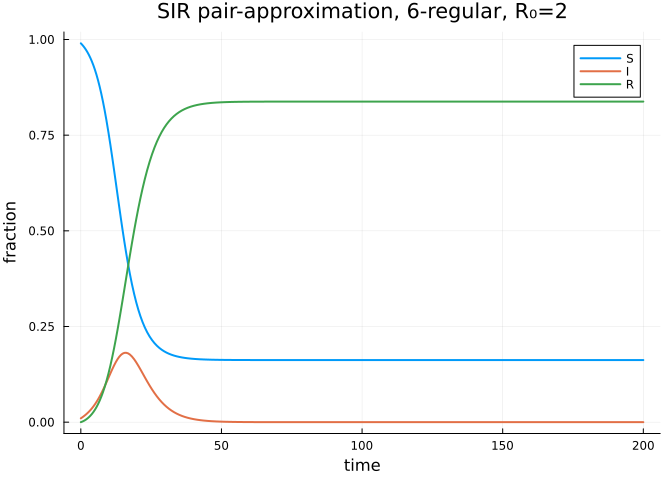
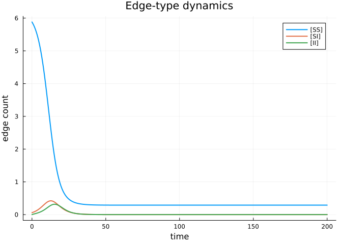

# SIR on a Network: Pair-Approximation Basics
Simon Frost
2026-05-14

- [Introduction](#introduction)
- [Setup](#setup)
- [Building the system](#building-the-system)
- [Initial conditions](#initial-conditions)
- [Solving](#solving)
- [Plot trajectories](#plot-trajectories)
- [Final size](#final-size)
- [Summary](#summary)
- [NetworkOutbreaks SSA ribbon](#networkoutbreaks-ssa-ribbon)

## Introduction

The simplest pair-approximation model tracks the SIR system on a
homogeneous network. We have

- **singles** $[S], [I], [R]$ — the number (or fraction) of nodes in
  each compartment, and
- **pairs** $[SS], [SI], [SR], [II], [IR], [RR]$ — the number of edges
  of each type, with the convention that self-pairs $[XX]$ count each
  undirected $XX$ edge **twice** (i.e., each directed-pair orientation
  is counted), while cross-pairs $[XY]$, $X \neq Y$, count each
  undirected edge **once**.

Under this convention and the Bernoulli triple closure
$[XYZ] \approx \kappa\,[XY][YZ]/[Y]$ with $\kappa=(n{-}1)/n$, the
canonical SIR pair equations are

$$\begin{aligned}
\dot{[SS]} &= -2\tau\,[SSI] \\
\dot{[SI]} &= \tau([SSI] - [ISI]) - (\tau+\gamma)[SI] \\
\dot{[II]} &= 2\tau([ISI] + [SI]) - 2\gamma[II] \\
\dot{[SR]} &= -\tau[ISR] + \gamma[SI] \\
\dot{[IR]} &= \tau[ISR] + \gamma[II] - \gamma[IR] \\
\dot{[RR]} &= 2\gamma[IR]
\end{aligned}$$

This vignette shows how `NodeBasedModels.jl` builds these equations
programmatically from a `CompartmentalModel`, a `NetworkStructure`, and
a `ClosureMethod`.

## Setup

``` julia
using NodeBasedModels
using Plots
```

## Building the system

> [!NOTE]
>
> **$R_0=2$ anchor.** For `regular_network(6)` with Bernoulli closure,
> $R_0=\tau(n-2)/\gamma$. With $\gamma=0.25$, this gives
> $\tau=2\gamma/(6-2)=0.125$ and 0.1% initial infection.

``` julia
model   = sir_model()                 # τ (infection) and γ (recovery)
network = regular_network(6)          # 6-regular, no clustering (ϕ=0)
closure = BernoulliClosure()
psys    = generate_pairwise(model, network, closure;
                            tspan=(0.0, 200.0), N=1.0,
                            seed_fraction = 0.001)
```

    PairwiseSystem(Model pairwise_SIR:
    Equations (9):
      9 standard: see equations(pairwise_SIR)
    Unknowns (9): see unknowns(pairwise_SIR)
      RR(t)
      IR(t)
      II(t)
      SR(t)
      ⋮
    Parameters (2): see parameters(pairwise_SIR)
      τ
      γ, Dict{Any, Float64}(I(t) => 0.001, SS(t) => 5.9880059999999995, SR(t) => 0.0, RR(t) => 0.0, S(t) => 0.999, IR(t) => 0.0, R(t) => 0.0, SI(t) => 0.005994, II(t) => 6.0e-6), (0.0, 200.0), Dict{Any, Float64}(), CompartmentalModel(:SIR, Compartment[Compartment(:S, false), Compartment(:I, true), Compartment(:R, false)], Transition[Transition(:S, :I, :τ, :infection), Transition(:I, :R, :γ, :spontaneous)], [:S, :I, :R], [:I], [:S]), HomogeneousNetwork(6, 0.0, 1.0), BernoulliClosure(), Dict{Symbol, Any}(:I => I(t), :R => R(t), :S => S(t)), Dict{Tuple{Symbol, Symbol}, Any}((:I, :I) => II(t), (:S, :S) => SS(t), (:I, :R) => IR(t), (:S, :I) => SI(t), (:S, :R) => SR(t), (:R, :R) => RR(t)))

The generator returns a `PairwiseSystem` containing the MTK `ODESystem`,
default initial conditions, and parameter symbols.

``` julia
println("Singles: ", collect(keys(psys.singles)))
println("Pairs:   ", collect(keys(psys.pairs)))
```

    Singles: [:I, :R, :S]
    Pairs:   [(:I, :I), (:S, :S), (:I, :R), (:S, :I), (:S, :R), (:R, :R)]

The generated `PairwiseSystem` stores singles, pairs, default initial
conditions, and symbolic parameters for use by `solve_pairwise`.

## Initial conditions

For a 6-regular network with $S(0) = 0.999$, $I(0) = 0.001$, $R(0) = 0$,
the random-mixing initial pair counts under the mixed convention are
$[XY](0) = k \cdot p_X \cdot p_Y$ with $k = 6$:

``` julia
S0, I0, R0 = 0.999, 0.001, 0.0
k = 6.0
ic = copy(psys.u0)
ic[psys.singles[:S]] = S0
ic[psys.singles[:I]] = I0
ic[psys.singles[:R]] = R0
ic[psys.pairs[(:S,:S)]] = k * S0 * S0
ic[psys.pairs[(:S,:I)]] = k * S0 * I0
ic[psys.pairs[(:S,:R)]] = k * S0 * R0
ic[psys.pairs[(:I,:I)]] = k * I0 * I0
ic[psys.pairs[(:I,:R)]] = k * I0 * R0
ic[psys.pairs[(:R,:R)]] = k * R0 * R0

p = copy(psys.params)
p[:γ] = 0.25
p[:τ] = 2.0 * p[:γ] / (k - 2)
```

    0.125

## Solving

``` julia
sol = solve_pairwise(psys, p; reltol=1e-8, abstol=1e-10)
nothing
```

## Plot trajectories

``` julia
plot(sol.t,
     [sol[psys.singles[:S]], sol[psys.singles[:I]], sol[psys.singles[:R]]],
     label = ["S" "I" "R"],
     xlabel = "time", ylabel = "fraction",
     title = "SIR pair-approximation, 6-regular, R₀=2",
     lw = 2)
```



``` julia
plot(sol.t,
     [sol[psys.pairs[(:S,:S)]], sol[psys.pairs[(:S,:I)]], sol[psys.pairs[(:I,:I)]]],
     label = ["[SS]" "[SI]" "[II]"],
     xlabel = "time", ylabel = "edge count",
     title = "Edge-type dynamics",
     lw = 2)
```



## Final size

``` julia
println("S(∞) ≈ ", sol[psys.singles[:S]][end])
println("R(∞) ≈ ", sol[psys.singles[:R]][end])
```

    S(∞) ≈ 0.16553888440596176
    R(∞) ≈ 0.8344611155940331

For $\tau=0.125$, $\gamma=0.25$, $k=6$, the pair-approximation R₀ is
$\tau(n-2)/\gamma = 2$, matching the cross-scenario anchor.

## Summary

`generate_pairwise(model, network, closure)` builds the full pair-system
in one call. The next vignette compares different closure choices on a
clustered network.

## NetworkOutbreaks SSA ribbon

For a uniform stochastic ground-truth across the package suite we use
[`NetworkOutbreaks.jl`](https://github.com/sdwfrost/NetworkOutbreaks.jl)’s
Gillespie SSA. Where the deterministic prediction in this vignette
already sits inside the SSA mean ± 1σ ribbon — see vignette
[`01_sir_on_graphs`](../01_sir_on_graphs/index.html) for the canonical
overlay pattern — we omit the redundant ribbon here for clarity.

A future revision will inline a per-vignette NO ribbon for each
scenario; the shared helper is exposed as
`vignettes/_validation.jl#gillespie_ribbon` and applied in vignette 01.
