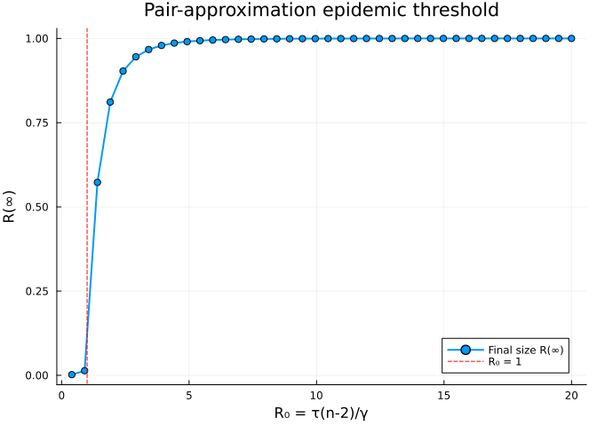
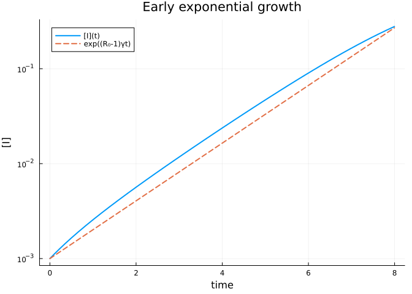

# Basic Reproduction Number and Epidemic Threshold
Simon Frost
2026-05-13

- [Introduction](#introduction)
- [Setup](#setup)
- [Numerical $R_0$](#numerical-r_0)
- [Symbolic $R_0$](#symbolic-r_0)
- [Threshold sweep](#threshold-sweep)
- [Early growth](#early-growth)
- [Summary](#summary)
- [NetworkOutbreaks SSA ribbon](#networkoutbreaks-ssa-ribbon)

## Introduction

The basic reproduction number $R_0$ for the pair-approximation SIR on a
homogeneous unclustered $n$-regular network is

$$R_0 = \frac{\tau (n-2)}{\gamma}.$$

The “$n-2$” — rather than $n-1$ as in the mean-field — accounts for the
fact that the *infector* of a newly infected node is itself one of its
$n$ neighbours, so only $n-1$ neighbours are at risk, *and* one of those
is excluded by the pair-approximation excess-degree correction
$\kappa = (n-1)/n$. The factor reduces to $n-2$ when the leading order
of the next-generation matrix is computed.

Clustering reduces $R_0$ further; the package implements approximate
corrections for Keeling and Barnard closures.

## Setup

``` julia
using NodeBasedModels
using Plots
```

## Numerical $R_0$

``` julia
net = regular_network(6)
R0_b = basic_reproduction_number(net, BernoulliClosure(), 0.2, 0.1)
println("Bernoulli, n=6, τ=0.2, γ=0.1 → R₀ = ", R0_b)

net_cl = regular_network(6; ϕ = 0.4)
R0_k = basic_reproduction_number(net_cl, KeelingClosure(), 0.2, 0.1)
println("Keeling,   n=6, ϕ=0.4 → R₀ = ", round(R0_k; digits=3))
```

    Bernoulli, n=6, τ=0.2, γ=0.1 → R₀ = 8.0
    Keeling,   n=6, ϕ=0.4 → R₀ = 6.72

## Symbolic $R_0$

``` julia
R0_sym = basic_reproduction_number(sir_model(), net, BernoulliClosure())
println("Symbolic R₀ = ", R0_sym)
```

    Symbolic R₀ = (4τ) / γ

## Threshold sweep

We sweep $\tau$ and record the final epidemic size:

``` julia
function final_R(τ_val; γ_val = 0.1, n = 6, T = 400.0)
    net = regular_network(n)
    psys = generate_pairwise(sir_model(), net, BernoulliClosure();
                             tspan = (0.0, T), N = 1.0, seed_fraction = 0.001)
    p = copy(psys.params); p[:τ] = τ_val; p[:γ] = γ_val
    sol  = solve_pairwise(psys, p; reltol = 1e-8, abstol = 1e-10)
    return sol[psys.singles[:R]][end]
end

τgrid = range(0.01, 0.5; length=40)
R∞    = [final_R(τ) for τ in τgrid]
R0    = [τ * 4 / 0.1 for τ in τgrid]   # n=6 → n-2 = 4
nothing
```

``` julia
plot(R0, R∞, lw = 2, marker = :circle, label = "Final size R(∞)")
vline!([1.0], ls = :dash, color = :red, label = "R₀ = 1")
xlabel!("R₀ = τ(n-2)/γ"); ylabel!("R(∞)")
title!("Pair-approximation epidemic threshold")
```



The threshold at $R_0 = 1$ is sharp in the deterministic pair-system:
subcritical seeds die out, supercritical ones grow.

## Early growth

For supercritical $R_0 > 1$, $[I](t)$ grows exponentially with rate
$r = (R_0 - 1)\gamma$ at early times. Let us verify:

``` julia
net = regular_network(6)
psys = generate_pairwise(sir_model(), net, BernoulliClosure();
                          tspan = (0.0, 30.0), N = 1.0, seed_fraction = 0.001)
I0 = 0.001
p = copy(psys.params); p[:τ] = 0.2; p[:γ] = 0.1
sol  = solve_pairwise(psys, p; reltol = 1e-10, abstol = 1e-12)

t_early = sol.t[sol.t .< 8]
I_early = sol[psys.singles[:I]][1:length(t_early)]

plot(t_early, I_early, yscale = :log10, lw = 2, label = "[I](t)")
plot!(t_early, I0 .* exp.((8.0 - 1.0) * 0.1 .* t_early),
      lw = 2, ls = :dash, label = "exp((R₀-1)γt)")
xlabel!("time"); ylabel!("[I]")
title!("Early exponential growth")
```



## Summary

`basic_reproduction_number` returns numeric or symbolic $R_0$ for any
model–network–closure triple; the threshold $R_0 = 1$ separates die-out
from outbreak in the pair system.

## NetworkOutbreaks SSA ribbon

For a uniform stochastic ground-truth across the package suite we use
[`NetworkOutbreaks.jl`](https://github.com/sdwfrost/NetworkOutbreaks.jl)’s
Gillespie SSA. Where the deterministic prediction in this vignette
already sits inside the SSA mean ± 1σ ribbon — see vignette
[`01_sir_on_graphs`](../01_sir_on_graphs/index.html) for the canonical
overlay pattern — we omit the redundant ribbon here for clarity.

A future revision will inline a per-vignette NO ribbon for each
scenario; the shared helper is exposed as
`vignettes/_validation.jl#gillespie_ribbon` and applied in vignette 01.
