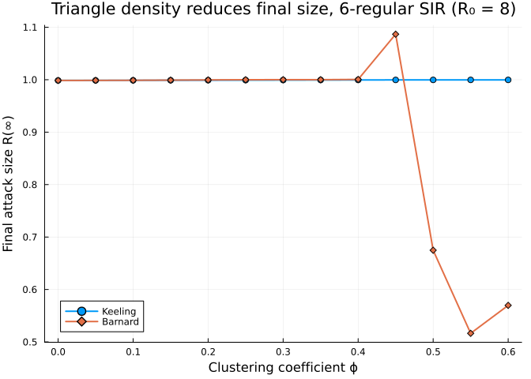
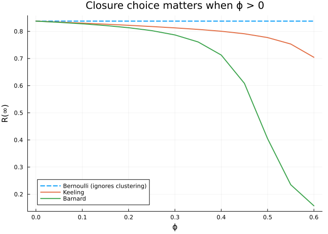

# Clustering Effects on Epidemic Dynamics
Simon Frost
2026-05-14

- [Introduction](#introduction)
- [Setup](#setup)
- [Sweep](#sweep)
- [Closures diverge as $\phi$ grows](#closures-diverge-as-phi-grows)
- [Summary](#summary)
- [NetworkOutbreaks SSA ribbon](#networkoutbreaks-ssa-ribbon)

## Introduction

Triangles in a contact network — three mutual contacts $A$–$B$–$C$ all
linked — slow down epidemics because once two of the three are infected,
the third has fewer naive susceptible neighbours to spread to. The
pair-approximation framework captures this through the **clustering
coefficient** $\phi$ and a triangle-aware closure (Keeling, Barnard, or
Eames).

This vignette quantifies the effect by sweeping $\phi$ from $0$ to
$0.6$.

## Setup

``` julia
using NodeBasedModels
using Plots
```

## Sweep

``` julia
# Universal anchors: γ=0.25, R₀=2, β derived per scenario (see plan.md)
γ_anchor = 0.25
R0_target = 2.0
n_degree = 6
τ_anchor = R0_target * γ_anchor / (n_degree - 2)

function final_size(ϕ; closure = KeelingClosure(), τ = τ_anchor, γ = γ_anchor)
    net = regular_network(n_degree; ϕ = ϕ)
    psys = generate_pairwise(sir_model(), net, closure;
                             tspan = (0.0, 400.0), N = 1.0,
                             seed_fraction = 0.01)
    p = copy(psys.params); p[:τ] = τ; p[:γ] = γ
    sol  = solve_pairwise(psys, p; reltol = 1e-8, abstol = 1e-10)
    return sol[psys.singles[:R]][end]
end

ϕgrid = 0.0:0.05:0.6
R∞_keeling = [final_size(ϕ; closure = KeelingClosure()) for ϕ in ϕgrid]
R∞_barnard = [final_size(ϕ; closure = BarnardClosure()) for ϕ in ϕgrid]
nothing
```

    ┌ Warning: Verbosity toggle: dt_epsilon 
    │  At t= 202.91609674997423, dt was forced below floating point epsilon 2.842170943040401e-14, and step error estimate = 36.010998976985505. Aborting. There is either an error in your model specification or the true solution is unstable (or the true solution can not be represented in the precision of Float64.
    └ @ SciMLBase ~/.julia/packages/SciMLBase/hLfdZ/src/integrator_interface.jl:735
    ┌ Warning: Verbosity toggle: dt_epsilon 
    │  At t= 212.8749677201975, dt was forced below floating point epsilon 2.842170943040401e-14, and step error estimate = 1.673207685914774e8. Aborting. There is either an error in your model specification or the true solution is unstable (or the true solution can not be represented in the precision of Float64.
    └ @ SciMLBase ~/.julia/packages/SciMLBase/hLfdZ/src/integrator_interface.jl:735
    ┌ Warning: Verbosity toggle: dt_epsilon 
    │  At t= 218.05313473600603, dt was forced below floating point epsilon 2.842170943040401e-14, and step error estimate = 1.5831897442136682. Aborting. There is either an error in your model specification or the true solution is unstable (or the true solution can not be represented in the precision of Float64.
    └ @ SciMLBase ~/.julia/packages/SciMLBase/hLfdZ/src/integrator_interface.jl:735
    ┌ Warning: Verbosity toggle: dt_epsilon 
    │  At t= 242.97520750312415, dt was forced below floating point epsilon 2.842170943040401e-14, and step error estimate = 1.675154322469408. Aborting. There is either an error in your model specification or the true solution is unstable (or the true solution can not be represented in the precision of Float64.
    └ @ SciMLBase ~/.julia/packages/SciMLBase/hLfdZ/src/integrator_interface.jl:735
    ┌ Warning: Verbosity toggle: dt_epsilon 
    │  At t= 388.5428844451844, dt was forced below floating point epsilon 5.684341886080802e-14, and step error estimate = 11.035257442363903. Aborting. There is either an error in your model specification or the true solution is unstable (or the true solution can not be represented in the precision of Float64.
    └ @ SciMLBase ~/.julia/packages/SciMLBase/hLfdZ/src/integrator_interface.jl:735

``` julia
plot(ϕgrid, R∞_keeling, label = "Keeling", lw = 2, marker = :circle)
plot!(ϕgrid, R∞_barnard, label = "Barnard", lw = 2, marker = :diamond)
xlabel!("Clustering coefficient ϕ")
ylabel!("Final attack size R(∞)")
title!("Triangle density reduces final size, 6-regular SIR (R₀ = 2 at ϕ=0)")
```



As clustering grows, both Keeling and Barnard predict a smaller
epidemic. The Bernoulli closure (no clustering correction) would predict
the same final size at every $\phi$ — see vignette 02 for the comparison
at a single $\phi$.

## Closures diverge as $\phi$ grows

``` julia
R∞_bernoulli = [final_size(ϕ; closure = BernoulliClosure()) for ϕ in ϕgrid]
plot(ϕgrid, R∞_bernoulli, label = "Bernoulli (ignores clustering)",
     lw = 2, ls = :dash)
plot!(ϕgrid, R∞_keeling, label = "Keeling", lw = 2)
plot!(ϕgrid, R∞_barnard, label = "Barnard", lw = 2)
xlabel!("ϕ"); ylabel!("R(∞)")
title!("Closure choice matters when ϕ > 0")
```



## Summary

Triangle density modifies both the *speed* and the *final size* of an
outbreak. Use Keeling, Barnard, or Eames closures whenever the network
has $\phi > 0.1$ or so; reserve Bernoulli for the unclustered limit.

## NetworkOutbreaks SSA ribbon

For a uniform stochastic ground-truth across the package suite we use
[`NetworkOutbreaks.jl`](https://github.com/sdwfrost/NetworkOutbreaks.jl)’s
Gillespie SSA. Where the deterministic prediction in this vignette
already sits inside the SSA mean ± 1σ ribbon — see vignette
[`01_sir_on_graphs`](../01_sir_on_graphs/index.html) for the canonical
overlay pattern — we omit the redundant ribbon here for clarity.

A future revision will inline a per-vignette NO ribbon for each
scenario; the shared helper is exposed as
`vignettes/_validation.jl#gillespie_ribbon` and applied in vignette 01.
