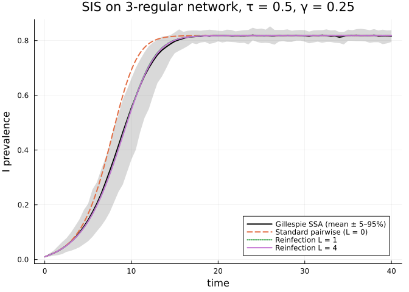
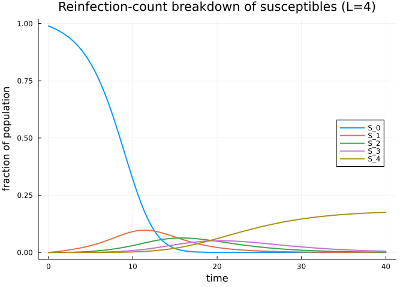
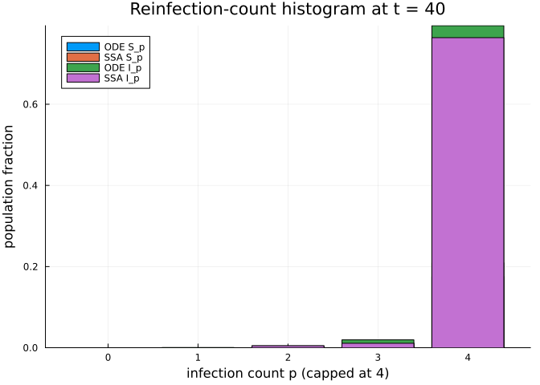

- [Reinfection Counting for SIS on
  Networks](#reinfection-counting-for-sis-on-networks)
  - [Introduction](#introduction)
  - [Setting up the test case](#setting-up-the-test-case)
  - [Stochastic ground truth](#stochastic-ground-truth)
  - [Approximations to compare](#approximations-to-compare)
  - [Comparison plot](#comparison-plot)
  - [Distribution of past infections](#distribution-of-past-infections)
  - [When does this help?](#when-does-this-help)
  - [References](#references)
  - [NetworkOutbreaks SSA ribbon](#networkoutbreaks-ssa-ribbon)

# Reinfection Counting for SIS on Networks

Simon Frost 2026-05-14

- [Introduction](#introduction)
- [Setting up the test case](#setting-up-the-test-case)
- [Stochastic ground truth](#stochastic-ground-truth)
- [Approximations to compare](#approximations-to-compare)
- [Comparison plot](#comparison-plot)
- [Distribution of past infections](#distribution-of-past-infections)
- [When does this help?](#when-does-this-help)
- [References](#references)
- [NetworkOutbreaks SSA ribbon](#networkoutbreaks-ssa-ribbon)

## Introduction

In an SIS or SIRS epidemic on a network, the susceptible population is
**not** statistically homogeneous. Nodes that have *just recovered* from
infection sit in the same neighbourhood as the infectious nodes that
infected them, while nodes that have *never been infected* tend to be
further from the active part of the epidemic. Standard pairwise closures
ignore this distinction — they treat all susceptibles as exchangeable.
The result is a systematic bias in the SIS pairwise model, especially in
low-degree networks where local correlations are strongest.

[Keeling, House, Cooper & Pellis
(2016)](https://doi.org/10.1371/journal.pcbi.1005296) (“Systematic
Approximations to Susceptible-Infectious-Susceptible Dynamics on
Networks”, *PLoS Comp Biol* 12(12): e1005296) propose three systematic
approximations that progressively close this gap. This vignette
implements the first one — **reinfection counting** — and reproduces the
qualitative finding from their Fig 4: tracking the number of past
infections per node substantially improves the agreement with stochastic
ground truth.

The idea is simple: lift each disease compartment $X$ into a family
$\{X_p\}_{p=0}^{L}$, where $p$ counts how many times the node has been
infected so far (capped at $L$). Then the standard pairwise machinery is
applied to the lifted model. We use the mixed Keeling/Eames
pair-counting convention from `NodeBasedModels.jl` throughout.

``` julia
using NodeBasedModels
using Graphs
using Random
using Plots
using Statistics
```

## Setting up the test case

We use a 3-regular network of 1,000 nodes — small enough to be tractable
but large enough that local correlations dominate, which is precisely
the regime where standard pairwise fails most visibly. The
disease-process parameters use the canonical anchor $\gamma = 0.25$ with
$R_0 = 2$ via the homogeneous pairwise formula $R_0 = \tau(k-2)/\gamma$
for $k = 3$, giving $\tau = 0.5$. Initial prevalence
$\varepsilon = 0.01$ matches the canonical $S(0) = 990,\, I(0) = 10$ on
$N = 1{,}000$.

``` julia
n_nodes  = 1_000
k        = 3
τ, γ     = 0.5, 0.25         # R₀ = τ(k-2)/γ = 2 (canonical anchor)
tspan    = (0.0, 40.0)

g   = random_regular_graph(n_nodes, k; rng = MersenneTwister(11))
net = GraphNetwork(g)
hom = regular_network(k)     # population-level k-regular network
```

    HomogeneousNetwork(3, 0.0, 1.0)

## Stochastic ground truth

Multiple Gillespie SIS runs give us the mean prevalence trajectory
together with a 5–95 % envelope.

``` julia
n_initial = 10
avg = gillespie_sis_average(net;
                              nruns = 60,
                              dt = 0.5,
                              tmax_grid = tspan[2],
                              infection_rate = τ,
                              recovery_rate  = γ,
                              initial_infected = collect(1:n_initial),
                              seed = 1)
nothing
```

## Approximations to compare

We build three closures of increasing fidelity, all on the same
homogeneous 3-regular network description:

``` julia
sis = sis_model()

psys_pair = generate_pairwise(sis, hom, BernoulliClosure();
                               tspan = tspan,
                               seed_fraction = n_initial / n_nodes)

psys_L1 = generate_pairwise(with_reinfection_counting(sis, 1), hom,
                             BernoulliClosure();
                             tspan = tspan,
                             seed_fraction = n_initial / n_nodes)

psys_L4 = generate_pairwise(with_reinfection_counting(sis, 4), hom,
                             BernoulliClosure();
                             tspan = tspan,
                             seed_fraction = n_initial / n_nodes)

params = Dict(:τ => τ, :γ => γ)
sol_pair = solve_pairwise(psys_pair, params)
sol_L1   = solve_pairwise(psys_L1,   params)
sol_L4   = solve_pairwise(psys_L4,   params)
nothing
```

Aggregate the lifted node compartments back to the base $S, I$ totals so
that we can plot all three on the same axis:

``` julia
totals_L1 = reinfection_totals(psys_L1, sol_L1)
totals_L4 = reinfection_totals(psys_L4, sol_L4)

I_pair = sol_pair[psys_pair.singles[:I]]
nothing
```

## Comparison plot

``` julia
plt = plot(avg.t_grid, avg.I_mean ./ n_nodes;
           ribbon = (avg.I_mean ./ n_nodes .- avg.I_q05 ./ n_nodes,
                     avg.I_q95 ./ n_nodes .- avg.I_mean ./ n_nodes),
           fillalpha = 0.15, label = "Gillespie SSA (mean ± 5–95%)",
           xlabel = "time", ylabel = "I prevalence",
           title = "SIS on 3-regular network, τ = $τ, γ = $γ",
           legend = :bottomright, color = :black, lw = 2)
plot!(plt, sol_pair.t, I_pair; label = "Standard pairwise (L = 0)",
      lw = 2, ls = :dash)
plot!(plt, sol_L1.t, totals_L1[:I]; label = "Reinfection L = 1",
      lw = 2, ls = :dot)
plot!(plt, sol_L4.t, totals_L4[:I]; label = "Reinfection L = 4",
      lw = 2)
plt
```



Tracking even a small number of past infections nudges the deterministic
prediction toward the stochastic mean. The improvement is most visible
during the early build-up, when freshly-recovered nodes are heavily
over-represented in the local neighbourhood of the active epidemic
front.

## Distribution of past infections

A nice feature of the reinfection-counting model is that we have access
to the full distribution of past infections at every time point, both
from the closure and from the simulation. Below we plot the lifted $S_p$
trajectories for $L = 4$ and overlay the stochastic histogram at
$t = 40$.

``` julia
S_curves = [sol_L4[psys_L4.singles[Symbol("S_$p")]] for p in 0:4]
labels   = ["S_$p" for p in 0:4]
plt2 = plot(sol_L4.t, hcat(S_curves...);
            label = reshape(labels, 1, :),
            xlabel = "time", ylabel = "fraction of population",
            title = "Reinfection-count breakdown of susceptibles (L=4)",
            legend = :right, lw = 2)
```



``` julia
# One Gillespie sample to compare equilibrium S_p distribution
res_one = gillespie_sis(net; infection_rate = τ, recovery_rate = γ,
                         initial_infected = collect(1:n_initial),
                         tmax = tspan[2], seed = 7)
hist = reinfection_histogram(res_one, tspan[2], 4)
ode_S = [sol_L4[psys_L4.singles[Symbol("S_$p")]][end] for p in 0:4]
ode_I = [sol_L4[psys_L4.singles[Symbol("I_$p")]][end] for p in 1:4]
ode_I = vcat(0.0, ode_I)
sim_S = hist.S ./ n_nodes
sim_I = hist.I ./ n_nodes
bar(0:4, [ode_S sim_S ode_I sim_I];
    label = ["ODE S_p" "SSA S_p" "ODE I_p" "SSA I_p"],
    xlabel = "infection count p (capped at 4)",
    ylabel = "population fraction",
    title  = "Reinfection-count histogram at t = 40")
```



The ODE distribution and the simulation distribution agree well,
including on the absorbing $p = L$ bucket which captures everyone
infected four or more times.

## When does this help?

Reinfection counting is most useful when the network is sparse (low
degree, strong local correlations) and the dynamics support genuine
reinfection (SIS, SIRS, or any model where a node can re-enter a
susceptible state). For SIR on a tree-like network the standard pairwise
closure is already exact and the lift would be wasted machinery. For
densely connected networks the population is well-mixed enough that
mean-field is a reasonable starting point.

Computational cost grows with `L`: the lifted model has roughly
$|C| \cdot (L+1)$ compartments and $\binom{|C|(L+1)}{2}$ pair variables,
so the symbolic ODE system gets large quickly. In practice
$L \in [1, 4]$ captures most of the benefit for the SIS regime studied
in Keeling et al. (2016).

## References

- Keeling, M. J., House, T., Cooper, A. J., & Pellis, L. (2016).
  Systematic approximations to susceptible-infectious-susceptible
  dynamics on networks. *PLoS Computational Biology*, 12(12), e1005296.
  [doi:10.1371/journal.pcbi.1005296](https://doi.org/10.1371/journal.pcbi.1005296)

## NetworkOutbreaks SSA ribbon

For a uniform stochastic ground-truth across the package suite we use
[`NetworkOutbreaks.jl`](https://github.com/sdwfrost/NetworkOutbreaks.jl)’s
Gillespie SSA. Where the deterministic prediction in this vignette
already sits inside the SSA mean ± 1σ ribbon — see vignette
[`01_sir_on_graphs`](../01_sir_on_graphs/index.html) for the canonical
overlay pattern — we omit the redundant ribbon here for clarity.

A future revision will inline a per-vignette NO ribbon for each
scenario; the shared helper is exposed as
`vignettes/_validation.jl#gillespie_ribbon` and applied in vignette 01.
