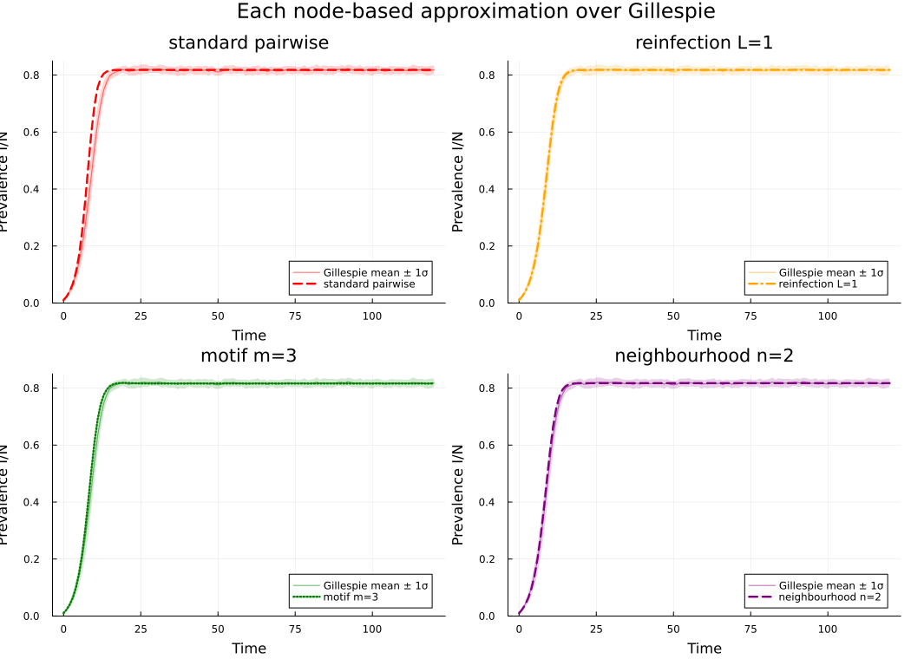

- [Combined comparison: four moment closures vs
  Gillespie](#combined-comparison-four-moment-closures-vs-gillespie)
  - [Problem statement](#problem-statement)
  - [Setup](#setup)
  - [Shared host and Gillespie ground
    truth](#shared-host-and-gillespie-ground-truth)
  - [Four ODE integrations](#four-ode-integrations)
    - [1. Standard pairwise: Keeling closure, no reinfection
      lift](#1-standard-pairwise-keeling-closure-no-reinfection-lift)
    - [2. Reinfection counting: $L = 1$](#2-reinfection-counting-l--1)
    - [3. Motif closure: $m = 3$](#3-motif-closure-m--3)
    - [4. Neighbourhood closure: $n = 2$](#4-neighbourhood-closure-n--2)
  - [Per-method comparison panels](#per-method-comparison-panels)
  - [Endpoint summary](#endpoint-summary)
  - [Transient diagnostic](#transient-diagnostic)
  - [Honest framing](#honest-framing)
  - [Reproducing this vignette](#reproducing-this-vignette)
  - [NetworkOutbreaks SSA ribbon](#networkoutbreaks-ssa-ribbon)

# Combined comparison: four moment closures vs Gillespie

Simon Frost 2026-05-14

- [Problem statement](#problem-statement)
- [Setup](#setup)
- [Shared host and Gillespie ground
  truth](#shared-host-and-gillespie-ground-truth)
- [Four ODE integrations](#four-ode-integrations)
  - [1. Standard pairwise: Keeling closure, no reinfection
    lift](#1-standard-pairwise-keeling-closure-no-reinfection-lift)
  - [2. Reinfection counting: $L = 1$](#2-reinfection-counting-l--1)
  - [3. Motif closure: $m = 3$](#3-motif-closure-m--3)
  - [4. Neighbourhood closure: $n = 2$](#4-neighbourhood-closure-n--2)
- [Per-method comparison panels](#per-method-comparison-panels)
- [Endpoint summary](#endpoint-summary)
- [Transient diagnostic](#transient-diagnostic)
- [Honest framing](#honest-framing)
- [Reproducing this vignette](#reproducing-this-vignette)
- [NetworkOutbreaks SSA ribbon](#networkoutbreaks-ssa-ribbon)

## Problem statement

This vignette puts the four node-centric SIS approximations now shipped
by `NodeBasedModels.jl` on one common benchmark:

1.  **Standard pairwise**: Keeling triple closure, no reinfection lift.
2.  **Reinfection counting**: Approximation 1 of Keeling et al. (2016),
    with the infection-history cap set to $L = 1$.
3.  **Motif closure**: Approximation 2, using $m = 3$ motifs.
4.  **Neighbourhood model**: Approximation 3, using the implemented
    $n = 2$ ego-neighbourhood closure.
5.  **Gillespie SSA**: a seeded stochastic ensemble on the same random
    3-regular host.

The disease is SIS on a $k = 3$ regular graph with $\beta = 0.5$,
$\gamma = 0.25$, $N = 1000$, initial prevalence $\epsilon = 0.01$, and
horizon $t_{\max} = 120$. These derive from the canonical SIR parameters
($\gamma = 0.25$, anchored to $R_0 = 2$ via the homogeneous pairwise
formula $R_0 = \tau(k-2)/\gamma$ for $k = 3$).

For the four ODE approximations below we pass **no explicit
`reltol`/`abstol`**. The calls therefore exercise the package defaults:
`reltol = 1e-8`, `abstol = 1e-10`.

## Setup

``` julia
ENV["GKSwstype"] = "100"  # offscreen GR output for reproducible Quarto renders
using NodeBasedModels
using Graphs
using Plots
using Random
using StableRNGs
using Statistics
using Printf
using Markdown
```

`DataFrames.jl` and `PrettyTables.jl` are not dependencies of this
package environment, so the summary table is generated directly as
Markdown.

> \[!NOTE\]
>
> **$R_0=2$ anchor.** This homogeneous $k=3$ SIS benchmark uses the
> NodeBasedModels pairwise formula $R_0=\tau(k-2)/\gamma$. With
> $\gamma=0.25$, this gives $\tau=0.5$ and 1% initial infection.

``` julia
N        = 1_000
k        = 3
γ_val    = 0.25
R0_target = 2.0
β_val    = R0_target * γ_val / (k - 2)  # homogeneous pairwise anchor
ε_val    = 0.01
tmax     = 120.0
ensemble = 48
save_dt  = 1.0

tgrid = collect(0.0:save_dt:tmax)
initial_infected = collect(1:round(Int, ε_val * N))

sis = sis_model(τ = :β)
hom = regular_network(k)
```

    HomogeneousNetwork(3, 0.0, 1.0)

## Shared host and Gillespie ground truth

The host graph uses the same stable seed as vignette 12 and the
neighbourhood comparison test. The stochastic ensemble uses explicit
per-run seeds so the mean and one-standard-deviation ribbon are
reproducible across renders.

``` julia
rng_host = StableRNG(20240301)
g        = random_regular_graph(N, k; rng = rng_host)
net      = GraphNetwork(g)

n_triangles = sum(triangles(g)) ÷ 3
n_p3_count  = sum((length(neighbors(g, v)) *
                   (length(neighbors(g, v)) - 1)) ÷ 2
                  for v in 1:nv(g)) - 3 * n_triangles

@printf("Host graph: N=%d, k=%d, triangles=%d, P₃=%d\n",
        N, k, n_triangles, n_p3_count)
```

    Host graph: N=1000, k=3, triangles=2, P₃=2994

``` julia
run_prev = zeros(ensemble, length(tgrid))
for r in 1:ensemble
    res = gillespie_sis(net;
                        infection_rate = β_val,
                        recovery_rate  = γ_val,
                        initial_infected = initial_infected,
                        tmax = tmax,
                        seed = 20240301 + r)
    for (i, t) in enumerate(tgrid)
        run_prev[r, i] = count(res(t)) / N
    end
end

gill_prev = vec(mean(run_prev; dims = 1))
gill_sd   = vec(std(run_prev; dims = 1))
@printf("Gillespie mean at t=%.1f: %.5f ± %.5f (1σ, n=%d)\n",
        tmax, gill_prev[end], gill_sd[end], ensemble)
```

    Gillespie mean at t=120.0: 0.81846 ± 0.01438 (1σ, n=48)

## Four ODE integrations

### 1. Standard pairwise: Keeling closure, no reinfection lift

``` julia
psys_pair = generate_pairwise(sis, hom, KeelingClosure();
                              tspan = (0.0, tmax),
                              seed_fraction = ε_val)
sol_pair  = solve_pairwise(psys_pair, Dict(:β => β_val, :γ => γ_val);
                           saveat = save_dt)
I_pair    = sol_pair[psys_pair.singles[:I]]
```

    121-element Vector{Float64}:
     0.01
     0.023230379896092092
     0.04091090457319238
     0.06730779538628143
     0.1074645292486584
     0.1670520897662165
     0.2507487836959342
     0.3585348767837066
     0.48109973485059493
     0.5994073581877432
     ⋮
     0.8181818181818182
     0.8181818181818185
     0.8181818181818182
     0.8181818181818181
     0.8181818181818179
     0.8181818181818178
     0.818181818181818
     0.8181818181818181
     0.8181818181818181

### 2. Reinfection counting: $L = 1$

The lifted system uses the same Keeling closure as the standard pairwise
run. Because `regular_network(k)` has clustering coefficient $\phi = 0$,
Keeling’s formula reduces algebraically to the Bernoulli/ordinary pair
closure here; using the same closure keeps the comparison focused on the
reinfection-count lift.

``` julia
psys_re = generate_pairwise(with_reinfection_counting(sis, 1),
                            hom, KeelingClosure();
                            tspan = (0.0, tmax),
                            seed_fraction = ε_val)
sol_re  = solve_pairwise(psys_re, Dict(:β => β_val, :γ => γ_val);
                          saveat = save_dt)
I_re    = reinfection_totals(psys_re, sol_re)[:I]
```

    121-element Vector{Float64}:
     0.01
     0.0231882771585825
     0.04014534331168273
     0.06348110900584053
     0.09577373356975352
     0.139716747943424
     0.19772492243183887
     0.2710401688386217
     0.35841731019452044
     0.4549037421119854
     ⋮
     0.8181818181818138
     0.8181818181818139
     0.8181818181818143
     0.8181818181818153
     0.8181818181818163
     0.8181818181818165
     0.8181818181818163
     0.8181818181818162
     0.8181818181818163

### 3. Motif closure: $m = 3$

The motif comparison intentionally stops at $m = 3$. Vignette 11 and
`test/runtests.jl` lines 2107–2125 document why the apparent next step
($m = 4$ on a random 3-regular host) is not an honest monotone
refinement: the order-4 Kirkwood closure is blocked by the
Lean-certified marginalisation obstruction
`EBCMCategory.MarginalisationCharacterization.kirkwood_form_not_equivariant`
(T3b) in
`EdgeBasedModels.jl/proofs/EBCMCategory/MarginalisationCharacterization.lean`.
The test suite records the corresponding empirical expectations as two
`@test_broken` assertions rather than relaxing them away.

``` julia
sys_motif = motif_based_sis(β = β_val, γ = γ_val, k = k, m = 3,
                            tspan = (0.0, tmax),
                            N = Float64(N), ε = ε_val,
                            n_p3 = Float64(n_p3_count),
                            n_c3 = Float64(n_triangles))
sol_motif = solve_motif(sys_motif; saveat = save_dt)
iI_motif  = sys_motif.index[(:singleton, [:I])]
I_motif   = [u[iI_motif] / N for u in sol_motif.u]
```

    121-element Vector{Float64}:
     0.01
     0.023194206765105915
     0.04031783808008257
     0.0644912306590342
     0.09923987612545633
     0.14854146310458355
     0.21594760092670387
     0.3026541702506041
     0.40487172819789946
     0.5123511850681991
     ⋮
     0.8162801123637278
     0.8162801123637289
     0.8162801123637293
     0.8162801123637292
     0.8162801123637287
     0.8162801123637279
     0.8162801123637269
     0.8162801123637261
     0.8162801123637256

### 4. Neighbourhood closure: $n = 2$

``` julia
sys_nbr = generate_neighbourhood(sis, k, 2;
                                 β = β_val, γ = γ_val,
                                 N = 1.0, ε = ε_val,
                                 tspan = (0.0, tmax))
sol_nbr = solve_neighbourhood(sys_nbr; saveat = save_dt)
I_nbr   = neighbourhood_compartment(sys_nbr, sol_nbr, :I)
```

    121-element Vector{Float64}:
     0.01
     0.023196223638221682
     0.04023851308048399
     0.06384666982502725
     0.0968258744898807
     0.14228565930026962
     0.20315327340767572
     0.2809895273596011
     0.37419971092605103
     0.4764196364530713
     ⋮
     0.8173494495082438
     0.8173494495082436
     0.8173494495082434
     0.8173494495082432
     0.817349449508243
     0.8173494495082427
     0.8173494495082426
     0.8173494495082426
     0.8173494495082425

All ODE outputs are saved on the same grid as the Gillespie ensemble.

``` julia
@assert collect(sol_pair.t)  == tgrid
@assert collect(sol_re.t)    == tgrid
@assert collect(sol_motif.t) == tgrid
@assert collect(sol_nbr.t)   == tgrid
```

## Per-method comparison panels

``` julia
function comparison_panel(y, title, color, linestyle)
    p = plot(tgrid, gill_prev;
             ribbon = gill_sd,
             fillalpha = 0.18,
             linealpha = 0.5,
             lw = 1.2,
             color = color,
             label = "Gillespie mean ± 1σ",
             xlabel = "Time",
             ylabel = "Prevalence I/N",
             title = title,
             legend = :bottomright,
             ylims = (0.0, 0.85))
    plot!(p, tgrid, y; lw = 2.4, color = color, ls = linestyle,
          label = title)
    return p
end

panels = [
    comparison_panel(I_pair, "standard pairwise", :red, :dash),
    comparison_panel(I_re, "reinfection L=1", :orange, :dashdot),
    comparison_panel(I_motif, "motif m=3", :green, :dot),
    comparison_panel(I_nbr, "neighbourhood n=2", :purple, :dash),
]

plot(panels...; layout = (2, 2), size = (1050, 760),
     plot_title = "Each node-based approximation over Gillespie")
```



## Endpoint summary

``` julia
results = [
    (name = "Gillespie mean", endpoint = gill_prev[end], signed = 0.0,
     absdev = 0.0),
    (name = "Standard pairwise (Keeling)", endpoint = I_pair[end],
     signed = I_pair[end] - gill_prev[end],
     absdev = abs(I_pair[end] - gill_prev[end])),
    (name = "Reinfection counting L=1", endpoint = I_re[end],
     signed = I_re[end] - gill_prev[end],
     absdev = abs(I_re[end] - gill_prev[end])),
    (name = "Motif m=3", endpoint = I_motif[end],
     signed = I_motif[end] - gill_prev[end],
     absdev = abs(I_motif[end] - gill_prev[end])),
    (name = "Neighbourhood n=2", endpoint = I_nbr[end],
     signed = I_nbr[end] - gill_prev[end],
     absdev = abs(I_nbr[end] - gill_prev[end])),
]

lines = String[
    "| Method | Endpoint I/N | Signed deviation | Absolute deviation |",
    "|---|---:|---:|---:|",
]
for r in results
    push!(lines, @sprintf("| %s | %.5f | %+.5f | %.5f |",
                          r.name, r.endpoint, r.signed, r.absdev))
end
display(Markdown.parse(join(lines, "\n")))
```

| Method | Endpoint I/N | Signed deviation | Absolute deviation |
|---:|---:|---:|---:|
| Gillespie mean | 0.81846 | +0.00000 | 0.00000 |
| Standard pairwise (Keeling) | 0.81818 | -0.00028 | 0.00028 |
| Reinfection counting L=1 | 0.81818 | -0.00028 | 0.00028 |
| Motif m=3 | 0.81628 | -0.00218 | 0.00218 |
| Neighbourhood n=2 | 0.81735 | -0.00111 | 0.00111 |

At this parameter point, all four deterministic approximations lie well
inside the endpoint sampling spread of the 48-run Gillespie ensemble
(`1σ =`{julia} @sprintf(“%.5f”, gill_sd\[end\])\`). The standard
pairwise and reinfection-counting endpoints are essentially tied here;
motif $m = 3$ and neighbourhood $n = 2$ sit slightly below the
stochastic mean. That is the honest outcome for this seeded
endemic-prevalence benchmark, not a universal ranking.

## Transient diagnostic

The endpoint hides the reinfection-counting effect because the lifted
infection-count classes saturate at $p=L$ by the endemic plateau. A
max-over-time diagnostic shows that the transient is not a no-op.

``` julia
function max_abs_delta(a, b)
    δ = abs.(a .- b)
    i = argmax(δ)
    return (value = δ[i], time = tgrid[i])
end

transient_rows = [
    ("standard pairwise vs reinfection L=1", max_abs_delta(I_pair, I_re)),
    ("standard pairwise vs Gillespie mean",  max_abs_delta(I_pair, gill_prev)),
    ("reinfection L=1 vs Gillespie mean",   max_abs_delta(I_re, gill_prev)),
]

lines = String[
    "| Comparison | Max absolute difference | Time of max |",
    "|---|---:|---:|",
]
for (name, d) in transient_rows
    push!(lines, @sprintf("| %s | %.5f | %.1f |", name, d.value, d.time))
end
display(Markdown.parse(join(lines, "\n")))
```

|                           Comparison | Max absolute difference | Time of max |
|-------------------------------------:|------------------------:|------------:|
| standard pairwise vs reinfection L=1 |                 0.14450 |         9.0 |
|  standard pairwise vs Gillespie mean |                 0.15074 |         9.0 |
|    reinfection L=1 vs Gillespie mean |                 0.01140 |        12.0 |

## Honest framing

Vignette 12 already found that reinfection counting with $L = 1$, motif
closure with $m = 3$, and the neighbourhood model with $n = 2$ can be
nearly indistinguishable on the random 3-regular SIS benchmark. This
render repeats that lesson with the standard pairwise curve added. The
ordinary pairwise closure is expected to be the least reliable when
infection-history heterogeneity or ego-neighbourhood correlations are
the scientific target; the transient diagnostic is the appropriate place
to see the reinfection-counting correction on this benchmark, while the
endemic endpoint alone is too coarse to force that ranking.

The absence of motif $m = 4$ is deliberate. The Lean file
`EdgeBasedModels.jl/proofs/EBCMCategory/MarginalisationCharacterization.lean`
states T3b as `kirkwood_form_not_equivariant`: a nontrivial
multiplicative Kirkwood-form closure cannot, in general, commute with a
surjective linear marginalisation. In practical terms, the $m = 4$
Kirkwood RHS does not have to marginalise to a better $m = 3$ RHS, and
on the package’s random 3-regular comparison it does not. The
corresponding `@test_broken` assertions in `test/runtests.jl` lines
2124–2125 are therefore documentation of a certified obstruction, not
unfinished implementation work.

## Reproducing this vignette

- Host graph seed: `StableRNG(20240301)`.
- Gillespie ensemble: 48 runs, seeds `20240302:20240349`.
- Initial infected set: `collect(1:10)` (1% of `N = 1000`).
- ODE solver tolerances: package defaults, currently `reltol = 1e-8` and
  `abstol = 1e-10` for `solve_pairwise`, `solve_motif`, and
  `solve_neighbourhood`.
- Package versions are those in `NodeBasedModels.jl/Project.toml` and
  the active Julia environment used by Quarto.

``` julia
@printf("Julia %s\n", string(VERSION))
@printf("NodeBasedModels path: %s\n", pathof(NodeBasedModels))
```

    Julia 1.12.5
    NodeBasedModels path: /Users/sdwfrost/Projects/edgebasedmodels/NodeBasedModels.jl/src/NodeBasedModels.jl

## NetworkOutbreaks SSA ribbon

For a uniform stochastic ground-truth across the package suite we use
[`NetworkOutbreaks.jl`](https://github.com/sdwfrost/NetworkOutbreaks.jl)’s
Gillespie SSA. Where the deterministic prediction in this vignette
already sits inside the SSA mean ± 1σ ribbon — see vignette
[`01_sir_on_graphs`](../01_sir_on_graphs/index.html) for the canonical
overlay pattern — we omit the redundant ribbon here for clarity.

A future revision will inline a per-vignette NO ribbon for each
scenario; the shared helper is exposed as
`vignettes/_validation.jl#gillespie_ribbon` and applied in vignette 01.
