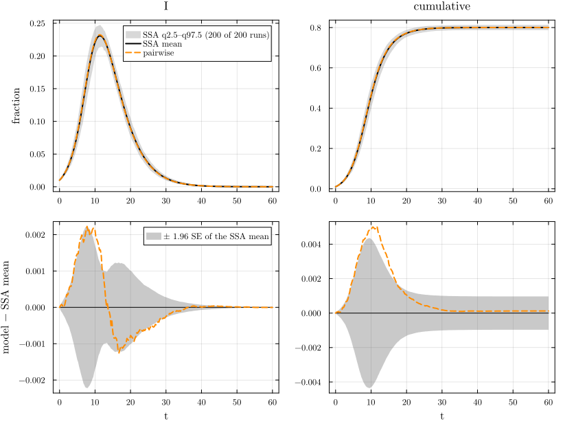
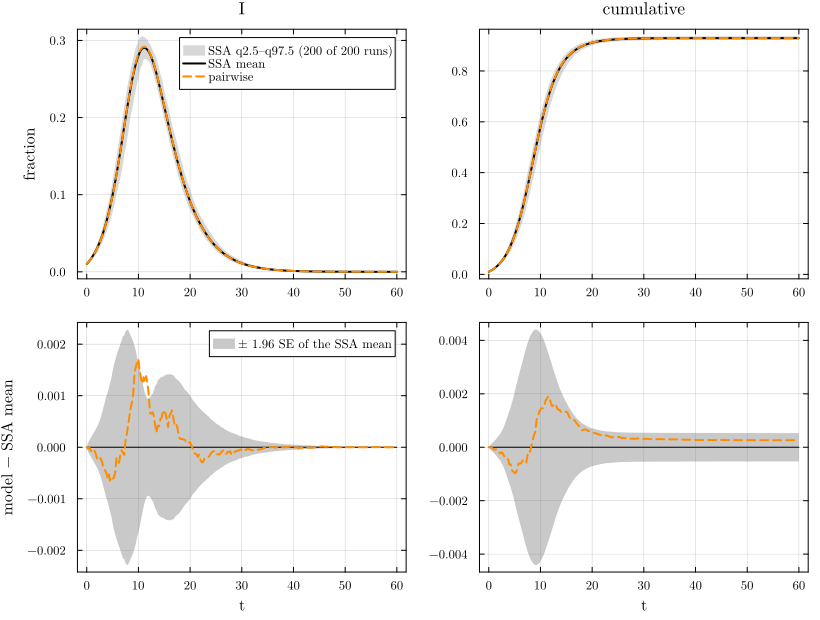

# From a reaction network to a pairwise model


- [The shared first cell](#the-shared-first-cell)
- [The model object and its typing](#the-model-object-and-its-typing)
- [Low level and factory](#low-level-and-factory)
- [The mathematics of the lift](#the-mathematics-of-the-lift)
- [The same curves as the edge-based
  model](#the-same-curves-as-the-edge-based-model)
- [Against simulation: Poisson(5)](#against-simulation-poisson5)
- [Against simulation: 6-regular](#against-simulation-6-regular)
- [References](#references)

This page shows the whole pipeline once, on the simplest model. An SIR
model is written as a reaction network, read into NetworkEpiCore’s model
object with `contact_model`, and lifted with `node_based` to a
population-level pairwise model: equations for the expected numbers of
nodes (\[S\], \[I\], \[R\]) and of ordered pairs of neighbours (\[SS\],
\[SI\], …), closed at the level of triples ([Keeling
1999](#ref-keeling1999); [Eames and Keeling 2002](#ref-eames2002);
[House and Keeling 2011](#ref-house2011); [Kiss et al.
2017](#ref-kiss2017)). The factory `generate_pairwise` then builds the
same system, and the two vector fields are checked equal. We print the
lifted equations, check the conservation laws, and compare the model
with a committed NetworkOutbreaks ensemble on a Poisson(5) network and
on a 6-regular network. The EdgeBasedModels page E01 starts with the
same first cell and the same scenario, and lifts to an edge-based model
instead.

## The shared first cell

The cell below is the same, line for line, as the first cell of
EdgeBasedModels’ E01, apart from the lines of the `# --- NBM vignette`
section and the lines marked `# back end`. The contact `τ, S + I --> 2I`
has a **per-contact** rate τ: a susceptible node with one infectious
neighbour is infected at rate τ along that edge. The scenario
`:sir_pois5` fixes τ = 1/6, γ = 1/4, a Poisson(5) configuration network
and 1% of the nodes seeded in I. A Quarto cell shows only its last
value, so the figure is drawn again below and the cell’s output is the
`compare` table.

``` julia
include(joinpath(@__DIR__, "..", "_shared", "setup.jl"))
require_summaries([:sir_pois5, :sir_reg6])   # back end
using NetworkEpiCore, NetworkOutbreaks, Catalyst, Plots
sir = @reaction_network sir begin
    @parameters τ γ
    τ, S + I --> 2I        # contact: per-contact (per-edge) rate τ; S converted, I unchanged
    γ, I --> R             # node-local transition
end
model = contact_model(sir)          # prints the typing report (B.1)
sc    = scenario(:sir_pois5)        # Poisson(5), τ = 1/6, γ = 1/4, 1% seeds in I, t ∈ [0, 60]
@assert isequivalent(model, sc.model)
ref   = scenario_summary(sc)        # committed NO ensemble: N = 10⁴, 200 runs, a fresh G(N, p) graph per run
# --- NBM vignette ---------------------------------------------------------------
using NodeBasedModels
sys   = node_based(model, sc.network)                      # low level
sysF  = generate_pairwise(sir_model(), sc.network, default_closure(sc.network); cumulative = true)  # factory
@assert vector_fields_equal(symbolic_ode(sys), symbolic_ode(sysF))
# --- both -------------------------------------------------------------------------
sol = solve_epidemic(sys, sc)                              # p, initial, tspan, saveat all from the scenario
det = model_curves(sys, sol; t = sc.tgrid, label = "pairwise")   # back end
comparisonplot(ref, det; observables = [:I, :cumulative])  # top: spread ribbon + mean + curve; bottom: residual ± 1.96 SE
compare(ref, det)                                          # D∞, z∞, ΔR∞ (95% CI), Δpeak, Δt_peak
```

    ComparisonTable :sir_pois5  (scenario 34c89792; conditioned mean of 200 runs)
      curve     observable        D∞     t(D∞)       SE∞        z∞       ΔR∞  95% CI                 Δpeak   Δt_peak  coverage
      pairwise  S            0.00503     11.50   0.00222      2.61   0.00012  [-0.00085,  0.00109]   0.00000      0.00     0.788
      pairwise  I            0.00223      7.75   0.00113      2.60   0.00012  [-0.00085,  0.00109]   0.00158      0.00     0.830
      pairwise  R            0.00387     13.25   0.00168      2.39   0.00012  [-0.00085,  0.00109]   0.00012      0.00     0.784
      pairwise  infectious   0.00223      7.75   0.00113      2.60   0.00012  [-0.00085,  0.00109]   0.00158      0.00     0.830
      pairwise  cumulative   0.00503     11.50   0.00222      2.61   0.00012  [-0.00085,  0.00109]   0.00012      3.50     0.788

The rest of the page takes this cell apart.

## The model object and its typing

`contact_model` classifies each reaction by its stoichiometry.
`S + I --> 2I` has one catalytic substrate, I, so it is a contact
`S + I → I + I` with infector I and entry state I; `I --> R` is a node
transition. The typing report lists the back ends that accept the model;
the population pairwise model (`pairwise`) accepts every model of the
network type theory T_net, and this one is also in the edge-based theory
T_EB.

``` julia
model
```

    ContactModel :sir  (source: Catalyst.ReactionSystem; method: stoichiometry; rates: PerContact)
      species       S (Sus)   I   R
      contacts      [1] S + I → I + I    τ    contact     infector I, entry I
      transitions   [2] I → R            γ    progress
      typing        T_EB  ⇒  edge_based ✓  s_anchored ✓  pairwise ✓  individual ✓  pair ✓  stochastic ✓  mass_action ✓
      assumptions   Sus inferred as recipients \ contact products = {S}

The scenario is pure data: model, network, parameters, seeding, time
grid and simulation settings. Its `expected` values are computed by
NetworkEpiCore when the registry is built, not typed by hand.

``` julia
sc
```

    Scenario :sir_pois5 — SIR on a Poisson(5) configuration network
      model        ContactModel(:sir; 3 species, 1 contact, 1 transition)
      network      ConfigurationNetwork(degrees=PoissonDegree(mean=5))
      params       γ = 0.25, τ = 0.166667
      initial      I 0.01
      time         0.0:0.25:60.0 (241 points)
      observables  S, I, R, infectious, cumulative
      sim          SimConfig(N = 10000, nsims = 200, graphs = :per_run, algorithm = :next_reaction, base_seed = 20260926, condition = MajorOutbreak(0.05), align = NoAlignment())
      backends     edge_based => exact_limit, pairwise_const => exact_limit, pgf_closure => exact_limit
      tags         canonical, ebm, nbm, sir, configuration, pt, n_scaling
      expected     R0 = 2, T = 0.4, closure_constant = 1, excess_degree = 5, final_size = 0.800204, mean_degree = 5, r = 0.416667
      notes        The Poisson isomorphism (EB ≅ MA(5τ, γ + τ) on (S, φ_I), Rempała's quotient) and constant-K pairwise with K = 1. Also run at N = 10³ and 10⁵ (N-scaling).
      hash         34c89792c3f7f8c0e0f9d4b2ce83aaafac299e4c50c06a7a435e42ec746a421f

## Low level and factory

The low-level route is `contact_model` then `node_based`. The factory
`generate_pairwise(sir_model(), net, closure)` builds the same
population pairwise model from the canned SIR model; `node_based` adds
the cumulative-incidence accumulator, so the factory is called with
`cumulative = true`. The two vector fields are compared symbolically by
`vector_fields_equal`:

``` julia
sysF0 = generate_pairwise(sir_model(), sc.network, default_closure(sc.network))
@printf("vector fields equal: %s;  states: node_based %d, factory %d, factory without the accumulator %d\n",
        vector_fields_equal(symbolic_ode(sys), symbolic_ode(sysF)), length(state_names(symbolic_ode(sys))),
        length(state_names(symbolic_ode(sysF))), length(state_names(symbolic_ode(sysF0))))
```

    vector fields equal: true;  states: node_based 10, factory 10, factory without the accumulator 9

## The mathematics of the lift

The pairwise model follows the expected fraction of nodes in each
compartment, \[X\], and the expected number of ordered pairs of
neighbours per node in each pair of compartments, \[XY\] (so Σ\_{X,Y}
\[XY\] = ⟨k⟩). A contact S + I → I + I along the pair \[SI\] is an
infection, and it changes every pair that the newly infected node
belongs to; that needs the triples \[SSI\] and \[ISI\], which the
closure writes in terms of pairs and singles:

$$[A\,S\,B] = K\,\frac{[AS]\,[SB]}{[S]}, \qquad K = \frac{\langle k(k-1)\rangle}{\langle k\rangle^2}.$$

This constant-K closure is `BernoulliClosure()`, the `default_closure`
of a configuration network:

``` julia
@printf("default_closure: %s;  K = closure_constant(Poisson(5)) = %.6g;  is_poisson_type: %s\n",
        default_closure(sc.network), closure_constant(sc.network), is_poisson_type(sc.network) !== nothing)
```

    default_closure: NodeBasedModels.BernoulliClosure();  K = closure_constant(Poisson(5)) = 1;  is_poisson_type: true

For Poisson(5), K = 1. The vector field of the lifted system, as
NetworkEpiCore’s symbolic form (the `ifelse` guards only protect the
division at \[S\] = 0):

``` julia
symbolic_ode(sys)
```

    SymbolicODE :pairwise_sir (10 states)
      dS/dt = -SI(t)*τ
      dI/dt = -I(t)*γ + SI(t)*τ
      dR/dt = I(t)*γ
      dSS/dt = -10.0ifelse((5.0S(t)) == 0, 0, (SI(t)*SS(t)) / (5.0S(t)))*τ
      dSI/dt = -SI(t)*γ - SI(t)*τ + 5.0ifelse((5.0S(t)) == 0, 0, (SI(t)*SS(t)) / (5.0S(t)))*τ - 5.0ifelse((5.0S(t)) == 0, 0, (SI(t)^2) / (5.0S(t)))*τ
      dSR/dt = SI(t)*γ - 5.0ifelse((5.0S(t)) == 0, 0, (SI(t)*SR(t)) / (5.0S(t)))*τ
      dII/dt = -2II(t)*γ + 2SI(t)*τ + 10.0ifelse((5.0S(t)) == 0, 0, (SI(t)^2) / (5.0S(t)))*τ
      dIR/dt = II(t)*γ - IR(t)*γ + 5.0ifelse((5.0S(t)) == 0, 0, (SI(t)*SR(t)) / (5.0S(t)))*τ
      dRR/dt = 2IR(t)*γ
      dcumulative/dt = SI(t)*τ
      parameters  γ, τ

Written out (with the closure substituted and \[SR\], \[IR\], \[RR\]
following the same pattern),

$$\begin{aligned}
\dot{[S]} &= -\tau[SI], & \dot{[I]} &= \tau[SI] - \gamma[I], & \dot{[R]} &= \gamma[I],\\
\dot{[SS]} &= -2\tau K\frac{[SS][SI]}{[S]}, &
\dot{[SI]} &= \tau K\frac{[SS][SI] - [SI]^2}{[S]} - (\tau+\gamma)[SI], &
\dot{[II]} &= 2\tau[SI] + 2\tau K\frac{[SI]^2}{[S]} - 2\gamma[II],
\end{aligned}$$

and the accumulator $\dot C = \tau[SI]$ counts infections. The initial
condition is the image of the edge-based one (DESIGN §E.2): with q = 1 −
ρ, \[S\] = q, \[I\] = ρ, \[SS\] = ⟨k⟩q², \[SI\] = ⟨k⟩qρ, \[II\] = ⟨k⟩ρ²
and the pairs with R zero. The solution of the shared cell starts there,
and it keeps the two conservation laws S + I + R = 1 and Σ\[XY\] = ⟨k⟩
(ordered pairs: \[SI\] counts once for S–I and once for I–S):

``` julia
x(name) = compartment(sys, sol, name)                     # singles [X]
xy(a, b) = sol[pair_variables(sys)[(a, b)]]               # pairs [XY]
q, ρ, κ = 1 - 0.01, 0.01, mean_degree(sc.network)
@printf("[S](0) = %.6f (q = %.6f);  [SI](0) = %.6f (⟨k⟩qρ = %.6f);  [SS](0) = %.6f (⟨k⟩q² = %.6f);  [II](0) = %.6f (⟨k⟩ρ² = %.6f)\n",
        x(:S)[1], q, xy(:S, :I)[1], κ * q * ρ, xy(:S, :S)[1], κ * q^2, xy(:I, :I)[1], κ * ρ^2)
pairs_total = xy(:S, :S) .+ 2 .* xy(:S, :I) .+ 2 .* xy(:S, :R) .+ xy(:I, :I) .+ 2 .* xy(:I, :R) .+ xy(:R, :R)
@printf("max |S + I + R − 1| = %.2e;   max |Σ[XY] − ⟨k⟩| = %.2e\n",
        maximum(abs.(x(:S) .+ x(:I) .+ x(:R) .- 1)), maximum(abs.(pairs_total .- κ)))
```

    [S](0) = 0.990000 (q = 0.990000);  [SI](0) = 0.049500 (⟨k⟩qρ = 0.049500);  [SS](0) = 4.900500 (⟨k⟩q² = 4.900500);  [II](0) = 0.000500 (⟨k⟩ρ² = 0.000500)
    max |S + I + R − 1| = 2.22e-16;   max |Σ[XY] − ⟨k⟩| = 3.55e-15

## The same curves as the edge-based model

On a Poisson-type degree distribution (ψ’(x) = αψ(x)^K; Poisson,
binomial, negative binomial and regular distributions) the constant-K
closure is exact against the edge-based model: the map from edge-based
states to pairwise states is a semiconjugacy, so it carries the
edge-based solution to the pairwise one.

The statement for every T_EB model on a PT network, with the constant
closure K = ψ’‘(1)/ψ’(1)² used here (ψ(1) = 1), is Lean theorem
`NEP.eb_to_pws_pt_closure_one` (NetworkEpiCore.jl/proofs), whose target
is the S-anchored pairwise model (S, I, R, \[SS\], \[SI\], \[SR\]); the
pairs of the 10-state system solved here that have no S (\[II\], \[IR\],
\[RR\]) do not enter those equations. Only this “if” direction is
formalised for the dynamics; N02 shows a non-PT distribution on which
the constant closure is biased.

Numerically, with EdgeBasedModels loaded:

``` julia
using EdgeBasedModels
eb   = edge_based(model, sc.network)
deteb = model_curves(eb, solve_epidemic(eb, sc); t = sc.tgrid, label = "edge-based")
pw_eb = maximum(maximum(abs.(det[X] .- deteb[X])) for X in (:S, :I, :R, :cumulative))
@printf("max over S, I, R, cumulative of |pairwise − edge-based| on the grid: %.2e\n", pw_eb)
```

    max over S, I, R, cumulative of |pairwise − edge-based| on the grid: 1.28e-05

## Against simulation: Poisson(5)

The reference is the committed NetworkOutbreaks ensemble of
`:sir_pois5`, simulated with the next-reaction method on a fresh
Erdős–Rényi graph G(N, p), p = 5/(N − 1), for every run
(NetworkOutbreaks samples `PoissonDegree` this way). The anchors and the
reference, printed by code:

``` julia
anchors(sc);
describe_reference(ref);
```

    :sir_pois5: γ = 0.25, τ = 0.166667; seeds I 0.01; t = 0:0.25:60; R₀ = 2; pairwise threshold τ_c = 0.0625, τ/τ_c = 2.66667 (canonical anchors)
    NetworkOutbreaks reference :sir_pois5 (hash 34c89792): N = 10000 nodes, 200 runs on a fresh graph per run, algorithm :next_reaction; conditioning: major outbreaks only (cumulative incidence excluding seeds ≥ 0.05·N by t_end); 200 of 200 runs kept (major runs), P(major) = 1.000 (95% CI 0.981–1.000); no time alignment.

The figure has one column per observable. The top row shows the
pointwise q2.5–q97.5 spread of the individual runs, their mean and the
pairwise curve; the bottom row shows the residual (model minus ensemble
mean) with the ±1.96 SE band of the ensemble mean.

``` julia
comparisonplot(ref, det; observables = [:I, :cumulative])
```

<div id="fig-pois5">



Figure 1: Pairwise SIR on Poisson(5) against the committed
NetworkOutbreaks ensemble of :sir_pois5 (top: spread band q2.5–q97.5 of
the runs and their mean; bottom: residual with the mean band ±1.96 SE).

</div>

``` julia
tab = compare(ref, det)
```

    ComparisonTable :sir_pois5  (scenario 34c89792; conditioned mean of 200 runs)
      curve     observable        D∞     t(D∞)       SE∞        z∞       ΔR∞  95% CI                 Δpeak   Δt_peak  coverage
      pairwise  S            0.00503     11.50   0.00222      2.61   0.00012  [-0.00085,  0.00109]   0.00000      0.00     0.788
      pairwise  I            0.00223      7.75   0.00113      2.60   0.00012  [-0.00085,  0.00109]   0.00158      0.00     0.830
      pairwise  R            0.00387     13.25   0.00168      2.39   0.00012  [-0.00085,  0.00109]   0.00012      0.00     0.784
      pairwise  infectious   0.00223      7.75   0.00113      2.60   0.00012  [-0.00085,  0.00109]   0.00158      0.00     0.830
      pairwise  cumulative   0.00503     11.50   0.00222      2.61   0.00012  [-0.00085,  0.00109]   0.00012      3.50     0.788

``` julia
rI = tab["pairwise", :I]; rC = tab["pairwise", :cumulative]
@printf("I: D∞ = %.4f at t = %.2f (SE∞ = %.4f, z∞ = %.2f);  final size: model %.4f, ensemble %.4f, ΔR∞ = %+.4f (95%% CI %+.4f to %+.4f)\n",
        rI.D∞, rI.t_D∞, rI.SE∞, rI.z∞, det[:cumulative][end], det[:cumulative][end] - rC.ΔR∞, rC.ΔR∞, rC.ΔR∞_ci...)
@printf("registry final size (NetworkEpiCore fixed point): %.4f\n", sc.expected[:final_size])
```

    I: D∞ = 0.0022 at t = 7.75 (SE∞ = 0.0011, z∞ = 2.60);  final size: model 0.8002, ensemble 0.8001, ΔR∞ = +0.0001 (95% CI -0.0008 to +0.0011)
    registry final size (NetworkEpiCore fixed point): 0.8002

The columns of `compare` are defined in NetworkEpiCore
(`ComparisonTable`): D∞ = max_t \|x_det(t) − x̄(t)\| is the largest gap
between the model and the ensemble mean x̄, and t(D∞) the time where it
occurs; SE∞ = max_t se(t) is the largest standard error of the mean on
the grid; and z∞ = max_t \|x_det(t) − x̄(t)\| / max(se(t), 10⁻⁴) is the
largest *standardised* gap. z∞ is a maximum over the whole grid in its
own right, so it need not occur at t(D∞), and it is not in general
D∞/SE∞ (that is the standardised gap at t(D∞) only when se is largest
there). The standardised gap on the grid, printed by code:

``` julia
stI = ref.cond[:I]                                  # the major-run statistics that compare uses
@assert det.t == ref.t                              # the same grid, so no interpolation
zI  = abs.(det[:I] .- stI.mean) ./ max.(stI.se, 1e-4)
iz  = argmax(zI); iD = findfirst(==(rI.t_D∞), ref.t)
@assert zI[iz] ≈ rI.z∞
@printf("z∞ = %.2f at t = %.2f (gap %.4f, se %.5f);  at t(D∞) = %.2f: gap D∞ = %.4f, se %.5f, gap/se = %.2f;  D∞/SE∞ = %.2f\n",
        zI[iz], ref.t[iz], abs(det[:I][iz] - stI.mean[iz]), stI.se[iz], rI.t_D∞, rI.D∞, stI.se[iD], zI[iD],
        rI.D∞ / rI.SE∞)
@printf("coverage (fraction of the grid with gap ≤ 1.96 max(se, 10⁻⁴)) = %.3f;  95%% CI of ΔR∞ contains 0: %s\n",
        rI.coverage, rC.ΔR∞_ci[1] <= 0 <= rC.ΔR∞_ci[2])
```

    z∞ = 2.60 at t = 11.50 (gap 0.0016, se 0.00061);  at t(D∞) = 7.75: gap D∞ = 0.0022, se 0.00113, gap/se = 1.96;  D∞/SE∞ = 1.96
    coverage (fraction of the grid with gap ≤ 1.96 max(se, 10⁻⁴)) = 0.830;  95% CI of ΔR∞ contains 0: true

The largest prevalence gap is D∞ = 0.002228, at t = 7.75, where it is
1.96 standard errors of the 200-run mean. The largest standardised gap
is z∞ = 2.6, at t = 11.5, later than t(D∞), where the gap is smaller
(0.00158) but so is the standard error. The curve lies inside the ±1.96
SE band of the mean on a fraction 0.83 of the grid. The final-size
difference is ΔR∞ = 0.00012, with 95% interval \[-0.00085, 0.0011\]. The
pairwise model here equals the edge-based model, the large-N limit of
the process, to 1.3e-05 (solver tolerance), so what remains is Monte
Carlo error plus the finite-N deviation of the N = 10⁴ ensemble from
that limit, which this page does not separate (N02 prints how the error
changes between N = 10³, 10⁴ and 10⁵).

## Against simulation: 6-regular

The same model on a 6-regular network. Every node has 6 edges, so the
excess degree is 5 and R₀ is again T·κ_ex = 0.4 × 5 = 2. Only the
scenario changes; the low-level lift and the factory are built again on
its network.

``` julia
sc6   = scenario(:sir_reg6)
@assert isequivalent(model, sc6.model)
ref6  = scenario_summary(sc6)
sys6  = node_based(model, sc6.network)
sys6F = generate_pairwise(sir_model(), sc6.network, default_closure(sc6.network); cumulative = true)
@assert vector_fields_equal(symbolic_ode(sys6), symbolic_ode(sys6F))
@printf("K = closure_constant(RegularDegree(6)) = %.6f (= (k − 1)/k = %.6f)\n", closure_constant(sc6.network), 5 / 6)
symbolic_ode(sys6)
```

    K = closure_constant(RegularDegree(6)) = 0.833333 (= (k − 1)/k = 0.833333)

    SymbolicODE :pairwise_sir (10 states)
      dS/dt = -SI(t)*τ
      dI/dt = -I(t)*γ + SI(t)*τ
      dR/dt = I(t)*γ
      dSS/dt = -1.6666666666666667ifelse(S(t) == 0, 0, (SI(t)*SS(t)) / S(t))*τ
      dSI/dt = -SI(t)*γ - SI(t)*τ + 0.8333333333333334ifelse(S(t) == 0, 0, (SI(t)*SS(t)) / S(t))*τ - 0.8333333333333334ifelse(S(t) == 0, 0, (SI(t)^2) / S(t))*τ
      dSR/dt = SI(t)*γ - 0.8333333333333334ifelse(S(t) == 0, 0, (SI(t)*SR(t)) / S(t))*τ
      dII/dt = -2II(t)*γ + 2SI(t)*τ + 1.6666666666666667ifelse(S(t) == 0, 0, (SI(t)^2) / S(t))*τ
      dIR/dt = II(t)*γ - IR(t)*γ + 0.8333333333333334ifelse(S(t) == 0, 0, (SI(t)*SR(t)) / S(t))*τ
      dRR/dt = 2IR(t)*γ
      dcumulative/dt = SI(t)*τ
      parameters  γ, τ

With K = 5/6 the triple closure is Keeling’s homogeneous \[ASB\] = ((k −
1)/k)\[AS\]\[SB\]/\[S\] ([Keeling 1999](#ref-keeling1999)); the
coefficients above are those of the display with K = 5/6 and ⟨k⟩ = 6.

``` julia
anchors(sc6);
describe_reference(ref6);
```

    :sir_reg6: γ = 0.25, τ = 0.166667; seeds I 0.01; t = 0:0.25:60; R₀ = 2; pairwise threshold τ_c = 0.0625, τ/τ_c = 2.66667 (canonical anchors)
    NetworkOutbreaks reference :sir_reg6 (hash e5443b54): N = 10000 nodes, 200 runs on a fresh graph per run, algorithm :next_reaction; conditioning: major outbreaks only (cumulative incidence excluding seeds ≥ 0.05·N by t_end); 200 of 200 runs kept (major runs), P(major) = 1.000 (95% CI 0.981–1.000); no time alignment.

``` julia
sol6 = solve_epidemic(sys6, sc6)
det6 = model_curves(sys6, sol6; t = sc6.tgrid, label = "pairwise")
comparisonplot(ref6, det6; observables = [:I, :cumulative])
```

<div id="fig-reg6">



Figure 2: As above, on the 6-regular network of :sir_reg6.

</div>

``` julia
tab6 = compare(ref6, det6)
```

    ComparisonTable :sir_reg6  (scenario e5443b54; conditioned mean of 200 runs)
      curve     observable        D∞     t(D∞)       SE∞        z∞       ΔR∞  95% CI                 Δpeak   Δt_peak  coverage
      pairwise  S            0.00191     11.50   0.00225      1.67   0.00026  [-0.00027,  0.00080]   0.00000      0.00     1.000
      pairwise  I            0.00171     10.00   0.00117      2.74   0.00026  [-0.00027,  0.00080]   0.00128     -0.25     0.975
      pairwise  R            0.00112     13.50   0.00165      1.47   0.00026  [-0.00027,  0.00080]   0.00027      0.00     1.000
      pairwise  infectious   0.00171     10.00   0.00117      2.74   0.00026  [-0.00027,  0.00080]   0.00128     -0.25     0.975
      pairwise  cumulative   0.00191     11.50   0.00225      1.67   0.00026  [-0.00027,  0.00080]   0.00026      5.50     1.000

The two networks have the same R₀ = 2 and the same early growth rate,
but different epidemics:

``` julia
peak(d) = (v = d[:I]; i = argmax(v); (v[i], d.t[i]))
rows = [(string("`:", s.id, "`"), closure_constant(s.network), basic_reproduction_number(s.model, s.network, s.params),
         early_growth_rate(s.model, s.network, s.params), peak(d)[1], peak(d)[2], d[:cumulative][end],
         c["pairwise", :I].D∞, c["pairwise", :cumulative].ΔR∞)
        for (s, d, c) in ((sc, det, tab), (sc6, det6, tab6))]
md_table(["scenario", "K", "R₀", "r", "peak I", "t(peak)", "R(t_end)", "D∞(I) vs NO", "ΔR∞ vs NO"], rows)
```

| scenario     |      K |  R₀ |      r | peak I | t(peak) | R(t_end) | D∞(I) vs NO | ΔR∞ vs NO |
|--------------|-------:|----:|-------:|-------:|--------:|---------:|------------:|----------:|
| `:sir_pois5` |      1 |   2 | 0.4167 | 0.2323 |   11.25 |   0.8002 |    0.002228 | 0.0001227 |
| `:sir_reg6`  | 0.8333 |   2 | 0.4167 | 0.2918 |      11 |   0.9295 |    0.001709 | 0.0002649 |

``` julia
@printf("fraction of degree-0 nodes: Poisson(5) %.4f, 6-regular %.4f\n",
        pgf(PoissonDegree(5), 0.0), pgf(RegularDegree(6), 0.0))
```

    fraction of degree-0 nodes: Poisson(5) 0.0067, 6-regular 0.0000

The 6-regular network has the larger and earlier-peaking epidemic
although R₀ and r are the same: a Poisson(5) network has low-degree
nodes that are rarely reached, and a fraction 0.006738 of nodes with no
edges at all. N02 takes this comparison to five degree distributions and
to closures that are not exact.

## References

<div id="refs" class="references csl-bib-body hanging-indent">

<div id="ref-eames2002" class="csl-entry">

Eames, Ken T. D., and Matt J. Keeling. 2002. “Modeling Dynamic and
Network Heterogeneities in the Spread of Sexually Transmitted Diseases.”
*Proceedings of the National Academy of Sciences* 99 (20): 13330–35.
<https://doi.org/10.1073/pnas.202244299>.

</div>

<div id="ref-house2011" class="csl-entry">

House, Thomas, and Matt J. Keeling. 2011. “Insights from Unifying Modern
Approximations to Infections on Networks.” *Journal of the Royal Society
Interface* 8 (54): 67–73. <https://doi.org/10.1098/rsif.2010.0179>.

</div>

<div id="ref-keeling1999" class="csl-entry">

Keeling, Matt J. 1999. “The Effects of Local Spatial Structure on
Epidemiological Invasions.” *Proceedings of the Royal Society of London.
Series B* 266 (1421): 859–67. <https://doi.org/10.1098/rspb.1999.0716>.

</div>

<div id="ref-kiss2017" class="csl-entry">

Kiss, István Z., Joel C. Miller, and Péter L. Simon. 2017. *Mathematics
of Epidemics on Networks: From Exact to Approximate Models*. Vol. 46.
Interdisciplinary Applied Mathematics. Springer.
<https://doi.org/10.1007/978-3-319-50806-1>.

</div>

</div>
