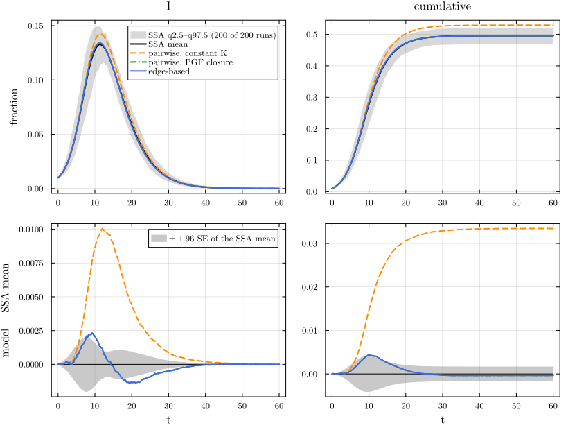
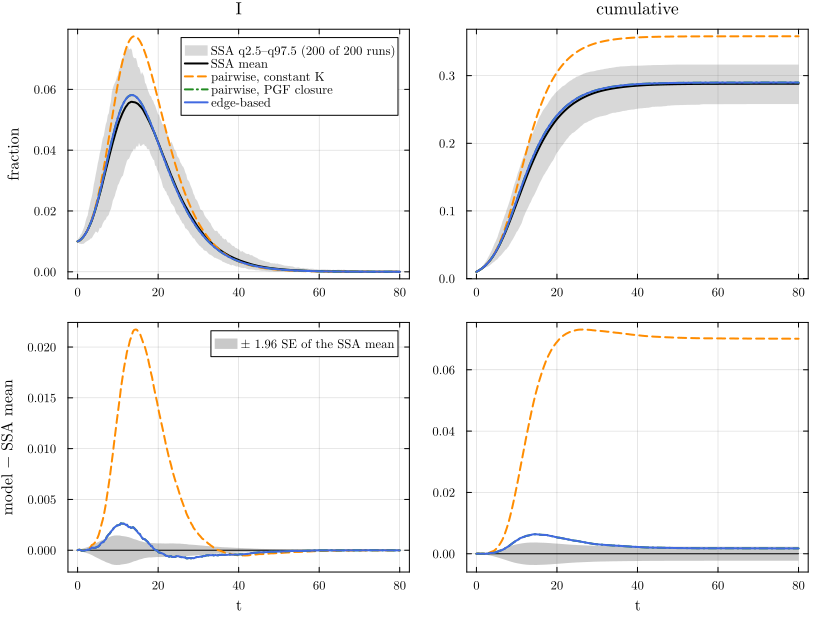
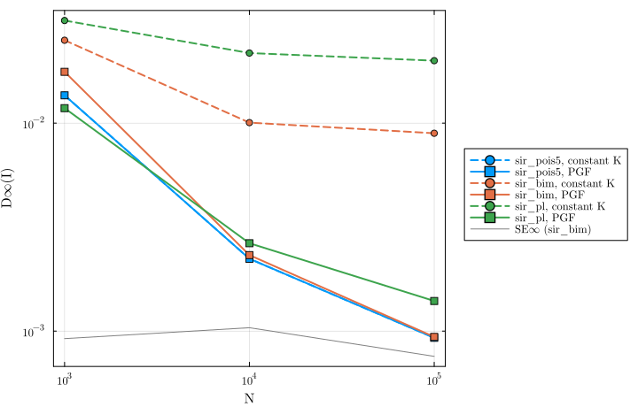

# Closures and degree heterogeneity


- [The five networks](#the-five-networks)
- [Low level and factory](#low-level-and-factory)
- [The mathematics of the two
  closures](#the-mathematics-of-the-two-closures)
- [Edge-based and pairwise: the
  morphism](#edge-based-and-pairwise-the-morphism)
- [Against simulation: five networks](#against-simulation-five-networks)
- [N-scaling: exact in the limit versus
  biased](#n-scaling-exact-in-the-limit-versus-biased)
- [References](#references)

A pairwise model needs the triples \[A S B\] in terms of pairs. The
constant-K closure \[A S B\] = K\[AS\]\[SB\]/\[S\], with K = ⟨k(k −
1)⟩/⟨k⟩², uses one number per degree distribution; it is exact against
the edge-based model when the degree distribution is of Poisson type
(PT: ψ’(x) = αψ(x)^K, which holds for the Poisson, binomial, negative
binomial and regular distributions), and biased otherwise ([House and
Keeling 2011](#ref-house2011); [Kiss et al. 2017](#ref-kiss2017);
[Miller 2011](#ref-miller2011)). The PGF closure replaces K by K_ψ(θ) =
ψ(θ)ψ’‘(θ)/ψ’(θ)², evaluated along the solution through the
edge-survival variable θ, and it is exact for every degree distribution.
This page runs all of them on five SIR scenarios that share R₀ = 2 and γ
= 1/4; the four with τ = 1/6 also share r = 5/12, while the power law
has τ ≈ 0.075 and a different r (the network table below prints r for
each), against the committed NetworkOutbreaks ensembles and against the
edge-based model, and then checks how the error scales with N.

The page mirrors two EdgeBasedModels pages: E03 (degree heterogeneity)
and E06 (edge-based and pairwise). Its first cell is E03’s first cell,
and the cell `shared-cell-E06` further down is E06’s, apart from the
lines marked `# back end`.

## The five networks

``` julia
include(joinpath(@__DIR__, "..", "_shared", "setup.jl"))
require_summaries([:sir_reg6, :sir_pois5, :sir_nb4, :sir_bim, :sir_pl, :sir_pois5_N1000, :sir_pois5_N100000,   # back end
                   :sir_bim_N1000, :sir_bim_N100000, :sir_pl_N1000, :sir_pl_N100000])                    # back end
using NetworkEpiCore, NetworkOutbreaks, Catalyst, Plots
using EdgeBasedModels
sir = @reaction_network sir begin
    @parameters τ γ
    τ, S + I --> 2I
    γ, I --> R
end
model = contact_model(sir)
ids = [:sir_reg6, :sir_pois5, :sir_nb4, :sir_bim, :sir_pl]
scs = Dict(id => scenario(id) for id in ids)
@assert all(isequivalent(model, scs[id].model) for id in ids)
mdtable(args...; kw...) = md_table(args...; kw...)   # back end
mdtable(["scenario", "title"], [(string("`:", id, "`"), scs[id].title) for id in ids])
```

| scenario | title |
|----|----|
| `:sir_reg6` | SIR on a 6-regular configuration network |
| `:sir_pois5` | SIR on a Poisson(5) configuration network |
| `:sir_nb4` | SIR on a negative binomial (mean 4, variance 8) configuration network |
| `:sir_bim` | SIR on a bimodal {2, 10} configuration network |
| `:sir_pl` | SIR on a truncated power-law (α = 2.5, k = 2…60) configuration network |

The network statistics, and the epidemic quantities that NetworkEpiCore
computes from the degree distribution alone (the edge-based R₀ = T·κ_ex,
the early growth rate r and the final size R∞ from ρ = 1%):

``` julia
netrow(id) = (sc = scs[id]; net = sc.network; p = sc.params;
    (string("`:", id, "`"), mean_degree(net), excess_degree(net), closure_constant(net),
     is_poisson_type(net) === nothing ? "no" : "yes", p[:τ], basic_reproduction_number(model, net, p),
     early_growth_rate(model, net, p), final_size(model, net, p; initial = sc.initial)))
md_table(["scenario", "⟨k⟩", "κ_ex", "K = ⟨k(k−1)⟩/⟨k⟩²", "Poisson type", "τ", "R₀", "r", "R∞"],
         [netrow(id) for id in ids])
```

| scenario | ⟨k⟩ | κ_ex | K = ⟨k(k−1)⟩/⟨k⟩² | Poisson type | τ | R₀ | r | R∞ |
|----|---:|---:|---:|----|---:|---:|---:|---:|
| `:sir_reg6` | 6 | 5 | 0.8333 | yes | 0.1667 | 2 | 0.4167 | 0.9295 |
| `:sir_pois5` | 5 | 5 | 1 | yes | 0.1667 | 2 | 0.4167 | 0.8002 |
| `:sir_nb4` | 4 | 5 | 1.25 | yes | 0.1667 | 2 | 0.4167 | 0.6408 |
| `:sir_bim` | 3.333 | 5 | 1.5 | no | 0.1667 | 2 | 0.4167 | 0.4956 |
| `:sir_pl` | 3.985 | 8.663 | 2.174 | no | 0.07504 | 2 | 0.325 | 0.2898 |

## Low level and factory

On one network, the bimodal distribution {2: 5/6, 10: 1/6} of
`:sir_bim`, the model is built both ways for the constant-K closure (the
default on a configuration network) and for the PGF closure. For the PGF
closure the factory model `sir_model()` goes through `node_based` (the
0.1-era `generate_pairwise` builder cannot take `PGFClosure`), and the
scenario form `node_based(sc; …)`, which the comparisons below use, is
checked as well:

``` julia
sc   = scs[:sir_bim]
net  = sc.network
sysK   = node_based(model, net)                                                        # low level, constant K
sysKF  = generate_pairwise(sir_model(), net, BernoulliClosure(); cumulative = true)    # factory
@assert vector_fields_equal(symbolic_ode(sysK), symbolic_ode(sysKF))
sysP   = node_based(model, net; closure = PGFClosure())                                # low level, PGF closure
sysPF  = node_based(sir_model(), net; closure = PGFClosure())                          # factory, PGF closure
sysPS  = node_based(sc; closure = PGFClosure())                                        # scenario form
@assert vector_fields_equal(symbolic_ode(sysP), symbolic_ode(sysPF))
@assert vector_fields_equal(symbolic_ode(sysP), symbolic_ode(sysPS))
sysS   = node_based(model, net; level = :s_anchored, closure = PGFClosure())           # S-anchored subsystem
@printf("constant K: %d states;  PGF closure: %d states;  S-anchored (PGF): %d states;  K = %.4f\n",
        length(state_names(symbolic_ode(sysK))), length(state_names(symbolic_ode(sysP))),
        length(state_names(symbolic_ode(sysS))), closure_constant(net))
```

    constant K: 10 states;  PGF closure: 10 states;  S-anchored (PGF): 7 states;  K = 1.5000

## The mathematics of the two closures

With the constant closure the susceptible-centred triples are \[A S B\]
= K\[AS\]\[SB\]/\[S\] with K fixed. The PGF closure adds the
edge-survival probability θ of the edge-based model, with θ̇ =
−τ\[SI\]/(\[S\]·ψ’(θ)/ψ(θ)) (the edge-based θ̇ = −τφ_I rewritten in
pairwise variables), and closes with

$$[A\,S\,B] = K_\psi(\theta)\,\frac{[AS][SB]}{[S]}, \qquad K_\psi(\theta) = \frac{\psi(\theta)\,\psi''(\theta)}{\psi'(\theta)^2}.$$

At θ = 1, K_ψ(1) = ψ’‘(1)/ψ’(1)² = K, so the two closures agree at the
start of the epidemic. They agree at every time exactly when K_ψ is
constant, which is the Poisson-type condition: ψψ’’ = Kψ’² on an
interval if and only if ψ’ = αψ^K there.

That equivalence (for ψ \> 0 on the interval) is Lean theorem
`NEP.pt_iff_const_closure` (NetworkEpiCore.jl/proofs).

For the bimodal distribution K_ψ falls as the epidemic depletes the
high-degree nodes:

``` julia
Kψ(d, θ) = pgf(d, θ) * pgf_derivative(d, θ, 2) / pgf_derivative(d, θ, 1)^2
θs = [1.0, 0.9, 0.8, 0.6, 0.4]
md_table(vcat(["scenario"], ["K_ψ($(θ))" for θ in θs]),
         [vcat([string("`:", id, "`")], [Kψ(scs[id].network.degrees, θ) for θ in θs]) for id in ids])
```

| scenario     | K_ψ(1.0) | K_ψ(0.9) | K_ψ(0.8) | K_ψ(0.6) | K_ψ(0.4) |
|--------------|---------:|---------:|---------:|---------:|---------:|
| `:sir_reg6`  |   0.8333 |   0.8333 |   0.8333 |   0.8333 |   0.8333 |
| `:sir_pois5` |        1 |        1 |        1 |        1 |        1 |
| `:sir_nb4`   |     1.25 |     1.25 |     1.25 |     1.25 |     1.25 |
| `:sir_bim`   |      1.5 |    1.294 |   0.9512 |   0.5586 |   0.5024 |
| `:sir_pl`    |    2.174 |    1.126 |   0.8809 |   0.6917 |   0.6001 |

The printed vector field of the PGF-closed S-anchored system on the
bimodal network (ψ(θ) = (5θ² + θ¹⁰)/6):

``` julia
symbolic_ode(sysS)
```

    SymbolicODE :s_anchored_sir (7 states)
      dθ/dt = (SI(t)*(-0.8333333333333334(θ(t)^2) - 0.16666666666666666(θ(t)^10))*τ) / (S(t)*(1.6666666666666667θ(t) + 1.6666666666666665(θ(t)^9)))
      dS/dt = -SI(t)*τ
      dI/dt = -I(t)*γ + SI(t)*τ
      dR/dt = I(t)*γ
      dSS/dt = (-2SI(t)*SS(t)*(1.6666666666666667 + 15.0(θ(t)^8))*(0.8333333333333334(θ(t)^2) + 0.16666666666666666(θ(t)^10))*τ) / (S(t)*((1.6666666666666667θ(t) + 1.6666666666666665(θ(t)^9))^2))
      dSI/dt = (SI(t)*SS(t)*(1.6666666666666667 + 15.0(θ(t)^8))*(0.8333333333333334(θ(t)^2) + 0.16666666666666666(θ(t)^10))*τ) / (S(t)*((1.6666666666666667θ(t) + 1.6666666666666665(θ(t)^9))^2)) - SI(t)*γ - (SI(t) + ((SI(t)^2)*(1.6666666666666667 + 15.0(θ(t)^8))*(0.8333333333333334(θ(t)^2) + 0.16666666666666666(θ(t)^10))) / (S(t)*((1.6666666666666667θ(t) + 1.6666666666666665(θ(t)^9))^2)))*τ
      dSR/dt = (-SI(t)*SR(t)*(1.6666666666666667 + 15.0(θ(t)^8))*(0.8333333333333334(θ(t)^2) + 0.16666666666666666(θ(t)^10))*τ) / (S(t)*((1.6666666666666667θ(t) + 1.6666666666666665(θ(t)^9))^2)) + SI(t)*γ
      parameters  γ, τ
      domain      θ ∈ (0.05, 1.0)

## Edge-based and pairwise: the morphism

The cell below is E06’s first cell; the one after it maps the edge-based
model to the pairwise one.

``` julia
include(joinpath(@__DIR__, "..", "_shared", "setup.jl"))
using NetworkEpiCore, NetworkOutbreaks, Catalyst, Plots
using EdgeBasedModels, NodeBasedModels
using Statistics
sir = @reaction_network sir begin
    @parameters τ γ
    τ, S + I --> 2I
    γ, I --> R
end
model = contact_model(sir)
ids = [:sir_reg6, :sir_pois5, :sir_nb4, :sir_bim, :sir_pl, :seair_pois5]
scs = Dict(id => scenario(id) for id in ids)
mdtable(["scenario", "title"], [(string("`:", id, "`"), scs[id].title) for id in ids])
```

| scenario | title |
|----|----|
| `:sir_reg6` | SIR on a 6-regular configuration network |
| `:sir_pois5` | SIR on a Poisson(5) configuration network |
| `:sir_nb4` | SIR on a negative binomial (mean 4, variance 8) configuration network |
| `:sir_bim` | SIR on a bimodal {2, 10} configuration network |
| `:sir_pl` | SIR on a truncated power-law (α = 2.5, k = 2…60) configuration network |
| `:seair_pois5` | SEAIR (branching after latency, two infectors) on Poisson(5) |

EdgeBasedModels’ `pairwise_image` pushes the edge-based vector field
forward along π^PW: (θ, ξ, φ, pop) ↦ (\[s\], \[ss\], \[sX\], \[X\]) =
(qξψ(θ), q²ξ²ψ’(θ)²/ψ’(1), qξψ’(θ)φ_X, pop_X). The image is the
S-anchored pairwise model with the PGF closure, the system
NodeBasedModels builds with
`level = :s_anchored, closure = PGFClosure()`. The two symbolic vector
fields are equal on every network of the cell, SEAIR (two infectors,
branching after latency) included:

``` julia
function morphism_row(id)
    s  = scs[id]
    eb = edge_based(s.model, s.network)
    pw = pairwise_image(eb)
    nb = node_based(s.model, s.network; level = :s_anchored, closure = PGFClosure())
    (string("`:", id, "`"), string(pw.morphism.exactness), vector_fields_equal(pw.ode, symbolic_ode(nb)),
     length(state_names(pw.ode)))
end
md_table(["scenario", "exactness of π^PW", "image ≡ NBM S-anchored PGF", "states"], [morphism_row(id) for id in ids])
```

| scenario       | exactness of π^PW | image ≡ NBM S-anchored PGF | states |
|----------------|-------------------|---------------------------:|-------:|
| `:sir_reg6`    | exact             |                       true |      7 |
| `:sir_pois5`   | exact             |                       true |      7 |
| `:sir_nb4`     | exact             |                       true |      7 |
| `:sir_bim`     | exact             |                       true |      7 |
| `:sir_pl`      | exact             |                       true |      7 |
| `:seair_pois5` | exact             |                       true |     11 |

That π^PW is a local semiconjugacy onto the PGF-closed S-anchored model,
for every T_EB model and every ψ with the derivatives it needs, on the
domain {ψ(θ) ≠ 0, ψ’(θ) ≠ 0, ξ ≠ 0}, is Lean theorem `NEP.eb_to_pws`
(NetworkEpiCore.jl/proofs); its SIR and SEIR instances, for ψ with those
derivatives at every θ, are Lean theorem `NEP.eb_to_pws_sir_global`
(NetworkEpiCore.jl/proofs) and Lean theorem `NEP.eb_to_pws_seir_global`
(NetworkEpiCore.jl/proofs). With the constant closure the same map is a
local semiconjugacy when ψ is of Poisson type, Lean theorem
`NEP.eb_to_pws_pt_any` (NetworkEpiCore.jl/proofs); only that “if”
direction is formalised for the dynamics.

## Against simulation: five networks

Every closure, the S-anchored subsystems and the edge-based model on
every network, against the committed NetworkOutbreaks ensembles:

``` julia
refs = Dict(id => scenario_summary(scs[id]) for id in ids)
reference_table([refs[id] for id in ids])
```

| scenario | N | runs | graphs | conditioning | kept | kept fraction (95% CI) |
|----|---:|---:|----|----|---:|----|
| `:sir_reg6` | 10000 | 200 | per_run | major (≥ 0.05·N) | 200 | P(major) = 1.000 (0.981–1.000) |
| `:sir_pois5` | 10000 | 200 | per_run | major (≥ 0.05·N) | 200 | P(major) = 1.000 (0.981–1.000) |
| `:sir_nb4` | 10000 | 200 | per_run | major (≥ 0.05·N) | 200 | P(major) = 1.000 (0.981–1.000) |
| `:sir_bim` | 10000 | 200 | per_run | major (≥ 0.05·N) | 200 | P(major) = 1.000 (0.981–1.000) |
| `:sir_pl` | 10000 | 200 | per_run | major (≥ 0.05·N) | 200 | P(major) = 1.000 (0.981–1.000) |
| `:seair_pois5` | 10000 | 200 | per_run | major (≥ 0.05·N) | 200 | P(major) = 1.000 (0.981–1.000) |

``` julia
function all_curves(s)
    systems = [("pairwise, constant K", node_based(s.model, s.network)),
               ("pairwise, PGF closure", node_based(s.model, s.network; closure = PGFClosure())),
               ("S-anchored, constant K", node_based(s.model, s.network; level = :s_anchored)),
               ("S-anchored, PGF closure", node_based(s.model, s.network; level = :s_anchored, closure = PGFClosure())),
               ("edge-based", edge_based(s.model, s.network))]
    [model_curves(sys, solve_epidemic(sys, s); t = s.tgrid, label = l) for (l, sys) in systems]
end
dets = Dict(id => all_curves(scs[id]) for id in ids)
tabs = Dict(id => compare(refs[id], dets[id]...) for id in ids)
nothing
```

``` julia
rows = [(string("`:", id, "`"), d.label, tabs[id][d.label, :I].D∞, tabs[id][d.label, :I].z∞,
         d[:cumulative][end], tabs[id][d.label, :cumulative].ΔR∞,
         @sprintf("[%+.4f, %+.4f]", tabs[id][d.label, :cumulative].ΔR∞_ci...))
        for id in ids for d in dets[id]]
md_table(["scenario", "model", "D∞(I)", "z∞(I)", "R(t_end)", "ΔR∞", "95% CI of ΔR∞"], rows)
```

| scenario | model | D∞(I) | z∞(I) | R(t_end) | ΔR∞ | 95% CI of ΔR∞ |
|----|----|---:|---:|---:|---:|----|
| `:sir_reg6` | pairwise, constant K | 0.001709 | 2.736 | 0.9295 | 0.0002649 | \[-0.0003, +0.0008\] |
| `:sir_reg6` | pairwise, PGF closure | 0.001709 | 2.736 | 0.9295 | 0.0002649 | \[-0.0003, +0.0008\] |
| `:sir_reg6` | S-anchored, constant K | 0.001709 | 2.736 | 0.9295 | 0.0002649 | \[-0.0003, +0.0008\] |
| `:sir_reg6` | S-anchored, PGF closure | 0.001709 | 2.736 | 0.9295 | 0.0002649 | \[-0.0003, +0.0008\] |
| `:sir_reg6` | edge-based | 0.001712 | 2.769 | 0.9295 | 0.0002613 | \[-0.0003, +0.0008\] |
| `:sir_pois5` | pairwise, constant K | 0.002228 | 2.596 | 0.8002 | 0.0001227 | \[-0.0008, +0.0011\] |
| `:sir_pois5` | pairwise, PGF closure | 0.002228 | 2.596 | 0.8002 | 0.0001227 | \[-0.0008, +0.0011\] |
| `:sir_pois5` | S-anchored, constant K | 0.002228 | 2.596 | 0.8002 | 0.0001227 | \[-0.0008, +0.0011\] |
| `:sir_pois5` | S-anchored, PGF closure | 0.002228 | 2.596 | 0.8002 | 0.0001227 | \[-0.0008, +0.0011\] |
| `:sir_pois5` | edge-based | 0.002226 | 2.587 | 0.8002 | 0.0001105 | \[-0.0009, +0.0011\] |
| `:sir_nb4` | pairwise, constant K | 0.001145 | 1.736 | 0.6408 | 0.0003432 | \[-0.0010, +0.0017\] |
| `:sir_nb4` | pairwise, PGF closure | 0.001145 | 1.736 | 0.6408 | 0.0003432 | \[-0.0010, +0.0017\] |
| `:sir_nb4` | S-anchored, constant K | 0.001145 | 1.736 | 0.6408 | 0.0003432 | \[-0.0010, +0.0017\] |
| `:sir_nb4` | S-anchored, PGF closure | 0.001145 | 1.736 | 0.6408 | 0.0003432 | \[-0.0010, +0.0017\] |
| `:sir_nb4` | edge-based | 0.00115 | 1.742 | 0.6408 | 0.000338 | \[-0.0010, +0.0017\] |
| `:sir_bim` | pairwise, constant K | 0.01006 | 20.29 | 0.5293 | 0.03344 | \[+0.0317, +0.0351\] |
| `:sir_bim` | pairwise, PGF closure | 0.00232 | 3.57 | 0.4956 | -0.000345 | \[-0.0020, +0.0013\] |
| `:sir_bim` | S-anchored, constant K | 0.01006 | 20.29 | 0.5293 | 0.03344 | \[+0.0317, +0.0351\] |
| `:sir_bim` | S-anchored, PGF closure | 0.00232 | 3.57 | 0.4956 | -0.000345 | \[-0.0020, +0.0013\] |
| `:sir_bim` | edge-based | 0.002319 | 3.586 | 0.4956 | -0.0003484 | \[-0.0020, +0.0013\] |
| `:sir_pl` | pairwise, constant K | 0.02173 | 51.14 | 0.3582 | 0.07013 | \[+0.0679, +0.0724\] |
| `:sir_pl` | pairwise, PGF closure | 0.002645 | 3.943 | 0.2898 | 0.001731 | \[-0.0005, +0.0040\] |
| `:sir_pl` | S-anchored, constant K | 0.02173 | 51.14 | 0.3582 | 0.07013 | \[+0.0679, +0.0724\] |
| `:sir_pl` | S-anchored, PGF closure | 0.002645 | 3.943 | 0.2898 | 0.001731 | \[-0.0005, +0.0040\] |
| `:sir_pl` | edge-based | 0.002645 | 3.944 | 0.2898 | 0.001729 | \[-0.0005, +0.0040\] |
| `:seair_pois5` | pairwise, constant K | 0.0003658 | 2.454 | 0.6976 | -0.001017 | \[-0.0026, +0.0006\] |
| `:seair_pois5` | pairwise, PGF closure | 0.0003658 | 2.454 | 0.6976 | -0.001017 | \[-0.0026, +0.0006\] |
| `:seair_pois5` | S-anchored, constant K | 0.0003658 | 2.454 | 0.6976 | -0.001017 | \[-0.0026, +0.0006\] |
| `:seair_pois5` | S-anchored, PGF closure | 0.0003658 | 2.454 | 0.6976 | -0.001017 | \[-0.0026, +0.0006\] |
| `:seair_pois5` | edge-based | 0.0003645 | 2.448 | 0.6976 | -0.001017 | \[-0.0026, +0.0006\] |

On the three Poisson-type networks every row of a scenario gives the
same curve: the constant closure is exact there. On the two non-PT
networks the constant-K rows separate from the others:

``` julia
for id in (:sir_bim, :sir_pl)
    cK = tabs[id]["pairwise, constant K", :cumulative]; cP = tabs[id]["pairwise, PGF closure", :cumulative]
    dKe = dets[id][1][:cumulative][end] - dets[id][5][:cumulative][end]
    @printf(":%s  constant K: ΔR∞ = %+.4f vs NO, %+.4f vs edge-based;  PGF closure: ΔR∞ = %+.4f vs NO;  D∞(I): %.4f (K) vs %.4f (PGF)\n",
            id, cK.ΔR∞, dKe, cP.ΔR∞, tabs[id]["pairwise, constant K", :I].D∞, tabs[id]["pairwise, PGF closure", :I].D∞)
end
maxPT = maximum(maximum(abs.(dets[id][1][X] .- dets[id][5][X])) for id in (:sir_reg6, :sir_pois5, :sir_nb4)
                for X in (:I, :cumulative))
maxPGF = maximum(maximum(abs.(dets[id][2][X] .- dets[id][5][X])) for id in ids for X in (:I, :cumulative))
@printf("max |constant K − edge-based| on the PT networks: %.1e;  max |PGF closure − edge-based| on all of them: %.1e\n",
        maxPT, maxPGF)
z_eb = Dict(id => tabs[id]["edge-based", :I].z∞ for id in ids)
ci0  = Dict(id => (ci = tabs[id]["edge-based", :cumulative].ΔR∞_ci; ci[1] <= 0 <= ci[2]) for id in ids)
for id in ids
    @printf(":%-9s edge-based: z∞(I) = %.2f;  95%% CI of ΔR∞ contains 0: %s\n", id, z_eb[id], ci0[id])
end
```

    :sir_bim  constant K: ΔR∞ = +0.0334 vs NO, +0.0338 vs edge-based;  PGF closure: ΔR∞ = -0.0003 vs NO;  D∞(I): 0.0101 (K) vs 0.0023 (PGF)
    :sir_pl  constant K: ΔR∞ = +0.0701 vs NO, +0.0684 vs edge-based;  PGF closure: ΔR∞ = +0.0017 vs NO;  D∞(I): 0.0217 (K) vs 0.0026 (PGF)
    max |constant K − edge-based| on the PT networks: 2.2e-05;  max |PGF closure − edge-based| on all of them: 2.2e-05
    :sir_reg6  edge-based: z∞(I) = 2.77;  95% CI of ΔR∞ contains 0: true
    :sir_pois5 edge-based: z∞(I) = 2.59;  95% CI of ΔR∞ contains 0: true
    :sir_nb4   edge-based: z∞(I) = 1.74;  95% CI of ΔR∞ contains 0: true
    :sir_bim   edge-based: z∞(I) = 3.59;  95% CI of ΔR∞ contains 0: true
    :sir_pl    edge-based: z∞(I) = 3.94;  95% CI of ΔR∞ contains 0: true
    :seair_pois5 edge-based: z∞(I) = 2.45;  95% CI of ΔR∞ contains 0: true

The constant-K bias is pinned: the final size is too large by more than
0.02 on both non-PT networks, far outside the 95% intervals of the
ensemble. For the final size the PGF closure and the edge-based model
(the same curve, to the printed `max |PGF closure − edge-based|`) agree
with the ensemble: the 95% interval of their ΔR∞ contains 0 for every
scenario of the table (true). Their prevalence curves do not agree to
within Monte Carlo error: z∞(I) is 3.6 on `:sir_bim` and 3.9 on
`:sir_pl`, and 1.7 to 2.8 on the three Poisson-type networks, a residual
common to every model on the page that the N-scaling section below
separates from bias. The figure for the bimodal network, where the two
closures start together (K_ψ(1) = K) and separate as the hubs are
infected:

``` julia
distinct_styles!(comparisonplot(refs[:sir_bim], dets[:sir_bim][[1, 2, 5]]; observables = [:I, :cumulative]))
```

<div id="fig-bim">



Figure 1: The bimodal network :sir_bim: constant-K and PGF-closed
pairwise models and the edge-based model against the NetworkOutbreaks
ensemble (top: spread band q2.5–q97.5 of the runs and their mean;
bottom: residual with the mean band ±1.96 SE).

</div>

And for the power law, where K = 2.174 at the start:

``` julia
distinct_styles!(comparisonplot(refs[:sir_pl], dets[:sir_pl][[1, 2, 5]]; observables = [:I, :cumulative]))
```

<div id="fig-pl">



Figure 2: As above, on the power-law network :sir_pl (exponent 2.5,
degrees 2–60).

</div>

## N-scaling: exact in the limit versus biased

At fixed N, D∞ mixes three things: Monte Carlo error, a finite-size
effect that shrinks as N grows (its rate is measured by the log–log
slopes printed below the figure, not assumed), and any structural bias
of the model. The N-scaling variants hold N·runs fixed (N = 10³, 10⁴,
10⁵ with 2000, 200 and 20 runs), so the Monte Carlo error of the mean
stays roughly flat. A model that is exact in the large-N limit decays
towards that floor; a biased one plateaus.

``` julia
variants = Dict(:sir_pois5 => [:sir_pois5_N1000, :sir_pois5, :sir_pois5_N100000],
                :sir_bim   => [:sir_bim_N1000, :sir_bim, :sir_bim_N100000],
                :sir_pl    => [:sir_pl_N1000, :sir_pl, :sir_pl_N100000])
scaling = []
for base in (:sir_pois5, :sir_bim, :sir_pl), v in variants[base]
    r = v === base ? refs[base] : scenario_summary(scenario(v))
    c = compare(r, dets[base][1], dets[base][2])
    push!(scaling, (base, r.N, r.nsims, c["pairwise, constant K", :I].D∞, c["pairwise, PGF closure", :I].D∞,
                    c["pairwise, PGF closure", :I].SE∞, c["pairwise, constant K", :cumulative].ΔR∞,
                    c["pairwise, PGF closure", :cumulative].ΔR∞))
end
md_table(["scenario", "N", "runs", "D∞(I), constant K", "D∞(I), PGF", "SE∞(I)", "ΔR∞, constant K", "ΔR∞, PGF"],
         [(string("`:", s[1], "`"), s[2:end]...) for s in scaling])
```

| scenario | N | runs | D∞(I), constant K | D∞(I), PGF | SE∞(I) | ΔR∞, constant K | ΔR∞, PGF |
|----|---:|---:|---:|---:|---:|---:|---:|
| `:sir_pois5` | 1000 | 2000 | 0.0136 | 0.0136 | 0.001153 | 0.0007155 | 0.0007155 |
| `:sir_pois5` | 10000 | 200 | 0.002228 | 0.002228 | 0.001135 | 0.0001227 | 0.0001227 |
| `:sir_pois5` | 100000 | 20 | 0.0009282 | 0.0009282 | 0.001157 | 0.0001942 | 0.0001942 |
| `:sir_bim` | 1000 | 2000 | 0.02504 | 0.01765 | 0.00092 | 0.03813 | 0.004346 |
| `:sir_bim` | 10000 | 200 | 0.01006 | 0.00232 | 0.001038 | 0.03344 | -0.000345 |
| `:sir_bim` | 100000 | 20 | 0.00894 | 0.0009376 | 0.000756 | 0.03344 | -0.0003395 |
| `:sir_pl` | 1000 | 2000 | 0.03114 | 0.0118 | 0.000614 | 0.0832 | 0.0148 |
| `:sir_pl` | 10000 | 200 | 0.02173 | 0.002645 | 0.000743 | 0.07013 | 0.001731 |
| `:sir_pl` | 100000 | 20 | 0.01997 | 0.001396 | 0.000637 | 0.06814 | -0.0002673 |

``` julia
plt = plot(; xscale = :log10, yscale = :log10, xlabel = "N", ylabel = "D∞(I)", legend = :outerright)
for (j, base) in enumerate((:sir_pois5, :sir_bim, :sir_pl))
    rs = filter(s -> s[1] === base, scaling)
    Ns = [s[2] for s in rs]
    plot!(plt, Ns, [s[4] for s in rs]; ls = :dash, marker = :circle, color = j, label = "$(base), constant K")
    plot!(plt, Ns, [s[5] for s in rs]; ls = :solid, marker = :square, color = j, label = "$(base), PGF")
end
rs = filter(s -> s[1] === :sir_bim, scaling)
plot!(plt, [s[2] for s in rs], [s[6] for s in rs]; color = :grey, lw = 1, label = "SE∞ (sir_bim)")
plt
```

<div id="fig-scaling">



Figure 3: D∞(I) against N for the constant-K (dashed) and PGF (solid)
closures; the grey line is SE∞(I) of the PGF comparison, the Monte Carlo
floor.

</div>

``` julia
pl_K = [s[4] for s in scaling if s[1] === :sir_pl]; pl_P = [s[5] for s in scaling if s[1] === :sir_pl]
@printf("sir_pl, D∞(I) at N = 10³, 10⁴, 10⁵:  constant K %.4f, %.4f, %.4f;  PGF %.4f, %.4f, %.4f\n", pl_K..., pl_P...)
# least-squares slope of log D∞(I) on log N over the three sizes (−1 would be an O(1/N) decay)
loglog_slope(xs, ys) = (lx = log.(xs); ly = log.(ys); sum((lx .- mean(lx)) .* (ly .- mean(ly))) / sum((lx .- mean(lx)) .^ 2))
slopes = Dict(base => (rs = filter(s -> s[1] === base, scaling);
                       (loglog_slope([s[2] for s in rs], [s[4] for s in rs]), loglog_slope([s[2] for s in rs], [s[5] for s in rs])))
              for base in (:sir_pois5, :sir_bim, :sir_pl))
for base in (:sir_pois5, :sir_bim, :sir_pl)
    @printf(":%-9s log–log slope of D∞(I) against N:  constant K %+.2f;  PGF %+.2f\n", base, slopes[base]...)
end
```

    sir_pl, D∞(I) at N = 10³, 10⁴, 10⁵:  constant K 0.0311, 0.0217, 0.0200;  PGF 0.0118, 0.0026, 0.0014
    :sir_pois5 log–log slope of D∞(I) against N:  constant K -0.58;  PGF -0.58
    :sir_bim   log–log slope of D∞(I) against N:  constant K -0.22;  PGF -0.64
    :sir_pl    log–log slope of D∞(I) against N:  constant K -0.10;  PGF -0.46

On the power law the constant-K error stays at about 0.02 from N = 10⁴
to 10⁵, while the PGF closure (the edge-based model in pairwise
coordinates) falls from 0.012 at N = 10³ to 0.0014 at N = 10⁵. The
fitted log–log slopes of the PGF rows lie between -0.46 and -0.64,
shallower than the −1 of an O(1/N) decay; with three sizes, and the
Monte Carlo floor entering at N = 10⁵, they do not pin the rate, only
that the error of an exact-in-the-limit model shrinks with N, while the
constant-K error on the non-PT networks flattens (slopes -0.22 on
`:sir_bim` and -0.097 on `:sir_pl`).

## References

<div id="refs" class="references csl-bib-body hanging-indent">

<div id="ref-house2011" class="csl-entry">

House, Thomas, and Matt J. Keeling. 2011. “Insights from Unifying Modern
Approximations to Infections on Networks.” *Journal of the Royal Society
Interface* 8 (54): 67–73. <https://doi.org/10.1098/rsif.2010.0179>.

</div>

<div id="ref-kiss2017" class="csl-entry">

Kiss, István Z., Joel C. Miller, and Péter L. Simon. 2017. *Mathematics
of Epidemics on Networks: From Exact to Approximate Models*. Vol. 46.
Interdisciplinary Applied Mathematics. Springer.
<https://doi.org/10.1007/978-3-319-50806-1>.

</div>

<div id="ref-miller2011" class="csl-entry">

Miller, Joel C. 2011. “A Note on a Paper by Erik Volz: SIR Dynamics in
Random Networks.” *Journal of Mathematical Biology* 62 (3): 349–58.
<https://doi.org/10.1007/s00285-010-0337-9>.

</div>

</div>
