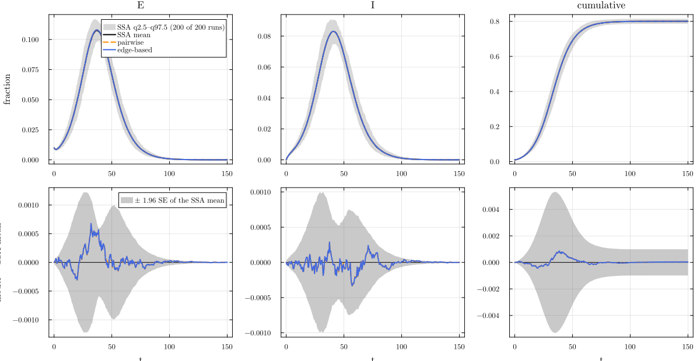
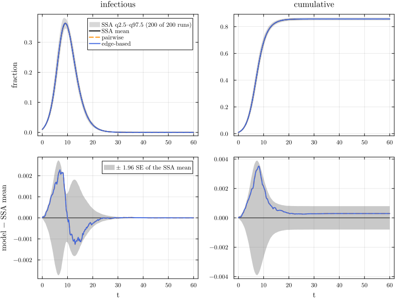
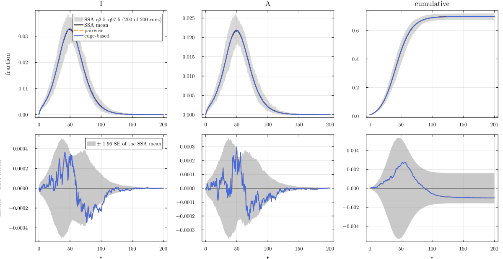
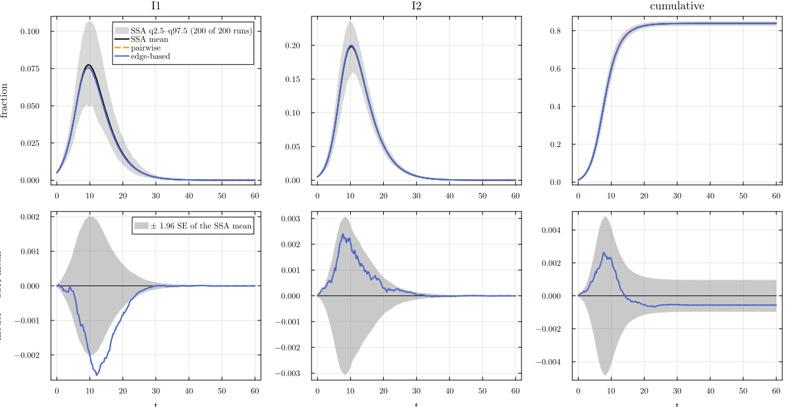
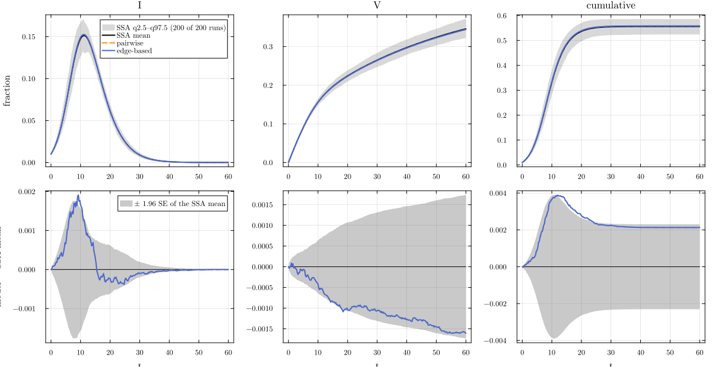
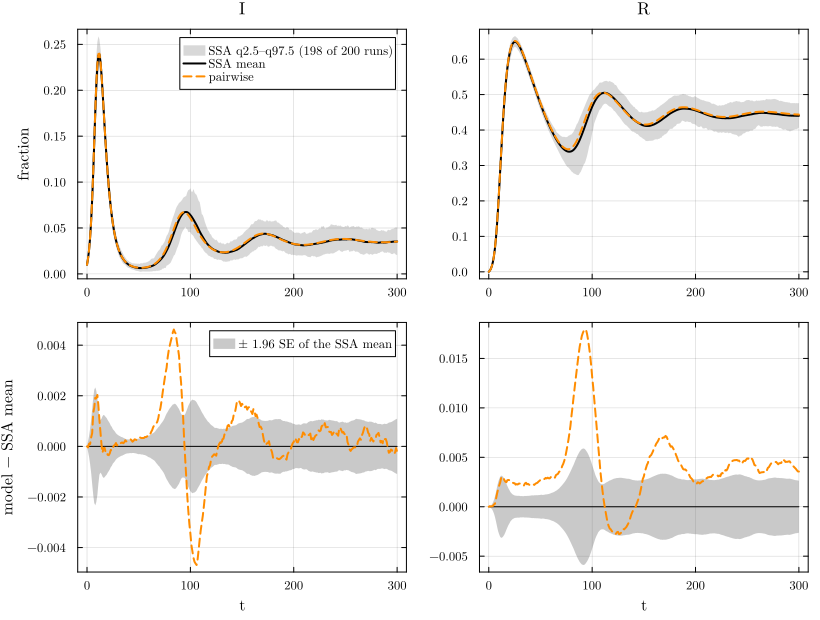

# Natural history in pairwise models


- [Latency: SEIR](#latency-seir)
- [Stages: an Erlang infectious
  period](#stages-an-erlang-infectious-period)
- [Branching and two infectors:
  SEAIR](#branching-and-two-infectors-seair)
- [Two strains with full
  cross-immunity](#two-strains-with-full-cross-immunity)
- [An exit from S: vaccination](#an-exit-from-s-vaccination)
- [Waning immunity: SIRS, where the edge-based model
  stops](#waning-immunity-sirs-where-the-edge-based-model-stops)
- [Summary](#summary)
- [References](#references)

The pairwise lift is not specific to SIR. Every reaction of the model
contributes its own terms: a contact X + J → Y + J with per-contact rate
τ drains the pair \[XJ\] (and, through the closed triples \[Z X J\],
every pair \[ZX\]); a node transition W → Z moves the singles \[W\] and
every pair containing W. So latency, stages, branching, several
infectors with their own rates, several strains, exits from S and even
waning immunity are lifted the same way. This page lifts six models on
the Poisson(5) configuration network, where the constant closure K = 1
is exact against the edge-based model for the five models inside T_EB
([Kiss et al. 2017](#ref-kiss2017); [Miller et al.
2012](#ref-miller2012)). Each is written as a Catalyst reaction network
and then built from the canned model with the factory, and each is
compared with its committed NetworkOutbreaks ensemble. The
EdgeBasedModels page E04 covers the same natural histories; the SEIR
cell below is the same as E04’s, apart from the lines marked
`# back end`.

``` julia
include(joinpath(@__DIR__, "..", "_shared", "setup.jl"))
require_summaries([:seir_pois5, :sir_erl3_pois5, :seair_pois5, :twostrain_pois5, :sir_vax_pois5, :sirs_pois5])
using NetworkEpiCore, NetworkOutbreaks, Catalyst, Plots
using EdgeBasedModels
net = ConfigurationNetwork(PoissonDegree(5))
# the deterministic curves of a system on the scenario's grid
curves_of(sys, sc, label) = model_curves(sys, solve_epidemic(sys, sc); t = sc.tgrid, label)
# one table row per curve: the total prevalence of the infectious compartments and the final size
function compare_rows(sc, ref, dets)
    tab = compare(ref, dets...)
    [(string("`:", sc.id, "`"), d.label, tab[d.label, :infectious].D∞, tab[d.label, :infectious].SE∞,
      tab[d.label, :infectious].z∞, tab[d.label, :cumulative].ΔR∞,
      @sprintf("[%+.4f, %+.4f]", tab[d.label, :cumulative].ΔR∞_ci...)) for d in dets]
end
const ROW_HEADER = ["scenario", "model", "D∞(infectious)", "SE∞", "z∞", "ΔR∞", "95% CI of ΔR∞"]
```

## Latency: SEIR

``` julia
seir_rn = @reaction_network seir begin
    @parameters τ σ γ
    τ, S + I --> E + I
    σ, E --> I
    γ, I --> R
end
sc_seir   = scenario(:seir_pois5)
m_seir    = contact_model(seir_rn)
@assert isequivalent(m_seir, sc_seir.model)
sys_seir  = node_based(m_seir, sc_seir.network)             # back end
sys_seirF = generate_pairwise(seir_model(), sc_seir.network, BernoulliClosure(); cumulative = true)   # back end
@assert vector_fields_equal(symbolic_ode(sys_seir), symbolic_ode(sys_seirF))
p = sc_seir.params
@printf("SEIR: T = %.4f (τ/(τ + γ) = %.4f), R₀ = %.4f, r = %.4f\n", transmissibility(m_seir, sc_seir.network, p),   # back end
        p[:τ] / (p[:τ] + p[:γ]), basic_reproduction_number(m_seir, sc_seir.network, p), early_growth_rate(m_seir, sc_seir.network, p))   # back end
```

    SEIR: T = 0.4000 (τ/(τ + γ) = 0.4000), R₀ = 2.0000, r = 0.1140

The low-level system (from the Catalyst network) and the factory system
(`generate_pairwise(seir_model(), …)`) are the same vector field. The
exposed class adds the singles \[E\] and the pairs \[SE\], \[EE\],
\[EI\], \[ER\]; the contact S + I → E + I moves the newly infected end
of \[SI\] into E, not I:

``` julia
symbolic_ode(sys_seir)
```

    SymbolicODE :pairwise_seir (15 states)
      dS/dt = -SI(t)*τ
      dE/dt = -E(t)*σ + SI(t)*τ
      dI/dt = E(t)*σ - I(t)*γ
      dR/dt = I(t)*γ
      dSS/dt = -10.0ifelse((5.0S(t)) == 0, 0, (SI(t)*SS(t)) / (5.0S(t)))*τ
      dSE/dt = -SE(t)*σ + 5.0ifelse((5.0S(t)) == 0, 0, (SI(t)*SS(t)) / (5.0S(t)))*τ - 5.0ifelse((5.0S(t)) == 0, 0, (SE(t)*SI(t)) / (5.0S(t)))*τ
      dSI/dt = SE(t)*σ - SI(t)*γ - SI(t)*τ - 5.0ifelse((5.0S(t)) == 0, 0, (SI(t)^2) / (5.0S(t)))*τ
      dSR/dt = SI(t)*γ - 5.0ifelse((5.0S(t)) == 0, 0, (SI(t)*SR(t)) / (5.0S(t)))*τ
      dEE/dt = -2EE(t)*σ + 10.0ifelse((5.0S(t)) == 0, 0, (SE(t)*SI(t)) / (5.0S(t)))*τ
      dEI/dt = EE(t)*σ - EI(t)*(γ + σ) + SI(t)*τ + 5.0ifelse((5.0S(t)) == 0, 0, (SI(t)^2) / (5.0S(t)))*τ
      dER/dt = EI(t)*γ - ER(t)*σ + 5.0ifelse((5.0S(t)) == 0, 0, (SI(t)*SR(t)) / (5.0S(t)))*τ
      dII/dt = 2EI(t)*σ - 2II(t)*γ
      dIR/dt = ER(t)*σ + II(t)*γ - IR(t)*γ
      dRR/dt = 2IR(t)*γ
      dcumulative/dt = SI(t)*τ
      parameters  γ, σ, τ

The transmissibility T = τ/(τ + γ) is that of SIR, because a latent node
cannot transmit and every exposed node becomes infectious; so R₀ =
T·κ_ex is again 2, while the latency lowers the growth rate r (printed
above) from the SIR value on the same network, r = 0.4167.

``` julia
ref_seir = scenario_summary(sc_seir)
anchors(sc_seir);
describe_reference(ref_seir);
det_seir = curves_of(sys_seir, sc_seir, "pairwise")
eb_seir  = curves_of(edge_based(m_seir, sc_seir.network), sc_seir, "edge-based")
nothing
```

    :seir_pois5: γ = 0.25, σ = 0.2, τ = 0.166667; seeds E 0.01; t = 0:0.5:150; R₀ = 2 (canonical anchors)
    NetworkOutbreaks reference :seir_pois5 (hash b3d403ab): N = 10000 nodes, 200 runs on a fresh graph per run, algorithm :next_reaction; conditioning: major outbreaks only (cumulative incidence excluding seeds ≥ 0.05·N by t_end); 200 of 200 runs kept (major runs), P(major) = 1.000 (95% CI 0.981–1.000); no time alignment.

``` julia
distinct_styles!(comparisonplot(ref_seir, det_seir, eb_seir; observables = [:E, :I, :cumulative]))
```

<div id="fig-seir">



Figure 1: SEIR on Poisson(5): pairwise and edge-based models against the
committed NetworkOutbreaks ensemble of :seir_pois5 (top: spread band
q2.5–q97.5 of the runs and their mean; bottom: residual with the mean
band ±1.96 SE).

</div>

``` julia
md_table(ROW_HEADER, compare_rows(sc_seir, ref_seir, [det_seir, eb_seir]))
```

| scenario | model | D∞(infectious) | SE∞ | z∞ | ΔR∞ | 95% CI of ΔR∞ |
|----|----|---:|---:|---:|---:|----|
| `:seir_pois5` | pairwise | 0.0003383 | 0.000511 | 1.101 | 3.48e-05 | \[-0.0010, +0.0010\] |
| `:seir_pois5` | edge-based | 0.0003316 | 0.000511 | 1.1 | 3.403e-05 | \[-0.0010, +0.0010\] |

## Stages: an Erlang infectious period

`erlang_stages(model, :I, n)` is a transform of the model object: it
splits I into $I_1 \to I_2 \to \dots \to I_n$ with rate nγ per stage
(the same mean infectious period 1/γ, a less variable duration), keeps
every stage infectious at the same τ, and makes I₁ the entry state. The
scenario `:sir_erl3_pois5` is the three-stage transform of SIR. The
low-level route transforms the Catalyst model; the factory route
transforms the canned SIR model:

``` julia
sc_erl  = scenario(:sir_erl3_pois5)
m_erl   = erlang_stages(contact_model(@reaction_network sir begin
              @parameters τ γ
              τ, S + I --> 2I
              γ, I --> R
          end), :I, 3)
@assert isequivalent(m_erl, sc_erl.model)
sys_erl  = node_based(m_erl, sc_erl.network)
sys_erlF = generate_pairwise(erlang_stages(sir_model(), :I, 3), sc_erl.network, BernoulliClosure(); cumulative = true)
@assert vector_fields_equal(symbolic_ode(sys_erl), symbolic_ode(sys_erlF))
m_erl
```

    ContactModel :sir  (source: transform; method: explicit; rates: PerContact)
      species       S (Sus)   I_1   I_2   I_3   R
      contacts      [1] S + I_1 → I_1 + I_1    τ     contact     infector I_1, entry I_1
                    [2] S + I_2 → I_1 + I_2    τ     contact     infector I_2, entry I_1
                    [3] S + I_3 → I_1 + I_3    τ     contact     infector I_3, entry I_1
      transitions   [4] I_1 → I_2              3γ    progress
                    [5] I_2 → I_3              3γ    progress
                    [6] I_3 → R                3γ    progress
      typing        T_EB  ⇒  edge_based ✓  s_anchored ✓  pairwise ✓  individual ✓  pair ✓  stochastic ✓  mass_action ✓
      assumptions   Sus inferred as recipients \ contact products = {S}
                    transform of a catalyst model (method stoichiometry)
                    erlang_stages: I ↦ I_1 → I_2 → I_3; internal rate 3·a_tot with a_tot = γ; exits from I_3 at 3·a_j

A less variable infectious period gives each edge a larger chance to
transmit before recovery: with exponential duration T = τ/(τ + γ), with
n Erlang stages T = 1 − (nγ/(τ + nγ))ⁿ:

``` julia
p_erl = sc_erl.params
T_erl = transmissibility(m_erl, net, p_erl)
@printf("T = %.4f (formula 1 − (3γ/(τ + 3γ))³ = %.4f; exponential: %.4f);  R₀ = %.4f;  r = %.4f\n",
        T_erl, 1 - (3p_erl[:γ] / (p_erl[:τ] + 3p_erl[:γ]))^3, p_erl[:τ] / (p_erl[:τ] + p_erl[:γ]),
        basic_reproduction_number(m_erl, net, p_erl), early_growth_rate(m_erl, net, p_erl))
```

    T = 0.4523 (formula 1 − (3γ/(τ + 3γ))³ = 0.4523; exponential: 0.4000);  R₀ = 2.2615;  r = 0.5568

``` julia
ref_erl = scenario_summary(sc_erl)
anchors(sc_erl);
describe_reference(ref_erl);
det_erl = curves_of(sys_erl, sc_erl, "pairwise")
eb_erl  = curves_of(edge_based(m_erl, sc_erl.network), sc_erl, "edge-based")
nothing
```

    :sir_erl3_pois5: γ = 0.25, τ = 0.166667; seeds I_1 0.01; t = 0:0.25:60; R₀ = 2.26146 (differs from the canonical anchors: R₀ ≠ 2)
    NetworkOutbreaks reference :sir_erl3_pois5 (hash 3f15dbe7): N = 10000 nodes, 200 runs on a fresh graph per run, algorithm :next_reaction; conditioning: major outbreaks only (cumulative incidence excluding seeds ≥ 0.05·N by t_end); 200 of 200 runs kept (major runs), P(major) = 1.000 (95% CI 0.981–1.000); no time alignment.

``` julia
distinct_styles!(comparisonplot(ref_erl, det_erl, eb_erl; observables = [:infectious, :cumulative]))
```

<div id="fig-erl">



Figure 2: SIR with a three-stage Erlang infectious period
(:sir_erl3_pois5): the total infectious prevalence I₁ + I₂ + I₃ and the
cumulative incidence (bands as above).

</div>

``` julia
md_table(ROW_HEADER, compare_rows(sc_erl, ref_erl, [det_erl, eb_erl]))
```

| scenario | model | D∞(infectious) | SE∞ | z∞ | ΔR∞ | 95% CI of ΔR∞ |
|----|----|---:|---:|---:|---:|----|
| `:sir_erl3_pois5` | pairwise | 0.002276 | 0.00139 | 2.259 | 0.0002948 | \[-0.0005, +0.0011\] |
| `:sir_erl3_pois5` | edge-based | 0.002282 | 0.00139 | 2.263 | 0.0002938 | \[-0.0005, +0.0011\] |

## Branching and two infectors: SEAIR

After latency a node becomes symptomatic (I, probability p) or
asymptomatic (A, probability 1 − p), and the two infect at their own
per-contact rates τ_I and τ_A. Each infector has its own contact, so
each has its own pair \[SI\], \[SA\] and its own rate in the lifted
equations:

``` julia
sc_seair = scenario(:seair_pois5)
seair_rn = @reaction_network seair begin
    @parameters τI τA p σ γ
    τI, S + I --> E + I
    τA, S + A --> E + A
    p*σ, E --> I
    (1 - p)*σ, E --> A
    γ, I --> R
    γ, A --> R
end
m_seair = contact_model(seair_rn)
@assert isequivalent(m_seair, sc_seair.model)
sys_seair  = node_based(m_seair, sc_seair.network)
sys_seairF = generate_pairwise(seair_model(), sc_seair.network, BernoulliClosure(); cumulative = true)
@assert vector_fields_equal(symbolic_ode(sys_seair), symbolic_ode(sys_seairF))
sode = symbolic_ode(sys_seair)
println(length(state_names(sode)), " states: ", join(state_names(sode), ", "))
```

    21 states: S, E, I, A, R, SS, SE, SI, SA, SR, EE, EI, EA, ER, II, IA, IR, AA, AR, RR, cumulative

The node equations and the two infector pairs, from the symbolic form:

``` julia
show_rows(sode, names) = for n in names
    i = findfirst(==(n), state_names(sode)); println("d", n, "/dt = ", sode.rhs[i])
end
show_rows(sode, [:S, :E, :I, :A, :SI, :SA])
```

    dS/dt = -SA(t)*τA - SI(t)*τI
    dE/dt = SA(t)*τA + SI(t)*τI - E(t)*p*σ - E(t)*(1 - p)*σ
    dI/dt = -I(t)*γ + E(t)*p*σ
    dA/dt = -A(t)*γ + E(t)*(1 - p)*σ
    dSI/dt = -SI(t)*γ - SI(t)*τI - 5.0ifelse((5.0S(t)) == 0, 0, (SA(t)*SI(t)) / (5.0S(t)))*τA - 5.0ifelse((5.0S(t)) == 0, 0, (SI(t)^2) / (5.0S(t)))*τI + SE(t)*p*σ
    dSA/dt = -SA(t)*(γ + τA) - 5.0ifelse((5.0S(t)) == 0, 0, (SA(t)^2) / (5.0S(t)))*τA - 5.0ifelse((5.0S(t)) == 0, 0, (SA(t)*SI(t)) / (5.0S(t)))*τI + SE(t)*(1 - p)*σ

The transmissibility averages the two branches, T = p·τ_I/(τ_I + γ) + (1
− p)·τ_A/(τ_A + γ):

``` julia
p_s = sc_seair.params
@printf("T = %.4f (formula %.4f);  R₀ = %.4f;  r = %.4f\n", transmissibility(m_seair, net, p_s),
        p_s[:p] * p_s[:τI] / (p_s[:τI] + p_s[:γ]) + (1 - p_s[:p]) * p_s[:τA] / (p_s[:τA] + p_s[:γ]),
        basic_reproduction_number(m_seair, net, p_s), early_growth_rate(m_seair, net, p_s))
```

    T = 0.3400 (formula 0.3400);  R₀ = 1.7000;  r = 0.0812

``` julia
ref_seair = scenario_summary(sc_seair)
anchors(sc_seair);
describe_reference(ref_seair);
det_seair = curves_of(sys_seair, sc_seair, "pairwise")
eb_seair  = curves_of(edge_based(m_seair, sc_seair.network), sc_seair, "edge-based")
nothing
```

    :seair_pois5: p = 0.6, γ = 0.25, σ = 0.2, τA = 0.0833333, τI = 0.166667; seeds E 0.01; t = 0:0.5:200; R₀ = 1.7 (differs from the canonical anchors: R₀ ≠ 2)
    NetworkOutbreaks reference :seair_pois5 (hash f939d028): N = 10000 nodes, 200 runs on a fresh graph per run, algorithm :next_reaction; conditioning: major outbreaks only (cumulative incidence excluding seeds ≥ 0.05·N by t_end); 200 of 200 runs kept (major runs), P(major) = 1.000 (95% CI 0.981–1.000); no time alignment.

``` julia
distinct_styles!(comparisonplot(ref_seair, det_seair, eb_seair; observables = [:I, :A, :cumulative]))
```

<div id="fig-seair">



Figure 3: SEAIR with branching after latency (:seair_pois5): symptomatic
I, asymptomatic A and cumulative incidence (bands as above).

</div>

``` julia
md_table(ROW_HEADER, compare_rows(sc_seair, ref_seair, [det_seair, eb_seair]))
```

| scenario | model | D∞(infectious) | SE∞ | z∞ | ΔR∞ | 95% CI of ΔR∞ |
|----|----|---:|---:|---:|---:|----|
| `:seair_pois5` | pairwise | 0.0006032 | 0.000419 | 2.895 | -0.001017 | \[-0.0026, +0.0006\] |
| `:seair_pois5` | edge-based | 0.0006045 | 0.000419 | 2.905 | -0.001017 | \[-0.0026, +0.0006\] |

## Two strains with full cross-immunity

Two strains compete for the same susceptibles: an infection by either
strain makes the node immune to both. The contacts have two entry
states, I1 and I2, so there is no default seed and `node_based` asks for
one:

``` julia
sc_ts = scenario(:twostrain_pois5)
ts_rn = @reaction_network twostrain begin
    @parameters τ1 τ2 γ
    τ1, S + I1 --> 2I1
    τ2, S + I2 --> 2I2
    γ, I1 --> R
    γ, I2 --> R
end
m_ts = contact_model(ts_rn)
@assert isequivalent(m_ts, sc_ts.model)
println(try node_based(m_ts, net); "built" catch e; sprint(showerror, e) end)
```

    ArgumentError: model :twostrain has several entry states (I1, I2), so there is no default seed; pass an explicit `initial`, e.g. SeedFraction(:I1 => ρ_I1, :I2 => ρ_I2)

With the scenario’s seeds (0.5% in each strain):

``` julia
sys_ts  = node_based(m_ts, sc_ts.network; initial = sc_ts.initial)
sys_tsF = generate_pairwise(twostrain_model(), sc_ts.network, BernoulliClosure(); cumulative = true,
                            initial = sc_ts.initial)
@assert vector_fields_equal(symbolic_ode(sys_ts), symbolic_ode(sys_tsF))
ref_ts = scenario_summary(sc_ts)
anchors(sc_ts);
describe_reference(ref_ts);
det_ts = curves_of(sys_ts, sc_ts, "pairwise")
eb_ts  = curves_of(edge_based(m_ts, sc_ts.network), sc_ts, "edge-based")
nothing
```

    :twostrain_pois5: γ = 0.25, τ1 = 0.166667, τ2 = 0.2; seeds I1 0.005, I2 0.005; t = 0:0.25:60; R₀ = 2.22222 (differs from the canonical anchors: R₀ ≠ 2)
    NetworkOutbreaks reference :twostrain_pois5 (hash f7d6dcda): N = 10000 nodes, 200 runs on a fresh graph per run, algorithm :next_reaction; conditioning: major outbreaks only (cumulative incidence excluding seeds ≥ 0.05·N by t_end); 200 of 200 runs kept (major runs), P(major) = 1.000 (95% CI 0.981–1.000); no time alignment.

``` julia
distinct_styles!(comparisonplot(ref_ts, det_ts, eb_ts; observables = [:I1, :I2, :cumulative]))
```

<div id="fig-ts">



Figure 4: Two competing strains (:twostrain_pois5, τ₁ = 1/6, τ₂ = 1/5):
the prevalence of each strain (bands as above).

</div>

``` julia
md_table(ROW_HEADER, compare_rows(sc_ts, ref_ts, [det_ts, eb_ts]))
```

| scenario | model | D∞(infectious) | SE∞ | z∞ | ΔR∞ | 95% CI of ΔR∞ |
|----|----|---:|---:|---:|---:|----|
| `:twostrain_pois5` | pairwise | 0.001277 | 0.001374 | 1.926 | -0.0005572 | \[-0.0015, +0.0004\] |
| `:twostrain_pois5` | edge-based | 0.00128 | 0.001374 | 1.925 | -0.0005612 | \[-0.0015, +0.0004\] |

``` julia
tab_ts = compare(ref_ts, det_ts)
@printf("peak I1: model %.4f; peak I2: model %.4f;  D∞(I1) = %.4f (z∞ = %.2f), D∞(I2) = %.4f (z∞ = %.2f)\n",
        maximum(det_ts[:I1]), maximum(det_ts[:I2]), tab_ts["pairwise", :I1].D∞, tab_ts["pairwise", :I1].z∞,
        tab_ts["pairwise", :I2].D∞, tab_ts["pairwise", :I2].z∞)
```

    peak I1: model 0.0756; peak I2: model 0.2000;  D∞(I1) = 0.0026 (z∞ = 3.06), D∞(I2) = 0.0024 (z∞ = 2.27)

The faster strain (τ₂ = 1/5) reaches the larger peak, and the model
follows each strain separately, not only their total.

## An exit from S: vaccination

Vaccination S → V at rate ν is an *exit*: it takes a susceptible node
out of the epidemic without infecting it. It is in T_EB (the edge-based
model carries the exit factor ξ), and in the pairwise model it simply
moves \[S\] and every pair with an S end:

``` julia
sc_vax = scenario(:sir_vax_pois5)
vax_rn = @reaction_network sirv begin
    @parameters τ γ ν
    τ, S + I --> 2I
    γ, I --> R
    ν, S --> V
end
m_vax = contact_model(vax_rn)
@assert isequivalent(m_vax, sc_vax.model)
sys_vax  = node_based(m_vax, sc_vax.network)
sys_vaxF = generate_pairwise(sirv_model(), sc_vax.network, BernoulliClosure(); cumulative = true)
@assert vector_fields_equal(symbolic_ode(sys_vax), symbolic_ode(sys_vaxF))
show_rows(symbolic_ode(sys_vax), [:S, :V, :SS, :SI, :SV])
```

    dS/dt = -S(t)*ν - SI(t)*τ
    dV/dt = S(t)*ν
    dSS/dt = -2SS(t)*ν - 10.0ifelse((5.0S(t)) == 0, 0, (SI(t)*SS(t)) / (5.0S(t)))*τ
    dSI/dt = -SI(t)*γ - SI(t)*ν - SI(t)*τ + 5.0ifelse((5.0S(t)) == 0, 0, (SI(t)*SS(t)) / (5.0S(t)))*τ - 5.0ifelse((5.0S(t)) == 0, 0, (SI(t)^2) / (5.0S(t)))*τ
    dSV/dt = SS(t)*ν - SV(t)*ν - 5.0ifelse((5.0S(t)) == 0, 0, (SI(t)*SV(t)) / (5.0S(t)))*τ

Vaccinated nodes are not infections, so the cumulative incidence counts
only the S → I contacts (typing rule §J.8), and at every time the
fraction ever infected is 1 − S − V:

``` julia
ref_vax = scenario_summary(sc_vax)
anchors(sc_vax);
describe_reference(ref_vax);
det_vax = curves_of(sys_vax, sc_vax, "pairwise")
eb_vax  = curves_of(edge_based(m_vax, sc_vax.network), sc_vax, "edge-based")
@printf("max |cumulative − (1 − S − V)| = %.2e;  final V: model %.4f;  final size: model %.4f\n",
        maximum(abs.(det_vax[:cumulative] .- (1 .- det_vax[:S] .- det_vax[:V]))), det_vax[:V][end],
        det_vax[:cumulative][end])
```

    :sir_vax_pois5: γ = 0.25, ν = 0.02, τ = 0.166667; seeds I 0.01; t = 0:0.25:60; R₀ = 2 (canonical anchors)
    NetworkOutbreaks reference :sir_vax_pois5 (hash fb03c72c): N = 10000 nodes, 200 runs on a fresh graph per run, algorithm :next_reaction; conditioning: major outbreaks only (cumulative incidence excluding seeds ≥ 0.05·N by t_end); 200 of 200 runs kept (major runs), P(major) = 1.000 (95% CI 0.981–1.000); no time alignment.
    max |cumulative − (1 − S − V)| = 4.44e-16;  final V: model 0.3442;  final size: model 0.5581

``` julia
distinct_styles!(comparisonplot(ref_vax, det_vax, eb_vax; observables = [:I, :V, :cumulative]))
```

<div id="fig-vax">



Figure 5: SIR with vaccination S → V at ν = 0.02 (:sir_vax_pois5):
prevalence, vaccinated fraction and cumulative incidence (bands as
above).

</div>

``` julia
md_table(ROW_HEADER, compare_rows(sc_vax, ref_vax, [det_vax, eb_vax]))
```

| scenario | model | D∞(infectious) | SE∞ | z∞ | ΔR∞ | 95% CI of ΔR∞ |
|----|----|---:|---:|---:|---:|----|
| `:sir_vax_pois5` | pairwise | 0.001909 | 0.000902 | 2.257 | 0.00213 | \[-0.0002, +0.0044\] |
| `:sir_vax_pois5` | edge-based | 0.00191 | 0.000902 | 2.258 | 0.002127 | \[-0.0002, +0.0044\] |

## Waning immunity: SIRS, where the edge-based model stops

With R → S at rate ε a recovered node becomes susceptible again. The
reaction produces the susceptible species, so the model is outside T_EB:
the edge-based model is not defined, and `edge_based` says why. The
pairwise model is defined for every model of the network theory T_net,
and it is an approximation here, not an exact limit:

``` julia
sc_sirs = scenario(:sirs_pois5)
sirs_rn = @reaction_network sirs begin
    @parameters τ γ ε
    τ, S + I --> 2I
    γ, I --> R
    ε, R --> S
end
m_sirs = contact_model(sirs_rn)
@assert isequivalent(m_sirs, sc_sirs.model)
sys_sirs  = node_based(m_sirs, sc_sirs.network)
sys_sirsF = generate_pairwise(sirs_model(), sc_sirs.network, BernoulliClosure(); cumulative = true)
@assert vector_fields_equal(symbolic_ode(sys_sirs), symbolic_ode(sys_sirsF))
println(try edge_based(m_sirs, sc_sirs.network); "built" catch e; join(first(split(sprint(showerror, e), '\n'), 2), '\n') end)
```

    AdmissibilityError: edge_based(:sirs, ConfigurationNetwork(PoissonDegree(5.0))):
      `ε, R --> S` (type resus: node → sus) produces the susceptible species S.

The SIRS ensemble is conditioned on survival (prevalence at t_end \> 0),
and its time horizon is 300:

``` julia
ref_sirs = scenario_summary(sc_sirs)
anchors(sc_sirs);
describe_reference(ref_sirs);
det_sirs = curves_of(sys_sirs, sc_sirs, "pairwise")
tab_sirs = compare(ref_sirs, det_sirs)
```

    :sirs_pois5: γ = 0.25, ε = 0.02, τ = 0.166667; seeds I 0.01; t = 0:1:300; edge-based R₀ not defined (model outside T_EB) (differs from the canonical anchors: no edge-based R₀)
    NetworkOutbreaks reference :sirs_pois5 (hash c4098584): N = 10000 nodes, 200 runs on a fresh graph per run, algorithm :next_reaction; conditioning: surviving runs only (prevalence at t_end > 0); 198 of 200 runs kept (surviving runs), P(survival) = 0.990 (95% CI 0.964–0.997); no time alignment.

    ComparisonTable :sirs_pois5  (scenario c4098584; conditioned mean of 198 runs)
      curve     observable        D∞     t(D∞)       SE∞        z∞       ΔR∞  95% CI                 Δpeak   Δt_peak  coverage
      pairwise  S            0.02032     89.00   0.00345      6.15   2.16161  [ 2.16133,  2.16190]   0.00000      0.00     0.226
      pairwise  I            0.00469    106.00   0.00119      5.43   2.16161  [ 2.16133,  2.16190]   0.00104      0.00     0.688
      pairwise  R            0.01793     94.00   0.00301      6.20   2.16161  [ 2.16133,  2.16190]   0.00238      0.00     0.226
      pairwise  infectious   0.00469    106.00   0.00119      5.43   2.16161  [ 2.16133,  2.16190]   0.00104      0.00     0.688
      pairwise  cumulative   0.02734    289.00   0.00437      8.83   2.16161  [ 2.16133,  2.16190]   0.02662      0.00     0.037

``` julia
comparisonplot(ref_sirs, det_sirs; observables = [:I, :R])
```

<div id="fig-sirs">



Figure 6: SIRS with waning immunity ε = 1/50 (:sirs_pois5): pairwise
model against the survival-conditioned ensemble (bands as above).

</div>

With reinfection the cumulative incidence counts infection *events*,
which exceed the number of nodes, while the ensemble’s `final_size` is
the fraction of nodes ever infected. The ΔR∞ column above compares these
two different quantities, so for SIRS it is not a final-size error; the
comparison of the curves themselves is:

``` julia
rI = tab_sirs["pairwise", :I]; rc = tab_sirs["pairwise", :cumulative]
@printf("cumulative infections per node at t = %g: model %.4f, ensemble mean %.4f (D∞ over the grid %.4f);  mean fraction ever infected (final_size) %.4f\n",
        last(sc_sirs.tgrid), det_sirs[:cumulative][end], ref_sirs.cond[:cumulative].mean[end], rc.D∞,
        mean(ref_sirs.final_size[ref_sirs.major]))
@printf("prevalence: D∞ = %.4f at t = %.1f, z∞ = %.2f;  endemic I at t_end: model %.4f, ensemble %.4f\n",
        rI.D∞, rI.t_D∞, rI.z∞, det_sirs[:I][end], ref_sirs.cond[:I].mean[end])
```

    cumulative infections per node at t = 300: model 3.1377, ensemble mean 3.1111 (D∞ over the grid 0.0273);  mean fraction ever infected (final_size) 0.9761
    prevalence: D∞ = 0.0047 at t = 106.0, z∞ = 5.43;  endemic I at t_end: model 0.0351, ensemble 0.0353

Unlike the five T_EB models above, the pairwise SIRS model misses the
ensemble by more than the Monte Carlo error during the transient (z∞,
the largest standardised gap max_t \|x_det − x̄\|/max(se, 10⁻⁴) over the
grid, is well above 2 for the prevalence; the time printed above is that
of the largest absolute gap D∞), although its endemic prevalence at
t_end is close to the ensemble’s. A likely cause, not tested on this
page, is that the triple closure misses the correlations that
reinfection builds up along edges. N09–N12 study the same question for
SIS, and E13 shows it from the edge-based side.

## Summary

``` julia
rows = vcat(compare_rows(sc_seir, ref_seir, [det_seir, eb_seir]), compare_rows(sc_erl, ref_erl, [det_erl, eb_erl]),
            compare_rows(sc_seair, ref_seair, [det_seair, eb_seair]), compare_rows(sc_ts, ref_ts, [det_ts, eb_ts]),
            compare_rows(sc_vax, ref_vax, [det_vax, eb_vax]))
md_table(ROW_HEADER, rows)
pw_eb = maximum(maximum(abs.(a[X] .- b[X])) for (a, b) in ((det_seir, eb_seir), (det_erl, eb_erl),
                (det_seair, eb_seair), (det_ts, eb_ts), (det_vax, eb_vax)) for X in (:infectious, :cumulative))
@printf("max |pairwise − edge-based| over the five T_EB models (infectious, cumulative): %.1e\n", pw_eb)
```

| scenario | model | D∞(infectious) | SE∞ | z∞ | ΔR∞ | 95% CI of ΔR∞ |
|----|----|---:|---:|---:|---:|----|
| `:seir_pois5` | pairwise | 0.0003383 | 0.000511 | 1.101 | 3.48e-05 | \[-0.0010, +0.0010\] |
| `:seir_pois5` | edge-based | 0.0003316 | 0.000511 | 1.1 | 3.403e-05 | \[-0.0010, +0.0010\] |
| `:sir_erl3_pois5` | pairwise | 0.002276 | 0.00139 | 2.259 | 0.0002948 | \[-0.0005, +0.0011\] |
| `:sir_erl3_pois5` | edge-based | 0.002282 | 0.00139 | 2.263 | 0.0002938 | \[-0.0005, +0.0011\] |
| `:seair_pois5` | pairwise | 0.0006032 | 0.000419 | 2.895 | -0.001017 | \[-0.0026, +0.0006\] |
| `:seair_pois5` | edge-based | 0.0006045 | 0.000419 | 2.905 | -0.001017 | \[-0.0026, +0.0006\] |
| `:twostrain_pois5` | pairwise | 0.001277 | 0.001374 | 1.926 | -0.0005572 | \[-0.0015, +0.0004\] |
| `:twostrain_pois5` | edge-based | 0.00128 | 0.001374 | 1.925 | -0.0005612 | \[-0.0015, +0.0004\] |
| `:sir_vax_pois5` | pairwise | 0.001909 | 0.000902 | 2.257 | 0.00213 | \[-0.0002, +0.0044\] |
| `:sir_vax_pois5` | edge-based | 0.00191 | 0.000902 | 2.258 | 0.002127 | \[-0.0002, +0.0044\] |

max \|pairwise − edge-based\| over the five T_EB models (infectious,
cumulative): 2.3e-05

On Poisson(5) the pairwise model and the edge-based model are the same
curves for all five T_EB models, and both stay within a few standard
errors of the ensembles.

## References

<div id="refs" class="references csl-bib-body hanging-indent">

<div id="ref-kiss2017" class="csl-entry">

Kiss, István Z., Joel C. Miller, and Péter L. Simon. 2017. *Mathematics
of Epidemics on Networks: From Exact to Approximate Models*. Vol. 46.
Interdisciplinary Applied Mathematics. Springer.
<https://doi.org/10.1007/978-3-319-50806-1>.

</div>

<div id="ref-miller2012" class="csl-entry">

Miller, Joel C., Anja C. Slim, and Erik M. Volz. 2012. “Edge-Based
Compartmental Modelling for Infectious Disease Spread.” *Journal of the
Royal Society Interface* 9 (70): 890–906.
<https://doi.org/10.1098/rsif.2011.0403>.

</div>

</div>
