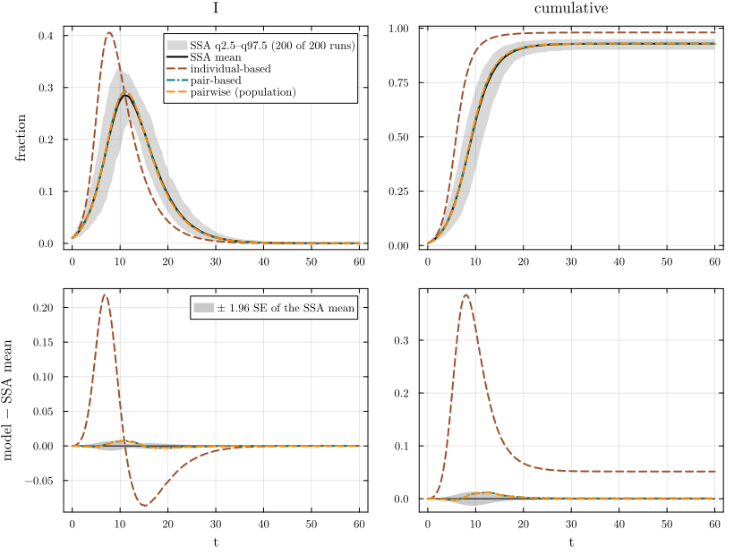
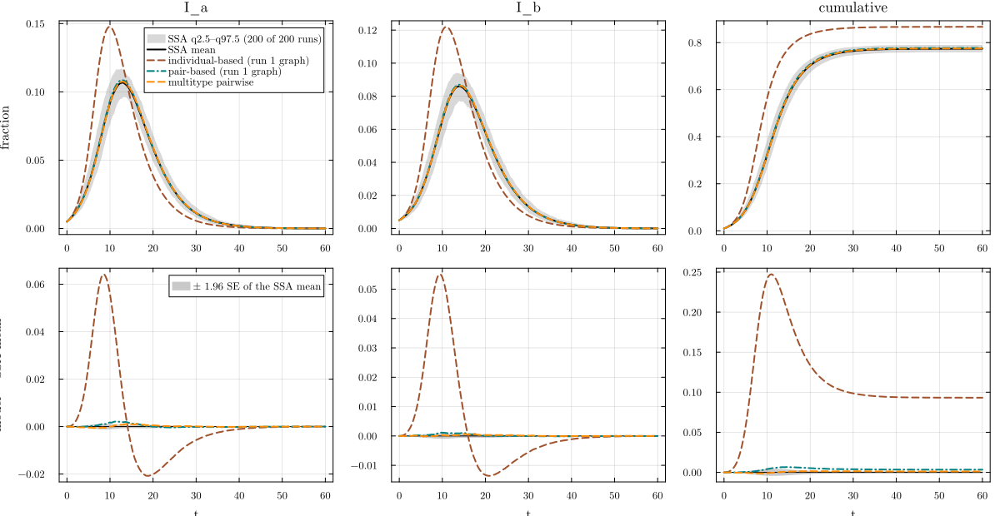

# Graph-level models: individual- and pair-based


- [One fixed graph: `:sir_reg6_fixed`](#one-fixed-graph-sir_reg6_fixed)
- [The equations](#the-equations)
- [Pair-based is exact on trees](#pair-based-is-exact-on-trees)
- [A typed instance: `:sir_sbm2`](#a-typed-instance-sir_sbm2)
- [References](#references)

The population-level pairwise models of N01–N03 describe a *random*
network by its degree distribution. The graph-level models of
NodeBasedModels describe one *given* graph instead ([Sharkey
2008](#ref-sharkey2008), [2011](#ref-sharkey2011); [Sharkey et al.
2015](#ref-sharkey2015)):

- the **individual-based** model (order 1, NIMFA) has one probability
  per node and compartment, ⟨S_i⟩, ⟨I_i⟩, and closes the pairs by
  independence, ⟨S_i I_j⟩ = ⟨S_i⟩⟨I_j⟩;
- the **pair-based** model (order 2) adds the probabilities of every
  edge’s pair states, ⟨S_i I_j⟩, ⟨S_i S_j⟩, and closes the triples with
  Kirkwood’s rule ⟨A_i B_j C_k⟩ = ⟨A_i B_j⟩⟨B_j C_k⟩/⟨B_j⟩ along a path
  i – j – k.

NetworkOutbreaks can return the exact graph of any run of a committed
ensemble (`scenario_graph(sc, r)`), so these models run on the same
graph as the simulation. The quenched scenario `:sir_reg6_fixed`
simulates all of its runs on one fixed 6-regular graph of N = 1000
nodes; `:sir_sbm2` draws a fresh typed graph per run, and we take the
graph of run 1 as an instance. The EdgeBasedModels page E10 treats
`:sir_sbm2` with the typed edge-based model; its first cell is the
shared cell further down.

``` julia
include(joinpath(@__DIR__, "..", "_shared", "setup.jl"))
require_summaries([:sir_reg6_fixed, :sir_sbm2])
using NetworkEpiCore, NetworkOutbreaks, Catalyst, Plots
using Graphs, SparseArrays, LinearAlgebra
using OrdinaryDiffEqDefault: ODEProblem, solve   # only these two: SciMLBase also exports an `EnsembleSummary`
# an SIR ModelCurves with the cumulative incidence 1 − S added (every node that left S was infected)
function with_cumulative(d::ModelCurves)
    vals = Dict{Symbol,Vector{Float64}}(k => copy(v) for (k, v) in d.values)
    S = sum(v for (k, v) in vals if startswith(string(k), "S"))
    vals[:cumulative] = 1 .- S
    ModelCurves(d.t, vals; label = d.label, representation = d.representation)
end
```

## One fixed graph: `:sir_reg6_fixed`

``` julia
sir = @reaction_network sir begin
    @parameters τ γ
    τ, S + I --> 2I
    γ, I --> R
end
model = contact_model(sir)
sc6  = scenario(:sir_reg6_fixed)
@assert isequivalent(model, sc6.model)
ref6 = scenario_summary(sc6)
g6   = scenario_graph(sc6)                # the one graph of every run of the ensemble
@printf("graph: %d nodes, %d edges, degrees %d–%d, %d triangles, %d connected component(s)\n", nv(g6), ne(g6),
        minimum(degree(g6)), maximum(degree(g6)), sum(triangles(g6)) ÷ 3, length(connected_components(g6)))
anchors(sc6);
describe_reference(ref6);
```

    graph: 1000 nodes, 3000 edges, degrees 6–6, 15 triangles, 1 connected component(s)
    :sir_reg6_fixed: γ = 0.25, τ = 0.166667; seeds I 0.01; t = 0:0.25:60; R₀ = 2; pairwise threshold τ_c = 0.0625, τ/τ_c = 2.66667 (canonical anchors)
    NetworkOutbreaks reference :sir_reg6_fixed (hash 6529c590): N = 1000 nodes, 200 runs on one fixed (quenched) graph for every run, algorithm :next_reaction; conditioning: major outbreaks only (cumulative incidence excluding seeds ≥ 0.05·N by t_end); 200 of 200 runs kept (major runs), P(major) = 1.000 (95% CI 0.981–1.000); no time alignment.

The low-level route lifts the Catalyst model with
`node_based(model, ExplicitGraph(g); level)`, which solves at once and
returns the result; the factories `generate_individual_based` and
`generate_pair_based` take the canned SIR model. Every node starts in I
with probability ρ = 0.01, the probability that a given node is one of
the ρN seeds that NetworkOutbreaks draws uniformly for each run.

``` julia
p6 = sc6.params
kw = (p = p6, tspan = sc6.tspan, initial = sc6.initial, saveat = step(sc6.tgrid))
ib6  = node_based(model, ExplicitGraph(g6); level = :individual, kw...)      # low level
ib6F = generate_individual_based(sir_model(), ExplicitGraph(g6); kw...)       # factory
pb6  = node_based(model, ExplicitGraph(g6); level = :pair, kw...)            # low level
pb6F = generate_pair_based(sir_model(), ExplicitGraph(g6); kw...)             # factory
dIB = maximum(maximum(abs.(aggregate(ib6, X) .- aggregate(ib6F, X))) for X in (:S, :I))
dPB = maximum(maximum(abs.(aggregate(pb6, X) .- aggregate(pb6F, X))) for X in (:S, :I))
@printf("max |low level − factory| over [S], [I]: individual-based %.1e, pair-based %.1e\n", dIB, dPB)
@assert dIB == 0 && dPB == 0
```

    max |low level − factory| over [S], [I]: individual-based 0.0e+00, pair-based 0.0e+00

The individual-based model has 2N = 2000 equations. The pair-based model
adds the states of both orientations of every edge, and the
population-level pairwise model of the same degree distribution (N01) is
the reference point without the graph:

``` julia
d_ib = with_cumulative(model_curves(ib6; t = sc6.tgrid, label = "individual-based"))
d_pb = with_cumulative(model_curves(pb6; t = sc6.tgrid, label = "pair-based"))
pw6  = node_based(sc6)
d_pw = model_curves(pw6, solve_epidemic(pw6, sc6); t = sc6.tgrid, label = "pairwise (population)")
tab6 = compare(ref6, d_ib, d_pb, d_pw)
```

    ComparisonTable :sir_reg6_fixed  (scenario 6529c590; conditioned mean of 200 runs)
      curve                  observable        D∞     t(D∞)       SE∞        z∞       ΔR∞  95% CI                 Δpeak   Δt_peak  coverage
      individual-based       S            0.38559      8.00   0.00680     69.01   0.05153  [ 0.04970,  0.05336]   0.00000      0.00     0.008
      individual-based       I            0.21815      6.75   0.00357     70.12   0.05153  [ 0.04970,  0.05336]   0.12099     -3.25     0.257
      individual-based       R            0.26811     11.00   0.00497     66.05   0.05153  [ 0.04970,  0.05336]   0.05155      4.50     0.021
      individual-based       infectious   0.21815      6.75   0.00357     70.12   0.05153  [ 0.04970,  0.05336]   0.12099     -3.25     0.257
      individual-based       cumulative   0.38559      8.00   0.00680     69.01   0.05153  [ 0.04970,  0.05336]   0.05153     11.50     0.008
      pair-based             S            0.01197     12.75   0.00680      2.69   0.00064  [-0.00120,  0.00247]   0.00000      0.00     0.859
      pair-based             I            0.00718     11.25   0.00357      3.90   0.00064  [-0.00120,  0.00247]   0.00682      0.00     0.876
      pair-based             R            0.00800     15.50   0.00497      2.41   0.00064  [-0.00120,  0.00247]   0.00065      4.50     0.863
      pair-based             infectious   0.00718     11.25   0.00357      3.90   0.00064  [-0.00120,  0.00247]   0.00682      0.00     0.876
      pair-based             cumulative   0.01197     12.75   0.00680      2.69   0.00064  [-0.00120,  0.00247]   0.00064     11.50     0.859
      pairwise (population)  S            0.01190     12.75   0.00680      2.66   0.00063  [-0.00120,  0.00247]   0.00000      0.00     0.863
      pairwise (population)  I            0.00724     11.25   0.00357      3.97   0.00063  [-0.00120,  0.00247]   0.00682      0.00     0.876
      pairwise (population)  R            0.00797     15.50   0.00497      2.39   0.00063  [-0.00120,  0.00247]   0.00065      4.50     0.867
      pairwise (population)  infectious   0.00724     11.25   0.00357      3.97   0.00063  [-0.00120,  0.00247]   0.00682      0.00     0.876
      pairwise (population)  cumulative   0.01190     12.75   0.00680      2.66   0.00063  [-0.00120,  0.00247]   0.00063     11.50     0.863

``` julia
distinct_styles!(comparisonplot(ref6, d_ib, d_pb, d_pw; observables = [:I, :cumulative]))
```

<div id="fig-fixed">



Figure 1: SIR on one fixed 6-regular graph of 1000 nodes
(:sir_reg6_fixed): individual-based, pair-based and population pairwise
models against the 200 simulations on that graph (top: spread band
q2.5–q97.5 of the runs and their mean; bottom: residual with the mean
band ±1.96 SE).

</div>

``` julia
for d in (d_ib, d_pb, d_pw)
    r = tab6[d.label, :I]; c = tab6[d.label, :cumulative]
    @printf("%-22s D∞(I) = %.4f (z∞ = %6.2f);  final size %.4f (ΔR∞ = %+.4f)\n", d.label, r.D∞, r.z∞,
            d[:cumulative][end], c.ΔR∞)
end
```

    individual-based       D∞(I) = 0.2181 (z∞ =  70.12);  final size 0.9804 (ΔR∞ = +0.0515)
    pair-based             D∞(I) = 0.0072 (z∞ =   3.90);  final size 0.9295 (ΔR∞ = +0.0006)
    pairwise (population)  D∞(I) = 0.0072 (z∞ =   3.97);  final size 0.9295 (ΔR∞ = +0.0006)

The individual-based model overshoots badly: its peak is too high and
too early and its final size too large. It lets an infected node be
re-infected by the neighbour it infected (the “echo” through the 2-cycle
i → j → i, which independence cannot exclude; Sharkey
([2011](#ref-sharkey2011))). The pair-based model removes that error by
keeping the edge states, and on this sparse graph it is as close to the
simulation as the population pairwise model. What remains (D∞ =
0.007179, z∞ = 3.9) is more than the Monte Carlo error. The population
pairwise model, which knows nothing of this graph or its 15 triangles,
has the same D∞ and z∞ (printed above), so the residual is not specific
to the graph’s cycles; it is a gap between the N = 1000 ensemble and the
models’ shared description, which this page does not decompose further.

## The equations

With adjacency matrix A, the individual-based SIR model is

$$\frac{d\langle S_i\rangle}{dt} = -\tau\langle S_i\rangle\sum_j A_{ij}\langle I_j\rangle, \qquad
\frac{d\langle I_i\rangle}{dt} = \tau\langle S_i\rangle\sum_j A_{ij}\langle I_j\rangle - \gamma\langle I_i\rangle,$$

and the pair-based model keeps ⟨S_i I_j⟩ and ⟨S_i S_j⟩ for every edge,

$$\begin{aligned}
\frac{d\langle S_i\rangle}{dt} &= -\tau\sum_j A_{ij}\langle S_i I_j\rangle,\\
\frac{d\langle S_i I_j\rangle}{dt} &= \tau\sum_{k\ne i}A_{jk}\langle S_i S_j I_k\rangle
  - \tau\sum_{k\ne j}A_{ik}\langle I_k S_i I_j\rangle - (\tau+\gamma)\langle S_i I_j\rangle,\\
\frac{d\langle S_i S_j\rangle}{dt} &= -\tau\sum_{k\ne j}A_{ik}\langle I_k S_i S_j\rangle
  - \tau\sum_{k\ne i}A_{jk}\langle S_i S_j I_k\rangle,
\end{aligned}$$

with the Kirkwood closure ⟨A_i B_j C_k⟩ = ⟨A_i B_j⟩⟨B_j C_k⟩/⟨B_j⟩. On a
tree every path i – j – k is the only route between i and k, so the
closure loses nothing and the pair-based model is exact for SIR
([Sharkey et al. 2015](#ref-sharkey2015)).

## Pair-based is exact on trees

“Exact” can be checked without any simulation on a graph small enough
for the full Kolmogorov (master) equation: an SIR process on n nodes has
3ⁿ states, and the marginal probabilities ⟨I_i⟩(t) follow from one
linear ODE. The function below builds the generator of the process and
solves it:

``` julia
function sir_master_marginals(g, τ, γ, seeds, tgrid)
    n = nv(g); ns = 3^n
    code(st) = 1 + sum(st[i] * 3^(i - 1) for i in 1:n)           # 0 = S, 1 = I, 2 = R
    decode!(st, c) = (for i in 1:n; st[i] = c % 3; c ÷= 3; end; st)
    rows = Int[]; cols = Int[]; vals = Float64[]; st = zeros(Int, n)
    for c in 0:ns-1
        decode!(st, c)
        for i in 1:n
            if st[i] == 0
                k = count(j -> st[j] == 1, neighbors(g, i))
                k > 0 && (st[i] = 1; push!(rows, c + 1); push!(cols, code(st)); push!(vals, τ * k); st[i] = 0)
            elseif st[i] == 1
                st[i] = 2; push!(rows, c + 1); push!(cols, code(st)); push!(vals, γ); st[i] = 1
            end
        end
    end
    Q = sparse(rows, cols, vals, ns, ns)
    QT = sparse(transpose(Q - spdiagm(vec(sum(Q; dims = 2)))))
    p0 = zeros(ns); s0 = zeros(Int, n); s0[seeds] .= 1; p0[code(s0)] = 1.0
    sol = solve(ODEProblem((du, u, _, _) -> mul!(du, QT, u), p0, (0.0, last(tgrid))); saveat = tgrid,
                reltol = 1e-10, abstol = 1e-12)
    marg = zeros(n, length(tgrid))                                 # P(node i in I at time t)
    for c in 0:ns-1
        decode!(st, c)
        for i in 1:n; st[i] == 1 && (marg[i, :] .+= getindex.(sol.u, c + 1)); end
    end
    marg
end
```

    sir_master_marginals (generic function with 1 method)

Three graphs on eight nodes, seeded at node 1: a random tree (a Prüfer
code), the cycle C₈, and a path with a triangle at one end. τ = 1/2 and
γ = 1/4 make the epidemic reach far enough for the differences to show.

``` julia
tgrid = 0:0.25:30
τ, γ = 0.5, 0.25
tri = SimpleGraph(8); for (a, b) in ((1, 2), (2, 3), (3, 1), (3, 4), (4, 5), (5, 6), (6, 7), (7, 8)); add_edge!(tri, a, b); end
graphs = [("tree (Prüfer code [3, 3, 4, 4, 5, 5])", prufer_decode([3, 3, 4, 4, 5, 5])),
          ("cycle C₈", cycle_graph(8)), ("path with a triangle", tri)]
function exactness_row(name, g)
    m = sir_master_marginals(g, τ, γ, [1], tgrid)
    kw = (p = Dict(:τ => τ, :γ => γ), initial_infected = [1], tspan = (0.0, last(tgrid)), saveat = step(tgrid),
          reltol = 1e-10, abstol = 1e-12)
    pb = generate_pair_based(sir_model(), ExplicitGraph(g); kw...)
    ib = generate_individual_based(sir_model(), ExplicitGraph(g); kw...)
    err(r) = maximum(abs(node_state(r, i, :I, k) - m[i, k]) for i in 1:nv(g), k in eachindex(tgrid))
    (name, ne(g), is_tree(g) ? "yes" : "no", err(pb), err(ib))
end
exact_rows = [exactness_row(n, g) for (n, g) in graphs]
md_table(["graph", "edges", "tree", "largest error of ⟨I_i⟩, pair-based", "largest error of ⟨I_i⟩, individual-based"],
         exact_rows; align = "lrlrr")
```

| graph | edges | tree | largest error of ⟨I_i⟩, pair-based | largest error of ⟨I_i⟩, individual-based |
|----|---:|----|---:|---:|
| tree (Prüfer code \[3, 3, 4, 4, 5, 5\]) | 7 | yes | 6.328e-14 | 0.3373 |
| cycle C₈ | 8 | no | 0.003128 | 0.2998 |
| path with a triangle | 8 | no | 0.0281 | 0.3327 |

On the tree the pair-based model reproduces the master equation to
6.3e-14, solver tolerance; the individual-based model is off by 0.34 on
the same tree. A single cycle (0.0031) or triangle (0.028) is enough to
make the pair-based model approximate.

## A typed instance: `:sir_sbm2`

The shared cell with E10 builds the stratified SIR model of a two-block
stochastic block model. On the graph of one run the block labels only
say which nodes are of type a or b: every edge transmits at the same τ,
so the stratified process on that graph is plain SIR on the graph. The
scenario seeds 0.5% of all N nodes in each of I_a and I_b, and each
block holds half of the nodes, so every node starts in I with
probability 0.01, as in the graph-level models below (the §J.6 seeding
convention).

``` julia
include(joinpath(@__DIR__, "..", "_shared", "setup.jl"))
using Statistics
using NetworkEpiCore, NetworkOutbreaks, Catalyst, Plots
sir = @reaction_network sir begin
    @parameters τ γ
    τ, S + I --> 2I        # contact: per-contact (per-edge) rate τ; S converted, I unchanged
    γ, I --> R             # node-local transition
end
model = contact_model(sir)          # prints the typing report
st    = strata([:a, :b]; sizes = [0.5, 0.5])
model_ab = stratify(model, st)      # S_a + I_b → I_a + I_b, I_a → R_a, …
sc    = scenario(:sir_sbm2)         # Poisson SBM, mean contacts [6 2; 2 4], τ calibrated to R₀ = 2
@assert isequivalent(model_ab, sc.model)
ref   = scenario_summary(sc)        # committed typed NetworkOutbreaks ensemble
# --- NBM vignette ---------------------------------------------------------------
using NodeBasedModels, Graphs
g     = scenario_graph(sc, 1)       # the typed contact graph of run 1 of the ensemble
p     = Dict(:τ => sc.params[:τ], :γ => sc.params[:γ])
ib    = generate_individual_based(sir_model(), ExplicitGraph(g); p, initial = SeedFraction(:I => 0.01),
                                  tspan = sc.tspan, saveat = step(sc.tgrid))
pb    = generate_pair_based(sir_model(), ExplicitGraph(g); p, initial = SeedFraction(:I => 0.01),
                            tspan = sc.tspan, saveat = step(sc.tgrid))
mt    = node_based(sc)             # population-level multitype pairwise model (N14)
```

    MultitypePairwiseSystem(sir_strat; level = :population, 2 types, 6 singles, 21 pairs, closure = BernoulliClosure())

The multitype pairwise model `mt` above is the scenario form. The same
system twice more, from the stratified Catalyst network of the shared
cell (low level) and from the `sir_model()` factory stratified the same
way:

``` julia
kw     = (; p = sc.params, initial = sc.initial, tspan = sc.tspan)
mt_low = node_based(model_ab, sc.network; kw...)                          # Catalyst → contact_model → stratify
mt_fac = node_based(stratify(sir_model(), st), sc.network; kw...)         # factory → stratify
eq_low = vector_fields_equal(symbolic_ode(mt_low), symbolic_ode(mt))
eq_fac = vector_fields_equal(symbolic_ode(mt_fac), symbolic_ode(mt))
@assert eq_low && eq_fac
@printf("multitype pairwise, %d states: low level ≡ scenario form: %s;  factory ≡ scenario form: %s\n",
        length(state_names(symbolic_ode(mt))), eq_low, eq_fac)
```

    multitype pairwise, 27 states: low level ≡ scenario form: true;  factory ≡ scenario form: true

``` julia
@printf("instance: %d nodes (%d of type a, %d of type b), %d edges, %d triangles;  mean degree %.3f (descriptor %.3f)\n",
        nv(g), length(nodes_of_type(g, :a)), length(nodes_of_type(g, :b)), ne(g), sum(triangles(g)) ÷ 3,
        2ne(g) / nv(g), sc.expected[:mean_degree])
@printf("seeds: %s of all nodes, within-type fraction %.3f in each block\n",
        join(("$(X) $(ρ)" for (X, ρ) in sc.initial.fractions), ", "), 0.005 / 0.5)
anchors(sc);
describe_reference(ref);
```

    instance: 10000 nodes (5000 of type a, 5000 of type b), 35163 edges, 72 triangles;  mean degree 7.033 (descriptor 7.000)
    seeds: I_a 0.005, I_b 0.005 of all nodes, within-type fraction 0.010 in each block
    :sir_sbm2: γ = 0.25, τ = 0.0954915; seeds I_a 0.005, I_b 0.005; t = 0:0.25:60; R₀ = 2; no NodeBasedModels pairwise threshold for a MultitypeNetwork (differs from the canonical anchors: τ ≠ 1/6)
    NetworkOutbreaks reference :sir_sbm2 (hash f8e96436): N = 10000 nodes, 200 runs on a fresh graph per run, algorithm :next_reaction; conditioning: major outbreaks only (cumulative incidence excluding seeds ≥ 0.05·N by t_end); 200 of 200 runs kept (major runs), P(major) = 1.000 (95% CI 0.981–1.000); no time alignment.

The graph-level results are probabilities per node; summing them over
the nodes of each type gives the typed observables of the ensemble
(fractions of all N nodes):

``` julia
function typed_curves(r, label, representation)
    N = nv(g); vals = Dict{Symbol,Vector{Float64}}()
    for a in (:a, :b), X in (:S, :I, :R)
        nodes = nodes_of_type(g, a)
        vals[Symbol(X, :_, a)] = [sum(node_state(r, i, X, k) for i in nodes) / N for k in eachindex(r.sol.t)]
    end
    vals[:infectious] = vals[:I_a] .+ vals[:I_b]
    vals[:cumulative] = 1 .- vals[:S_a] .- vals[:S_b]
    ModelCurves(collect(r.sol.t), vals; label, representation)
end
d_ibT = typed_curves(ib, "individual-based (run 1 graph)", :individual)
d_pbT = typed_curves(pb, "pair-based (run 1 graph)", :pair)
d_mt  = model_curves(mt, solve_epidemic(mt, sc); t = sc.tgrid, label = "multitype pairwise")
tabT  = compare(ref, d_ibT, d_pbT, d_mt)
```

    ComparisonTable :sir_sbm2  (scenario f8e96436; conditioned mean of 200 runs)
      curve                           observable        D∞     t(D∞)       SE∞        z∞       ΔR∞  95% CI                 Δpeak   Δt_peak  coverage
      individual-based (run 1 graph)  S_a          0.13077     10.50   0.00126    131.94   0.09322  [ 0.09202,  0.09442]  -0.00000      0.00     0.012
      individual-based (run 1 graph)  S_b          0.11901     11.75   0.00105    130.42   0.09322  [ 0.09202,  0.09442]  -0.00000      0.00     0.017
      individual-based (run 1 graph)  I_a          0.06421      8.50   0.00060    108.83   0.09322  [ 0.09202,  0.09442]   0.04094     -2.75     0.199
      individual-based (run 1 graph)  I_b          0.05509      9.50   0.00048    121.38   0.09322  [ 0.09202,  0.09442]   0.03592     -3.00     0.207
      individual-based (run 1 graph)  R_a          0.10188     14.25   0.00099    133.24   0.09322  [ 0.09202,  0.09442]   0.03846      0.00     0.029
      individual-based (run 1 graph)  R_b          0.09779     15.75   0.00087    131.76   0.09322  [ 0.09202,  0.09442]   0.05481      0.00     0.033
      individual-based (run 1 graph)  infectious   0.11768      9.00   0.00100    118.12   0.09322  [ 0.09202,  0.09442]   0.07607     -3.00     0.141
      individual-based (run 1 graph)  cumulative   0.24734     11.00   0.00223    153.59   0.09322  [ 0.09202,  0.09442]   0.09322      0.00     0.008
      pair-based (run 1 graph)        S_a          0.00423     13.50   0.00126      7.01   0.00337  [ 0.00217,  0.00457]  -0.00000      0.00     0.162
      pair-based (run 1 graph)        S_b          0.00248     15.50   0.00105      3.91   0.00337  [ 0.00217,  0.00457]  -0.00000      0.00     0.207
      pair-based (run 1 graph)        I_a          0.00212     11.75   0.00060      5.74   0.00337  [ 0.00217,  0.00457]   0.00192      0.00     0.834
      pair-based (run 1 graph)        I_b          0.00116      9.75   0.00048      3.63   0.00337  [ 0.00217,  0.00457]   0.00087      0.00     0.863
      pair-based (run 1 graph)        R_a          0.00337     18.75   0.00099      7.13   0.00337  [ 0.00217,  0.00457]   0.00192      0.00     0.203
      pair-based (run 1 graph)        R_b          0.00200     19.50   0.00087      3.87   0.00337  [ 0.00217,  0.00457]   0.00146      0.00     0.286
      pair-based (run 1 graph)        infectious   0.00310     11.75   0.00100      5.01   0.00337  [ 0.00217,  0.00457]   0.00276      0.00     0.768
      pair-based (run 1 graph)        cumulative   0.00664     14.50   0.00223      6.01   0.00337  [ 0.00217,  0.00457]   0.00337      0.00     0.170
      multitype pairwise              S_a          0.00120      9.00   0.00126      1.93   0.00112  [-0.00008,  0.00232]   0.00000      0.00     1.000
      multitype pairwise              S_b          0.00090     31.25   0.00105      2.03   0.00112  [-0.00008,  0.00232]   0.00000      0.00     0.971
      multitype pairwise              I_a          0.00113     16.50   0.00060      3.31   0.00112  [-0.00008,  0.00232]   0.00078      0.25     0.905
      multitype pairwise              I_b          0.00070     15.00   0.00048      2.38   0.00112  [-0.00008,  0.00232]   0.00033      0.00     0.971
      multitype pairwise              R_a          0.00090     11.75   0.00099      1.77   0.00112  [-0.00008,  0.00232]   0.00041      0.00     1.000
      multitype pairwise              R_b          0.00086     37.50   0.00087      1.99   0.00112  [-0.00008,  0.00232]   0.00072      0.00     0.975
      multitype pairwise              infectious   0.00172     15.00   0.00100      3.30   0.00112  [-0.00008,  0.00232]   0.00112      0.25     0.917
      multitype pairwise              cumulative   0.00147     19.25   0.00223      2.21   0.00112  [-0.00008,  0.00232]   0.00112      0.00     0.846

``` julia
distinct_styles!(comparisonplot(ref, d_ibT, d_pbT, d_mt; observables = [:I_a, :I_b, :cumulative]))
```

<div id="fig-sbm">



Figure 2: Stratified SIR on the two-block SBM (:sir_sbm2): graph-level
models on the graph of run 1 and the population-level multitype pairwise
model against the typed ensemble (a fresh graph per run; bands as
above).

</div>

``` julia
for d in (d_ibT, d_pbT, d_mt)
    @printf("%-32s D∞(I_a) = %.4f, D∞(I_b) = %.4f, D∞(cumulative) = %.4f;  final size %.4f (ΔR∞ = %+.4f)\n",
            d.label, tabT[d.label, :I_a].D∞, tabT[d.label, :I_b].D∞, tabT[d.label, :cumulative].D∞,
            d[:cumulative][end], tabT[d.label, :cumulative].ΔR∞)
end
@printf("registry final size (typed edge-based fixed point): %.4f\n", sc.expected[:final_size])
```

    individual-based (run 1 graph)   D∞(I_a) = 0.0642, D∞(I_b) = 0.0551, D∞(cumulative) = 0.2473;  final size 0.8670 (ΔR∞ = +0.0932)
    pair-based (run 1 graph)         D∞(I_a) = 0.0021, D∞(I_b) = 0.0012, D∞(cumulative) = 0.0066;  final size 0.7772 (ΔR∞ = +0.0034)
    multitype pairwise               D∞(I_a) = 0.0011, D∞(I_b) = 0.0007, D∞(cumulative) = 0.0015;  final size 0.7749 (ΔR∞ = +0.0011)
    registry final size (typed edge-based fixed point): 0.7749

On the graph of run 1 the pair-based model is within D∞(I_a) = 0.002124
of the ensemble mean over fresh graphs, and its final size is off by
0.0034 (that instance has mean degree 7.033 against the descriptor’s 7).
The graph has few triangles (printed above), and the pair-based model on
it is close to the ensemble, though not within Monte Carlo error: its
largest z∞ over the typed observables is 7.1. The individual-based model
makes the same echo error as on the regular graph. The population-level
multitype pairwise model (N14) needs no graph at all and is closer still
to the ensemble mean (the table above).

## References

<div id="refs" class="references csl-bib-body hanging-indent">

<div id="ref-sharkey2008" class="csl-entry">

Sharkey, Kieran J. 2008. “Deterministic Epidemiological Models at the
Individual Level.” *Journal of Mathematical Biology* 57 (3): 311–31.
<https://doi.org/10.1007/s00285-008-0161-7>.

</div>

<div id="ref-sharkey2011" class="csl-entry">

Sharkey, Kieran J. 2011. “Deterministic Epidemic Models on Contact
Networks: Correlations and Unbiological Terms.” *Theoretical Population
Biology* 79 (4): 115–29. <https://doi.org/10.1016/j.tpb.2011.01.004>.

</div>

<div id="ref-sharkey2015" class="csl-entry">

Sharkey, Kieran J., István Z. Kiss, Robert R. Wilkinson, and Péter L.
Simon. 2015. “Exact Equations for SIR Epidemics on Tree Graphs.”
*Bulletin of Mathematical Biology* 77 (4): 614–45.
<https://doi.org/10.1007/s11538-013-9923-5>.

</div>

</div>
