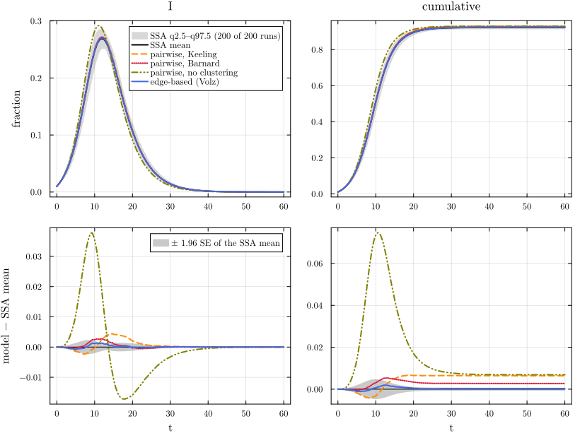
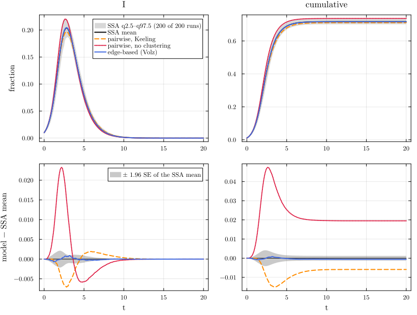
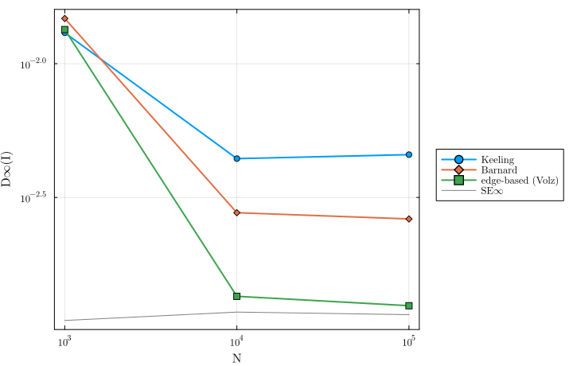

# Clustering


- [Low level and factory](#low-level-and-factory)
- [The closures](#the-closures)
- [Against simulation: triangles versus
  none](#against-simulation-triangles-versus-none)
- [Poisson singles and triangles](#poisson-singles-and-triangles)
- [N-scaling: which errors are closure
  errors](#n-scaling-which-errors-are-closure-errors)
- [References](#references)

Triangles make the neighbours of a node more likely to be neighbours of
each other. In a pairwise model that changes the triples: the closure
\[A B C\] = K\[AB\]\[BC\]/\[B\] treats the two ends of a path A – B – C
as independent, which they are not when A and C are also joined.
Keeling’s closure ([Keeling 1999](#ref-keeling1999)) mixes the open-path
value with a closed-triangle correction weighted by the clustering
coefficient ϕ; Barnard’s improved closure ([Barnard et al.
2019](#ref-barnard2019)) changes the triangle term so that it conserves
pairs. Both are approximations. For the Newman–Miller random clustered
networks ([Newman 2009](#ref-newman2009); [Miller
2009](#ref-miller2009)), where each node has s single edges and t
triangles, the edge-based model of Volz et al. ([2011](#ref-volz2011))
is exact in the large-N limit, so this page can separate the closure
error from the Monte Carlo error. The EdgeBasedModels page E08 treats
the same scenarios from the edge-based side; the first cell is shared
with it.

``` julia
include(joinpath(@__DIR__, "..", "_shared", "setup.jl"))
require_summaries([:sir_clust_s2t2, :sir_reg6, :sir_clust_pois12, :sir_clust_s2t2_N1000, :sir_clust_s2t2_N100000])   # back end
using NetworkEpiCore, NetworkOutbreaks, Catalyst, Plots
using EdgeBasedModels, NodeBasedModels
using Statistics
sir = @reaction_network sir begin
    @parameters τ γ
    τ, S + I --> 2I
    γ, I --> R
end
model = contact_model(sir)
sc  = scenario(:sir_clust_s2t2)       # s = 2 single edges and t = 2 triangles per node: degree 6
sc6 = scenario(:sir_reg6)             # the same degree, no triangles
@assert isequivalent(model, sc.model) && isequivalent(model, sc6.model)
sc.network
```

    ClusteredNetwork{Tuple{RegularDegree, RegularDegree}}(ClusteredDegree{Tuple{RegularDegree, RegularDegree}}((RegularDegree(2), RegularDegree(2))))

`:sir_clust_s2t2` gives every node s = 2 single edges and t = 2
triangles, so every node has degree 6, like the 6-regular network of
`:sir_reg6`, with the same τ = 1/6 and γ = 1/4. The only difference
between the two scenarios is the triangles. The descriptor’s clustering
coefficient and the realised statistics of the simulated graphs (means
over the runs):

``` julia
ref  = scenario_summary(sc)
ref6 = scenario_summary(sc6)
statrow(s, r) = (string("`:", s.id, "`"), mean_degree(s.network),
    s.network isa ClusteredNetwork ? clustering_coefficient(s.network) : 0.0,
    s.network isa ClusteredNetwork ? triangle_edge_fraction(s.network) : 0.0,
    mean(r.realised[:mean_degree]), mean(r.realised[:clustering]))
md_table(["scenario", "⟨k⟩", "ϕ = C (descriptor)", "fraction of edges in triangles", "⟨k⟩ realised",
          "C realised"], [statrow(sc, ref), statrow(sc6, ref6)])
```

| scenario | ⟨k⟩ | ϕ = C (descriptor) | fraction of edges in triangles | ⟨k⟩ realised | C realised |
|----|---:|---:|---:|---:|---:|
| `:sir_clust_s2t2` | 6 | 0.1333 | 0.6667 | 5.998 | 0.1336 |
| `:sir_reg6` | 6 | 0 | 0 | 6 | 0.000412 |

## Low level and factory

`default_closure` of a `ClusteredNetwork` is `KeelingClosure()`, with ϕ
read from the descriptor. The low-level lift of the Catalyst model and
the factory `generate_pairwise(sir_model(), net, KeelingClosure())` are
the same vector field, and so are the two Barnard systems:

``` julia
sysK   = node_based(model, sc.network)                                                        # low level, Keeling
sysKF  = generate_pairwise(sir_model(), sc.network, KeelingClosure(); cumulative = true)      # factory
@assert vector_fields_equal(symbolic_ode(sysK), symbolic_ode(sysKF))
sysB   = node_based(model, sc.network; closure = BarnardClosure())
sysBF  = generate_pairwise(sir_model(), sc.network, BarnardClosure(); cumulative = true)
@assert vector_fields_equal(symbolic_ode(sysB), symbolic_ode(sysBF))
@printf("default_closure: %s;  ϕ = clustering_coefficient = %.6f (= 2/15: %s)\n", default_closure(sc.network),
        clustering_coefficient(sc.network), clustering_coefficient(sc.network) ≈ 2 / 15)
```

    default_closure: NodeBasedModels.KeelingClosure();  ϕ = clustering_coefficient = 0.133333 (= 2/15: true)

## The closures

On a network where every node has n neighbours, Keeling’s closure is

$$[A\,B\,C] = \frac{n-1}{n}\,\frac{[AB][BC]}{[B]}\left((1-\phi) + \phi\,\frac{N\,[AC]}{n\,[A]\,[C]}\right),$$

with N = Σ_X \[X\] taken from the state. The first term is the open
path, the second a triangle closed by the pair \[AC\]. For SIR the
triple \[S S I\] now involves \[SI\], and \[I S I\] involves \[II\]: the
pairs that the triangle closes. In the symbolic field the correction
appears as the second fraction inside each closed triple:

``` julia
sodeK = symbolic_ode(sysK)
for n in (:SS, :SI)
    i = findfirst(==(n), state_names(sodeK)); println("d", n, "/dt = ", sodeK.rhs[i])
end
```

    dSS/dt = -1.6666666666666667(0.8666666666666667 + 0.13333333333333333ifelse((6I(t)*S(t)) == 0, 0, ((I(t) + R(t) + S(t))*SI(t)) / (6I(t)*S(t))))*ifelse(S(t) == 0, 0, (SI(t)*SS(t)) / S(t))*τ
    dSI/dt = -SI(t)*γ - SI(t)*τ + 0.8333333333333334(0.8666666666666667 + 0.13333333333333333ifelse((6I(t)*S(t)) == 0, 0, ((I(t) + R(t) + S(t))*SI(t)) / (6I(t)*S(t))))*ifelse(S(t) == 0, 0, (SI(t)*SS(t)) / S(t))*τ - 0.8333333333333334(0.8666666666666667 + 0.13333333333333333ifelse((6(I(t)^2)) == 0, 0, ((I(t) + R(t) + S(t))*II(t)) / (6(I(t)^2))))*ifelse(S(t) == 0, 0, (SI(t)^2) / S(t))*τ

Barnard’s closure ([Barnard et al. 2019](#ref-barnard2019); [Barnard
2018](#ref-barnard2018thesis)) replaces the triangle factor by
\[AB\]\[BC\]\[CA\]/(\[A\]·Σ_a \[aB\]\[aC\]/\[a\]), which conserves the
number of pairs in the triangle term.

## Against simulation: triangles versus none

``` julia
anchors(sc);
describe_reference(ref);
anchors(sc6);
describe_reference(ref6);
```

    :sir_clust_s2t2: γ = 0.25, τ = 0.166667; seeds I 0.01; t = 0:0.25:60; R₀ not computed by NetworkEpiCore for this network descriptor; pairwise threshold τ_c = 0.0681568, τ/τ_c = 2.44534 (differs from the canonical anchors: R₀ not computed)
    NetworkOutbreaks reference :sir_clust_s2t2 (hash b86d7ecb): N = 10000 nodes, 200 runs on a fresh graph per run, algorithm :next_reaction; conditioning: major outbreaks only (cumulative incidence excluding seeds ≥ 0.05·N by t_end); 200 of 200 runs kept (major runs), P(major) = 1.000 (95% CI 0.981–1.000); no time alignment.
    :sir_reg6: γ = 0.25, τ = 0.166667; seeds I 0.01; t = 0:0.25:60; R₀ = 2; pairwise threshold τ_c = 0.0625, τ/τ_c = 2.66667 (canonical anchors)
    NetworkOutbreaks reference :sir_reg6 (hash e5443b54): N = 10000 nodes, 200 runs on a fresh graph per run, algorithm :next_reaction; conditioning: major outbreaks only (cumulative incidence excluding seeds ≥ 0.05·N by t_end); 200 of 200 runs kept (major runs), P(major) = 1.000 (95% CI 0.981–1.000); no time alignment.

Four models on the clustered network: Keeling’s and Barnard’s closures,
the unclustered constant-K closure (which sees only the degree 6), and
the Volz edge-based model; and the pairwise model on the 6-regular
network without triangles:

``` julia
curves_of(sys, s, label) = model_curves(sys, solve_epidemic(sys, s); t = s.tgrid, label)
dK  = curves_of(sysK, sc, "pairwise, Keeling")
dB  = curves_of(sysB, sc, "pairwise, Barnard")
d0  = curves_of(node_based(model, sc.network; closure = BernoulliClosure()), sc, "pairwise, no clustering")
dV  = curves_of(edge_based(model, sc.network), sc, "edge-based (Volz)")
d6  = curves_of(node_based(model, sc6.network), sc6, "pairwise")
tab  = compare(ref, dK, dB, d0, dV)
tab6 = compare(ref6, d6)
nothing
```

``` julia
distinct_styles!(comparisonplot(ref, dK, dB, d0, dV; observables = [:I, :cumulative]))
```

<div id="fig-clust">



Figure 1: SIR on the clustered network :sir_clust_s2t2 (s = 2, t = 2):
Keeling, Barnard and unclustered pairwise closures and the Volz
edge-based model against the NetworkOutbreaks ensemble (top: spread band
q2.5–q97.5 of the runs and their mean; bottom: residual with the mean
band ±1.96 SE).

</div>

``` julia
row(t, s, d) = (string("`:", s.id, "`"), d.label, t[d.label, :I].D∞, t[d.label, :I].z∞, d[:cumulative][end],
                t[d.label, :cumulative].ΔR∞, @sprintf("[%+.4f, %+.4f]", t[d.label, :cumulative].ΔR∞_ci...))
md_table(["scenario", "model", "D∞(I)", "z∞(I)", "R(t_end)", "ΔR∞", "95% CI of ΔR∞"],
         vcat([row(tab, sc, d) for d in (dK, dB, d0, dV)], [row(tab6, sc6, d6)]))
```

| scenario | model | D∞(I) | z∞(I) | R(t_end) | ΔR∞ | 95% CI of ΔR∞ |
|----|----|---:|---:|---:|---:|----|
| `:sir_clust_s2t2` | pairwise, Keeling | 0.004417 | 7.354 | 0.9291 | 0.006426 | \[+0.0057, +0.0071\] |
| `:sir_clust_s2t2` | pairwise, Barnard | 0.002772 | 4.448 | 0.9253 | 0.002708 | \[+0.0020, +0.0034\] |
| `:sir_clust_s2t2` | pairwise, no clustering | 0.03781 | 34.74 | 0.9295 | 0.00688 | \[+0.0062, +0.0076\] |
| `:sir_clust_s2t2` | edge-based (Volz) | 0.00135 | 2.051 | 0.9229 | 0.0002972 | \[-0.0004, +0.0010\] |
| `:sir_reg6` | pairwise | 0.001709 | 2.736 | 0.9295 | 0.0002649 | \[-0.0003, +0.0008\] |

``` julia
@printf("final size: 6-regular %.4f, clustered (ensemble) %.4f;  triangles lower it by %.4f\n",
        d6[:cumulative][end], mean(ref.final_size[ref.major]), d6[:cumulative][end] - mean(ref.final_size[ref.major]))
```

    final size: 6-regular 0.9295, clustered (ensemble) 0.9226;  triangles lower it by 0.0069

The triangles lower the final size at the same degree. Ignoring them
(the unclustered closure) gives the 6-regular epidemic, far outside the
ensemble. For the prevalence curve Keeling’s and Barnard’s closures
remove most of that error, but not all of it. The z∞ column is
NetworkEpiCore’s largest standardised gap, max_t \|x_det(t) − x̄(t)\| /
max(se(t), 10⁻⁴) over the grid (not D∞ divided by a standard error, and
not necessarily at t(D∞)): it is 7.35 for Keeling’s closure and 4.45 for
Barnard’s, against 2.05 for the Volz edge-based model and 34.7 for the
unclustered closure. For the final size the picture differs: Keeling’s
closure leaves almost all of the final-size error of the unclustered
closure, and Barnard’s closure about 40% of it:

``` julia
e0 = tab[d0.label, :cumulative].ΔR∞
@printf("ΔR∞: unclustered %+.4f;  Keeling %+.4f (%.0f%% of it);  Barnard %+.4f (%.0f%%);  Volz %+.4f\n", e0,
        tab[dK.label, :cumulative].ΔR∞, 100 * tab[dK.label, :cumulative].ΔR∞ / e0, tab[dB.label, :cumulative].ΔR∞,
        100 * tab[dB.label, :cumulative].ΔR∞ / e0, tab[dV.label, :cumulative].ΔR∞)
```

    ΔR∞: unclustered +0.0069;  Keeling +0.0064 (93% of it);  Barnard +0.0027 (39%);  Volz +0.0003

## Poisson singles and triangles

`:sir_clust_pois12` draws the numbers of single edges and triangles from
Poisson(1) and Poisson(2) (mean degree 5), with τ = 0.6 and γ = 1.
Barnard’s closure is only implemented for networks with one degree, so
here the comparison is Keeling’s heterogeneous closure against the
unclustered one and the Volz model:

``` julia
sc12  = scenario(:sir_clust_pois12)
@assert isequivalent(model, sc12.model)
ref12 = scenario_summary(sc12)
anchors(sc12);
describe_reference(ref12);
sys12  = node_based(model, sc12.network)
sys12F = generate_pairwise(sir_model(), sc12.network, KeelingClosure(); cumulative = true)
@assert vector_fields_equal(symbolic_ode(sys12), symbolic_ode(sys12F))
println(try node_based(model, sc12.network; closure = BarnardClosure()); "built" catch e; sprint(showerror, e) end)
dK12 = curves_of(sys12, sc12, "pairwise, Keeling")
d012 = curves_of(node_based(model, sc12.network; closure = BernoulliClosure()), sc12, "pairwise, no clustering")
dV12 = curves_of(edge_based(model, sc12.network), sc12, "edge-based (Volz)")
tab12 = compare(ref12, dK12, d012, dV12)
nothing
```

    :sir_clust_pois12: γ = 1, τ = 0.6; seeds I 0.01; t = 0:0.1:20; R₀ not computed by NetworkEpiCore for this network descriptor; pairwise threshold τ_c = 0.219366, τ/τ_c = 2.73515 (differs from the canonical anchors: R₀ not computed, γ ≠ 1/4, τ ≠ 1/6)
    NetworkOutbreaks reference :sir_clust_pois12 (hash 812dc981): N = 10000 nodes, 200 runs on a fresh graph per run, algorithm :next_reaction; conditioning: major outbreaks only (cumulative incidence excluding seeds ≥ 0.05·N by t_end); 200 of 200 runs kept (major runs), P(major) = 1.000 (95% CI 0.981–1.000); no time alignment.
    ArgumentError: Only BernoulliClosure and KeelingClosure are implemented for HeterogeneousNetwork.

``` julia
distinct_styles!(comparisonplot(ref12, dK12, d012, dV12; observables = [:I, :cumulative]))
```

<div id="fig-clust12">



Figure 2: As above, on :sir_clust_pois12 (Poisson(1) single edges,
Poisson(2) triangles).

</div>

``` julia
md_table(["scenario", "model", "D∞(I)", "z∞(I)", "R(t_end)", "ΔR∞", "95% CI of ΔR∞"],
         [row(tab12, sc12, d) for d in (dK12, d012, dV12)])
```

| scenario | model | D∞(I) | z∞(I) | R(t_end) | ΔR∞ | 95% CI of ΔR∞ |
|----|----|---:|---:|---:|---:|----|
| `:sir_clust_pois12` | pairwise, Keeling | 0.007087 | 12.89 | 0.7114 | -0.005881 | \[-0.0071, -0.0047\] |
| `:sir_clust_pois12` | pairwise, no clustering | 0.02324 | 26.19 | 0.7368 | 0.01951 | \[+0.0183, +0.0207\] |
| `:sir_clust_pois12` | edge-based (Volz) | 0.0009005 | 1.766 | 0.7167 | -0.000596 | \[-0.0018, +0.0006\] |

## N-scaling: which errors are closure errors

The clustered scenario is also simulated at N = 10³ (2000 runs) and N =
10⁵ (20 runs). The deterministic curves do not depend on N; the error of
an exact-in-the-limit model shrinks towards the Monte Carlo floor as N
grows, while a closure error stays.

``` julia
scal = []
for id in (:sir_clust_s2t2_N1000, :sir_clust_s2t2, :sir_clust_s2t2_N100000)
    r = id === :sir_clust_s2t2 ? ref : scenario_summary(scenario(id))
    t = compare(r, dK, dB, dV)
    push!(scal, (string("`:", id, "`"), r.N, r.nsims, t[dK.label, :I].D∞, t[dB.label, :I].D∞, t[dV.label, :I].D∞,
                 t[dV.label, :I].SE∞))
end
md_table(["scenario", "N", "runs", "D∞(I), Keeling", "D∞(I), Barnard", "D∞(I), Volz EB", "SE∞(I)"], scal)
```

| scenario | N | runs | D∞(I), Keeling | D∞(I), Barnard | D∞(I), Volz EB | SE∞(I) |
|----|---:|---:|---:|---:|---:|---:|
| `:sir_clust_s2t2_N1000` | 1000 | 2000 | 0.01305 | 0.01476 | 0.01341 | 0.001097 |
| `:sir_clust_s2t2` | 10000 | 200 | 0.004417 | 0.002772 | 0.00135 | 0.001179 |
| `:sir_clust_s2t2_N100000` | 100000 | 20 | 0.004571 | 0.002628 | 0.001245 | 0.001153 |

``` julia
Ns = [s[2] for s in scal]
plt = plot(; xscale = :log10, yscale = :log10, xlabel = "N", ylabel = "D∞(I)", legend = :outerright)
plot!(plt, Ns, [s[4] for s in scal]; marker = :circle, label = "Keeling")
plot!(plt, Ns, [s[5] for s in scal]; marker = :diamond, label = "Barnard")
plot!(plt, Ns, [s[6] for s in scal]; marker = :square, label = "edge-based (Volz)")
plot!(plt, Ns, [s[7] for s in scal]; color = :grey, lw = 1, label = "SE∞")
plt
```

<div id="fig-clust-scaling">



Figure 3: D∞(I) against N on the clustered network: Keeling and Barnard
closures and the Volz edge-based model; the grey line is SE∞(I), the
Monte Carlo floor.

</div>

``` julia
@printf("from N = 10⁴ to 10⁵: Keeling %.4f → %.4f, Barnard %.4f → %.4f, Volz EB %.4f → %.4f\n",
        scal[2][4], scal[3][4], scal[2][5], scal[3][5], scal[2][6], scal[3][6])
```

    from N = 10⁴ to 10⁵: Keeling 0.0044 → 0.0046, Barnard 0.0028 → 0.0026, Volz EB 0.0014 → 0.0012

From N = 10⁴ to 10⁵ the clustered closures keep their error, while the
Volz model’s error stays comparable to SE∞, the Monte Carlo floor (table
above): the remaining Keeling and Barnard errors are closure errors, not
finite-size effects.

## References

<div id="refs" class="references csl-bib-body hanging-indent">

<div id="ref-barnard2019" class="csl-entry">

Barnard, Rosanna C., Luc Berthouze, Péter L. Simon, and István Z. Kiss.
2019. “Epidemic Threshold in Pairwise Models for Clustered Networks:
Closures and Fast Correlations.” *Journal of Mathematical Biology* 79
(3): 823–60. <https://doi.org/10.1007/s00285-019-01380-1>.

</div>

<div id="ref-barnard2018thesis" class="csl-entry">

Barnard, Rosanna Claire. 2018. “Modelling and Analysing Neuronal and
Epidemiological Dynamics on Structured Static and Dynamic Networks.” PhD
thesis, University of Sussex.

</div>

<div id="ref-keeling1999" class="csl-entry">

Keeling, Matt J. 1999. “The Effects of Local Spatial Structure on
Epidemiological Invasions.” *Proceedings of the Royal Society of London.
Series B* 266 (1421): 859–67. <https://doi.org/10.1098/rspb.1999.0716>.

</div>

<div id="ref-miller2009" class="csl-entry">

Miller, Joel C. 2009. “Percolation and Epidemics in Random Clustered
Networks.” *Physical Review E* 80 (2): 020901.
<https://doi.org/10.1103/PhysRevE.80.020901>.

</div>

<div id="ref-newman2009" class="csl-entry">

Newman, M. E. J. 2009. “Random Graphs with Clustering.” *Physical Review
Letters* 103 (5): 058701.
<https://doi.org/10.1103/PhysRevLett.103.058701>.

</div>

<div id="ref-volz2011" class="csl-entry">

Volz, Erik M., Joel C. Miller, Alison Galvani, and Lauren Ancel Meyers.
2011. “Effects of Heterogeneous and Clustered Contact Patterns on
Infectious Disease Dynamics.” *PLoS Computational Biology* 7 (6):
e1002042. <https://doi.org/10.1371/journal.pcbi.1002042>.

</div>

</div>
