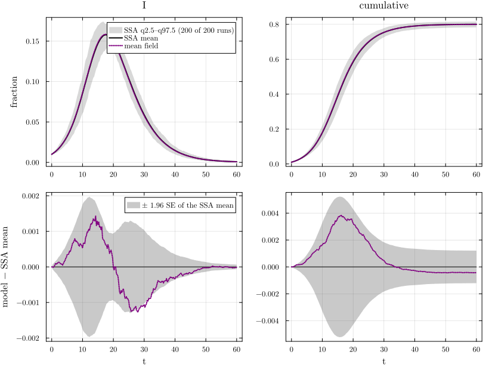
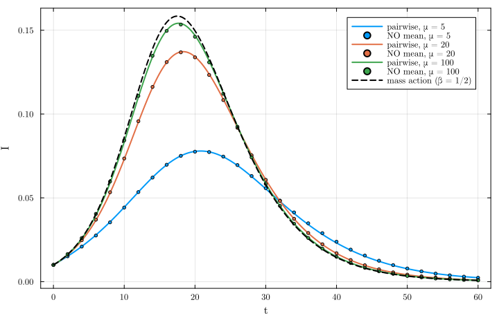
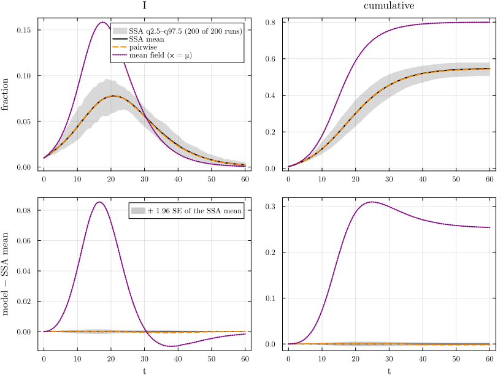

# Back to mass action


- [A well-mixed population](#a-well-mixed-population)
- [The complete graph](#the-complete-graph)
- [Dense Poisson networks](#dense-poisson-networks)
  - [What is exact on Poisson networks: Rempała’s
    reduction](#what-is-exact-on-poisson-networks-rempałas-reduction)
- [References](#references)

Mass action is the model that forgets the network: every node meets
fleeting random partners. There are several roads back to it from the
node-based models, and they have different status:

- on a **well-mixed population** `WellMixed(κ)` (κ fleeting contacts per
  node at a time), the mean-field closure \[XY\] = κ\[X\]\[Y\] closes
  the node equations exactly into mass action with β = κτ. This is the
  unit law of the lift;
- on the **complete graph** K_N, the individual-based model restricted
  to identical nodes is the same mass-action model;
- on a **dense configuration network**, Poisson(μ) with μτ fixed, the
  pairwise model approaches mass action as μ → ∞, with an error that
  decays like 1/μ. This is an approximation, and at finite μ the network
  model and mass action are different epidemics.

The EdgeBasedModels page E05 takes the same roads from the edge-based
side; the well-mixed cell below is shared with it.

``` julia
include(joinpath(@__DIR__, "..", "_shared", "setup.jl"))
require_summaries([:sir_wm5, :sir_dense_pois5, :sir_dense_pois20, :sir_dense_pois100])
using NetworkEpiCore, NetworkOutbreaks, Catalyst, Plots
using Graphs
sir = @reaction_network sir begin
    @parameters τ γ
    τ, S + I --> 2I
    γ, I --> R
end
model = contact_model(sir)
curves_of(sys, s, label) = model_curves(sys, solve_epidemic(sys, s); t = s.tgrid, label)
```

## A well-mixed population

``` julia
sc_wm = scenario(:sir_wm5)
@assert isequivalent(model, sc_wm.model)
sys_wm  = node_based(model, sc_wm.network)   # back end
sys_wmF = generate_pairwise(sir_model(), WellMixed(5), MeanFieldClosure(); cumulative = true)   # back end
@assert vector_fields_equal(symbolic_ode(sys_wm), symbolic_ode(sys_wmF))
symbolic_ode(sys_wm)
```

    SymbolicODE :mean_field_sir (3 states)
      dS/dt = -5.0I(t)*S(t)*τ
      dI/dt = -I(t)*γ + 5.0I(t)*S(t)*τ
      dR/dt = I(t)*γ
      parameters  γ, τ

`node_based` on `WellMixed(5)` returns a `MeanFieldSystem` (the default
closure there is `MeanFieldClosure()`), and the factory is
`generate_pairwise` with that closure. The field has three states: every
pair is closed by \[XY\] = κ\[X\]\[Y\], so no pair variable is left. It
is mass action with β = κτ, NetworkEpiCore’s `mass_action(model; κ)`:

``` julia
ma = mass_action(sc_wm.model; κ = 5)
@printf("%s;  node_based ≡ mass_action(model; κ = 5): %s;  β = κτ = %.4f, γ = %.4f\n", nameof(typeof(sys_wm)),
        vector_fields_equal(symbolic_ode(sys_wm), ma), 5 * sc_wm.params[:τ], sc_wm.params[:γ])
```

    MeanFieldSystem;  node_based ≡ mass_action(model; κ = 5): true;  β = κτ = 0.5000, γ = 0.2500

The NetworkOutbreaks reference of `:sir_wm5` is simulated with the
mass-action SSA, so it has no contact graph:

``` julia
ref_wm = scenario_summary(sc_wm)
anchors(sc_wm);
describe_reference(ref_wm);
println(try scenario_graph(sc_wm, 1); "a graph" catch e; sprint(showerror, e) end)
```

    :sir_wm5: γ = 0.25, τ = 0.1; seeds I 0.01; t = 0:0.25:60; R₀ = 2; no NodeBasedModels pairwise threshold for a WellMixed (differs from the canonical anchors: τ ≠ 1/6)
    NetworkOutbreaks reference :sir_wm5 (hash 6e8fb963): N = 10000 nodes, 200 runs on a fresh graph per run, algorithm :mass_action; conditioning: major outbreaks only (cumulative incidence excluding seeds ≥ 0.05·N by t_end); 200 of 200 runs kept (major runs), P(major) = 1.000 (95% CI 0.981–1.000); no time alignment.
    ArgumentError: scenario_graph(:sir_wm5): the scenario is well mixed and simulated with MassActionSSA, which has no contact graph

The phrase “a fresh graph per run” in the description above comes from
the scenario setting `sc.sim.graphs` = :per_run, which the shared
`describe_reference` helper prints; with the mass-action SSA it has no
effect, and the last line shows that no graph exists for this scenario.

``` julia
det_wm = curves_of(sys_wm, sc_wm, "mean field")
comparisonplot(ref_wm, det_wm; observables = [:I, :cumulative])
```

<div id="fig-wm">



Figure 1: The mean-field model of :sir_wm5 (mass action, β = 1/2, γ =
1/4) against the mass-action SSA ensemble (top: spread band q2.5–q97.5
of the runs and their mean; bottom: residual with the mean band ±1.96
SE).

</div>

``` julia
tab_wm = compare(ref_wm, det_wm)
```

    ComparisonTable :sir_wm5  (scenario 6e8fb963; conditioned mean of 200 runs)
      curve       observable        D∞     t(D∞)       SE∞        z∞       ΔR∞  95% CI                 Δpeak   Δt_peak  coverage
      mean field  S            0.00384     16.25   0.00267      1.57  -0.00043  [-0.00164,  0.00078]   0.00000      0.00     1.000
      mean field  I            0.00143     14.25   0.00101      2.22  -0.00043  [-0.00164,  0.00078]   0.00062      0.00     0.929
      mean field  R            0.00325     20.00   0.00231      1.56  -0.00043  [-0.00164,  0.00078]  -0.00041      0.00     1.000
      mean field  infectious   0.00143     14.25   0.00101      2.22  -0.00043  [-0.00164,  0.00078]   0.00062      0.00     0.929
      mean field  cumulative   0.00384     16.25   0.00267      1.57  -0.00043  [-0.00164,  0.00078]  -0.00043      0.00     1.000

## The complete graph

On K_N every node is joined to the N − 1 others. With per-edge rate τ_N
= κτ/(N − 1) each node has total contact rate κτ, as in `WellMixed(κ)`.
When every node starts with the same probability ρ of being infected,
the individual-based equations keep all nodes identical, ⟨S_i⟩ = s, and
reduce to ṡ = −τ_N(N − 1)·s·i = −κτ·s·i: mass action again. The
individual-based model is built on an explicit K_N (N = 200) with the
uniform seed of the scenario:

``` julia
N  = 200
τN = 5 * sc_wm.params[:τ] / (N - 1)
kw = (p = Dict(:τ => τN, :γ => sc_wm.params[:γ]), tspan = sc_wm.tspan, saveat = step(sc_wm.tgrid),
      reltol = 1e-10, abstol = 1e-12)
ibK  = generate_individual_based(sir_model(), ExplicitGraph(complete_graph(N)); initial = sc_wm.initial, kw...)
d_ibK = model_curves(ibK; t = sc_wm.tgrid, label = "individual-based on K_N")
sym_err = maximum(maximum(abs.(d_ibK[X] .- det_wm[X])) for X in (:S, :I, :R))
@printf("N = %d, τ_N = %.3e:  max |individual-based on K_N − mean field| over S, I, R = %.2e\n", N, τN, sym_err)
```

    N = 200, τ_N = 2.513e-03:  max |individual-based on K_N − mean field| over S, I, R = 4.44e-11

With seeds placed on two named nodes instead (the same expected number,
0.01·N = 2), the nodes are no longer identical and the individual-based
model is not exactly mass action; on K_N the difference is small and
shrinks with N:

``` julia
function named_seed_error(N)
    τN = 5 * sc_wm.params[:τ] / (N - 1)
    k  = round(Int, 0.01N)
    r  = generate_individual_based(sir_model(), ExplicitGraph(complete_graph(N)); initial_infected = collect(1:k),
                                   p = Dict(:τ => τN, :γ => sc_wm.params[:γ]), tspan = sc_wm.tspan,
                                   saveat = step(sc_wm.tgrid), reltol = 1e-10, abstol = 1e-12)
    d = model_curves(r; t = sc_wm.tgrid, label = "IB")
    (N, k, maximum(abs.(d[:I] .- det_wm[:I])))
end
md_table(["N", "seeded nodes", "max over t of abs(I_IB − I_MA)"], [named_seed_error(N) for N in (100, 200, 400)])
```

|   N | seeded nodes | max over t of abs(I_IB − I_MA) |
|----:|-------------:|-------------------------------:|
| 100 |            1 |                      0.0006283 |
| 200 |            2 |                      0.0003132 |
| 400 |            4 |                      0.0001564 |

## Dense Poisson networks

The scenarios `:sir_dense_pois5`, `:sir_dense_pois20` and
`:sir_dense_pois100` put SIR on Poisson(μ) networks with τ = 1/(2μ), so
the total contact rate μτ = 1/2 is that of `:sir_wm5`. On Poisson
networks the constant closure is exact (K = 1), so the pairwise model is
the exact large-N limit at each μ. The mean-field model with κ = μ is
the dense-limit approximation, `node_based(model, WellMixed(μ))`:

``` julia
dense_ids = [:sir_dense_pois5, :sir_dense_pois20, :sir_dense_pois100]
dense = map(dense_ids) do id
    s = scenario(id); @assert isequivalent(model, s.model)
    r = scenario_summary(s)
    μ = mean_degree(s.network)
    sysP  = node_based(model, s.network)
    sysPF = generate_pairwise(sir_model(), s.network, BernoulliClosure(); cumulative = true)
    @assert vector_fields_equal(symbolic_ode(sysP), symbolic_ode(sysPF))
    dP = curves_of(sysP, s, "pairwise")
    dM = curves_of(node_based(model, WellMixed(μ)), s, "mean field (κ = μ)")
    (id = id, s = s, ref = r, μ = μ, dP = dP, dM = dM, tab = compare(r, dP, dM))
end
reference_table([d.ref for d in dense])
```

| scenario | N | runs | graphs | conditioning | kept | kept fraction (95% CI) |
|----|---:|---:|----|----|---:|----|
| `:sir_dense_pois5` | 10000 | 200 | per_run | major (≥ 0.05·N) | 200 | P(major) = 1.000 (0.981–1.000) |
| `:sir_dense_pois20` | 10000 | 200 | per_run | major (≥ 0.05·N) | 200 | P(major) = 1.000 (0.981–1.000) |
| `:sir_dense_pois100` | 10000 | 200 | per_run | major (≥ 0.05·N) | 200 | P(major) = 1.000 (0.981–1.000) |

``` julia
for d in dense
    anchors(d.s)
end
```

    :sir_dense_pois5: γ = 0.25, τ = 0.1; seeds I 0.01; t = 0:0.25:60; R₀ = 1.42857; pairwise threshold τ_c = 0.0625, τ/τ_c = 1.6 (differs from the canonical anchors: R₀ ≠ 2, τ ≠ 1/6)
    :sir_dense_pois20: γ = 0.25, τ = 0.025; seeds I 0.01; t = 0:0.25:60; R₀ = 1.81818; pairwise threshold τ_c = 0.0131579, τ/τ_c = 1.9 (differs from the canonical anchors: R₀ ≠ 2, τ ≠ 1/6)
    :sir_dense_pois100: γ = 0.25, τ = 0.005; seeds I 0.01; t = 0:0.25:60; R₀ = 1.96078; pairwise threshold τ_c = 0.00252525, τ/τ_c = 1.98 (differs from the canonical anchors: R₀ ≠ 2, τ ≠ 1/6)

``` julia
rows = [(string("`:", d.id, "`"), d.μ, d.s.params[:τ], d.tab["pairwise", :I].D∞, d.tab["pairwise", :I].z∞,
         d.tab["mean field (κ = μ)", :I].D∞, d.tab["mean field (κ = μ)", :I].z∞,
         maximum(abs.(d.dP[:I] .- d.dM[:I])), d.μ * maximum(abs.(d.dP[:I] .- d.dM[:I])))
        for d in dense]
md_table(["scenario", "μ", "τ", "D∞(I) pairwise", "z∞", "D∞(I) mean field", "z∞",
          "max over t of abs(I_PW − I_MF)", "μ × that maximum"], rows)
```

| scenario | μ | τ | D∞(I) pairwise | z∞ | D∞(I) mean field | z∞ | max over t of abs(I_PW − I_MF) | μ × that maximum |
|----|---:|---:|---:|---:|---:|---:|---:|---:|
| `:sir_dense_pois5` | 5 | 0.1 | 0.0008236 | 2.173 | 0.08546 | 114.8 | 0.08554 | 0.4277 |
| `:sir_dense_pois20` | 20 | 0.025 | 0.0007817 | 1.73 | 0.02399 | 40.71 | 0.02414 | 0.4828 |
| `:sir_dense_pois100` | 100 | 0.005 | 0.001049 | 2.476 | 0.00528 | 9.279 | 0.004934 | 0.4934 |

``` julia
plt = plot(; xlabel = "t", ylabel = "I", legend = :topright)
for (j, d) in enumerate(dense)
    plot!(plt, d.dP.t, d.dP[:I]; color = j, label = "pairwise, μ = $(Int(d.μ))")
    scatter!(plt, d.ref.t[1:8:end], d.ref.cond[:I].mean[1:8:end]; color = j, ms = 2.5, label = "NO mean, μ = $(Int(d.μ))")
end
plot!(plt, det_wm.t, det_wm[:I]; color = :black, ls = :dash, label = "mass action (β = 1/2)")
plt
```

<div id="fig-dense">



Figure 2: Overview (no bands): prevalence on Poisson(μ) networks with μτ
= 1/2 (pairwise model, exact for Poisson; solid) against the ensemble
means (points) and mass action with β = 1/2 (dashed).

</div>

The overview above shows ensemble means only. The comparison with bands,
for μ = 5, where the two models differ most:

``` julia
distinct_styles!(comparisonplot(dense[1].ref, dense[1].dP, dense[1].dM; observables = [:I, :cumulative]))
```

<div id="fig-dense5">



Figure 3: Pairwise and mean-field (κ = μ) SIR on Poisson(5) with τ =
1/10 against the committed NetworkOutbreaks ensemble of :sir_dense_pois5
(top: spread band q2.5–q97.5 of the runs and their mean; bottom:
residual with the mean band ±1.96 SE).

</div>

The pairwise model follows each ensemble within a few standard errors at
every μ, while the mean-field model is far off at μ = 5 and approaches
the network model as μ grows: the product of μ and the largest gap
between the two models, in the last column, is roughly constant: the 1/μ
rate. The network R₀ = T·κ_ex approaches the mass-action value 2 from
below as μ grows (printed by `anchors` above).

### What is exact on Poisson networks: Rempała’s reduction

On a Poisson(μ) network the susceptible curve of the network model *is*
the susceptible curve of a mass-action model, but not of the obvious
one: S(t) = q·e^{μ(θ−1)} with (S, φ_I) solving mass action with β = μτ
and removal rate γ + τ. The “I” of that mass-action model is φ_I, the
edge variable of the edge-based model, not the prevalence:

``` julia
d5 = dense[1]; s5 = d5.s
mf5 = node_based(model, WellMixed(d5.μ))
solR = solve_epidemic(mf5; p = Dict(:τ => s5.params[:τ], :γ => s5.params[:γ] + s5.params[:τ]),
                      initial = s5.initial, tspan = s5.tspan, saveat = s5.tgrid)
dR = model_curves(mf5, solR; t = s5.tgrid, label = "MA(μτ, γ + τ)")
@printf("Poisson(%d): max |S_pairwise − S_MA(μτ, γ+τ)| = %.2e;  max |I_pairwise − I_MA(μτ, γ+τ)| = %.4f\n",
        Int(d5.μ), maximum(abs.(d5.dP[:S] .- dR[:S])), maximum(abs.(d5.dP[:I] .- dR[:I])))
```

    Poisson(5): max |S_pairwise − S_MA(μτ, γ+τ)| = 1.07e-11;  max |I_pairwise − I_MA(μτ, γ+τ)| = 0.0215

The semiconjugacy behind this identity, (θ, ξ, φ, pop) ↦ (qξe^{μ(θ−1)},
φ_I) from the edge-based SIR model on Poisson(μ), μ ≠ 0, to mass-action
SIR with β = μτ and removal rate γ + τ, is Lean theorem
`NEP.rempala_general_sir` (NetworkEpiCore.jl/proofs).

So the susceptible curves agree to solver tolerance, while the
prevalence of the network model is not the “I” of that mass-action
model.

## References

<div id="refs">

</div>
